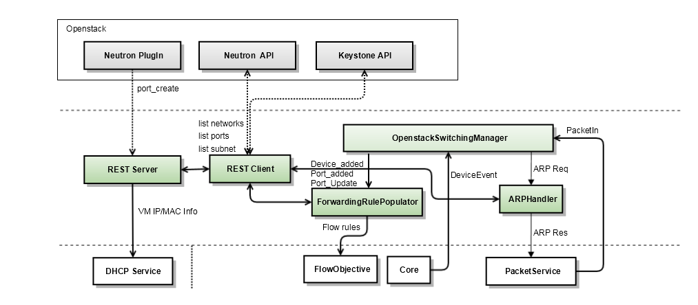
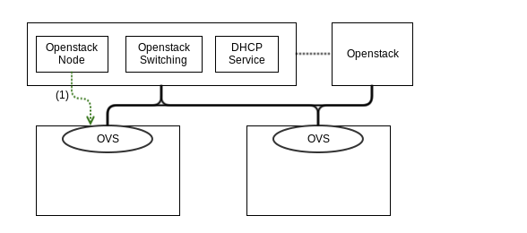
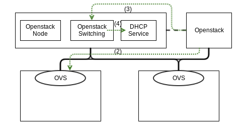
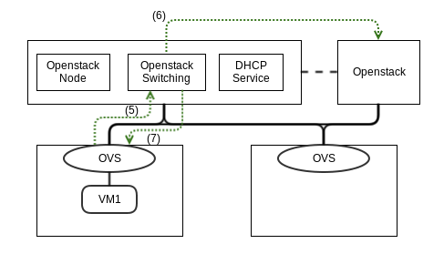
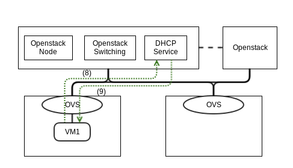
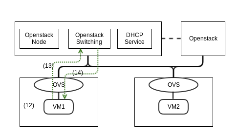
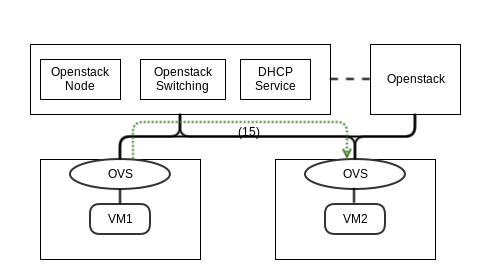

# OpenstackSwitching

**

| Module name | Description |
| --- | --- |
| REST Server | Handles the REST API, which are called from Neturon ONOS plugin. |
| REST Client | Extracts networks, subnets, and ports information from Neutron by calling Neutron API |
| ForwardingRulePopulator | Sets up packet forwarding rules to OVS of each Cnode for forwarding packets among all VMs in the same subnet. |
| ARPHandler | Creates the ARP Response for ARP packets sent from VMs and send it out to the VMs. |

### [Security Group](openstackswitching/security-group.md)

## Working Flow

(1) OVS setup : creates br-int bridge and setup controller, and setup **a TUNNEL\_PORT (vxlan)**

(2) CREATE\_VM by Nova

(3) CREAT\_VM REST API call from Nuetron ML2 plugin with VM1\_IP, VM1\_MAC

(4) Set VM1\_IP:VM1\_MAC mapping to DHCP Service

(5) PORT\_CREATED event to ONOS

(6) Query the VM IP and VM MAC to Neutron for the port created

(7) Populates a flow rule for the VM1 ( **dest\_IP == VM1\_IP -> output to PORT1** )

(8) DHCP Request

(9) DHCP Offer

(10) CREATE VM2 -> Follow the same step of (3) ~ (6)

(11) Populates flow rules for each VM using **Nicira Extension**

    VM1 : **dest\_IP == VM2\_IP -> set\_tunnel\_destIP = HOST2\_IP, set\_VNI = VNI1, output to TUNNEL\_PORT**

    VM2 :

* **dest\_IP == VM2\_IP -> output to VM2\_PORT**
* **dest\_IP == VM1\_IP -> set tunnel dest IP = HOST1\_IP, set\_VNI = VN1, output to TUNNEL\_PORT**

(12) ping VM2\_IP

(13) ARP request for VM2\_IP

(14) ARP response (VM2\_MAC) by ARP Handler

(15) ICMP request to VM2 using the flow rule : **dest\_IP == VM2\_IP -> set\_tunnel\_destIP = HOST2\_IP, set\_VNI = VNI1, output to TUNNEL\_PORT**

(16) ICMP request to VM2 using the flow rule : **dest\_IP == VM2\_IP -> output to VM2\_PORT**

(17) ARP request and response

(18) ICMP response to VM1 using the flow rule: **dest\_IP == VM1\_IP -> set tunnel dest IP = HOST1\_IP, set\_VNI = VN1, output to TUNNEL\_PORT**

(19) ICMP response to VM1 using the flow rule: **dest\_IP == VM1\_IP -> output to PORT1**
