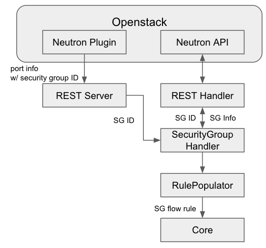
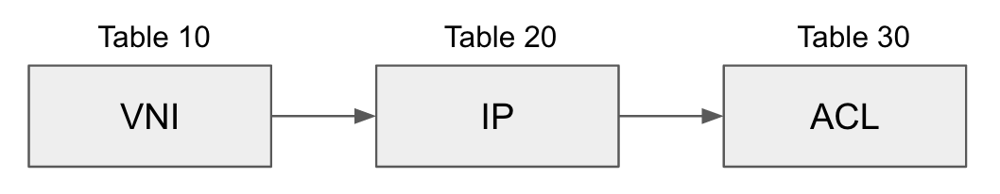

# Security Group

## Requirements

The basic characteristics of Neutron Security Groups are:

* For ingress traffic (to an instance)
  + Only traffic matched with security group rules are allowed.
  + When there is no rule defined, all traffic are dropped.
* For egress traffic (from an instance)
  + Only traffic matched with security group rules are allowed.
  + When there is no rule defined, all egress traffic are dropped.
  + When a new security group is created, rules to allow all egress traffic are automatically added.
* "default security group" is defined for each tenant.
  + For the default security group a rule which allows intercommunication among hosts associated with the default security group is defined by default.
  + As a result, all egress traffic and intercommunication in the default group are allowed and all ingress from outside of the default group is dropped by default (in the default security group).

## Limitations

* Connection Tracking is not supported

  + Generally, when an incoming traffic to a specific port is allowed, then the outgoing traffic from the port is allowed or vice and versa, using the connection tracking feature.
  + But, for now we do not support the connection tracking feature yet, and if you allow only incoming packet to a specific packet, then the response (outgoing) packets from the port are blocked.
  + So, if you want to allow any incoming traffic to specific port and the response (outgoing) packets using a security group, you have to define both rules to allow incoming and outgoing traffic to and from the port.
  + Connection Tracking feature will be supported using probably OVN feature, when OVS2.5 is released.

## Security Group Handling Architecture



## Table Structure



            APPLY                                 WRITE                         apply\_actions or drop INSTRUCTION

* The actions of flow rules in Table 10 are all apply actions
* The actions of flow rules in Table 20 are all write actions
* The actions added in Table 20 are applied according to the ACL flow rules in Table 30.

## Flow rule examples

Assumptions :

1. All VMs are created in a physical server, for simplicity
2. All flow rules are additive
3. "default" is ALL ALLOW
4. SSH rule : Allow remote IP: \* & dest port = 22 (Ingress & Egress)
5. HTTPS rule : Allow remote IP: \* & dest port = 8080 (Ingress & Egress)
6. CUSTOM rule: Allow remote IP: 10.10.10.0/24 & TCP (Ingress & Egress)

| Case | VNI table (10) | IP table (20) | ACL table (30) |
| --- | --- | --- | --- |
| Initialized | ARP or DHCP -> output controller |  | drop (w/ lowest priority) |
| a VM1 (10.0.1.2) is inserted with "default" SG and 101 VNI | in\_port=2 -> set VNI:101 | VNI=101, dst\_ip=10.0.1.2 -> output 2 | src\_ip = 10.0.1.2 -> apply  dst\_ip = 10.0.1.2 -> apply |
| a VM2 (10.0.1.3) is inserted with "default" SG and 101 VNI | in\_port=3 -> set VNI: 101 | VNI=101, dst\_ip=10.0.1.3 -> output 3 | src\_ip = 10.0.1.3 -> apply  dst\_ip = 10.0.1.3 -> apply |
| a VM3 (10.0.1.4) is inserted with "SSH" SG and 101 VNI | in\_port=4 -> set VNI:101 | VNI=101, dst\_ip=10.0.1.4 -> output 4 | src\_ip = 10.0.1.4, dst\_port=22 -> apply  dst\_ip = 10.0.1.4, dst\_port=22 -> apply |
| a VM4 (10.0.1.5) is inserted with "HTTP" SG and 101 VNI | in\_port=5 -> set VNI: 101 | VNI=101, dst\_ip=10.0.1.5 -> output 5 | src\_ip = 10.0.1.5, dst\_port=8080 -> apply  dst\_ip = 10.0.1.5, dst\_port=8080 -> apply |
| a VM5 (10.0.1.6) is inserted with "CUSTOM" SG and 101 VNI | in\_port=6 -> set VNI: 101 | VNI=101, dst\_ip=10.0.1.6 -> output 6 | src\_ip = 10.10.10.0/24 & dst\_ip = 10.0.1.6 & tcp -> apply  dst\_ip = 10.10.10.0/24 & src\_ip = 10.0.1.6 & tcp -> apply |

## Tasks

* Implement the security group REST response json parser
* Implement security group handler
* HA, DR, Scalability test

## REST API for Security Group

```
{
    "security_group": {
        "description": "security group for webservers",
        "id": "2076db17-a522-4506-91de-c6dd8e837028",
        "name": "new-webservers",
        "security_group_rules": [
            {
                "direction": "egress",
                "ethertype": "IPv4",
                "id": "38ce2d8e-e8f1-48bd-83c2-d33cb9f50c3d",
                "port_range_max": null,
                "port_range_min": null,
                "protocol": null,
                "remote_group_id": null,
                "remote_ip_prefix": null,
                "security_group_id": "2076db17-a522-4506-91de-c6dd8e837028",
                "tenant_id": "e4f50856753b4dc6afee5fa6b9b6c550"
            },
            {
                "direction": "egress",
                "ethertype": "IPv6",
                "id": "565b9502-12de-4ffd-91e9-68885cff6ae1",
                "port_range_max": null,
                "port_range_min": null,
                "protocol": null,
                "remote_group_id": null,
                "remote_ip_prefix": null,
                "security_group_id": "2076db17-a522-4506-91de-c6dd8e837028",
                "tenant_id": "e4f50856753b4dc6afee5fa6b9b6c550"
            }
        ],
        "tenant_id": "e4f50856753b4dc6afee5fa6b9b6c550"
    }
}
```

## Action Cases & REST Call Data

1. ### VM is created with any security group

   **No security group is set (but, "default" is added by default)**

   ```
   {
     "port": {
       "status": "ACTIVE", 
       "binding:host_id": "admin-os-cnode", 
       "allowed_address_pairs": [], 
       "extra_dhcp_opts": [], 
       "mac_address": "fa:16:3e:74:46:ce", 
       "device_owner": "compute:nova", 
       "binding:profile": {}, 
       "port_security_enabled": true, 
       "fixed_ips": [
         {
           "subnet_id": "0dceab88-2553-4c8a-b228-9013ea8163d2", 
           "ip_address": "10.1.0.48"
         }
       ], 
       "id": "4dbc40f2-fd12-478f-8d14-ef757cd57f6b", 
       "security_groups": [
         "73af9f7d-762e-4bee-9df0-f66d798599d9"
       ], 
       "device_id": "e4be9ba2-0d73-43e7-a191-f25df82e62f2", 
       "name": "", 
       "admin_state_up": true, 
       "network_id": "54d70be4-0246-41df-9467-d0c22022f0ed", 
       "dns_name": "", 
       "binding:vif_details": {
         "port_filter": true
       }, 
       "binding:vnic_type": "normal", 
       "binding:vif_type": "ovs", 
       "tenant_id": "78aabde6d6554fec8df9f3f22caaf762"
     }
   }
   ```

   **"default" security group is added when VM is created**

   ```
   {
     "port": {
       "status": "ACTIVE", 
       "binding:host_id": "admin-os-cnode", 
       "allowed_address_pairs": [], 
       "extra_dhcp_opts": [], 
       "mac_address": "fa:16:3e:04:6f:70", 
       "device_owner": "compute:nova", 
       "binding:profile": {}, 
       "port_security_enabled": true, 
       "fixed_ips": [
         {
           "subnet_id": "0dceab88-2553-4c8a-b228-9013ea8163d2", 
           "ip_address": "10.1.0.46"
         }
       ], 
       "id": "e8a24de5-af01-4165-b3bb-4bdf892d2d80", 
       "security_groups": [
         "73af9f7d-762e-4bee-9df0-f66d798599d9"
       ], 
       "device_id": "ddbbc42c-9185-49ae-bbed-f5fa7000b5b7", 
       "name": "", 
       "admin_state_up": true, 
       "network_id": "54d70be4-0246-41df-9467-d0c22022f0ed", 
       "dns_name": "", 
       "binding:vif_details": {
         "port_filter": true
       }, 
       "binding:vnic_type": "normal", 
       "binding:vif_type": "ovs", 
       "tenant_id": "78aabde6d6554fec8df9f3f22caaf762"
     }
   }
   ```

   **"ssh" security group is selected when a VM is created**

   ```
   {
     "port": {
       "status": "ACTIVE", 
       "binding:host_id": "admin-os-cnode3", 
       "allowed_address_pairs": [], 
       "extra_dhcp_opts": [], 
       "mac_address": "fa:16:3e:4a:bf:b8", 
       "device_owner": "compute:nova", 
       "binding:profile": {}, 
       "port_security_enabled": true, 
       "fixed_ips": [
         {
           "subnet_id": "0dceab88-2553-4c8a-b228-9013ea8163d2", 
           "ip_address": "10.1.0.49"
         }
       ], 
       "id": "725ffb2c-8d2d-4195-87dd-e7785606cf1b", 
       "security_groups": [
         "a249c20e-959b-4b8c-b1cc-d0d0cb117369"
       ], 
       "device_id": "96ce7dfb-a115-4454-84f9-1fa18ec8b350", 
       "name": "", 
       "admin_state_up": true, 
       "network_id": "54d70be4-0246-41df-9467-d0c22022f0ed", 
       "dns_name": "", 
       "binding:vif_details": {
         "port_filter": true
       }, 
       "binding:vnic_type": "normal", 
       "binding:vif_type": "ovs", 
       "tenant_id": "78aabde6d6554fec8df9f3f22caaf762"
     }
   }
   ```

   **"ssh" security group is added to an existing VM**

   ```
   {
     "port": {
       "status": "ACTIVE", 
       "binding:host_id": "admin-os-cnode", 
       "allowed_address_pairs": [], 
       "extra_dhcp_opts": [], 
       "mac_address": "fa:16:3e:74:46:ce", 
       "dns_assignment": [
         {
           "hostname": "host-10-1-0-48", 
           "ip_address": "10.1.0.48", 
           "fqdn": "host-10-1-0-48.openstacklocal."
         }
       ], 
       "device_owner": "compute:nova", 
       "binding:profile": {}, 
       "port_security_enabled": true, 
       "fixed_ips": [
         {
           "subnet_id": "0dceab88-2553-4c8a-b228-9013ea8163d2", 
           "ip_address": "10.1.0.48"
         }
       ], 
       "id": "4dbc40f2-fd12-478f-8d14-ef757cd57f6b", 
       "security_groups": [
         "a249c20e-959b-4b8c-b1cc-d0d0cb117369", 
         "73af9f7d-762e-4bee-9df0-f66d798599d9"
       ], 
       "device_id": "e4be9ba2-0d73-43e7-a191-f25df82e62f2", 
       "name": "", 
       "admin_state_up": true, 
       "network_id": "54d70be4-0246-41df-9467-d0c22022f0ed", 
       "dns_name": "", 
       "binding:vif_details": {
         "port_filter": true
       }, 
       "binding:vnic_type": "normal", 
       "binding:vif_type": "ovs", 
       "tenant_id": "78aabde6d6554fec8df9f3f22caaf762"
     }
   }
   ```
2. Security group that is assigned to the VM is modified  
   No event is coming from ONOS plugin

## References

1. Neutron/Security Groups: <https://wiki.openstack.org/wiki/Neutron/SecurityGroups>
2. Neutron API document: <http://developer.openstack.org/api-ref-networking-v2-ext.html>
3. OVN <http://blog.russellbryant.net/2015/10/22/openstack-security-groups-using-ovn-acls/>
4. OVN <http://openvswitch.org/support/slides/OVN-Vancouver.pdf>
