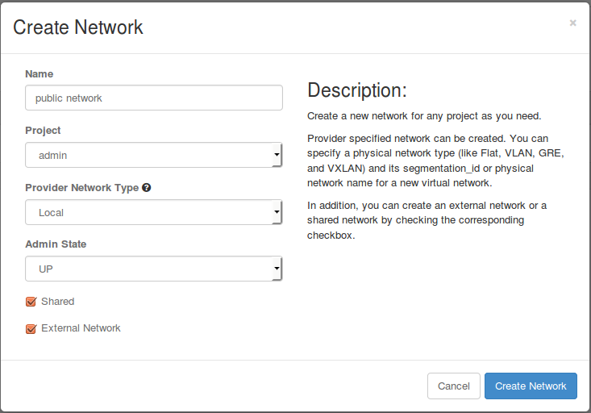
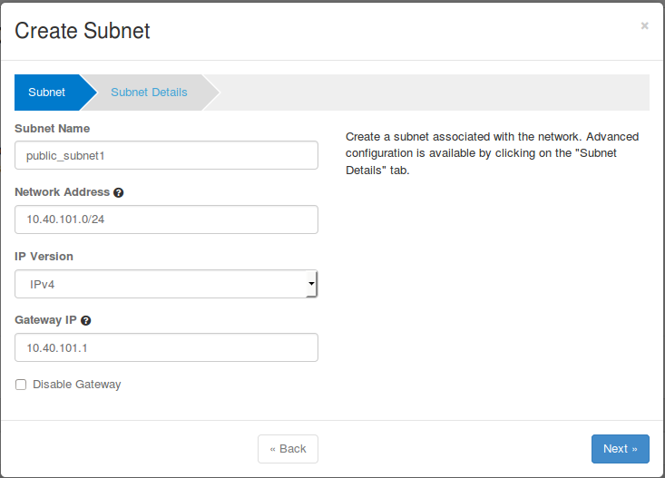
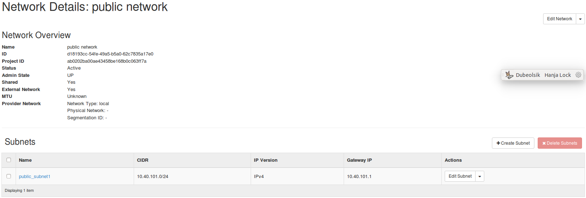
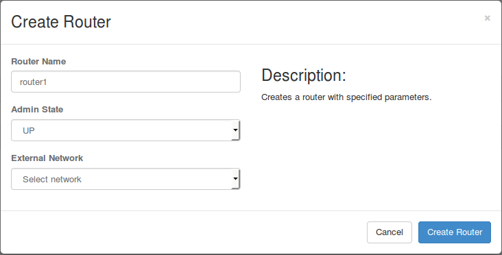
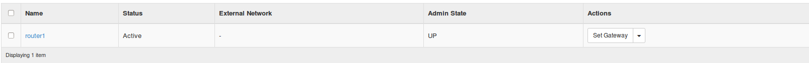
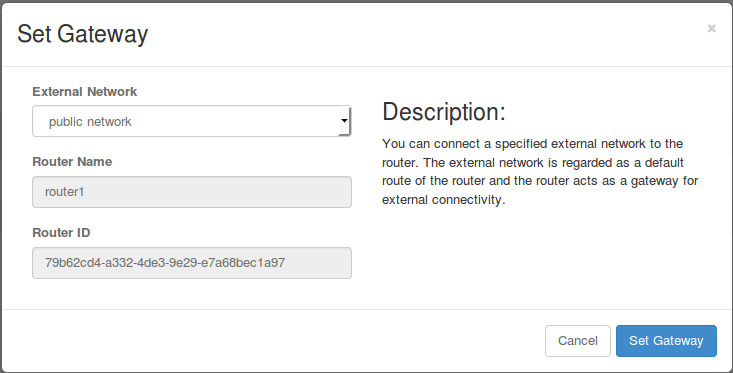
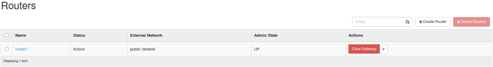
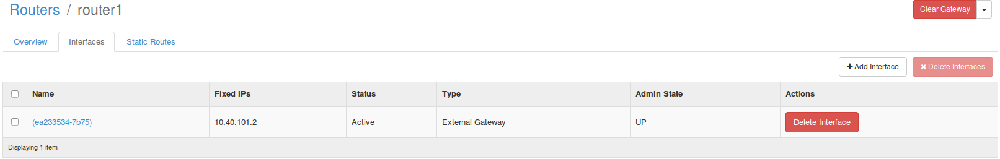
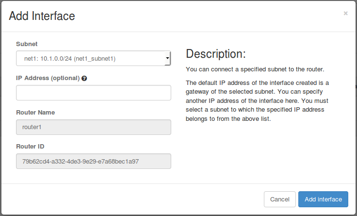

# Router Walk-Through

Simple Walk-through tutorials describes how to create VMs and shows that all VMs can ping each other. This tutorial explains how we can ssh to VMs from network node by adding an external network and router. We also use the horizon web interface to create networks and router.

1. Create a external network for a router from System>Networks>Create Network button.  
     
   Then, you can see that a network is added from the network list.  
   
2. Add a subnet in the external network by clicking the "Edit Network" button in the network list. We do not need to input information in subnet details.  
     
   We can see that the subnet for the external network is created as below.  
   
3. Create a router using the external network created above.  
   Project > Network > Routers > Create Router  
     
   Then, the router is created as below.  
     
   Set the gateway of the router using the external network by clicking the "Set Gateway" button in the router list.  
     
   Then, the router information is changed as below.  
     
   Click the router name in the router list above to see the router detail.  
     
   Click the "Add Interface" button in the "Interfaces" tab above.  
     
   Choose the subnet for the VMs as the Subnet click "Add Interface".  
   If you did not create the subnet for the VMs, please create one following the Simple Walk-through wiki page.  
   Done!!  
   Now, you can ping to VMs from network node.
4. Create a few VMs if you did not following the Simple Walk-through wiki page.
5. Now you can see that two new ports are created in the network node.

   ```
   $ sudo ovs-vsctl show
   5c56a00e-8820-4347-9100-e5825da49407
       Manager "ptcp:6640"
       Bridge br-int
           Controller "tcp:10.40.101.155:6653"
               is_connected: true
           Controller "tcp:10.40.101.153:6653"
               is_connected: true
           Controller "tcp:10.40.101.152:6653"
               is_connected: true
           fail_mode: secure
           Port vxlan
               Interface vxlan
                   type: vxlan
                   options: {key=flow, remote_ip=flow}
           Port "qr-12ab8d3d-66"
               Interface "qr-12ab8d3d-66"
                   type: internal
           Port br-int
               Interface br-int
       Bridge br-ex
           Port br-ex
               Interface br-ex
                   type: internal
           Port "qg-ea233534-7b"
               Interface "qg-ea233534-7b"
                   type: internal
   ```

   The port "qr-xxx" is a port for router to VMs and the port "qg-xxx" is a port for gateway to external: you can see that "qr-xxx" port is created in the br-int bridge, and the "qg-xxx" port is created in the br-ex bridge.
6. Also, you can see that a network namespace is created for the router. We use the network namespace to access the router.

   ```
   $ sudo ip netns
   qrouter-79b62cd4-a332-4de3-9e29-e7a68bec1a97
   ```
7. Now we can ping to all VMs using the network namespace.

   ```
   $ sudo ip netns exec qrouter-79b62cd4-a332-4de3-9e29-e7a68bec1a97 ping 10.1.0.16
   PING 10.1.0.16 (10.1.0.16) 56(84) bytes of data.
   64 bytes from 10.1.0.16: icmp_seq=1 ttl=64 time=1.81 ms
   64 bytes from 10.1.0.16: icmp_seq=2 ttl=64 time=0.731 ms
   64 bytes from 10.1.0.16: icmp_seq=3 ttl=64 time=0.746 ms
   ```
