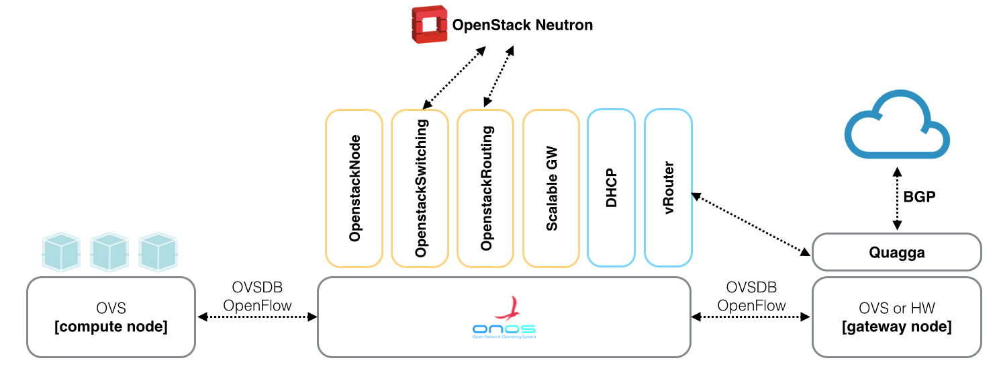
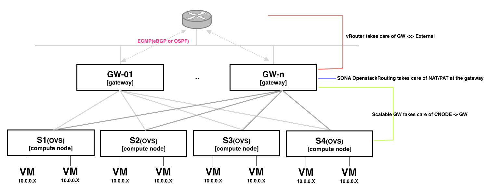
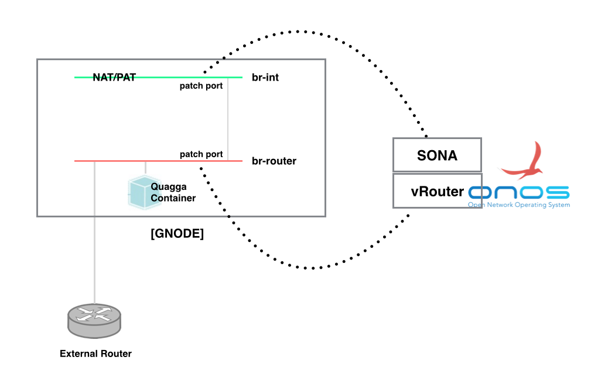

# Scalable GW

A gateway in SONA is a special compute node, which plays role as a connection point to external networks. It performs NAT and PAT for outbound traffics and also exchanges routes with external routers with BGP or OSPF. Scalable gateway provides load balancing and high availability by allowing multiple redundant gateways to the system.

## **Features**

* Provides load balance of outbound traffics among multiple gateways
* Provides fail-over for a gateway failure
* Provides dynamic add or remove of gateway nodes

## **High Level Architecture**

****

SONA is composed of multiple ONOS applications, and **Scalable Gateway** and **vRouter** are in charge of the North-South connectivity.

* Scalable Gateway provides a gateway group to OpenstackRouting
* OpenstackRouting takes care of forwarding outbound traffic to the gateway group
* OpenstackRouting takes care of NAT/PAT at the gateways
* vRouter takes care of connectivity between GNODEs and external routers

* GNODE is composed of two software switches controlled by SONA and vRouter
* br-int which is controlled by SONA, OpenstackRouting module specifically, performs NAT and PAT for N-S packets
* br-router which is controlled by vRouter makes the GNODE as a legacy router and it performs forwarding packets to right port

## **Detailed Architecture**

****

* Scalable GW manages the information of GNODEs
* OpenstackRouting requests the information of GNODEs
* Scalable GW provides the load-balancing policy to OpenstackRouting
* Scalable GW handles GNODE fail-over and scale-out

### Upstream Traffic Load Balancing

### Gateway Node Fail-Over

### Dynamic Gateway Node Scale-Out

