# Security Group Tutorial - ICMP

We describes how to test security group features

## ICMP Security Group Test

1. Create a security group that allows only SSH traffic as below.  
   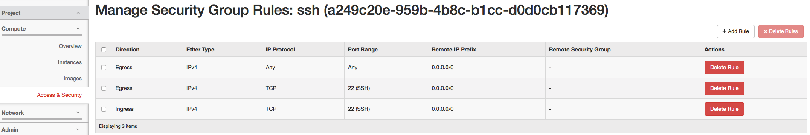
2. Create a security group that allows only ICMP traffic as below  
   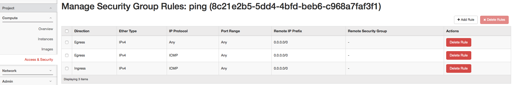
3. Create two VMs with ssh security group as below  
   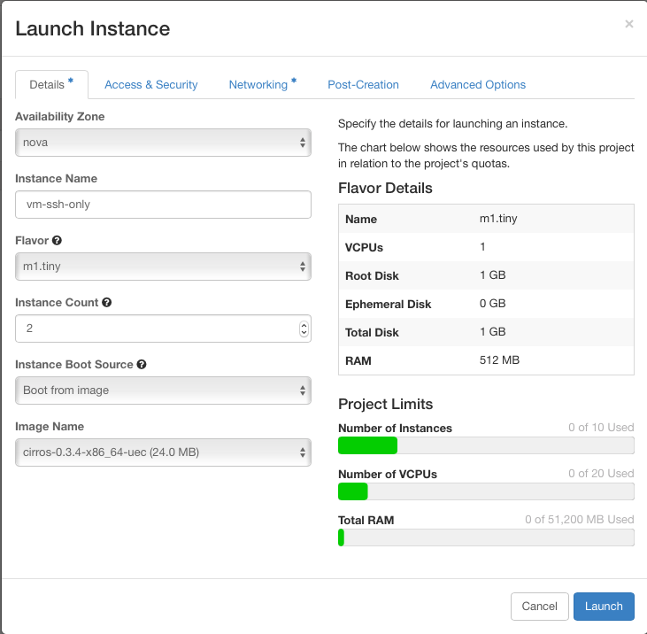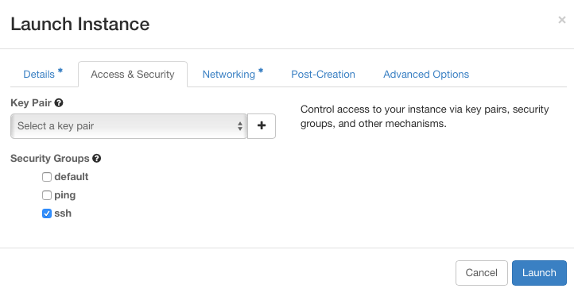
4. You can see that two VMs are creates successfully as below.  
   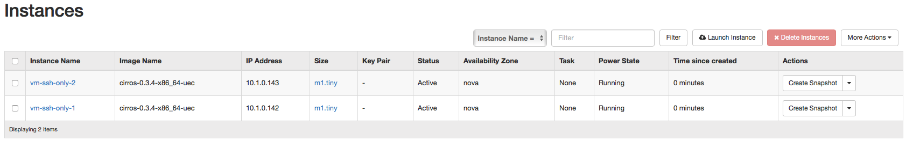
5. Check flow rules in two Compute Nodes as below

   **flow rules with SSH security group** Expand source

   ```
   $ ssh sangho@10.40.101.208 sudo ovs-ofctl dump-flows br-int -O openflow13; ssh sangho@10.40.101.227 sudo ovs-ofctl dump-flows br-int -O openflow13

   OFPST_FLOW reply (OF1.3) (xid=0x2):
    cookie=0x46000047fc8fa4, duration=161.523s, table=0, n_packets=15, n_bytes=1418, send_flow_rem priority=30000,ip,in_port=76 actions=set_field:0x443->tun_id,goto_table:1
    cookie=0x100004890d515, duration=64973.738s, table=0, n_packets=4, n_bytes=1360, send_flow_rem priority=40000,udp,tp_src=68,tp_dst=67 actions=CONTROLLER:65535
    cookie=0x4500004642a9bd, duration=64987.935s, table=0, n_packets=108, n_bytes=8424, send_flow_rem priority=0 actions=goto_table:1
    cookie=0x10000487f4dd5, duration=64987.935s, table=0, n_packets=0, n_bytes=0, send_flow_rem priority=40000,dl_type=0x88cc actions=CONTROLLER:65535
    cookie=0x10000488eb5db, duration=64987.933s, table=0, n_packets=2, n_bytes=84, send_flow_rem priority=40000,arp actions=CONTROLLER:65535
    cookie=0x460000c5cc4fcc, duration=161.523s, table=1, n_packets=0, n_bytes=0, send_flow_rem priority=30000,ip,tun_id=0x443,nw_dst=10.1.0.142 actions=write_actions(set_field:10.40.101.227->tun_dst,output:1),goto_table:2
    cookie=0x460000c5cc538d, duration=161.523s, table=1, n_packets=0, n_bytes=0, send_flow_rem priority=30000,ip,tun_id=0x443,nw_dst=10.1.0.143 actions=write_actions(output:76),goto_table:2
    cookie=0x4500004642a9be, duration=64987.935s, table=1, n_packets=373, n_bytes=33458, send_flow_rem priority=0 actions=drop
    cookie=0x4500004642a9bf, duration=4.535s, table=2, n_packets=0, n_bytes=0, send_flow_rem priority=0 actions=clear_actions
    cookie=0x460000c5cc1667, duration=161.302s, table=2, n_packets=0, n_bytes=0, send_flow_rem priority=30000,tcp,nw_src=10.1.0.143,tp_dst=22 actions=drop
    cookie=0x460000c5cac129, duration=161.302s, table=2, n_packets=0, n_bytes=0, send_flow_rem priority=30000,ip,nw_src=10.1.0.143 actions=drop
    cookie=0x460000c5cc1667, duration=161.302s, table=2, n_packets=0, n_bytes=0, send_flow_rem priority=30000,tcp,nw_dst=10.1.0.143,tp_src=22 actions=drop

   OFPST_FLOW reply (OF1.3) (xid=0x2):
    cookie=0x46000047fd0596, duration=163.837s, table=0, n_packets=15, n_bytes=1418, send_flow_rem priority=30000,ip,in_port=89 actions=set_field:0x443->tun_id,goto_table:1
    cookie=0x1000048914974, duration=64974.158s, table=0, n_packets=6, n_bytes=2028, send_flow_rem priority=40000,udp,tp_src=68,tp_dst=67 actions=CONTROLLER:65535
    cookie=0x45000046431e1c, duration=64988.641s, table=0, n_packets=137, n_bytes=10730, send_flow_rem priority=0 actions=goto_table:1
    cookie=0x10000487fc234, duration=64988.629s, table=0, n_packets=0, n_bytes=0, send_flow_rem priority=40000,dl_type=0x88cc actions=CONTROLLER:65535
    cookie=0x10000488f2a3a, duration=64988.615s, table=0, n_packets=3, n_bytes=126, send_flow_rem priority=40000,arp actions=CONTROLLER:65535
    cookie=0x460000c5ccc42b, duration=163.837s, table=1, n_packets=0, n_bytes=0, send_flow_rem priority=30000,ip,tun_id=0x443,nw_dst=10.1.0.142 actions=write_actions(output:89),goto_table:2
    cookie=0x460000c5ccc7ec, duration=161.943s, table=1, n_packets=0, n_bytes=0, send_flow_rem priority=30000,ip,tun_id=0x443,nw_dst=10.1.0.143 actions=write_actions(set_field:10.40.101.208->tun_dst,output:1),goto_table:2
    cookie=0x45000046431e1d, duration=64988.641s, table=1, n_packets=456, n_bytes=40861, send_flow_rem priority=0 actions=drop
    cookie=0x45000046431e1e, duration=5.252s, table=2, n_packets=0, n_bytes=0, send_flow_rem priority=0 actions=clear_actions
    cookie=0x460000c5cc8705, duration=163.625s, table=2, n_packets=0, n_bytes=0, send_flow_rem priority=30000,tcp,nw_src=10.1.0.142,tp_dst=22 actions=drop
    cookie=0x460000c5cb31c7, duration=163.625s, table=2, n_packets=0, n_bytes=0, send_flow_rem priority=30000,ip,nw_src=10.1.0.142 actions=drop
    cookie=0x460000c5cc8705, duration=163.625s, table=2, n_packets=0, n_bytes=0, send_flow_rem priority=30000,tcp,nw_dst=10.1.0.142,tp_src=22 actions=drop
   ```

   You can see that flow rules to allow SSH traffic are inserted in table 2
6. Open the terminal of a VM you just created and try ping to the other VM.  
   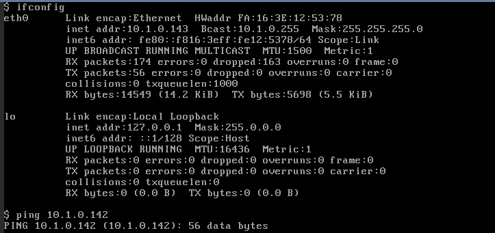  
   You can see that there is no response from the other VM. It is because all ICMP packets are blocked by the flow rules.
7. Now you creates two new VMs with ping security group as below.  
   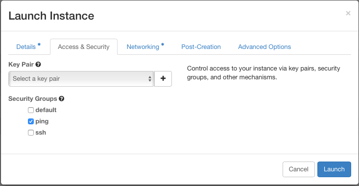  
   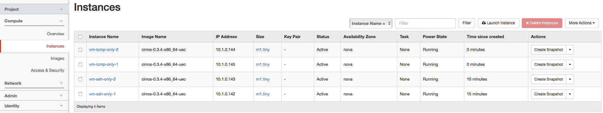
8. You can check that new flow rules to handle default switching and ICMP security group as below.

   **flow rules with ping security group** Expand source

   ```
   $ ssh sangho@10.40.101.208 sudo ovs-ofctl dump-flows br-int -O openflow13; ssh sangho@10.40.101.227 sudo ovs-ofctl dump-flows br-int -O openflow13

   OFPST_FLOW reply (OF1.3) (xid=0x2):
    cookie=0x46000047fc8fc3, duration=157.370s, table=0, n_packets=15, n_bytes=1418, send_flow_rem priority=30000,ip,in_port=77 actions=set_field:0x443->tun_id,goto_table:1
    cookie=0x46000047fc8fa4, duration=1111.078s, table=0, n_packets=668, n_bytes=65412, send_flow_rem priority=30000,ip,in_port=76 actions=set_field:0x443->tun_id,goto_table:1
    cookie=0x100004890d515, duration=65923.293s, table=0, n_packets=6, n_bytes=2052, send_flow_rem priority=40000,udp,tp_src=68,tp_dst=67 actions=CONTROLLER:65535
    cookie=0x4500004642a9bd, duration=65937.490s, table=0, n_packets=114, n_bytes=8892, send_flow_rem priority=0 actions=goto_table:1
    cookie=0x10000487f4dd5, duration=65937.490s, table=0, n_packets=0, n_bytes=0, send_flow_rem priority=40000,dl_type=0x88cc actions=CONTROLLER:65535
    cookie=0x10000488eb5db, duration=65937.488s, table=0, n_packets=19, n_bytes=798, send_flow_rem priority=40000,arp actions=CONTROLLER:65535
    cookie=0x460000c5cc5b0f, duration=157.369s, table=1, n_packets=0, n_bytes=0, send_flow_rem priority=30000,ip,tun_id=0x443,nw_dst=10.1.0.145 actions=write_actions(set_field:10.40.101.227->tun_dst,output:1),goto_table:2
    cookie=0x460000c5cc4fcc, duration=157.370s, table=1, n_packets=653, n_bytes=63994, send_flow_rem priority=30000,ip,tun_id=0x443,nw_dst=10.1.0.142 actions=write_actions(set_field:10.40.101.227->tun_dst,output:1),goto_table:2
    cookie=0x460000c5cc538d, duration=1111.078s, table=1, n_packets=0, n_bytes=0, send_flow_rem priority=30000,ip,tun_id=0x443,nw_dst=10.1.0.143 actions=write_actions(output:76),goto_table:2
    cookie=0x460000c5cc574e, duration=157.370s, table=1, n_packets=0, n_bytes=0, send_flow_rem priority=30000,ip,tun_id=0x443,nw_dst=10.1.0.144 actions=write_actions(output:77),goto_table:2
    cookie=0x4500004642a9be, duration=65937.490s, table=1, n_packets=394, n_bytes=35344, send_flow_rem priority=0 actions=drop
    cookie=0x4500004642a9bf, duration=24.040s, table=2, n_packets=0, n_bytes=0, send_flow_rem priority=0 actions=clear_actions
    cookie=0x460000c5cc1667, duration=1110.857s, table=2, n_packets=0, n_bytes=0, send_flow_rem priority=30000,tcp,nw_src=10.1.0.143,tp_dst=22 actions=drop
    cookie=0x460000c5cac4ea, duration=157.137s, table=2, n_packets=0, n_bytes=0, send_flow_rem priority=30000,ip,nw_src=10.1.0.144 actions=drop
    cookie=0x460000c5cac129, duration=1110.857s, table=2, n_packets=653, n_bytes=63994, send_flow_rem priority=30000,ip,nw_src=10.1.0.143 actions=drop
    cookie=0x460000c5cb6674, duration=157.137s, table=2, n_packets=0, n_bytes=0, send_flow_rem priority=30000,icmp,nw_src=10.1.0.144 actions=drop
    cookie=0x460000c5cb6a35, duration=157.137s, table=2, n_packets=0, n_bytes=0, send_flow_rem priority=30000,icmp,nw_dst=10.1.0.144 actions=drop
    cookie=0x460000c5cc1667, duration=1110.857s, table=2, n_packets=0, n_bytes=0, send_flow_rem priority=30000,tcp,nw_dst=10.1.0.143,tp_src=22 actions=drop

   OFPST_FLOW reply (OF1.3) (xid=0x2):
    cookie=0x46000047fd0596, duration=1113.401s, table=0, n_packets=15, n_bytes=1418, send_flow_rem priority=30000,ip,in_port=89 actions=set_field:0x443->tun_id,goto_table:1
    cookie=0x46000047fd05b5, duration=160.206s, table=0, n_packets=15, n_bytes=1418, send_flow_rem priority=30000,ip,in_port=90 actions=set_field:0x443->tun_id,goto_table:1
    cookie=0x1000048914974, duration=65923.722s, table=0, n_packets=8, n_bytes=2720, send_flow_rem priority=40000,udp,tp_src=68,tp_dst=67 actions=CONTROLLER:65535
    cookie=0x45000046431e1c, duration=65938.205s, table=0, n_packets=796, n_bytes=75192, send_flow_rem priority=0 actions=goto_table:1
    cookie=0x10000487fc234, duration=65938.193s, table=0, n_packets=0, n_bytes=0, send_flow_rem priority=40000,dl_type=0x88cc actions=CONTROLLER:65535
    cookie=0x10000488f2a3a, duration=65938.179s, table=0, n_packets=4, n_bytes=168, send_flow_rem priority=40000,arp actions=CONTROLLER:65535
    cookie=0x460000c5cccf6e, duration=160.206s, table=1, n_packets=0, n_bytes=0, send_flow_rem priority=30000,ip,tun_id=0x443,nw_dst=10.1.0.145 actions=write_actions(output:90),goto_table:2
    cookie=0x460000c5ccc42b, duration=1113.401s, table=1, n_packets=653, n_bytes=63994, send_flow_rem priority=30000,ip,tun_id=0x443,nw_dst=10.1.0.142 actions=write_actions(output:89),goto_table:2
    cookie=0x460000c5ccc7ec, duration=160.205s, table=1, n_packets=0, n_bytes=0, send_flow_rem priority=30000,ip,tun_id=0x443,nw_dst=10.1.0.143 actions=write_actions(set_field:10.40.101.208->tun_dst,output:1),goto_table:2
    cookie=0x460000c5cccbad, duration=157.798s, table=1, n_packets=0, n_bytes=0, send_flow_rem priority=30000,ip,tun_id=0x443,nw_dst=10.1.0.144 actions=write_actions(set_field:10.40.101.208->tun_dst,output:1),goto_table:2
    cookie=0x45000046431e1d, duration=65938.205s, table=1, n_packets=477, n_bytes=42747, send_flow_rem priority=0 actions=drop
    cookie=0x45000046431e1e, duration=24.764s, table=2, n_packets=25, n_bytes=2450, send_flow_rem priority=0 actions=clear_actions
    cookie=0x460000c5cc8705, duration=1113.189s, table=2, n_packets=0, n_bytes=0, send_flow_rem priority=30000,tcp,nw_src=10.1.0.142,tp_dst=22 actions=drop
    cookie=0x460000c5cb3d0a, duration=159.998s, table=2, n_packets=0, n_bytes=0, send_flow_rem priority=30000,ip,nw_src=10.1.0.145 actions=drop
    cookie=0x460000c5cb31c7, duration=1113.189s, table=2, n_packets=0, n_bytes=0, send_flow_rem priority=30000,ip,nw_src=10.1.0.142 actions=drop
    cookie=0x460000c5cbde94, duration=159.998s, table=2, n_packets=0, n_bytes=0, send_flow_rem priority=30000,icmp,nw_src=10.1.0.145 actions=drop
    cookie=0x460000c5cbe255, duration=159.998s, table=2, n_packets=0, n_bytes=0, send_flow_rem priority=30000,icmp,nw_dst=10.1.0.145 actions=drop
    cookie=0x460000c5cc8705, duration=1113.189s, table=2, n_packets=0, n_bytes=0, send_flow_rem priority=30000,tcp,nw_dst=10.1.0.142,tp_src=22 actions=drop
   ```
9. Open a console of a VM with ping security group and try to ping to the other VM with ssh security group. You can see that ping works between two nodes as below.  
   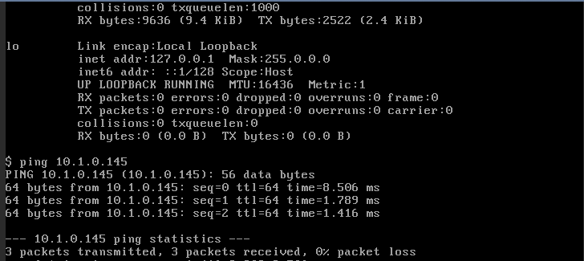
10. Now you add the ping security group to the both VMs with the SSH security group as below.  
    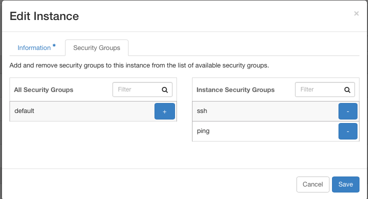
11. You can check that the flow rule to allow ICMP packets have been added for the two VMs in the two Computer Nodes as below.

    **flow rules after adding ping security group** Expand source

    ```
    $ ssh sangho@10.40.101.208 sudo ovs-ofctl dump-flows br-int -O openflow13; ssh sangho@10.40.101.227 sudo ovs-ofctl dump-flows br-int -O openflow13

    OFPST_FLOW reply (OF1.3) (xid=0x2):
     cookie=0x4b000047fc9745, duration=75.593s, table=0, n_packets=0, n_bytes=0, send_flow_rem priority=30000,ip,in_port=77 actions=set_field:0x443->tun_id,goto_table:1
     cookie=0x4b000047fc9726, duration=79.618s, table=0, n_packets=80, n_bytes=7840, send_flow_rem priority=30000,ip,in_port=76 actions=set_field:0x443->tun_id,goto_table:1
     cookie=0x100004890f31d, duration=80.966s, table=0, n_packets=0, n_bytes=0, send_flow_rem priority=40000,udp,tp_src=68,tp_dst=67 actions=CONTROLLER:65535
     cookie=0x4900004642a9bd, duration=107.369s, table=0, n_packets=156, n_bytes=11328, send_flow_rem priority=0 actions=goto_table:1
     cookie=0x10000487f5557, duration=107.398s, table=0, n_packets=0, n_bytes=0, send_flow_rem priority=40000,dl_type=0x88cc actions=CONTROLLER:65535
     cookie=0x10000488ebd5d, duration=107.397s, table=0, n_packets=30, n_bytes=1260, send_flow_rem priority=40000,arp actions=CONTROLLER:65535
     cookie=0x4b000026197145, duration=71.367s, table=1, n_packets=0, n_bytes=0, send_flow_rem priority=30000,ip,tun_id=0x443,nw_dst=10.1.0.145 actions=write_actions(set_field:10.40.101.227->tun_dst,output:1),goto_table:2
     cookie=0x4b0000261969c3, duration=79.618s, table=1, n_packets=8, n_bytes=784, send_flow_rem priority=30000,ip,tun_id=0x443,nw_dst=10.1.0.143 actions=write_actions(output:76),goto_table:2
     cookie=0x4b000026196602, duration=73.460s, table=1, n_packets=80, n_bytes=7840, send_flow_rem priority=30000,ip,tun_id=0x443,nw_dst=10.1.0.142 actions=write_actions(set_field:10.40.101.227->tun_dst,output:1),goto_table:2
     cookie=0x4b000026196d84, duration=75.593s, table=1, n_packets=0, n_bytes=0, send_flow_rem priority=30000,ip,tun_id=0x443,nw_dst=10.1.0.144 actions=write_actions(output:77),goto_table:2
     cookie=0x4900004642a9be, duration=107.369s, table=1, n_packets=425, n_bytes=36702, send_flow_rem priority=0 actions=drop
     cookie=0x4900004642a9bf, duration=16.411s, table=2, n_packets=0, n_bytes=0, send_flow_rem priority=0 actions=clear_actions
     cookie=0x4b00002619341f, duration=77.525s, table=2, n_packets=0, n_bytes=0, send_flow_rem priority=30000,tcp,nw_src=10.1.0.143,tp_dst=22 actions=drop
     cookie=0x4b00002617d39e, duration=75.345s, table=2, n_packets=0, n_bytes=0, send_flow_rem priority=30000,ip,nw_src=10.1.0.144 actions=drop
     cookie=0x4b00002617cfdd, duration=48.443s, table=2, n_packets=0, n_bytes=0, send_flow_rem priority=30000,ip,nw_src=10.1.0.143 actions=drop
     cookie=0x4b000026187caa, duration=75.345s, table=2, n_packets=0, n_bytes=0, send_flow_rem priority=30000,icmp,nw_src=10.1.0.144 actions=drop
     cookie=0x4b0000261878e9, duration=48.443s, table=2, n_packets=79, n_bytes=7742, send_flow_rem priority=30000,icmp,nw_src=10.1.0.143 actions=drop
     cookie=0x4b00002619341f, duration=77.525s, table=2, n_packets=0, n_bytes=0, send_flow_rem priority=30000,tcp,nw_dst=10.1.0.143,tp_src=22 actions=drop
     cookie=0x4b00002618806b, duration=75.345s, table=2, n_packets=0, n_bytes=0, send_flow_rem priority=30000,icmp,nw_dst=10.1.0.144 actions=drop
     cookie=0x4b000026187caa, duration=48.443s, table=2, n_packets=8, n_bytes=784, send_flow_rem priority=30000,icmp,nw_dst=10.1.0.143 actions=drop

    OFPST_FLOW reply (OF1.3) (xid=0x2):
     cookie=0x4b000047fd0d18, duration=73.868s, table=0, n_packets=8, n_bytes=784, send_flow_rem priority=30000,ip,in_port=89 actions=set_field:0x443->tun_id,goto_table:1
     cookie=0x4b000047fd0d37, duration=71.774s, table=0, n_packets=0, n_bytes=0, send_flow_rem priority=30000,ip,in_port=90 actions=set_field:0x443->tun_id,goto_table:1
     cookie=0x100004891677c, duration=81.369s, table=0, n_packets=0, n_bytes=0, send_flow_rem priority=40000,udp,tp_src=68,tp_dst=67 actions=CONTROLLER:65535
     cookie=x49000046431e1c, duration=107.872s, table=0, n_packets=13238, n_bytes=1294508, send_flow_rem priority=0 actions=goto_table:1
     cookie=0x10000487fc9b6, duration=107.803s, table=0, n_packets=0, n_bytes=0, send_flow_rem priority=40000,dl_type=0x88cc actions=CONTROLLER:65535
     cookie=0x10000488f31bc, duration=107.802s, table=0, n_packets=1, n_bytes=42, send_flow_rem priority=40000,arp actions=CONTROLLER:65535
     cookie=0x4b00002619e5a4, duration=71.774s, table=1, n_packets=0, n_bytes=0, send_flow_rem priority=30000,ip,tun_id=0x443,nw_dst=10.1.0.145 actions=write_actions(output:90),goto_table:2
     cookie=0x4b00002619da61, duration=73.868s, table=1, n_packets=75, n_bytes=7350, send_flow_rem priority=30000,ip,tun_id=0x443,nw_dst=10.1.0.142 actions=write_actions(output:89),goto_table:2
     cookie=0x4b00002619de22, duration=71.773s, table=1, n_packets=8, n_bytes=784, send_flow_rem priority=30000,ip,tun_id=0x443,nw_dst=10.1.0.143 actions=write_actions(set_field:10.40.101.208->tun_dst,output:1),goto_table:2
     cookie=0x4b00002619e1e3, duration=71.773s, table=1, n_packets=0, n_bytes=0, send_flow_rem priority=30000,ip,tun_id=0x443,nw_dst=10.1.0.144 actions=write_actions(set_field:10.40.101.208->tun_dst,output:1),goto_table:2
     cookie=0x49000046431e1d, duration=107.872s, table=1, n_packets=483, n_bytes=43335, send_flow_rem priority=0 actions=drop
     cookie=0x49000046431e1e, duration=16.974s, table=2, n_packets=9, n_bytes=882, send_flow_rem priority=0 actions=clear_actions
     cookie=0x4b00002619a4bd, duration=10.042s, table=2, n_packets=0, n_bytes=0, send_flow_rem priority=30000,tcp,nw_src=10.1.0.142,tp_dst=22 actions=drop
     cookie=0x4b000026184bbe, duration=71.533s, table=2, n_packets=0, n_bytes=0, send_flow_rem priority=30000,ip,nw_src=10.1.0.145 actions=drop
     cookie=0x4b00002618407b, duration=8.428s, table=2, n_packets=8, n_bytes=784, send_flow_rem priority=30000,ip,nw_src=10.1.0.142 actions=drop
     cookie=0x4b00002618e987, duration=8.428s, table=2, n_packets=0, n_bytes=0, send_flow_rem priority=30000,icmp,nw_src=10.1.0.142 actions=drop
     cookie=0x4b00002618f4ca, duration=71.534s, table=2, n_packets=0, n_bytes=0, send_flow_rem priority=30000,icmp,nw_src=10.1.0.145 actions=drop
     cookie=0x4b00002618ed48, duration=8.428s, table=2, n_packets=8, n_bytes=784, send_flow_rem priority=30000,icmp,nw_dst=10.1.0.142 actions=drop
     cookie=0x4b00002618f88b, duration=71.534s, table=2, n_packets=0, n_bytes=0, send_flow_rem priority=30000,icmp,nw_dst=10.1.0.145 actions=drop
     cookie=0x4b00002619a4bd, duration=10.042s, table=2, n_packets=0, n_bytes=0, send_flow_rem priority=30000,tcp,nw_dst=10.1.0.142,tp_src=22 actions=drop
    ```
12. Now try to ping in one of the VM to the other VM with security group of SSH and ICMP, and you can see that ping works as below.  
    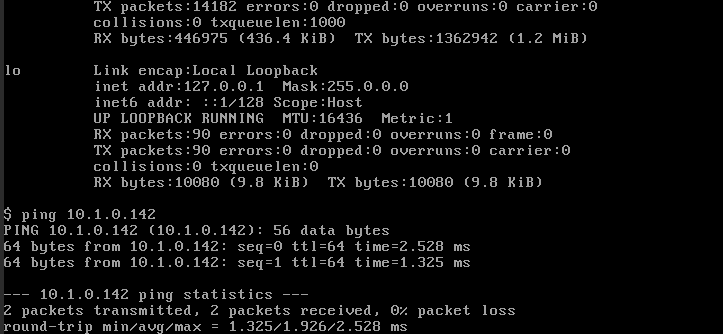
13. Remote the ping security group from the two VMs again as below.  
    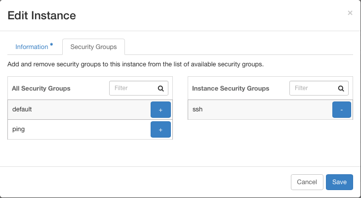
14. You can see that the flow rules to allow ICMP traffic in the VMs have been removed as below. (please note that IP addresses of the two VMs were change due to discontinuity of the test.)

    **flow rules after removing the ping security group** Expand source

    ```
    $ ssh sangho@10.40.101.208 sudo ovs-ofctl dump-flows br-int -O openflow13; ssh sangho@10.40.101.227 sudo ovs-ofctl dump-flows br-int -O openflow13

    OFPST_FLOW reply (OF1.3) (xid=0x2):
     cookie=0x4b000047fc9764, duration=274.388s, table=0, n_packets=15, n_bytes=1418, send_flow_rem priority=30000,ip,in_port=78 actions=set_field:0x443->tun_id,goto_table:1
     cookie=0x4b000047fc9783, duration=251.206s, table=0, n_packets=20, n_bytes=1908, send_flow_rem priority=30000,ip,in_port=79 actions=set_field:0x443->tun_id,goto_table:1
     cookie=0x100004890f31d, duration=336.520s, table=0, n_packets=4, n_bytes=1382, send_flow_rem priority=40000,udp,tp_src=68,tp_dst=67 actions=CONTROLLER:65535
     cookie=0x4a00004642a9bd, duration=386.846s, table=0, n_packets=755, n_bytes=69790, send_flow_rem priority=0 actions=goto_table:1
     cookie=0x10000487f5557, duration=386.810s, table=0, n_packets=0, n_bytes=0, send_flow_rem priority=40000,dl_type=0x88cc actions=CONTROLLER:65535
     cookie=0x10000488ebd5d, duration=386.810s, table=0, n_packets=3, n_bytes=126, send_flow_rem priority=40000,arp actions=CONTROLLER:65535
     cookie=0x4b0000e1288cca, duration=251.205s, table=1, n_packets=5, n_bytes=490, send_flow_rem priority=30000,ip,tun_id=0x443,nw_dst=10.1.0.147 actions=write_actions(set_field:10.40.101.227->tun_dst,output:1),goto_table:2
     cookie=0x4b0000e128944c, duration=249.089s, table=1, n_packets=0, n_bytes=0, send_flow_rem priority=30000,ip,tun_id=0x443,nw_dst=10.1.0.149 actions=write_actions(set_field:10.40.101.227->tun_dst,output:1),goto_table:2
     cookie=0x4b0000e128908b, duration=251.206s, table=1, n_packets=5, n_bytes=490, send_flow_rem priority=30000,ip,tun_id=0x443,nw_dst=10.1.0.148 actions=write_actions(output:79),goto_table:2
     cookie=0x4b0000e1288909, duration=274.403s, table=1, n_packets=0, n_bytes=0, send_flow_rem priority=30000,ip,tun_id=0x443,nw_dst=10.1.0.146 actions=write_actions(output:78),goto_table:2
     cookie=0x4a00004642a9be, duration=386.846s, table=1, n_packets=467, n_bytes=40474, send_flow_rem priority=0 actions=drop
     cookie=0x4a00004642a9bf, duration=25.923s, table=2, n_packets=0, n_bytes=0, send_flow_rem priority=0 actions=clear_actions
     cookie=0x4b0000e1285365, duration=9.265s, table=2, n_packets=0, n_bytes=0, send_flow_rem priority=30000,tcp,nw_src=10.1.0.146,tp_dst=22 actions=drop
     cookie=0x4b0000e126ef23, duration=9.265s, table=2, n_packets=0, n_bytes=0, send_flow_rem priority=30000,ip,nw_src=10.1.0.146 actions=drop
     cookie=0x4b0000e126f6a5, duration=251.044s, table=2, n_packets=5, n_bytes=490, send_flow_rem priority=30000,ip,nw_src=10.1.0.148 actions=drop
     cookie=0x4b0000e1279fb1, duration=251.044s, table=2, n_packets=0, n_bytes=0, send_flow_rem priority=30000,icmp,nw_src=10.1.0.148 actions=drop
     cookie=0x4b0000e1285365, duration=9.265s, table=2, n_packets=0, n_bytes=0, send_flow_rem priority=30000,tcp,nw_dst=10.1.0.146,tp_src=22 actions=drop
     cookie=0x4b0000e127a372, duration=251.044s, table=2, n_packets=5, n_bytes=490, send_flow_rem priority=30000,icmp,nw_dst=10.1.0.148 actions=drop

    OFPST_FLOW reply (OF1.3) (xid=0x2):
     cookie=0x4b000047fd0d75, duration=249.518s, table=0, n_packets=15, n_bytes=1418, send_flow_rem priority=30000,ip,in_port=92 actions=set_field:0x443->tun_id,goto_table:1
     cookie=0x4b000047fd0d56, duration=278.024s, table=0, n_packets=20, n_bytes=1908, send_flow_rem priority=30000,ip,in_port=91 actions=set_field:0x443->tun_id,goto_table:1
     cookie=0x100004891677c, duration=336.947s, table=0, n_packets=4, n_bytes=1382, send_flow_rem priority=40000,udp,tp_src=68,tp_dst=67 actions=CONTROLLER:65535
     cookie=0x4a000046431e1c, duration=386.770s, table=0, n_packets=13837, n_bytes=1352970, send_flow_rem priority=0 actions=goto_table:1
     cookie=0x10000487fc9b6, duration=386.770s, table=0, n_packets=0, n_bytes=0, send_flow_rem priority=40000,dl_type=0x88cc actions=CONTROLLER:65535
     cookie=0x10000488f31bc, duration=386.770s, table=0, n_packets=4, n_bytes=168, send_flow_rem priority=40000,arp actions=CONTROLLER:65535
     cookie=0x4b0000e1290129, duration=278.024s, table=1, n_packets=5, n_bytes=490, send_flow_rem priority=30000,ip,tun_id=0x443,nw_dst=10.1.0.147 actions=write_actions(output:91),goto_table:2
     cookie=0x4b0000e12908ab, duration=249.518s, table=1, n_packets=0, n_bytes=0, send_flow_rem priority=30000,ip,tun_id=0x443,nw_dst=10.1.0.149 actions=write_actions(output:92),goto_table:2
     cookie=0x4b0000e12904ea, duration=249.517s, table=1, n_packets=5, n_bytes=490, send_flow_rem priority=30000,ip,tun_id=0x443,nw_dst=10.1.0.148 actions=write_actions(set_field:10.40.101.208->tun_dst,output:1),goto_table:2
     cookie=0x4b0000e128fd68, duration=249.517s, table=1, n_packets=0, n_bytes=0, send_flow_rem priority=30000,ip,tun_id=0x443,nw_dst=10.1.0.146 actions=write_actions(set_field:10.40.101.208->tun_dst,output:1),goto_table:2
     cookie=0x4a000046431e1d, duration=386.770s, table=1, n_packets=525, n_bytes=47107, send_flow_rem priority=0 actions=drop
     cookie=0x4a000046431e1e, duration=25.744s, table=2, n_packets=0, n_bytes=0, send_flow_rem priority=0 actions=clear_actions
     cookie=0x4b0000e128cb85, duration=29.662s, table=2, n_packets=0, n_bytes=0, send_flow_rem priority=30000,tcp,nw_src=10.1.0.147,tp_dst=22 actions=drop
     cookie=0x4b0000e1276ec5, duration=249.354s, table=2, n_packets=0, n_bytes=0, send_flow_rem priority=30000,ip,nw_src=10.1.0.149 actions=drop
     cookie=0x4b0000e1276743, duration=29.662s, table=2, n_packets=0, n_bytes=0, send_flow_rem priority=30000,ip,nw_src=10.1.0.147 actions=drop
     cookie=0x4b0000e12817d1, duration=249.354s, table=2, n_packets=0, n_bytes=0, send_flow_rem priority=30000,icmp,nw_src=10.1.0.149 actions=drop
     cookie=0x4b0000e128cb85, duration=29.662s, table=2, n_packets=0, n_bytes=0, send_flow_rem priority=30000,tcp,nw_dst=10.1.0.147,tp_src=22 actions=drop
     cookie=0x4b0000e1281b92, duration=249.354s, table=2, n_packets=0, n_bytes=0, send_flow_rem priority=30000,icmp,nw_dst=10.1.0.149 actions=drop
    ```
15. Now you can check that ping stopped working after removing the ping security group from the two VMs, as below.  
    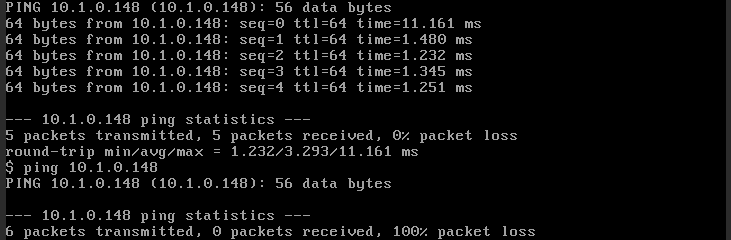
