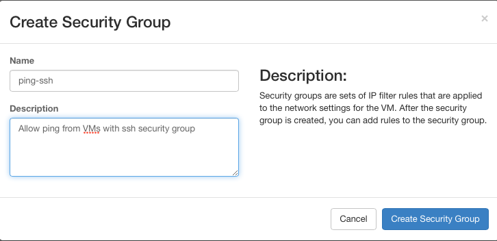
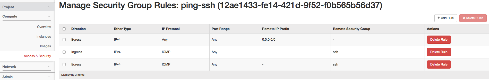
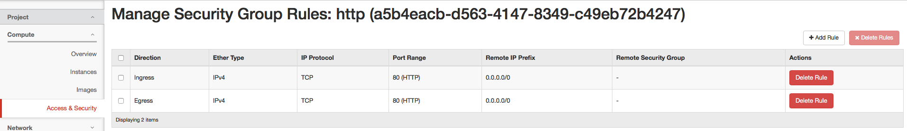
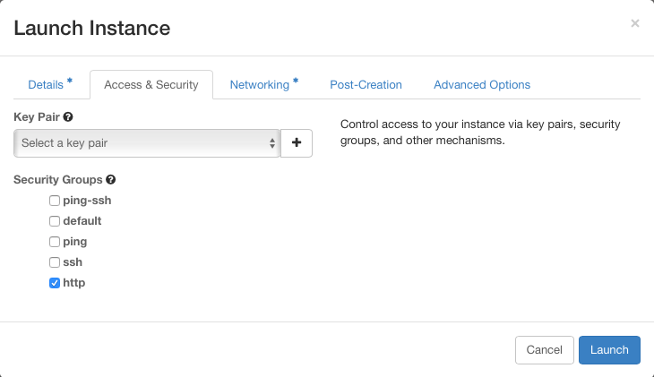
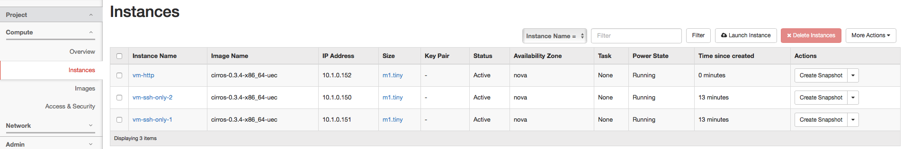
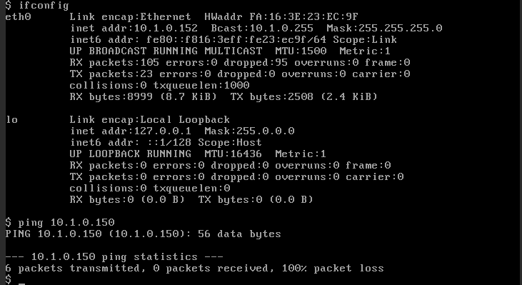
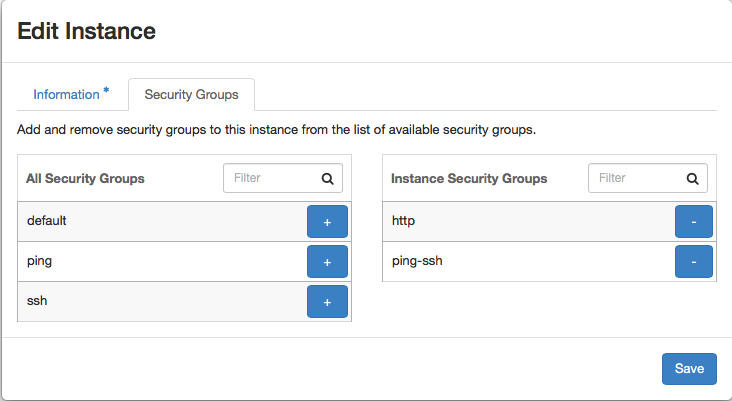
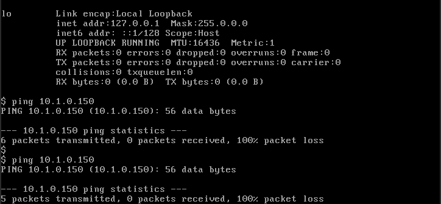
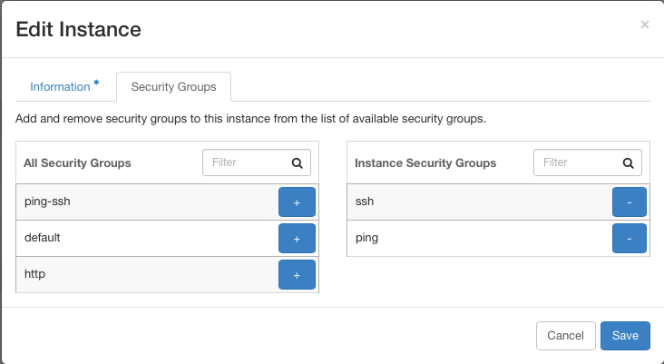
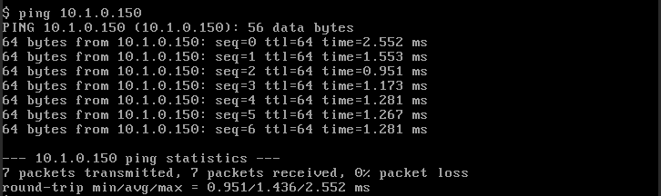

# Security Group Tutorial - Remote Security Group

The tutorial describes how to test the security group with remote security group.

1. Create a security group that allows ping from VMs with SSH security group as follows.  
     
   
2. Create a new security group of http which allows only HTTP (TCP & port 80) traffic as below.  
   
3. Create a new VM with http security group as below.  
     
   
4. Try to ping from the VM with vm-http security to one of the other VM with the ssh security group, and you can see that you cannot ping to it.  
   
5. Now we add the ping-ssh security group, which allows ping from the VMs with ssh security group, to the VM.  
   
6. Check the flow rules of the VM, and you can see that new flow rules that allows ICMP traffic from the two VMs with ssh security group (10.1.0.150 and 10.1.0.151 in the example).

   **flow rules after adding the ping-http security group**  Expand source

   ```
   $ ssh sangho@10.40.101.208 sudo ovs-ofctl dump-flows br-int -O openflow13; ssh sangho@10.40.101.227 sudo ovs-ofctl dump-flows br-int -O openflow13

   OFPST_FLOW reply (OF1.3) (xid=0x2):
    cookie=0x4b000047fc97a2, duration=1346.072s, table=0, n_packets=15, n_bytes=1418, send_flow_rem priority=30000,ip,in_port=80 actions=set_field:0x443->tun_id,goto_table:1
    cookie=0x100004890f31d, duration=2558.344s, table=0, n_packets=6, n_bytes=2072, send_flow_rem priority=40000,udp,tp_src=68,tp_dst=67 actions=CONTROLLER:65535
    cookie=0x4a00004642a9bd, duration=2608.670s, table=0, n_packets=767, n_bytes=70846, send_flow_rem priority=0 actions=goto_table:1
    cookie=0x10000487f5557, duration=2608.634s, table=0, n_packets=0, n_bytes=0, send_flow_rem priority=40000,dl_type=0x88cc actions=CONTROLLER:65535
    cookie=0x10000488ebd5d, duration=2608.634s, table=0, n_packets=5, n_bytes=210, send_flow_rem priority=40000,arp actions=CONTROLLER:65535
    cookie=0x4b0000e1289bce, duration=1346.072s, table=1, n_packets=0, n_bytes=0, send_flow_rem priority=30000,ip,tun_id=0x443,nw_dst=10.1.0.151 actions=write_actions(set_field:10.40.101.227->tun_dst,output:1),goto_table:2
    cookie=0x4b0000e128980d, duration=1346.072s, table=1, n_packets=0, n_bytes=0, send_flow_rem priority=30000,ip,tun_id=0x443,nw_dst=10.1.0.150 actions=write_actions(output:80),goto_table:2
    cookie=0x4b0000e1289f8f, duration=513.057s, table=1, n_packets=0, n_bytes=0, send_flow_rem priority=30000,ip,tun_id=0x443,nw_dst=10.1.0.152 actions=write_actions(set_field:10.40.101.227->tun_dst,output:1),goto_table:2
    cookie=0x4a00004642a9be, duration=2608.670s, table=1, n_packets=488, n_bytes=42360, send_flow_rem priority=0 actions=drop
    cookie=0x4a00004642a9bf, duration=27.607s, table=2, n_packets=0, n_bytes=0, send_flow_rem priority=0 actions=clear_actions
    cookie=0x4b0000e126fe27, duration=1345.894s, table=2, n_packets=0, n_bytes=0, send_flow_rem priority=30000,ip,nw_src=10.1.0.150 actions=drop
    cookie=0x4b0000e1286269, duration=1345.895s, table=2, n_packets=0, n_bytes=0, send_flow_rem priority=30000,tcp,nw_src=10.1.0.150,tp_dst=22 actions=drop
    cookie=0x4b0000e1286269, duration=1345.894s, table=2, n_packets=0, n_bytes=0, send_flow_rem priority=30000,tcp,nw_dst=10.1.0.150,tp_src=22 actions=drop

   OFPST_FLOW reply (OF1.3) (xid=0x2):
    cookie=0x4b000047fd0d94, duration=1347.873s, table=0, n_packets=15, n_bytes=1418, send_flow_rem priority=30000,ip,in_port=93 actions=set_field:0x443->tun_id,goto_table:1
    cookie=0x4b000047fd0db3, duration=513.477s, table=0, n_packets=21, n_bytes=2006, send_flow_rem priority=30000,ip,in_port=94 actions=set_field:0x443->tun_id,goto_table:1
    cookie=0x100004891677c, duration=2558.764s, table=0, n_packets=8, n_bytes=2750, send_flow_rem priority=40000,udp,tp_src=68,tp_dst=67 actions=CONTROLLER:65535
    cookie=0x4a000046431e1c, duration=2608.587s, table=0, n_packets=13855, n_bytes=1354494, send_flow_rem priority=0 actions=goto_table:1
    cookie=0x10000487fc9b6, duration=2608.587s, table=0, n_packets=0, n_bytes=0, send_flow_rem priority=40000,dl_type=0x88cc actions=CONTROLLER:65535
    cookie=0x10000488f31bc, duration=2608.587s, table=0, n_packets=8, n_bytes=336, send_flow_rem priority=40000,arp actions=CONTROLLER:65535
    cookie=0x4b0000e129102d, duration=1347.874s, table=1, n_packets=0, n_bytes=0, send_flow_rem priority=30000,ip,tun_id=0x443,nw_dst=10.1.0.151 actions=write_actions(output:93),goto_table:2
    cookie=0x4b0000e1290c6c, duration=513.478s, table=1, n_packets=6, n_bytes=588, send_flow_rem priority=30000,ip,tun_id=0x443,nw_dst=10.1.0.150 actions=write_actions(set_field:10.40.101.208->tun_dst,output:1),goto_table:2
    cookie=0x4b0000e12913ee, duration=513.478s, table=1, n_packets=0, n_bytes=0, send_flow_rem priority=30000,ip,tun_id=0x443,nw_dst=10.1.0.152 actions=write_actions(output:94),goto_table:2
    cookie=0x4a000046431e1d, duration=2608.587s, table=1, n_packets=567, n_bytes=50879, send_flow_rem priority=0 actions=drop
    cookie=0x4b00007a530f28, duration=10.009s, table=2, n_packets=0, n_bytes=0, send_flow_rem priority=30000,icmp,nw_src=10.1.0.152,nw_dst=10.1.0.151 actions=drop
    cookie=0x4b00007a530b67, duration=10.235s, table=2, n_packets=0, n_bytes=0, send_flow_rem priority=30000,icmp,nw_src=10.1.0.150,nw_dst=10.1.0.152 actions=drop
    cookie=0x4b00007a530b67, duration=10.009s, table=2, n_packets=0, n_bytes=0, send_flow_rem priority=30000,icmp,nw_src=10.1.0.152,nw_dst=10.1.0.150 actions=drop
    cookie=0x4b00007a530f28, duration=10.235s, table=2, n_packets=0, n_bytes=0, send_flow_rem priority=30000,icmp,nw_src=10.1.0.151,nw_dst=10.1.0.152 actions=drop
    cookie=0x4a000046431e1e, duration=27.429s, table=2, n_packets=0, n_bytes=0, send_flow_rem priority=0 actions=clear_actions
    cookie=0x4b0000e128e550, duration=11.796s, table=2, n_packets=0, n_bytes=0, send_flow_rem priority=30000,tcp,nw_src=10.1.0.152,tp_dst=80 actions=drop
    cookie=0x4b0000e128da89, duration=1347.700s, table=2, n_packets=0, n_bytes=0, send_flow_rem priority=30000,tcp,nw_src=10.1.0.151,tp_dst=22 actions=drop
    cookie=0x4b0000e1277647, duration=1347.700s, table=2, n_packets=0, n_bytes=0, send_flow_rem priority=30000,ip,nw_src=10.1.0.151 actions=drop
    cookie=0x4b0000e1277a08, duration=10.009s, table=2, n_packets=0, n_bytes=0, send_flow_rem priority=30000,ip,nw_src=10.1.0.152 actions=drop
    cookie=0x4b0000e128e550, duration=11.796s, table=2, n_packets=0, n_bytes=0, send_flow_rem priority=30000,tcp,nw_dst=10.1.0.152,tp_src=80 actions=drop
    cookie=0x4b0000e128da89, duration=1347.700s, table=2, n_packets=0, n_bytes=0, send_flow_rem priority=30000,tcp,nw_dst=10.1.0.151,tp_src=22 actions=drop
   ```
7. Now we try to ping the VM again, and you can see that still you cannot ping to the VM. It is because the VM with the ssh security group allows only SSH traffic.  
   
8. Then, we add the icmp security group to the VM with the http security group.  
   
9. We can check that new flow rules to allow ICMP traffic in the VM (10.1.0.150 in the example).

   **flow rules after adding icmp security group** Expand source

   ```
   $ ssh sangho@10.40.101.208 sudo ovs-ofctl dump-flows br-int -O openflow13; ssh sangho@10.40.101.227 sudo ovs-ofctl dump-flows br-int -O openflow13

   OFPST_FLOW reply (OF1.3) (xid=0x2):
    cookie=0x4b000047fc97a2, duration=2827.850s, table=0, n_packets=15, n_bytes=1418, send_flow_rem priority=30000,ip,in_port=80 actions=set_field:0x443->tun_id,goto_table:1
    cookie=0x100004890f31d, duration=4040.122s, table=0, n_packets=6, n_bytes=2072, send_flow_rem priority=40000,udp,tp_src=68,tp_dst=67 actions=CONTROLLER:65535
    cookie=0x4a00004642a9bd, duration=4090.448s, table=0, n_packets=772, n_bytes=71336, send_flow_rem priority=0 actions=goto_table:1
    cookie=0x10000487f5557, duration=4090.412s, table=0, n_packets=0, n_bytes=0, send_flow_rem priority=40000,dl_type=0x88cc actions=CONTROLLER:65535
    cookie=0x10000488ebd5d, duration=4090.412s, table=0, n_packets=5, n_bytes=210, send_flow_rem priority=40000,arp actions=CONTROLLER:65535
    cookie=0x4b0000e1289bce, duration=2827.850s, table=1, n_packets=0, n_bytes=0, send_flow_rem priority=30000,ip,tun_id=0x443,nw_dst=10.1.0.151 actions=write_actions(set_field:10.40.101.227->tun_dst,output:1),goto_table:2
    cookie=0x4b0000e128980d, duration=2827.850s, table=1, n_packets=5, n_bytes=490, send_flow_rem priority=30000,ip,tun_id=0x443,nw_dst=10.1.0.150 actions=write_actions(output:80),goto_table:2
    cookie=0x4b0000e1289f8f, duration=1994.835s, table=1, n_packets=0, n_bytes=0, send_flow_rem priority=30000,ip,tun_id=0x443,nw_dst=10.1.0.152 actions=write_actions(set_field:10.40.101.227->tun_dst,output:1),goto_table:2
    cookie=0x4a00004642a9be, duration=4090.448s, table=1, n_packets=488, n_bytes=42360, send_flow_rem priority=0 actions=drop
    cookie=0x4a00004642a9bf, duration=9.293s, table=2, n_packets=0, n_bytes=0, send_flow_rem priority=0 actions=clear_actions
    cookie=0x4b0000e1286269, duration=13.792s, table=2, n_packets=0, n_bytes=0, send_flow_rem priority=30000,tcp,nw_src=10.1.0.150,tp_dst=22 actions=drop
    cookie=0x4b0000e126fe27, duration=12.254s, table=2, n_packets=0, n_bytes=0, send_flow_rem priority=30000,ip,nw_src=10.1.0.150 actions=drop
    cookie=0x4b0000e127a733, duration=12.254s, table=2, n_packets=0, n_bytes=0, send_flow_rem priority=30000,icmp,nw_src=10.1.0.150 actions=drop
    cookie=0x4b0000e127aaf4, duration=12.254s, table=2, n_packets=0, n_bytes=0, send_flow_rem priority=30000,icmp,nw_dst=10.1.0.150 actions=drop
    cookie=0x4b0000e1286269, duration=13.792s, table=2, n_packets=0, n_bytes=0, send_flow_rem priority=30000,tcp,nw_dst=10.1.0.150,tp_src=22 actions=drop
   OFPST_FLOW reply (OF1.3) (xid=0x2):
    cookie=0x4b000047fd0d94, duration=2829.650s, table=0, n_packets=15, n_bytes=1418, send_flow_rem priority=30000,ip,in_port=93 actions=set_field:0x443->tun_id,goto_table:1
    cookie=0x4b000047fd0db3, duration=1995.254s, table=0, n_packets=26, n_bytes=2496, send_flow_rem priority=30000,ip,in_port=94 actions=set_field:0x443->tun_id,goto_table:1
    cookie=0x100004891677c, duration=4040.540s, table=0, n_packets=8, n_bytes=2750, send_flow_rem priority=40000,udp,tp_src=68,tp_dst=67 actions=CONTROLLER:65535
    cookie=0x4a000046431e1c, duration=4090.363s, table=0, n_packets=13855, n_bytes=1354494, send_flow_rem priority=0 actions=goto_table:1
    cookie=0x10000487fc9b6, duration=4090.363s, table=0, n_packets=0, n_bytes=0, send_flow_rem priority=40000,dl_type=0x88cc actions=CONTROLLER:65535
    cookie=0x10000488f31bc, duration=4090.363s, table=0, n_packets=9, n_bytes=378, send_flow_rem priority=40000,arp actions=CONTROLLER:65535
    cookie=0x4b0000e129102d, duration=2829.650s, table=1, n_packets=0, n_bytes=0, send_flow_rem priority=30000,ip,tun_id=0x443,nw_dst=10.1.0.151 actions=write_actions(output:93),goto_table:2
    cookie=0x4b0000e1290c6c, duration=1995.254s, table=1, n_packets=11, n_bytes=1078, send_flow_rem priority=30000,ip,tun_id=0x443,nw_dst=10.1.0.150 actions=write_actions(set_field:10.40.101.208->tun_dst,output:1),goto_table:2
    cookie=0x4b0000e12913ee, duration=1995.254s, table=1, n_packets=0, n_bytes=0, send_flow_rem priority=30000,ip,tun_id=0x443,nw_dst=10.1.0.152 actions=write_actions(output:94),goto_table:2
    cookie=0x4a000046431e1d, duration=4090.363s, table=1, n_packets=567, n_bytes=50879, send_flow_rem priority=0 actions=drop
    cookie=0x4a000046431e1e, duration=9.107s, table=2, n_packets=0, n_bytes=0, send_flow_rem priority=0 actions=clear_actions
    cookie=0x4b00007a530f28, duration=90.958s, table=2, n_packets=0, n_bytes=0, send_flow_rem priority=30000,icmp,nw_src=10.1.0.152,nw_dst=10.1.0.151 actions=drop
    cookie=0x4b00007a530b67, duration=13.330s, table=2, n_packets=0, n_bytes=0, send_flow_rem priority=30000,icmp,nw_src=10.1.0.150,nw_dst=10.1.0.152 actions=drop
    cookie=0x4b00007a530b67, duration=13.330s, table=2, n_packets=0, n_bytes=0, send_flow_rem priority=30000,icmp,nw_src=10.1.0.152,nw_dst=10.1.0.150 actions=drop
    cookie=0x4b00007a530f28, duration=91.185s, table=2, n_packets=0, n_bytes=0, send_flow_rem priority=30000,icmp,nw_src=10.1.0.151,nw_dst=10.1.0.152 actions=drop
    cookie=0x4b0000e128e550, duration=92.702s, table=2, n_packets=0, n_bytes=0, send_flow_rem priority=30000,tcp,nw_src=10.1.0.152,tp_dst=80 actions=drop
    cookie=0x4b0000e128da89, duration=2829.476s, table=2, n_packets=0, n_bytes=0, send_flow_rem priority=30000,tcp,nw_src=10.1.0.151,tp_dst=22 actions=drop
    cookie=0x4b0000e1277a08, duration=90.959s, table=2, n_packets=0, n_bytes=0, send_flow_rem priority=30000,ip,nw_src=10.1.0.152 actions=drop
    cookie=0x4b0000e1277647, duration=2829.476s, table=2, n_packets=0, n_bytes=0, send_flow_rem priority=30000,ip,nw_src=10.1.0.151 actions=drop
    cookie=0x4b0000e128e550, duration=92.702s, table=2, n_packets=0, n_bytes=0, send_flow_rem priority=30000,tcp,nw_dst=10.1.0.152,tp_src=80 actions=drop
    cookie=0x4b0000e128da89, duration=2829.476s, table=2, n_packets=0, n_bytes=0, send_flow_rem priority=30000,tcp,nw_dst=10.1.0.151,tp_src=22 actions=drop
   ```
10. Try to ping to the VM again, and you can see that you can ping to the VM finally.  
    
11. Enjoy the security group feature !!
