# Simple WalkThrough: L2 Switching

We describe how to create a network and VMs, and we show the VMs can communicate through the virtual network configured by OpenstackNetworking app. We do not describe the details of how to use Openstack. If you are not familiar with Openstack, we recommend to walk through tutorials in Openstack community sites. In this walkthrough, we use horizon UI interface for simplicity.

1. Login to the horizon interface using the ID and password. If you followed the steps described in the ONOS wiki pages, ID is admin and password is nova.  
   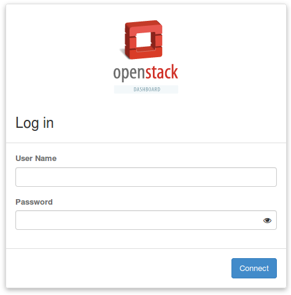
2. Create a network by clicking the Create Network button of admin > Network > Networks menu  
   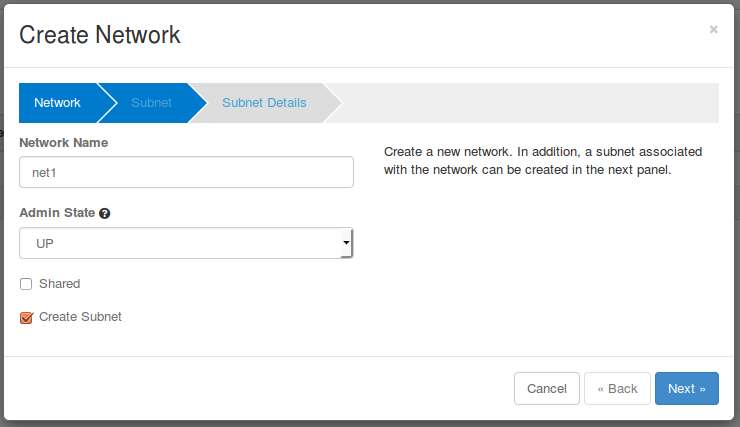  
   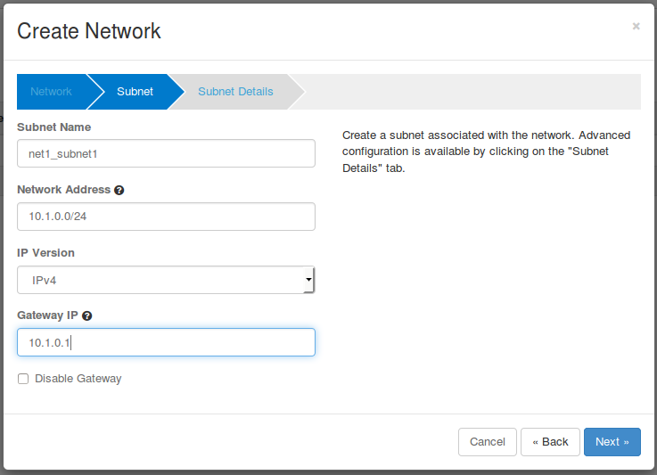  
   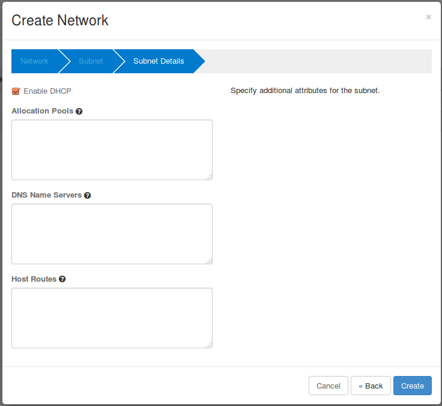  
   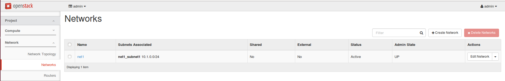
3. Create four VMs using the network net1 just created above : Compute > Instances > Launch Instance.  
   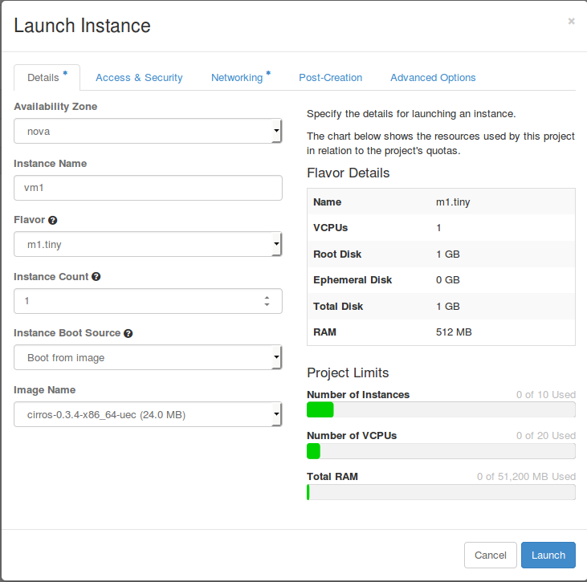  
   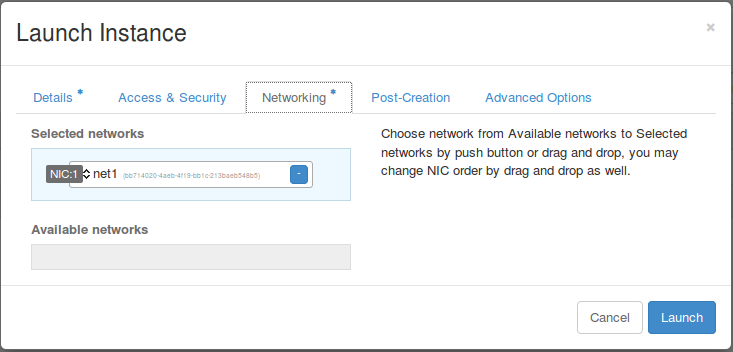  
     
   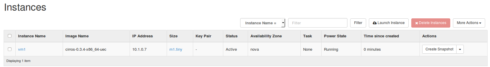When a VM is created successfully, you can see that a new port "tapxxxx" for the VM is created in the host. You can check the host of the VM in the menu of admin>system>instances.

   ```
   $ sudo ovs-vsctl show
   1265d109-8a0a-40d5-bfee-f8ee9c7438c1
       Manager "ptcp:6640"
       Bridge br-int
           Controller "tcp:10.40.101.152:6653"
               is_connected: true
           fail_mode: secure
           Port vxlan
               Interface vxlan
                   type: vxlan
                   options: {key=flow, remote_ip=flow}
           Port br-int
               Interface br-int
           Port "tap8ee7ff66-af"
               Interface "tap8ee7ff66-af"
   ```

   You can also check that forwarding flow rules for the VM are added in the bridge of the host.

   ```
   $ sudo ovs-ofctl dump-flows br-int -O openflow13
   OFPST_FLOW reply (OF1.3) (xid=0x2):
    cookie=0x100004890f31d, duration=1100957.665s, table=0, n_packets=0, n_bytes=0, send_flow_rem priority=40000,udp,tp_src=68,tp_dst=67 actions=CONTROLLER:65535
    cookie=0x4e00004642a9bd, duration=1101005.692s, table=0, n_packets=206, n_bytes=20884, send_flow_rem priority=0 actions=goto_table:1
    cookie=0x10000487f5557, duration=1101005.675s, table=0, n_packets=0, n_bytes=0, send_flow_rem priority=40000,dl_type=0x88cc actions=CONTROLLER:65535
    cookie=0x10000488ebd5d, duration=1101005.669s, table=0, n_packets=74, n_bytes=3108, send_flow_rem priority=40000,arp actions=CONTROLLER:65535
    cookie=0x4e00004642a9be, duration=1101005.678s, table=1, n_packets=182, n_bytes=15993, send_flow_rem priority=0 actions=drop
    cookie=0x4e00004642a9bf, duration=28.596s, table=2, n_packets=0, n_bytes=0, send_flow_rem priority=0 actions=clear_actions
   ```

   Repeat the process above to create three other VMs as below.  
   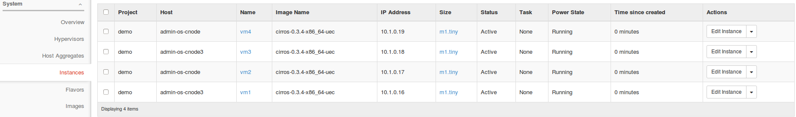

   From the Admin>System>Instances menu, you can see the location of the VMs. You can see that VMs have been created alternatively across hosts. If your VMs are created in only one host, then there must be some issues in the other host. Please check the logs of the compute node referring to the [SONA Troubleshooting](../sona-user-guide/sona-troubleshooting.md) page in the wiki.
4. Ping test  
   Log in to the VM using by clicking the vm name in the list above and click the console tab as below.  
   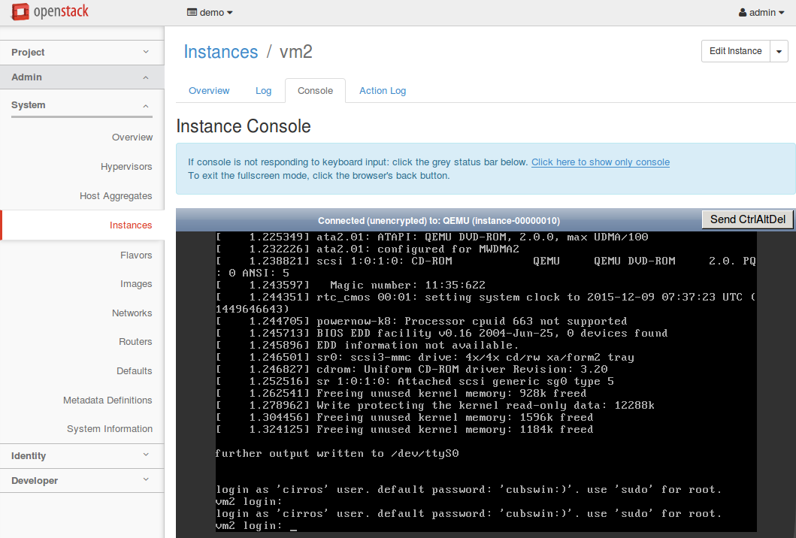  
   Log in to any VM using the console as guided in the console screen: cirros as the user name and cubswin:) as the password.  
   Then, please try to ping as below to all VMs. You should be able to ping to the VM created in the same host and different VMs.  
   cirros  
   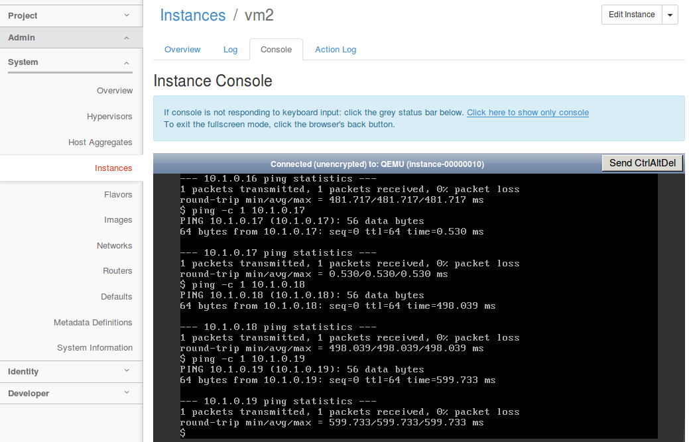
