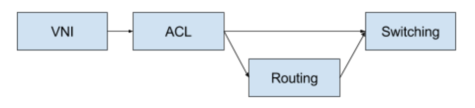
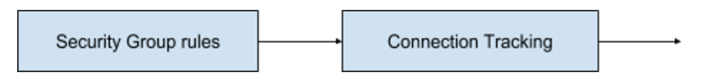
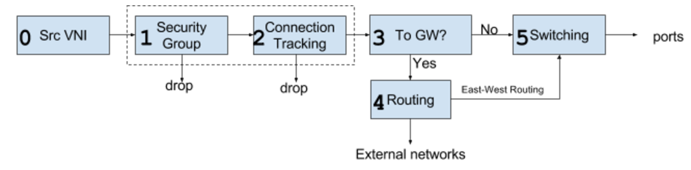
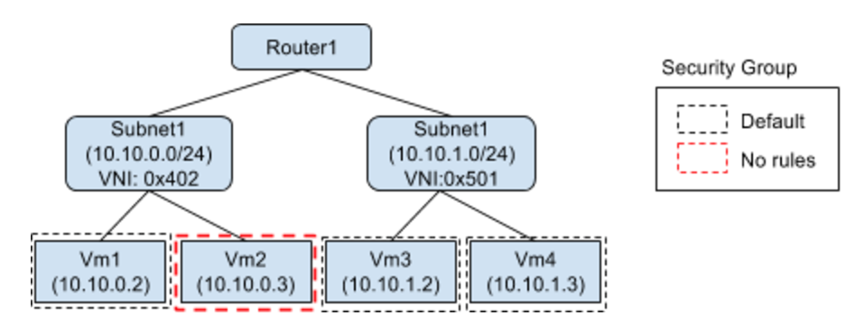

# SONA Pipeline

# Requirements

1. Supports Connection Tracking feature using OVS
2. Separates routing flow rules from switching rules for simplicity
3. Supports complete tenant isolation

# Limitations

A tenant cannot create more than one subnet with same IP address range even in different virtual network. However, the same subnet can be defined across tenants.

# High level table design



* VNI tables  
  - Tag the src VNI to the packet according to the in-port of the packet

* ACL tables  
  - Flow rules for Security Group  
  - Flow rules for Connection Tracking : due to the architecture of the OVS connection tracking feature the ACL should be located to prior to the switching tables.

* Routing table  
  - Check if routing is required by looking at the eth\_dst. If not go to switching table.  
  - Flow rules for routing between different subnets  
  - Flow rules for external network connections, i.e rules to gateway nodes.

* Switching table  
  - Flow rules to forwarding packets to VM ports  
  - Flow rules to forwarding packets to VxLAN tunnel port.

# Flow rule designs

* VNI tables  
  - Tag the VNI of source IP address (by looking at the in-port ??)

  ```
  table=0,ip,in_port=1, actions=set_field:0x402->tun_id,goto_table:1
  ```
* ACI tables

         

```
table=2,ip,nw_src=10.10.0.10,nw_dst=10.10.0.12 actions=goto_table:4
table=3,in_port=4,ip,ct_state=+trk+new,nw_dst=10.10.0.13/32,action=ct(commit),goto_table:4
```

* Routing table  
  - Check if the eth\_dst = virtual gateway mac (fe:00:00:00:00:02). If not, go to switching table.  
  - Allow packets with source VNI and src subnet and dest subnet connected via routers.  
  - Change the VNI using the destination if packets are from different subnet, which is because all of flow rules in the switching table forward packets using VNI of destination VM.

```
table=5,ip,tun_id=0x402,nw_src=10.10.0.0/24,dl_src=00:00:00:00:04:02,nw_dst=10.10.1.0/24, actions=set_field:0x501->tun_id, action=goto_table:6
```

* Switching table  
  - Sets the destination MAC address according to the destination IP address.  
  - It is required for routing, but we do not want to create another table only for the action.  
  - We believe that the additional action would not degrade the overall performance.  
  - However, if it does, it needs to moved to a separate routing table.

```
table=7,ip,nw_dst=10.10.0.13 actions=set_field:fa:16:3e:b8:92:fe->eth_dst ,output:5
table=7,ip,nw_dst=10.10.0.10 actions=set_field:10.0.0.166->tun_dst,output:1
```

# Overall SONA TTP



# Example



 

**VNI Table**

```
table=0,ip,in_port=2, actions=set_field:0x402->tun_id,goto_table:1
table=0,ip,in_port=3, actions=set_field:0x402->tun_id,goto_table:1
table=0,ip,in_port=4, actions=set_field:0x501->tun_id,goto_table:1
table=0,ip,in_port=5, actions=set_field:0x501->tun_id,goto_table:1
```

**Security Group**

```
table=1,ip,nw_src=10.10.0.2,nw_dst=10.10.0.3 actions=goto_table:4
table=1,ip,nw_src=10.10.0.3,nw_dst=10.10.0.2 actions=goto_table:4
table=1,ip,nw_src=10.10.1.2,nw_dst=10.10.1.3 actions=goto_table:4
table=1,ip,nw_src=10.10.1.3,nw_dst=10.10.1.2 actions=goto_table:4
table=1,ip,ct_state=-trk, actions=ct(table:2)
```

Security groups are set per VMs, and we need M x M (M=number of VMs) rules are required. We might be able to reduce the rules using subnet when all VMs in a subnet are set with the same security group.

**Connection Tracking**

```
table=2,ip,nw_src=10.10.0.2,ct_state=+trk+new,action=ct(commit),goto_table:3
table=2,ip,nw_dst=10.10.0.2,ct_state=+trk+est,action=goto_table:3
table=2,ip,nw_dst=10.10.0.2,ct_state=+trk+new,action=drop
```

Connection Tracking is activated only for VMs that do not have “allow all incoming” rules.

**Jump Table**

```
table=3,ip,eth_dst=fe:00:00:00:00:02,action=goto_table:4
table=3,ip,action=goto_table:7
```

**Routing Table**

```
table=5,ip,tun_id=0x402,nw_src=10.10.0.0/24,nw_dst=10.10.1.0/24, action=set_field:0x402->tun_id, goto_table:6 (1)
table=5,ip,tun_id=0x501,nw_src=10.10.1.0/24,nw_dst=10.10.1.0/24, action=set_field:0x501->tun_id, goto_table:6 (2)
table=5,ip,tun_id=0x402,nw_src=10.10.0.0/24,nw_dst=10.10.1.0/24, action=set_field:0x501->tun_id, goto_table:6 (3)
table=5,ip,tun_id=0x501,nw_src=10.10.1.0/24,nw_dst=10.10.0.0/24, action=set_field:0x402->tun_id, goto_table:6 (4)
```

Flow rules (1) & (2) are default routing rule for VMs within its subnet and set whenever a virtual network is created.  
Flow rules (3) & (4) are the routing rules between subnets. NxN (N=# of subnets) rules are required.

**Switching Table**

```
table=7,ip,tun_id=0x402,nw_dst=10.10.0.2 actions=set_field:fa:16:3e:b8:92:fe->eth_dst, output:2
table=7,ip,tun_id=0x402,nw_dst=10.10.0.3 actions=set_field:fa:16:3e:b8:92:fe->eth_dst, output:3
table=7,ip,tun_id=0x501,nw_dst=10.10.1.2 actions=set_field:fa:16:3e:b8:92:fe->eth_dst, output:4
table=7,ip,tun_id=0x501,nw_dst=10.10.1.3 actions=set_field:fa:16:3e:b8:92:fe->eth_dst, output:5
```
