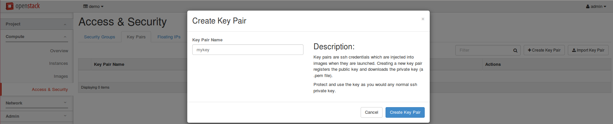
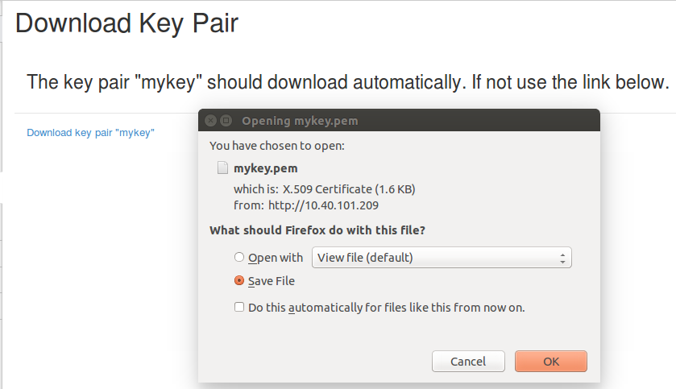
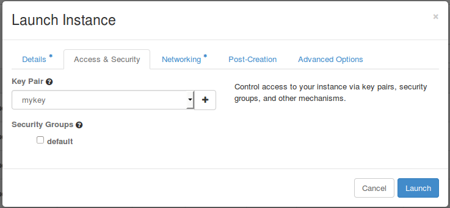

# Walk-Through 3: SSH to VMs using public key

In the previous tutorial, walk-through 2, we have described how to ping to VMs from network node using a router. In this tutorial, we explain how to SSH to VMs from network node using a router. If you have not done the walk-through 2, we strongly recommend to do so. This is a extended tutorial from walk-through 2.

1. Create a key to use to SSH to VMs: Compute > Access & Security > Key Pairs > Create Key Pair > "Create Key Pair" button  
     
   Then, download your private key.  
   

   How to create your own key

   If you want to ssh to your VMs using namespace, please create your public key as follows and import the key pair in openstack.

   ```
   $ sudo ip netns exec qrouter-5ec1a62d-95c4-48fd-a4b8-0b9f9e2f0437 bash    
   root@admin-os-networknode:~# ssh-keygen -t rsa
   Generating public/private rsa key pair.
   Enter file in which to save the key (/root/.ssh/id_rsa): 
   /root/.ssh/id_rsa already exists.
   Overwrite (y/n)? y
   Enter passphrase (empty for no passphrase): 
   Enter same passphrase again: 
   Your identification has been saved in /root/.ssh/id_rsa.
   Your public key has been saved in /root/.ssh/id_rsa.pub.
   The key fingerprint is:
   42:ad:84:d2:cc:62:0d:e9:66:c6:22:c4:12:71:de:00 root@admin-os-networknode
   The key's randomart image is:
   +--[ RSA 2048]----+
   |E++.             |
   |.=.O . .         |
   |oo= B o .        |
   |o.*o o .         |
   |.=    o S        |
   |       .         |
   |                 |
   |                 |
   |                 |
   +-----------------+
   ```

   You can import the public key in /root/.ssh/id\_rsa.pub in openstack.
2. Create VMs using the key we have just created.  
   After you created a key pair, the key pair is automatically added when you create VMs as below.  
   
3. Now you can login to your VMs using the key via namespace

   ```
   $ sudo ip netns exec qrouter-5ec1a62d-95c4-48fd-a4b8-0b9f9e2f0437 ssh -i your_key_file cirros@10.1.0.24
   ```

   ```
   qrouter-5ec1a62d-95c4-48fd-a4b8-0b9f9e2f0437 is the namespace, and you can check it using "sudo ip netns" command.
   ```

   If you registered the key created under the namespace as in the example above, you can login without specifying the key, as below.

   ```
   $ sudo ip netns exec qrouter-5ec1a62d-95c4-48fd-a4b8-0b9f9e2f0437 ssh cirros@10.1.0.24
   ```

   Using ssh you can give a command to the VM without logging in to the VMs. The following is an example to ping from a VM to another VM using SSH at the network node.

   ```
   $ sudo ip netns exec qrouter-5ec1a62d-95c4-48fd-a4b8-0b9f9e2f0437 ssh cirros@10.1.0.24 ping 10.1.0.25
   PING 10.1.0.25 (10.1.0.25): 56 data bytes
   64 bytes from 10.1.0.25: seq=0 ttl=64 time=397.890 ms
   64 bytes from 10.1.0.25: seq=1 ttl=64 time=1.636 ms
   64 bytes from 10.1.0.25: seq=2 ttl=64 time=1.472 ms
   ```
