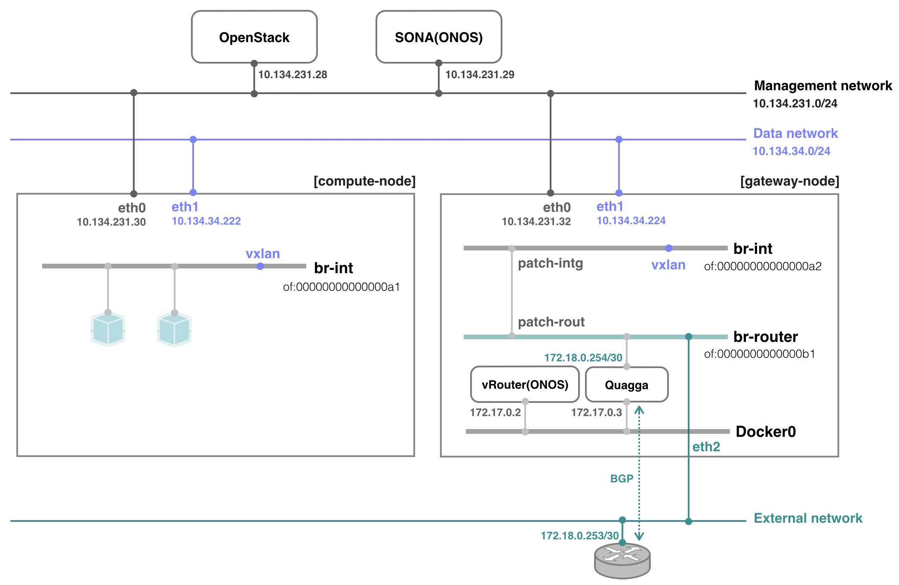

# SONA Network Configuration Guide

# ONOS-SONA Network Configuration

Here it describes how to create network configuration file consumed by SONA applications. To help understanding, it uses an example deployment with particular IP addresses and DPID values depicted in the figure below. Note that there can be multiple compute and gateway nodes in the system but the figure has only one of each type for convenience.



SONA supports REST API to create, update, and delete configurations for each node. The following is the REST API URI.

```
http://ONOS_IP:8181/onos/openstacknode/configure
```

Here is the example of setting SONA configuration using curl.

**Example of setting SONA configuration using curl**

```
$ curl --user onos:rocks -X POST -H "Content-Type:application/json" -d "@network-cfg.json.kuryr" http://172.27.0.22:8181/onos/openstacknode/configure
```

You can call the REST API with the configuration of the node you want to create, update, and delete only.

**ONOS-SONA network-cfg.json**

```
{
    "nodes" : [
        {
            "hostname" : "compute-node",
            "type" : "COMPUTE",
            "managementIp" : "10.134.231.30",
            "dataIp" : "10.134.34.222",
            "integrationBridge" : "of:00000000000000a1"
        },
        {
			"hostname" : "controller",
            "type" : "CONTROLLER",
            "managementIp" : "10.134.231.28",
			"keystoneConfig" : {
				"endpoint" : "keystone-endpoint-address",
            	"authentication" : {
                    "version" : "v2.0",
                    "protocol" : "HTTPS",
                    "project" : "admin",
                    "username" : "admin",
                    "password" : "PASSWORD",
                    "perspective" : "PUBLIC"
            	}
			},
			"neutronConfig": {
	  			"useMetadataProxy": true,
  				"metadataProxySecret": "nova",
  				"novaMetadataIp": "10.134.231.28",
  				"novaMetadataPort": 8775
			}
        },
        {
            "hostname" : "gateway-node",
            "type" : "GATEWAY",
            "managementIp" : "10.134.231.32",
            "dataIp" : "10.134.34.224",
            "integrationBridge" : "of:00000000000000a2",
            "uplinkPort" : "eth2"
         }
     ]
}
```

**Line 04 ~ 10**: Compute node information

* **hostname**: unique name of the host
* **type**: COMPUTE
* **managementIp**: management network IP address of the host, it is used by ONOS-SONA to control the integration bridge
* **dataIp**: data network IP address of the host, it is used to create a VXLAN tunnel between compute nodes
* **integrationBridge**: unique device ID of the integration bridge

**Line 11 ~ 21**: Controller node information (**only required by "openstack-sync-states" command, from ONOS version 1.13.0**)

* **hostname**: unique name of the host
* **type**: CONTROLLER
* **managementIp**: management network IP address of the host
* **endpoint**: endpoint address, it is used by ONOS-SONA to obtain openstack information through openstack endpoint (e.g., 192.168.0.100/identity/v3 or 192.168.0.100:35357/v2.0)
* **authentication**
  + **version**: openstack keystone version
  + **protocol**: openstack keystone endpoint protocol, it can be either HTTP or HTTPS
  + **project**: project name of openstack
  + **username**: username used for keystone authentication
  + **password**: password used for keystone authentication
  + **perspective**: perspective name of openstack

**Line 25 ~ 32**: Gateway node information

* **hostname**: unique name of the host
* **type**: GATEWAY
* **managementIp**: management network IP address of the host, it is used by ONOS-SONA to control the integration bridge
* **dataIp**: data network IP address of the host, it is used to create a VXLAN tunnel between compute nodes
* **integrationBridge**: unique device ID of the integration bridge
* **uplinkPort**: uplink interface name

### How to delete a node

Please use DELETE REST Call with a hostname path and the node name to delete.

```
$ curl --user onos:rocks -X DELETE http://172.27.0.22:8181/onos/openstacknode/configure/hostname?<NODE NAME>
```

# Other SONA Configurations

## Security Group option

SONA supports OpenStack Security Group features completely. However, it inserts not so little flow rules and it increases the complexity of flow rules even though it does not hurt the data plane performance. Thus, the security group feature is disabled by default. If you want to use the OpenStack Security Group feature, then you can enable the option as follows, inside of ONOS CLI.

```
onos> cfg set org.onosproject.openstacknetworking.impl.OpenstackSecurityGroupHandler useSecurityGroup True
```

The following is the flow rules in a compute node with two VMs with security group feature disabled. You can see that table miss entry in table 1 (ACL\_TABLE) is transition to table 2.

**Flow rules with security group feature disabled**

```
cookie=0x10000233acd2b, duration=113.823s, table=0, n_packets=0, n_bytes=0, send_flow_rem priority=40000,udp,tp_src=68,tp_dst=67 actions=CONTROLLER:65535,clear_actions
 cookie=0x10000c00eeaf2, duration=113.365s, table=0, n_packets=0, n_bytes=0, send_flow_rem priority=40000,arp actions=CONTROLLER:65535,clear_actions
 cookie=0x4d0000a3f4d7a9, duration=16.600s, table=0, n_packets=0, n_bytes=0, send_flow_rem priority=30000,ip,in_port=358 actions=set_field:0x400->tun_id,goto_table:1
 cookie=0x4d00001461d721, duration=16.656s, table=0, n_packets=0, n_bytes=0, send_flow_rem priority=0 actions=goto_table:1
 cookie=0x4d0000ab151d79, duration=16.653s, table=1, n_packets=0, n_bytes=0, send_flow_rem priority=0 actions=goto_table:2
 cookie=0x4d0000ff6d55f4, duration=16.653s, table=2, n_packets=0, n_bytes=0, send_flow_rem priority=30000,dl_dst=fe:00:00:00:00:02 actions=goto_table:3
 cookie=0x4d000019caf07e, duration=16.671s, table=2, n_packets=0, n_bytes=0, send_flow_rem priority=0 actions=goto_table:4
 cookie=0x4d000069835f89, duration=16.412s, table=3, n_packets=0, n_bytes=0, send_flow_rem priority=30000,ip,tun_id=0x400,nw_dst=172.1.1.1 actions=group:2957989412
 cookie=0x4d000011d7ffb2, duration=16.417s, table=3, n_packets=0, n_bytes=0, send_flow_rem priority=28000,ip,tun_id=0x400,nw_src=172.1.1.0/24,nw_dst=172.1.1.0/24 actions=set_field:0x400->tun_id,go
to_table:4
 cookie=0x4d0000d3c04a5d, duration=16.408s, table=3, n_packets=0, n_bytes=0, send_flow_rem priority=25000,ip,tun_id=0x400,dl_dst=fe:00:00:00:00:02,nw_src=172.1.1.0/24 actions=group:2957989412
 cookie=0x4d0000236f70bf, duration=16.593s, table=4, n_packets=0, n_bytes=0, send_flow_rem priority=30000,ip,tun_id=0x400,nw_dst=172.1.1.3 actions=set_field:fa:16:3e:07:67:22->eth_dst,output:358
 cookie=0x4d0000a05c373a, duration=16.549s, table=4, n_packets=0, n_bytes=0, send_flow_rem priority=30000,ip,tun_id=0x400,nw_dst=172.1.1.2 actions=set_field:10.1.1.169->tun_dst,output:1
```

When we enable the security group option, you can see the flow rules changes as follows: you can see that a few flow rules are inserted for handling security group.

**Flow rules with security group enabled**

```
 cookie=0x10000233acd2b, duration=268.393s, table=0, n_packets=0, n_bytes=0, send_flow_rem priority=40000,udp,tp_src=68,tp_dst=67 actions=CONTROLLER:65535,clear_actions
 cookie=0x10000c00eeaf2, duration=267.935s, table=0, n_packets=0, n_bytes=0, send_flow_rem priority=40000,arp actions=CONTROLLER:65535,clear_actions
 cookie=0x4d0000a3f4d7a9, duration=171.170s, table=0, n_packets=0, n_bytes=0, send_flow_rem priority=30000,ip,in_port=358 actions=set_field:0x400->tun_id,goto_table:1
 cookie=0x4d00001461d721, duration=171.226s, table=0, n_packets=0, n_bytes=0, send_flow_rem priority=0 actions=goto_table:1
 cookie=0x4d0000747993ed, duration=61.457s, table=1, n_packets=0, n_bytes=0, send_flow_rem priority=30000,ip,nw_src=172.1.1.3 actions=drop
 cookie=0x4d00002f880f62, duration=61.440s, table=1, n_packets=0, n_bytes=0, send_flow_rem priority=30000,ip,nw_src=172.1.1.2,nw_dst=172.1.1.3 actions=drop
 cookie=0x4d0000681f36c4, duration=61.440s, table=1, n_packets=0, n_bytes=0, send_flow_rem priority=30000,ip,nw_src=172.1.1.3,nw_dst=172.1.1.2 actions=drop
 cookie=0x4d0000ab151d79, duration=171.223s, table=1, n_packets=0, n_bytes=0, send_flow_rem priority=0 actions=goto_table:2
 cookie=0x4d0000ff6d55f4, duration=171.223s, table=2, n_packets=0, n_bytes=0, send_flow_rem priority=30000,dl_dst=fe:00:00:00:00:02 actions=goto_table:3
 cookie=0x4d000019caf07e, duration=171.241s, table=2, n_packets=0, n_bytes=0, send_flow_rem priority=0 actions=goto_table:4
 cookie=0x4d000069835f89, duration=170.982s, table=3, n_packets=0, n_bytes=0, send_flow_rem priority=30000,ip,tun_id=0x400,nw_dst=172.1.1.1 actions=group:2957989412
 cookie=0x4d000011d7ffb2, duration=170.987s, table=3, n_packets=0, n_bytes=0, send_flow_rem priority=28000,ip,tun_id=0x400,nw_src=172.1.1.0/24,nw_dst=172.1.1.0/24 actions=set_field:0x400->tun_id,g
oto_table:4
 cookie=0x4d0000d3c04a5d, duration=170.978s, table=3, n_packets=0, n_bytes=0, send_flow_rem priority=25000,ip,tun_id=0x400,dl_dst=fe:00:00:00:00:02,nw_src=172.1.1.0/24 actions=group:2957989412
 cookie=0x4d0000236f70bf, duration=171.163s, table=4, n_packets=0, n_bytes=0, send_flow_rem priority=30000,ip,tun_id=0x400,nw_dst=172.1.1.3 actions=set_field:fa:16:3e:07:67:22->eth_dst,output:358
 cookie=0x4d0000a05c373a, duration=171.119s, table=4, n_packets=0, n_bytes=0, send_flow_rem priority=30000,ip,tun_id=0x400,nw_dst=172.1.1.2 actions=set_field:10.1.1.169->tun_dst,output:1
```

 

# NAT option

SONA supports two NAT options, reactive and stateful. The default NAT behaviour is reactive NAT, and we can enable stateful NAT using the following configuration.

```
onos> cfg set org.onosproject.openstacknetworking.impl.OpenstackRoutingHandler useStatefulSnat True
```

Please note that OVS 2.6 or higher version is required for Stateful NAT option.

### Reactive NAT

NATing is done by ONOS controller, reactively. The first packet is sent to the controller, and it generates a NAT rule for the traffic and add it to the OVS bridge. After that, the rest of the packets of the flow is handled by the NAT flow. The flow rule expires in a few minutes to avoid the overflow of the flow table. ICMP packets do not have any port, and the controller works as a ICMP proxy. The controller transmit ICMP packets using the NATed IP, identifying each ICMP packet using ICMP ID.

### Stateful NAT

NATing is done by OVS NAT feature. When the Statefule NAT feature is enabled, the connection tracking feature is enabled in the flow rule, and it detects any new flow that requires NATing, and new NAT record is added in the conntection tracking table and each packet is sent by OVS NAT module.
