# SONA Walkthrough with Horizon

# Switching

Create two tenant networks and virtual machines in OpenStack, and then test tenant network connectivity and isolation.

Create two networks net-A and net-B.

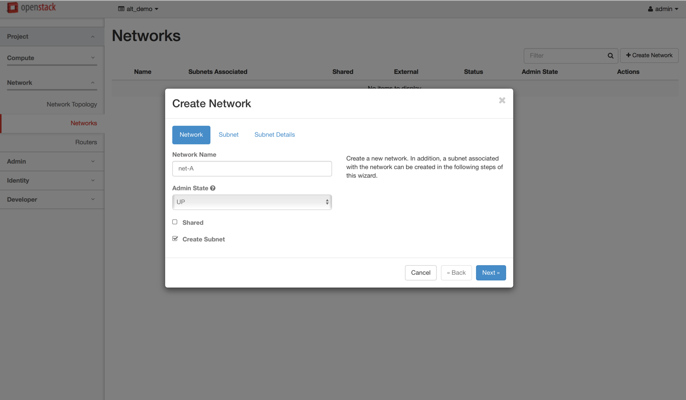

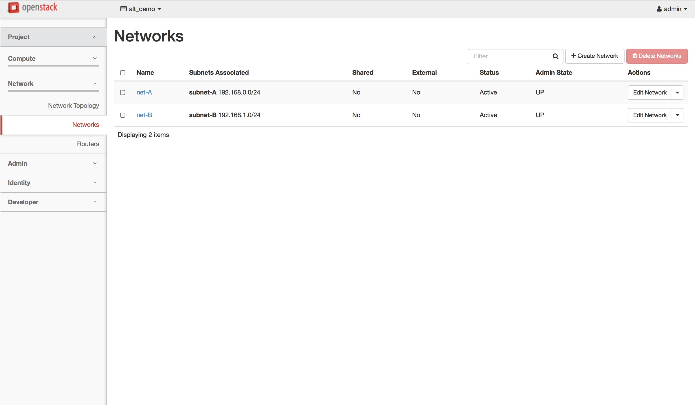

Create two three VMs using the two networks created before; two VMs using net-A and the other VM using net-B.

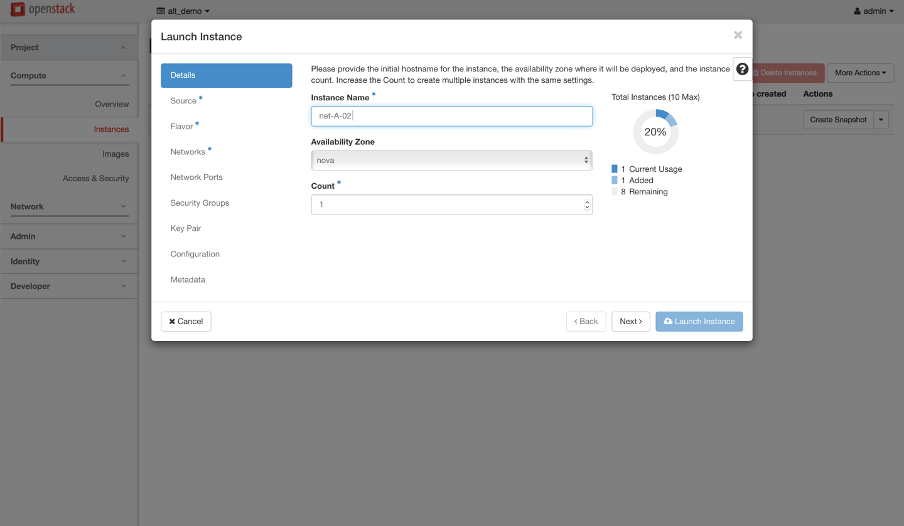

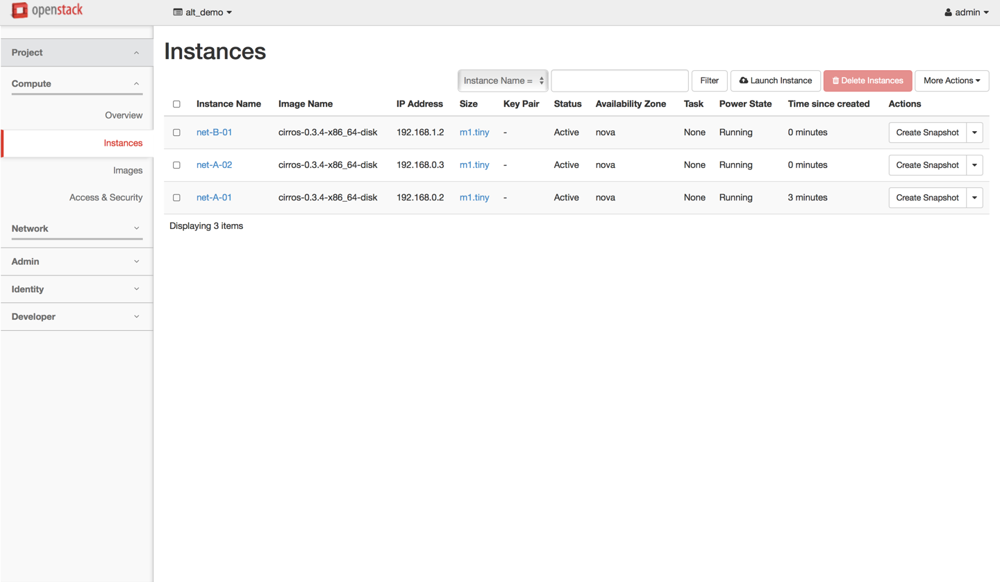

Log on to VMs using the horizon console and check connections.

* Can ping between net-A-01 and net-A-02
* Can't ping between net-A-01 and net-B-01

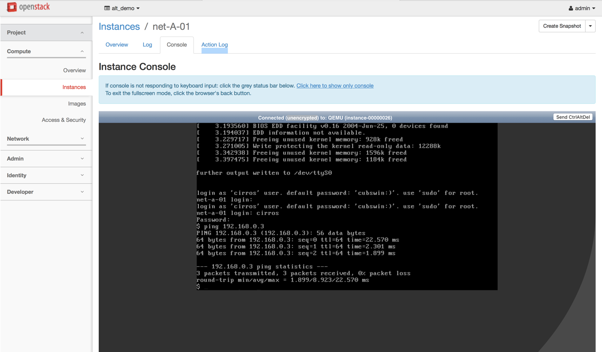

# Routing

Create another network for the external access and floating IP with the subnet range specified in the ONOS-vRouter network config(see [SONA Network Configuration Guide](sona-network-configuration-guide.md)).

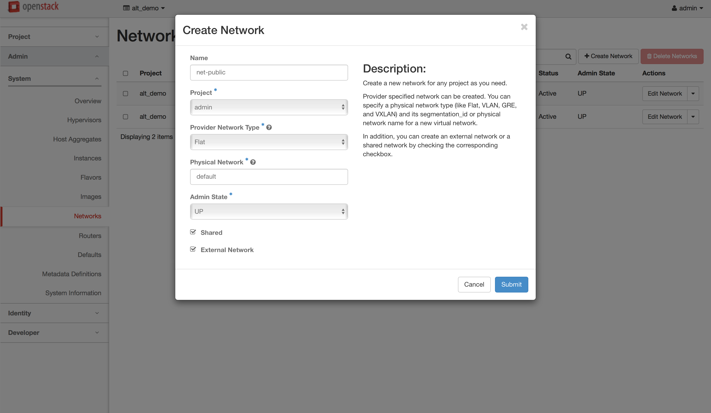

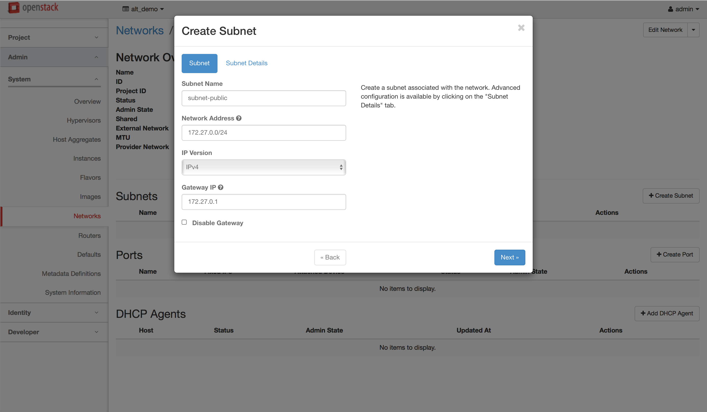

Create a router, and add gateway and two interfaces.

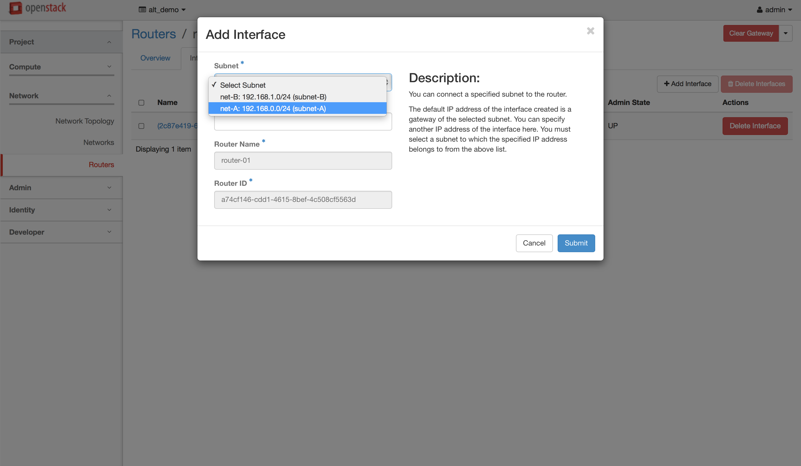

Now the network topology should look like the figure below if you check it in Horizon.

Create a security group to allow external access, and add it to the net-A-01 and net-B-01.

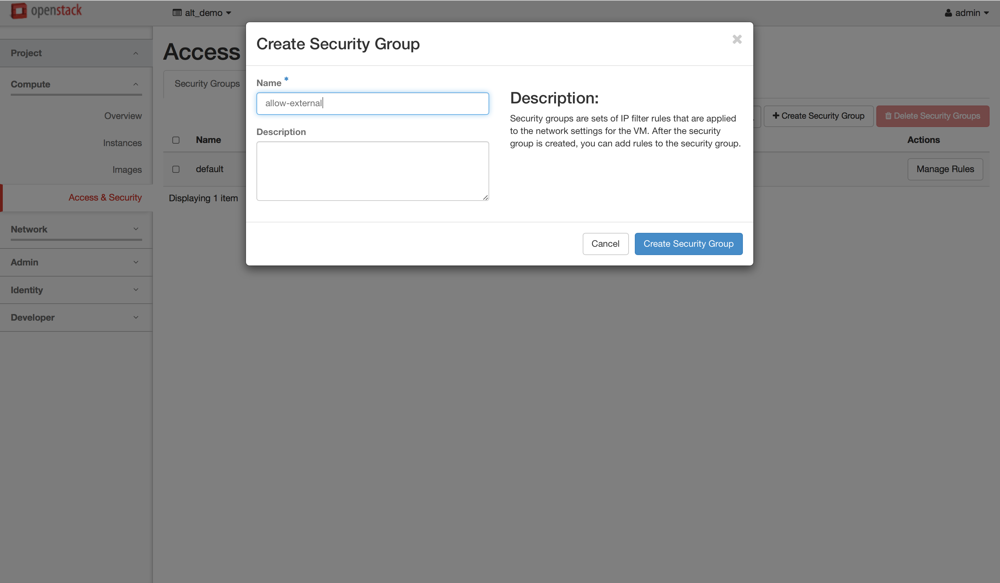

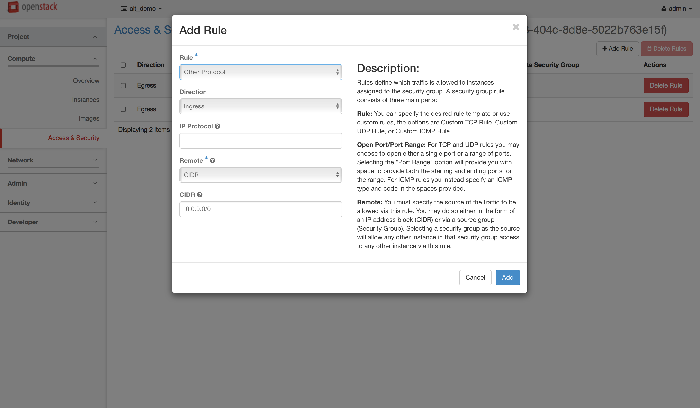

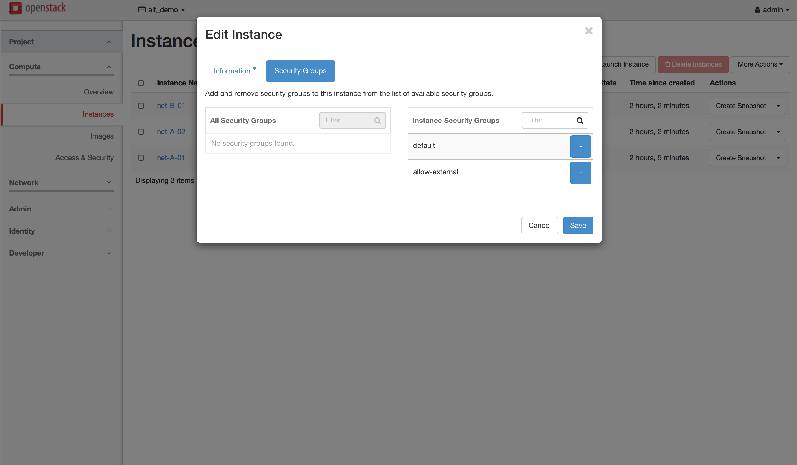

* Can ping from net-A-01 and net-B-01 to 8.8.8.8
* Can ping between net-A-01 and net-B-01

Icon

Currently, SONA security group implementation has a small limitation that it does not allow ingress traffic via a connected session by default. So, you'll need to add allowing rule for ingress direction with remote address "0.0.0.0/0" explicitly for your VM to be able to access the Internet.

Create a floating IP and associate it to net-A-01.

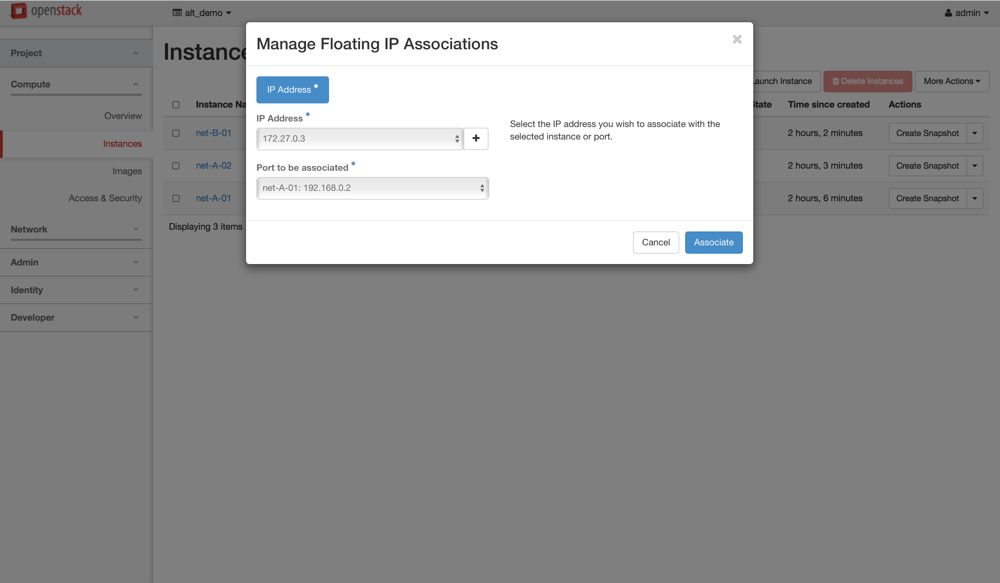

* Can ping to net-A-01 with the associated floating IP from the external
