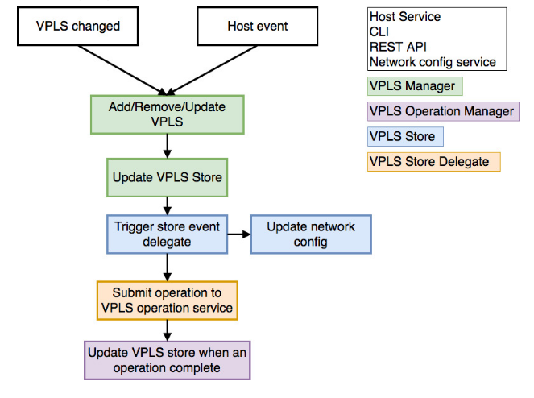

# VPLS Architecture Gude

# Overview

Virtual Private LAN Service (VPLS) is an ONOS application that enables operators to create L2 broadcast overlay networks on-demand, on top of OpenFlow infrastructures.

The application connects into overlay broadcast networks hosts connected to the OpenFlow data plane.

In order to let VPLS establish connectivity between two or more hosts, different things need to happen:

1. A VPLS needs to be defined
2. At least two interfaces need to be configured in the ONOS interfaces configuration
3. At least two interfaces need to be associated to the same VPLS
4. At least two hosts need to be connected to the OpenFlow network. Hosts participating to the same VPLS can send in packets tagged with the same VLAN Ids, different VLAN Ids, no VLAN Ids at all

When conditions 1, 2 and 3 are satisfied, hosts attached to the VPLS will be able to send and receive broadcast traffic (i.e. ARP request messages). This is needed to make sure that all hosts get discovered properly, before establishing unicast communication.

When 4 gets satisfied -meaning that ONOS discovers at least two hosts of the same VPLS- unicast communication is established.

# Components:

 VPLS contains several components:

**VPLS (VPLS Manager):**  

* Provides public API for managing virtual private LANs.
* The API provides create/update/read/delete (CURD) functionality, helps other application to interact with VPLS Store and VPLS operation service.
* Handles host events to attach/detach hosts to a virtual private LAN

**VPLS Store Delegate (in VPLS Manager):**

* Handles VPLS store events, it will generate new VPLS Operation according to store event type and VPLS status.
* Also, after it generate an operation, it will send to VPLS Operation Service directly.

**VPLS Operation Service(VPLS Operation Manager):**

* Manage any operation(modification) of any VPLS.
* Convert VPLS operations to sets of Intent operations.
* Provide correct order of Intent operations.
* Update VPLS status to store when finished/failed VPLS operation.

**VPLS Store (Distributed VPLS Store):**

* Stores all VPLS information
* Push all VPLS information to network config system

**VPLS Config Manager:**

* Handles network config update event
* Optimize changes from VPLS network config event and invoke VPLS API

**VPLS Neighbour Handler:**

* Handles neighbour messages of any VPLS from any interface

**VPLS REST API (Work in progress):**

* Provides REST API to control VPLS

# General workflow

VPLS can be changed by these ways:

* Host event (host added or removed)
* Network config modification
* VPLS command
* VPLS REST API

## VPLS Operation Service

* When a new VPLS operation generated and submit to VPLS operation service the operation will be queued.
* An operation scheduler will take batches of operation for multiple VPLS, if there exists multiple operations to process, it will optimize operations to a single operation.
* For every operation to be process, the scheduler will put the operation into operation executor and add success and error consumer to it.
* For success consumer, it will update VPLS state according to previous state (e.g. ADDING -> ADDED)
* For error consumer, will change the state to FAILED.

## VPLS Operation Executor (Intent installation)

The VPLS Operation Executor will generate different Intent operations for different operation type (add, remove or update VPLS).

For ADD operation, executor will generate two types of Intents:

* Single-Point to Multi-Point Intents for broadcast traffic, from any ingress point to every egress point, configured in the same VPLS.
* Multi-Point to Single-Point Intents for unicast traffic, from every egress point to any ingress point in the same VPLS.
* See **Traffic provisioning and intent requests** chapter below for more information.

For REMOVE operation, the executor will find every intents related to the VPLS (by Intent key) and remove them.

For UPDATE operation, two situation will be considered:

* Interfaces updated: will reinstall all Intents related to this VPLS.
* Hosts updated: will remove or add new unicast Intent only.

### Provide correct ordering of Intent installation

To resolve race condition issue (install after withdraw Intents), the executor uses IntentCompleter to wait Intent installation process.

An IntentCompleter is a kind of IntentListener, initialize by Intent keys we need to wait, then register as listener to the IntentService and do Intent operations (submit, withdraw)

After that, invoke “complete” method from the IntentCompleter, it will wait until all Intents finished or timeout exceed.

# Network configuration, interface configuration and hosts listeners

VPLS has listeners for three event types:

* Interface configuration updates: each time a node in the interface configuration is added, updated or deleted, for example pushing the JSON configuration file or through CLI. The Interface configuration is filtered to consider only the interfaces with no IPs (to avoid to conflict with Layer3 applications, such as [SDN-IP](../sdn-ip.md)).
* VPLS configuration updates: each time a node in the VPLS configuration is added or updated or deleted, for example pushing JSON file or through CLI.
* Host added  / Host updated: each time a host joins the network, meaning a new host gets physically connected to the OpenFlow data plane and starts sending ARP packets into the network. The Host Service will discover the host (with a MAC address, possibly a VLAN and one or more IP addresses). VPLS listens for Host added / updated / removed events and filters hosts that are attached to the OpenFlow switches, and use VLANs, according to what has been configured in the interfaces section.

# Traffic provisioning and intent requests

The [Intent Framework](../../guides/architecture-and-internals-guide/intent-framework.md) is used to provision both broadcast and unicast connectivity between the edge ports of the OpenFlow network, where hosts are attached to. Using the intent framework abstraction allows to mask the complexity of provisioning single flows on each switch and do error recovering in case failures happen.

## Broadcast traffic: single-point to multi-point intents

Broadcast connectivity is provisioned through single-point to multi-point intents. Within the same VPLS, for each host (source of the broadcast traffic), a single-point to multi-point intent is installed.

The (single) ingress point of each intent is the edge port where the source host (for that intent) is connected to. The egress points are any other edge port where destination hosts associated to the same VPLS, are connected to.

The intent ingress selector is defined using the edge in-port, the destination MAC address FF:FF:FF:FF:FF:FF (broadcast Ethernet address) and the VLAN Id of the source host (in case the interface associated has a VLAN Id associated), according to what has been defined in the interface configuration. The egress selectors are defined as the ingress selector (broadcast Ethernet address), but with the VLAN Id of the destination hosts (in case destination hosts have VLANs configured). The intent framework automatically performs the VLAN Id translation (translation, popping, pushing) at the egress as needed, before the traffic is sent to the destination hosts. The traffic is carried through the best-path - according to the PCE installed - to all the edge ports associated to the same VPLS.

Assuming N edge ports have interfaces associated to the same VPLS, N single-point to multi-point intents for broadcast will be installed.

Intents for Broadcast traffic get generated, regardless the hosts have been discovered or not. This is done since often hosts won’t be able to send traffic into the network (so get discovered by the Host Service) before ARP requests reach them and they reply to them with an ARP reply.

## Unicast traffic: multi-point to single-point intents

Unicast connectivity is provisioned through multi-point to single-point intents. Within the same VPLS, for each host (destination of the unicast traffic), a multi-point to single-point intent is installed.

The egress point of each intent is the edge port where the destination host is connected to. The ingress points are any other edge ports where the source hosts associated to the same VPLS, are connected to.

At each ingress, the intent ingress selector is defined using the edge in-port, the MAC address of the destination host, and the VLAN Id of the source host (in case the source interface has a VLAN Id configured), according to what has been defined in the interface configuration. The egress selector is defined as the ingress selectors (matching on the destination MAC address), but with the VLAN Id of the destination host (in case the interfaces associated to the destination hosts have a VLAN Id configured). The intent framework automatically performs the VLAN Id translation (translation, popping, pushing) at the ingress as needed, before the traffic is sent through the core. The traffic is carried through the best-path - according to the PCE installed - to all the edge ports associated to the same VPLS.

Assuming N edge ports have interfaces associated to the same VPLS, N multi-point to single-point intents for unicast will be installed.

Intents for Unicast traffic get generated only if:

* Two or more interfaces (with a VLAN Id configured and with no IPs) are configured and associated to the same VPLS;
* Two or more hosts attached to the interfaces configured send packets into the network and get discovered by the Host Service,

The reason for the second condition is that intents for unicast (see above) match on the MAC address of the hosts connected, which is doesn’t get configured by the operator, but instead provided by the host service after the host gets discovered.

## VPLS leader election

VPLS runs on top of ONOS as a distributed application. VPLS applications share their status and use common data structures. ONOS makes sure they remain in synch.

At the beginning, the VPLS operation manager from each ONOS instance will send a request to LeadershipService to make sure which instance is the leader of VPLS application.

Only the leader node can execute VPLS operation and install Intents now.

# Known limitations

At the current stage:

* Only VLAN tags can be used to select traffic at the ingress, no MPLS
