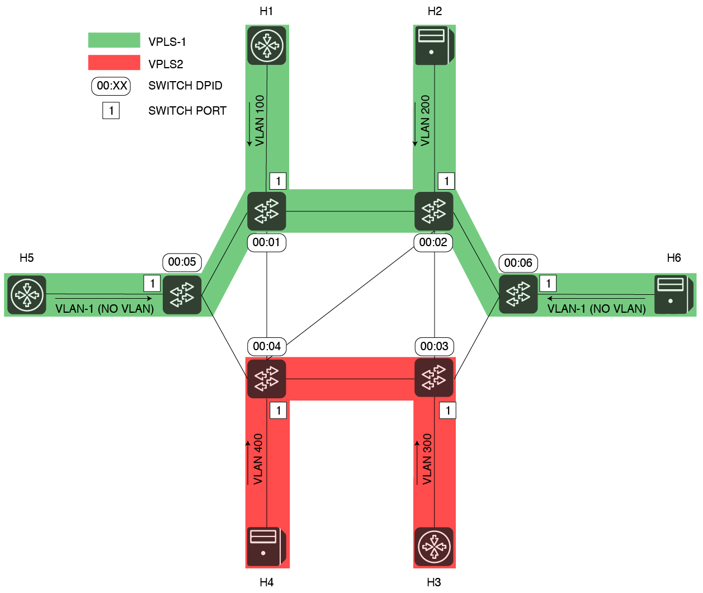

# VPLS User Guide

# VPLS installation and configuration

VPLS is an ONOS application, included by default in the platform (both source code and packages). It needs to be explicitly configured and activated.

The goal of VPLS is to connect multiple end-points in an OpenFlow network, creating isolated L2 broadcast overlay networks.

While legacy technologies require the manual configuration of multiple devices in the network, VPLS tries to make the process easier for network operators.

Hosts that get connected together can send in either untagged or VLAN tagged traffic, using either the same or different VLAN ids.

The User Guide assumes:

* You already have knowledge on how ONOS generally works;
* ONOS has been already installed or there’s a management machine ready to push bits to some target machines;
* Different hosts have been directly attached to the OpenFlow data plane and they send out packets using none or some (same or different) VLAN Ids.

## Starting VPLS

VPLS can be installed and configured:

* At setup-time, before pushing the ONOS bits from a management machine to target machines;
* At run-time, while ONOS is running.

Following, the procedure to activate and configure VPLS will be described.

As for other ONOS applications, VPLS can be activated either:

* Manually, through the ONOS Command Line (CLI), typing "app activate org.onosproject.vpls";
* Automatically at ONOS start up, adding the application name "vpls" to the list of apps to be started automatically, in the cell file. Specific startup details can be defined in the cell file on the management machine, before pushing the ONOS bits. Below, an example is reported.

**VPLS cell file**

```
# Basic VPLS topology

export ONOS_NIC=192.168.56.*
export OCI="192.168.56.101"
export OC1="192.168.56.101"
export OC2="192.168.56.102"
export OC3="192.168.56.103"
export ONOS_APPS=drivers,openflow,vpls
export ONOS_GROUP=sdn
export ONOS_SCENARIOS=$ONOS/tools/test/scenarios
export ONOS_TOPO=vpls
export ONOS_USER=sdn
export ONOS_USE_SSH=true
export ONOS_WEB_PASS=rocks
export ONOS_WEB_USER=onos
```

## Configuring VPLS

VPLS relies on the ONOS network configuration subsystem, which is by default distributed on all ONOS nodes and shared by all ONOS applications.

In order to have a VPLS working, two things need to happen:

* Two or more interfaces need to be configured
* At least one VPLS that associate the above interfaces together needs to be configured

The goal of the configuration process is to define what attachment points the hosts are connected to (so which DPID and which ports), and to associate them under the same VPLS. This will essentially determine what hosts should communicate together, and which don’t.

Both the the interface and the VPLS configurations can be applied either:

* Defining a network-cfg.json configuration file on the management machine, in $ONOS/tools/package/config, before pushing the ONOS bits to the target machines. In this case -while deploying- the network-cfg.json file will be copied over the target machines and parsed; this way is very convenient while developing, but it's not suggested for production deployments
* Pushing the same network-cfg.json file at run-time, after ONOS has started, using the specific REST APIs. This can be done from the management machine, using the tool onos-netcfg (i.e. onos-netcfg {$IP} {NET\_CFG\_FILE})
* From the ONOS CLI, using the interface and VPLS commands

## Configuration file format and syntax

Let’s assume the following scenario:



In this example, five hosts are sending in tagged packets with different VLAN Ids. Two VPLSs will be created, one called VPLS1 -in green-; one called VPLS2 -in red-. Four hosts will be part of VPLS1, other two will be associated to VPLS2.

Hosts are grouped by VPLS in the following table:

|  |  |  |  |  |
| --- | --- | --- | --- | --- |
| VPLS name | VLAN Id | Interface Name | OF Switch DPID | OF Port Number |
| VPLS1 | 100 | h1 | 0000000000000001 | 1 |
| VPLS1 | 200 | h2 | 0000000000000002 | 1 |
| VPLS1 | -1 (no VLAN) | h5 | 0000000000000005 | 1 |
| VPLS1 | -1 (no VLAN) | h6 | 0000000000000006 | 1 |
| VPLS2 | 300 | h3 | 0000000000000003 | 1 |
| VPLS2 | 400 | h4 | 0000000000000004 | 1 |

In order to configure what has been described above, the following configuration should be pushed to ONOS (either before or after VPLS has been started).

**network-cfg example**

```
{
  "ports": {
    "of:0000000000000001/1": {
      "interfaces": [
        {
          "name": "h1",
          "vlan": "100"
        }
      ]
    },
    "of:0000000000000002/1": {
      "interfaces": [
        {
          "name": "h2",
          "vlan": "200"
        }
      ]
    },
    "of:0000000000000003/1": {
      "interfaces": [
        {
          "name": "h3",
          "vlan": "300"
        }
      ]
    },
    "of:0000000000000004/1": {
      "interfaces": [
        {
          "name": "h4",
          "vlan": "400"
        }
      ]
    },
    "of:0000000000000005/1": {
      "interfaces": [
        {
          "name": "h5"
        }
      ]
    },
    "of:0000000000000006/1": {
      "interfaces": [
        {
          "name": "h6"
        }
      ]
    }
  },
  "apps" : {
    "org.onosproject.vpls" : {
      "vpls" : {
        "vplsList" : [
          {
            "name" : "VPLS1",
            "interfaces" : ["h1", "h2", "h5", "h6"]
          },
          {
            "name" : "VPLS2",
            "interfaces" : ["h3", "h4"],
            "encapsulation" : "vlan"
          }
        ]
      }
    }
  }
}
```

The same result can be achieved at run-time, using the interface and VPLS CLI commands as follows (see section "CLI syntax" for more details):

**CLI configuration example**

```
onos> interface-add -v 100 of:0000000000000001/1 h1
onos> interface-add -v 200 of:0000000000000002/1 h2
onos> interface-add -v 300 of:0000000000000004/1 h3
onos> interface-add -v 400 of:0000000000000002/1 h4
onos> interface-add of:0000000000000005/1 h5
onos> interface-add of:0000000000000006/1 h6

onos> vpls create VPLS1
onos> vpls add-if VPLS1 h1
onos> vpls add-if VPLS1 h2
onos> vpls add-if VPLS1 h5
onos> vpls add-if VPLS1 h6
onos> vpls set-encap VLPS1 VLAN

onos> vpls create VPLS2
onos> vpls add-if VPLS2 h3
onos> vpls add-if VPLS2 h4
```

As soon as two or more interfaces are added to the same VPLS, intents to manage broadcast will be installed.

As soon as two or more hosts connected to the same VPLS will get discovered by ONOS (and VPLS), intents to manage unicast traffic will be installed.

For more details on the VPLS architecture, internal workflow and intents used, please visit the [VPLS Architecture Guide](vpls-architecture-gude.md).

# Demo topology

Would you like to give VPLS a try, but it's too hard and long bringing up an entire network with hosts sending in packets on different VLANs? We made available a default topology file in ONOS for you!

The topology file is under $ONOS\_ROOT/tools/test/topos. It consists of three files:

* The Mininet topology file
* The network-cfg.json ONOS configuration file
* The receipe file, to check that when the topology is instantiated the number of devices, hosts and links matches the expectations

You can just take these files as examples for your topologies / configurations, or you can use them automatically along with the tool stc net-setup, which makes very convenient to deploy ONOS and Mininet together in a couple of commands.

Using the topology file along with stc net-setup is very simple. Just few steps:

* Create one mininet machine and one or more ONOS target machines (ready to receive the ONOS bits). The mininet machine should have the same username and password of the ONOS machine(s) and you should be able to run on it as well as sudoer without password
* Define your cell file. Add to it the following variable: OCN=XXX.YYY.WWW.ZZZ, where XXX.YYY.WWW.ZZZ is the IP of your Mininet machine
* After you have loaded your cell file, run the command *topo vpls*. This will tell stc what topology to use.
* Now run *stc setup && stc net-setup*. This will first deploy ONOS on the remote nodes (stc setup). It will then deploy the Mininet topology and apply the related ONOS configuration.
* You will be able to access your mininet machine directly from the management machine,

# CLI syntax

The applications allows to define and configured VPLSs also from a CLI. The paragraph below reports details about the CLI command syntax.

**Operations on networks**

```
# Creates a new VPLS
onos> vpls create {$VPLS_NAME}

# Deletes an existing VPLS
onos> vpls delete {$VPLS_NAME}

# Lists the configured VPLSs
onos> vpls list
Configured VPLSs
----------------
VPLS1
VPLS2

# Shows the list configured VPLSs, including their interfaces and the encapsulation type in use. If a VPLS name is specified, only the details for that VPLS are returned.
onos> vpls show [$VPLS_NAME]
Configured VPLSs
----------------
VPLS name: VPLS1
Associated interfaces: [h1, h2, h5, h6]
Encapsulation: NONE
----------------
VPLS name: VPLS2
Associated interfaces: [h3, h4]
Encapsulation: VLAN
----------------

# Sets the encapsulation type for a VPLS
onos> vpls set-encap {$VPLS_NAME} {VLAN|MPLS|NONE}
```

**Operations on interfaces**

```
# Adds an existing interface (in netcfg) to an existing VPLS
onos> vpls add-if {$VPLS_NAME} {$INTERFACE_NAME}
# Removes an existing interface from an existing VPLS
onos> vpls rem-if {$VPLS_NAME} {$INTERFACE_NAME}
```

**General operations**

```
# Cleans the status of the VPLS application (i.e., deletes VPLSs, removes interfaces from existing VPLSs and withdraws intents)
onos> vpls clean
```

# Issues and Troubleshooting

Things not working as expected? Time to troubleshoot!

* Is VPLS running? Check with *apps -a -s*. Is VPLS there?
* Hosts are not communicating? Do you have at least two interfaces configured and two hosts attached? Are the VLANs correct ?
* Is your configuration correct? Has it been correctly parsed? The first step is to check if the configuration has been loaded. Helpful commands are *netcfg, i*nterfaces, and the VPLS CLI commands (!!!! the VPLS configuration is not visible if the application is not started).
* Any exception? Type log:exception-display in the ONOS CLI  to discover it.
* Are the hosts connected to your OpenFlow data plane? Have the hosts been discovered correctly by ONOS? If a host sends out packets into the OpenFlow network, you should be able to see it, even if VPLS is not installed yet or no configuration is provided. Go in the ONOS CLI and type "hosts". As result, you should see something similar to this:

**Example of output for the hosts command in ONOS**

```
onos> hosts
id=00:00:00:00:00:01/100, mac=00:00:00:00:00:01, locations=[of:0000000000000001/1], vlan=100, ip(s)=[10.0.0.1], name=h1, latitude=40.888148, longitude=-103.459878, configured=false
id=00:00:00:00:00:02/200, mac=00:00:00:00:00:02, locations=[of:0000000000000002/1], vlan=200, ip(s)=[10.0.0.2], name=h2, latitude=42.756945, longitude=-79.831317, configured=false
id=00:00:00:00:00:03/300, mac=00:00:00:00:00:03, locations=[of:0000000000000003/1], vlan=300, ip(s)=[10.0.0.3], name=h3, latitude=35.427493, longitude=-83.885831, configured=false
id=00:00:00:00:00:04/400, mac=00:00:00:00:00:04, locations=[of:0000000000000004/1], vlan=400, ip(s)=[10.0.0.4], name=h4, latitude=34.66229, longitude=-110.946662, configured=false
id=00:00:00:00:00:05/None, mac=00:00:00:00:00:05, locations=[of:0000000000000005/1], vlan=None, ip(s)=[10.0.0.5], name=h5, latitude=33.224634, longitude=-121.532943, configured=false
id=00:00:00:00:00:06/None, mac=00:00:00:00:00:06, locations=[of:0000000000000006/1], vlan=None, ip(s)=[10.0.0.6], name=h6, latitude=42.395459, longitude=-75.293563, configured=false
```

Please, note that you should see results only for hosts that already sent traffic into the data plane. This sometimes doesn’t happen for example with Mininet, where hosts are only processes without any application running by default.

Also, as in any related intent-based ONOS applications, there are certain best-practices to follow, to see what’s going on with intents and flows. Type "intents" to see the detailed list of intents, or "intent -s" for the intents summary.

Below is an approximation of what you should see for the topology used in the example, assuming all hosts have already all been discovered and communicate together. Note that in this case, six intents for broadcast, and six intents for unicast are installed.

**Example of output for the intents command in ONOS, related to network VPLS2**

```
onos> intents
id=0xa6, state=INSTALLED, key=VPLS1-uni-of:0000000000000006-1-00:00:00:00:00:06, type=MultiPointToSinglePointIntent, appId=org.onosproject.vpls
    selector=[ETH_DST:00:00:00:00:00:06]
    treatment=[NOACTION]
    ingress=[of:0000000000000005/1, of:0000000000000001/1, of:0000000000000002/1], egress=of:0000000000000006/1
id=0x1a, state=INSTALLED, key=VPLS2-uni-of:0000000000000003-1-00:00:00:00:00:03, type=MultiPointToSinglePointIntent, appId=org.onosproject.vpls
    selector=[ETH_DST:00:00:00:00:00:03]
    treatment=[NOACTION]
    constraints=[EncapsulationConstraint{encapType=VLAN}]
    ingress=[of:0000000000000004/1], egress=of:0000000000000003/1
id=0xa7, state=INSTALLED, key=VPLS1-uni-of:0000000000000002-1-00:00:00:00:00:02, type=MultiPointToSinglePointIntent, appId=org.onosproject.vpls
    selector=[ETH_DST:00:00:00:00:00:02]
    treatment=[NOACTION]
    ingress=[of:0000000000000005/1, of:0000000000000006/1, of:0000000000000001/1], egress=of:0000000000000002/1
id=0xa1, state=INSTALLED, key=VPLS1-brc-of:0000000000000005-1-FF:FF:FF:FF:FF:FF, type=SinglePointToMultiPointIntent, appId=org.onosproject.vpls
    selector=[ETH_DST:FF:FF:FF:FF:FF:FF]
    treatment=[NOACTION]
    ingress=of:0000000000000005/1, egress=[of:0000000000000006/1, of:0000000000000001/1, of:0000000000000002/1]
id=0xa5, state=INSTALLED, key=VPLS1-uni-of:0000000000000001-1-00:00:00:00:00:01, type=MultiPointToSinglePointIntent, appId=org.onosproject.vpls
    selector=[ETH_DST:00:00:00:00:00:01]
    treatment=[NOACTION]
    ingress=[of:0000000000000005/1, of:0000000000000006/1, of:0000000000000002/1], egress=of:0000000000000001/1
id=0x1b, state=INSTALLED, key=VPLS2-uni-of:0000000000000004-1-00:00:00:00:00:04, type=MultiPointToSinglePointIntent, appId=org.onosproject.vpls
    selector=[ETH_DST:00:00:00:00:00:04]
    treatment=[NOACTION]
    constraints=[EncapsulationConstraint{encapType=VLAN}]
    ingress=[of:0000000000000003/1], egress=of:0000000000000004/1
id=0xa3, state=INSTALLED, key=VPLS1-brc-of:0000000000000006-1-FF:FF:FF:FF:FF:FF, type=SinglePointToMultiPointIntent, appId=org.onosproject.vpls
    selector=[ETH_DST:FF:FF:FF:FF:FF:FF]
    treatment=[NOACTION]
    ingress=of:0000000000000006/1, egress=[of:0000000000000005/1, of:0000000000000001/1, of:0000000000000002/1]
id=0x0, state=INSTALLED, key=VPLS2-brc-of:0000000000000003-1-FF:FF:FF:FF:FF:FF, type=SinglePointToMultiPointIntent, appId=org.onosproject.vpls
    selector=[ETH_DST:FF:FF:FF:FF:FF:FF]
    treatment=[NOACTION]
    constraints=[EncapsulationConstraint{encapType=VLAN}]
    ingress=of:0000000000000003/1, egress=[of:0000000000000004/1]
id=0x1, state=INSTALLED, key=VPLS2-brc-of:0000000000000004-1-FF:FF:FF:FF:FF:FF, type=SinglePointToMultiPointIntent, appId=org.onosproject.vpls
    selector=[ETH_DST:FF:FF:FF:FF:FF:FF]
    treatment=[NOACTION]
    constraints=[EncapsulationConstraint{encapType=VLAN}]
    ingress=of:0000000000000004/1, egress=[of:0000000000000003/1]
id=0xa0, state=INSTALLED, key=VPLS1-brc-of:0000000000000001-1-FF:FF:FF:FF:FF:FF, type=SinglePointToMultiPointIntent, appId=org.onosproject.vpls
    selector=[ETH_DST:FF:FF:FF:FF:FF:FF]
    treatment=[NOACTION]
    ingress=of:0000000000000001/1, egress=[of:0000000000000005/1, of:0000000000000006/1, of:0000000000000002/1]
id=0xa2, state=INSTALLED, key=VPLS1-brc-of:0000000000000002-1-FF:FF:FF:FF:FF:FF, type=SinglePointToMultiPointIntent, appId=org.onosproject.vpls
    selector=[ETH_DST:FF:FF:FF:FF:FF:FF]
    treatment=[NOACTION]
    ingress=of:0000000000000002/1, egress=[of:0000000000000005/1, of:0000000000000006/1, of:0000000000000001/1]
id=0xa4, state=INSTALLED, key=VPLS1-uni-of:0000000000000005-1-00:00:00:00:00:05, type=MultiPointToSinglePointIntent, appId=org.onosproject.vpls
    selector=[ETH_DST:00:00:00:00:00:05]
    treatment=[NOACTION]
    ingress=[of:0000000000000006/1, of:0000000000000001/1, of:0000000000000002/1], egress=of:0000000000000005/1
```

* Are intents installed?

+ Yes! (we’re happy!).
+ No! Ops….let’s check flows, since 1 intent is composed by one or more flows

* Type *flows pending-add* to see if there’s any flow for which ONOS still not received an installation confirmation
* Type *flows* to see the detailed list of flows - installed or not by the system, *flows -s* for a summary

Still having issues? Write to us. We can help! [Mailing Lists](../../community-information/mailing-lists.md)
