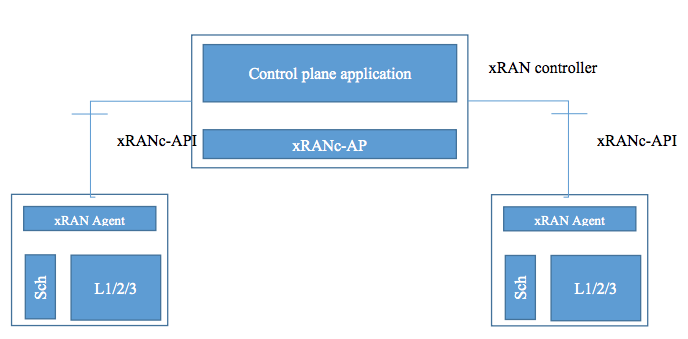
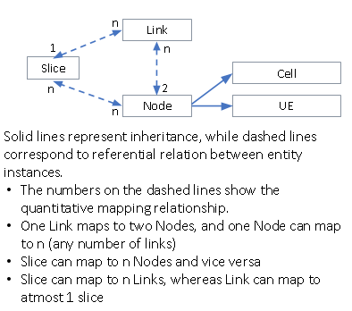
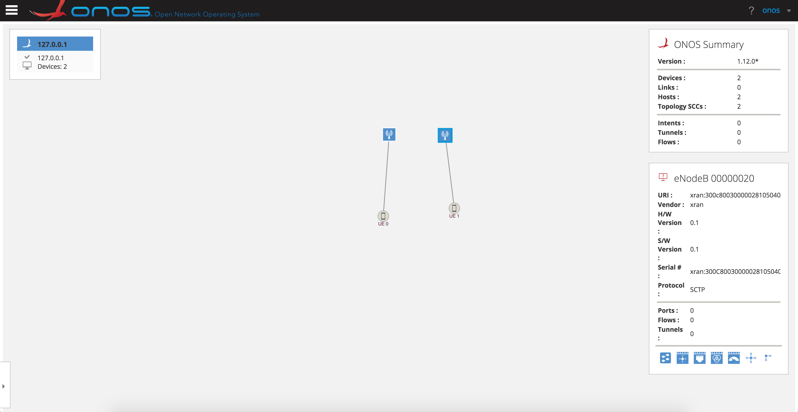
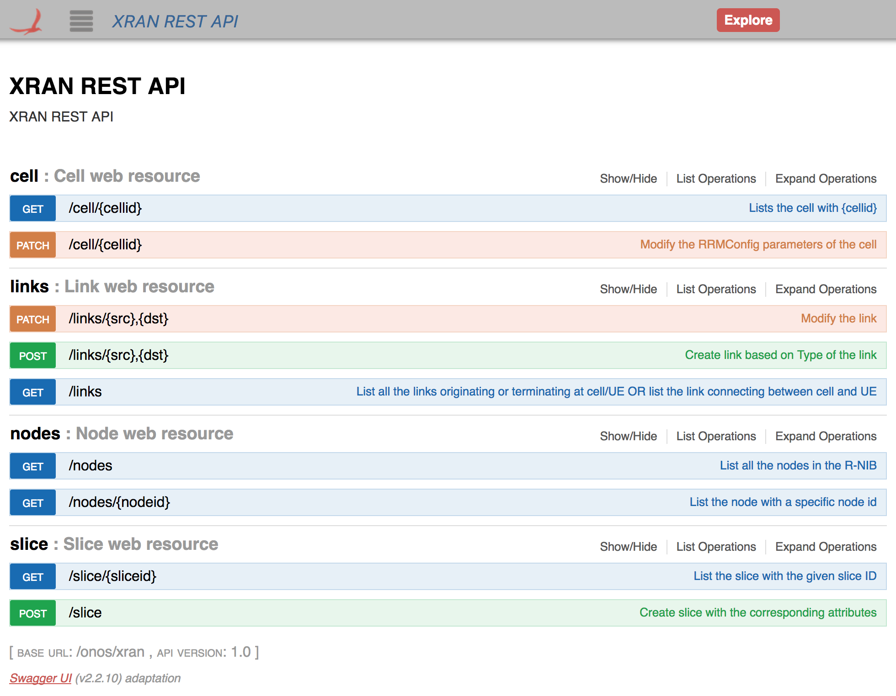

# xRAN Controller Integration

Download

xRAN application is not yet merged with the main repository. Please contact [oguz@opennetworking.org](mailto:oguz@opennetworking.org) for more information.

# Team

| Name | Organization | Role | Email |
| --- | --- | --- | --- |
| Dimitris Mavrommatis | ONF | Lead Developer | [dimitris@](mailto:dimitris@onlab.us)[opennetworking.org](http://opennetworking.org) |
| Sanjana Agarwal | ONF | Lead Developer | [sanjana@opennetworking.org](mailto:sanjana@opennetworking.org) |
| Sarabjot Singh | XRAN.org | Project Coordinator | [sarabjot.singh@xran.org](mailto:sarabjot.singh@xran.org) |

# Overview & goals

The xRAN controller implements the control plane functionality interfacing with the eNodeB data-plane functionality through the xRANc-API. The control plane functionality will include, but is not limited to, UE Admission Control, Radio Bearer Admission and Modification, Handoffs, and Load Balancing, Inter-cell Interference Coordination etc.



# RAN Controller Constituents

Radio-Network Information Base (RNIB)

* A graph of physical/logical network entities
* Control applications read and write to R-NIB using NorthBound Interface (NBI)

Network Topology (NT) Database

* LTE cell configuration parameters like cellIDs, latitude, longitudes, bands, azimuth, etc.
* Interfaces with R-NIB to provide spatio-temporal context

Functions

* Call/Bearer Admission Control
* Load Balancing and Policy Enforcement
* Radio Link Monitoring
* Slice Enforcer

# R-NIB: Overview

RNIB is a graph of physical/logical network entities within the network topology:

* **Cell:** eNBs, gNBs, WLAN AP, etc.
* **UE:** Smartphone, Car, etc.
* **Slice:** a virtual network within
* **Link:** air interface between eNB and UE, self backhauling link

Maintained as a relational database



# Controller Routines

R-NIB consistency/integrity routine:

* Makes sure that there is only one link of type serving/primary involving a given UE
* Makes sure the mapping between context IDs <->IMS <-> RAN ID is consistent

Configuration routine:

* Periodically sends CellConfigRequest to Cells that have the Cell/Conf set to empty, until it gets populated
* Periodically sends UECapabilityEnquiry for UEs that have the UE/Capability field empty

Measurement routine:

* Sends XRANC\_L2\_MEAS\_CONFIG once for each cell whose Conf has been set.
* Sends XRANC\_RX\_SIGNAL\_MEAS\_CONFIG, for UEs whose MeasConfig is not set.

Admission control:

* Responds with UEAdmissionResponse to UEAdmissionRequest depending on admission control policy
* Responds with BearerAdmissionResponse to BearerAdmissionRequest depending on bearer admission policy

Slice Enforcement:

* Policy intents to southbound messages

# Functions Details

## Handover


The call flow is shown in the following figure, where the objective is to move UE 2 to Cell 2. The steps undertaken are shown below:

1. Application issues a PATCH/POST command for the intent to modify/create the link{2,2} to be of type serving/primary
2. R-NIB consistency routine interprets the above PATCH/POST as a handover since there can not be more than one  primary serving links terminating at the same UE
3. Controller sends the HORequest with ecgi-t set to that of Cell 2 and ecgi-s set to that of the cell which currently has the serving/primary link to UE 2. CRNTI is set to RAN ID of UE 2.
4. Upon getting HOComplete from cell 2, controller updates link{2,2} to be of type serving/primary, UE 2’ RAN-ID with new CRNTI from cell2, link{1,2} to be non-serving.
5. The new ContextIDs obtained from UEContextUpdate  preceding HOComplete for this UE are used to populate the new ContextIDs

## PRB Restriction

IMPLEMENTED

### Cell Specific

The figure below shows an example call flow, where the objective is to restrict the PRB used on the two cells


The steps associated with the call flow are:

1. Applications express the intent to modify the RRMConfiguration of  cell 1 using PATCH (say)
2. Controller sends a RRMConfig message to the corresponding ECGI using the PATCH request parameters and CRNTI field blank
3. R-NIB is updated and PATCH response delivered after receiving the RRMConfigStatus from the corresponding cell

### Link Specific

The following call flow shows restriction based on particular links only


The steps associated with the call flow are:

1. Applications express the intent to modify the RRMConfiguration of  link{1,1}  to using PATCH (say)
2. Controller finds the CRNTI and ECGI connected by this link
3. Depending on the eNB support it sends RRMConfig or xICICConfig on the B1 interface
4. The message constituents are formed based on the PATCH request parameters and ECGI, CRNTI corresponding to that link
5. In case using the RRMConfig message, R-NIB is updated and PATCH response delivered after receiving the RRMConfigStatus from the eNodeB

## Programmable CA Deployment

IMPLEMENTED

Note: This functionality is only applicable to cells CA supported indicated using CellConfigReport/featureSupportList


The steps associated with the call flow are:

1. Applications uses PATCH/POST to modify/create the link{2,1} of type serving/secondary/ca.
2. Check if the UE is capable of CA by looking up the existence of “ca” under UE/Capability, if not reply in error.
3. Controller populates the field of ScellAdd as follows:

1. ECGI = ecgi of the primary cell of the UE in question
2. CRNTI = CRNTI of the UE at the primary cell
3. scells-prop:

1. PCI-ARFCN of the cell corresponding to link{2,1}
2. cross-carrier-sched-enable : UE/Capability/ca/crossCarrierSched
3. ca-direction: dl
4. deact-timer : 10000

4. Upon receiving the ScellAddStatus/status set to success for the PCI-ARFCN of link{2,1}’s cell in scells-ind, the change is reflected in R-NIB and POST/PATCH response given to application.

## Slicing

IN DEVELOPMENT

Key steps:

1. App uploads a slice profile through NBI at RAN controller
2. RAN controller enforces slice primitives through SBI
3. eNodeB implements instructions on the SB


The steps associated with the call flow are

1. Application uploads a slice profile. R-NIB consistency routine checks the slice attributes  and the [slice enforcement routine](https://docs.google.com/document/d/16zKENrqgoExUjL8M4xuZWIChcf7ltKeI3n_cjIl36eY/edit#heading=h.kmaqi1h3udjy) checks the intents. If both the checks pass
2. Slice Enforcement Routine interprets the presence of ResourceReservation  as an intent to send the RRMConfig/XICICConfig  for the involved links.

1. The available PRBs range  for reservation are found at each cell by taking a diff of the reserved PRBs of the existing links
2. Using the absolute PRBs required by the slice enforcement routine, the appropriate range is obtained and sent on RRMConfig/XICICConfig.

3. Example: if prbs from 0 to 20 are already reserved at Cell 1 and prbs from 0 to 40 at Cell 2, then link{1,1} has to be reserved prbs in range 21 to 70, and link{2,3} has to be reserved prbs in range {41,90}. Remaining links link{1,2} and link{2,4} have to moved to remaining prbs on the cells, like link{1,2} to be reserved 70 to 99, and link{2,4} to be reserved to {90,100}.

# Controller Implementation Details

## Southbound Interface

There is a SCTP netty server socket to listen for CELL connections on a port specified in the configuration file. The communication between the Controller and the CELL is using ASN.1 protocol with BER encoding. Each packet consists of a header and a body that are standarized by the xRAN organization:

* The header carries the specification version identifier and the type of the packet.
* The body depending on the type of the packet carries the data.

Configuration file includes a list of acceptable CELLs with some identifiers to avoid malicious connections.

## Northbound Interface

A REST based framework is used to handle the northbound requests. It supports GET, POST, PATCH, DELETE for NODE, CELL, LINK and SLICE entities. The events that ca be triggered from Northbound can be:

* UE Handover
* PRB Restriction for CELL/LINK
* Programmable CA Deployment
* Slicing

## Network State

UEs have the State attribute associated with them

* **ACTIVE****:** Default state when UE is created
* **IDLE:** Set upon receiving a release packet from primary cell

Links have a Type attribute associated with them

* **Serving/Primary:** Only one link per UE can be primary
* **Serving/Secondary****:** Used to increase UE throughput
* **Non-serving:** Inactive links that we gather measurement reports and can be changed to primary or secondary links

# Tutorial

## Configuration

Before we explain how to run the tutorial let us explain the configuration file:

```
{
  "apps": {
    "org.onosproject.xran": {
      "xran": {
        "active_cells": [
          {
            "plmn_id": "000001",
            "eci": "00000010",
            "ip_addr": "1.1.1.2"
          },
          {
            "plmn_id": "000002",
            "eci": "00000020",
            "ip_addr": "1.1.1.3"
          }
        ],
        "l2_meas_report_interval_ms": 5000,
        "rx_signal_meas_report_interval_ms": 7000,
        "xranc_cellconfigrequest_interval_seconds": 10,
        "xranc_bind_ip": "1.1.1.1",
        "xranc_port": 7891,
        "admission_success": true,
        "bearer_success": true,
        "no_meas_link_removal_ms": 1000000,
        "idle_ue_removal_ms": 1,
        "nb_response_timeout_ms": 10000
      }
    }
  }
}
```

* **"active\_cells"**: This field provide all the cells that the servers consider as acceptable.
  + **"plmn\_id": "000001":**This is the PLMN\_ID of the eNodeB that is connecting in hex format.
  + **"eci": "00000010":**This is the ECI of the eNodeB that is connecting in hex format.
  + **"ip\_addr": "1.1.1.2":** The IP address of which we are going to receive connection for the specific eNodeB.
* **"l2\_meas\_report\_interval\_ms": 5000:**Time in miliseconds of delay inbetween sending L2 measurement reports.
* **"rx\_signal\_meas\_report\_interval\_ms": 7000:**Time in miliseconds of delay inbetween sending RX Signal measurement reports.
* **"xranc\_cellconfigrequest\_interval\_seconds": 10:**Time in seconds to send CELL config request.
* **"xranc\_bind\_ip": "1.1.1.1":** The IP address that the xRAN Controller is going to bind.
* **"xranc\_port": 7891:**The servers port number that binds the SCTP server.
* **"admission\_success": true:**Accept all the admission requests.
* **"bearer\_success": true:**Accept all the bearer requests.
* **"no\_meas\_link\_removal\_ms": 1000000:**Time in miliseconds before removing an idle link.
* **"idle\_ue\_removal\_ms": 1:**Time in miliseconds before removing UE after being idle.
* **"nb\_response\_timeout\_ms": 10000:**Time in miliseconds to wait for northbound response.

## Running the Controller

Important Notice

You need to have SCTP library installed in order to run the controller successfully. As of now, Mac OS does not have a working SCTP library. (sudo apt-get install libsctp-dev -y)

1. Configure xran-cfg.json file to have IPs of all connecting CELLS and PLMN\_ID and ECI in hex format. PLMN\_ID should be 6 characters (from 0 to F) long (24bits) and ECI should be 8 characters (from 0 to F) long with always a 0 in the end (28 bits).
2. Load configuration

   ```
   # Make sure that the xranc_bind_ip option binds to an IP that is defined on an interface (xranc_bind_ip is 1.1.1.1 in our example so: sudo ip addr add 1.1.1.1/32 dev eth0)
   onos-netcfg ONOSIP path/to/xran-cfg.json
   ```
3. Connect to ONOS: onos ONOSIP

   ```
   onos ONOSIP
   ```
4. Activate XRAN:

   ```
   app activate org.onosproject.xran
   ```
5. Check logs to see if the Server has started and binded to the IP address that you specified:

   ```
   onos> log:tail
   ```
6. Enable debugging mode if you want to see send/received messages with:

   ```
   onos> log:set DEBUG
   ```
7. REST API calls to check nodes and links; credentials onos:rocks:

   ```
   http://IP:8181/onos/xran/nodes
   http://IP:8181/onos/xran/links
   ```
8. GUI to check topology; credentials onos:rocks (only shows primary links), IP can be localhost if you run onos locally:

   ```
   http://IP:8181/onos/ui
   ```

**Note: be sure you have SCTP library installed on the VM running ONOS.**

**Optional:** If you want to see a working version of the controller, we created a dummy eNodeB. It is a private repo, so you will need access; send request to [dimitris@opennetworking.org](mailto:dimitris@opennetworking.org). You can download it from: <http://bitbucket.org/slowr/enodeb>.

To run

```
java -jar sctpclient-with-dependencies.jar ONOS-IP ONOS-PORT ENODEB-IP ENODEB-PORT
# Based on the example to run locally with two eNodeB's (first we add the two interfaces that are related to the eNodeBs, these IPs are the ones specified in the configuration as well):
sudo ip addr add 1.1.1.2/32 dev eth0
sudo ip addr add 1.1.1.3/32 dev eth0
java -jar sctpclient-with-dependencies.jar 1.1.1.1 7891 1.1.1.2 12345
java -jar sctpclient-with-dependencies.jar 1.1.1.1 7891 1.1.1.3 12346
```

## NB Example Triggers with CURL

### Handover

If the link already exists and want to modify:

```
curl -H "Content-Type: application/json" -X PATCH -d '{"type":"serving/primary"}' -u onos:rocks "http://localhost:8181/onos/xran/links/{CELL ECI in hex},{id}"
```

If the link does not exist:

```
curl -H "Content-Type: application/json" -X POST -d '{"type":"serving/primary"}' -u onos:rocks "http://localhost:8181/onos/xran/links/{CELL ECI in hex},{id}"
```

### RRMConfing/xICICConfig

If the link already exists and want to modify:

```
curl -H "Content-Type: application/json" --request PATCH -d '{"RRMConf":{"start_prb_dl":0,"end_prb_dl":50}}' -u onos:rocks "http://localhost:8181/onos/xran/links/{CELL ECI in hex},{id}"
```

If the link does not exist:

```
curl -H "Content-Type: application/json" --request POST -d '{"RRMConf":{"start_prb_dl":0,"end_prb_dl":50}}' -u onos:rocks "http://localhost:8181/onos/xran/links/{CELL ECI in hex},{id}"
```

### ScellAdd

```
curl -H "Content-Type: application/json" -X PATCH -d '{"type":"serving/secondary/ca"}' -u onos:rocks "http://localhost:8181/onos/xran/links/{CELL ECI in hex},{id}"
```

**Same as before use PATCH to modify existing link or else POST to create a new one.**

### Example GET commands

```
curl -X GET -u onos:rocks "http://localhost:8181/onos/xran/links"
curl -X GET -u onos:rocks "http://localhost:8181/onos/xran/links?cell={ecgi id in hex}"
curl -X GET -u onos:rocks "http://localhost:8181/onos/xran/links?ue={mme id in hex}"
curl -X GET -u onos:rocks "http://localhost:8181/onos/xran/links?cell={ecgi id in hex}&ue={id}"
# To obtain the UE ID
curl -X GET -u onos:rocks "http://localhost:8181/onos/xran/nodes?type=ue"
curl -X GET -u onos:rocks "http://localhost:8181/onos/xran/nodes"
curl -X GET -u onos:rocks "http://localhost:8181/onos/xran/nodes?type=cell"
curl -X GET -u onos:rocks "http://localhost:8181/onos/xran/nodes?type=ue"
curl -H "Content-Type: application/json" --request PATCH -d '{"type":"serving/secondary/ca"}' -u onos:rocks "http://localhost:8181/onos/xran/links/{ecgi id in hex},{id}"
curl -H "Content-Type: application/json" --request PATCH -d '{"trafficpercent":50}' -u onos:rocks "http://localhost:8181/onos/xran/links/{ecgi id in hex},{id}"
curl -H "Content-Type: application/json" -X POST -d '{"type":"serving/primary"}' -u onos:rocks "http://localhost:8181/onos/xran/links/{ecgi id in hex},{id}"
curl -H "Content-Type: application/json" -X POST -d '{"type":"serving/secondary/ca"}' -u onos:rocks "http://localhost:8181/onos/xran/links/{ecgi id in hex},{id}"
```

### ONOS GUI & API

This sample topology consists of two base stations which each of them have one UE.



This is the API documentation which is available at <http://localhost:8181/onos/v1/docs> under xRAN REST API category.



# References

* “[xRAN Reference Controller Design Specification](https://docs.google.com/document/d/16zKENrqgoExUjL8M4xuZWIChcf7ltKeI3n_cjIl36eY/edit#heading=h.o1lqkp6h28wo)”, S.Singh, A. Raja, 2017
