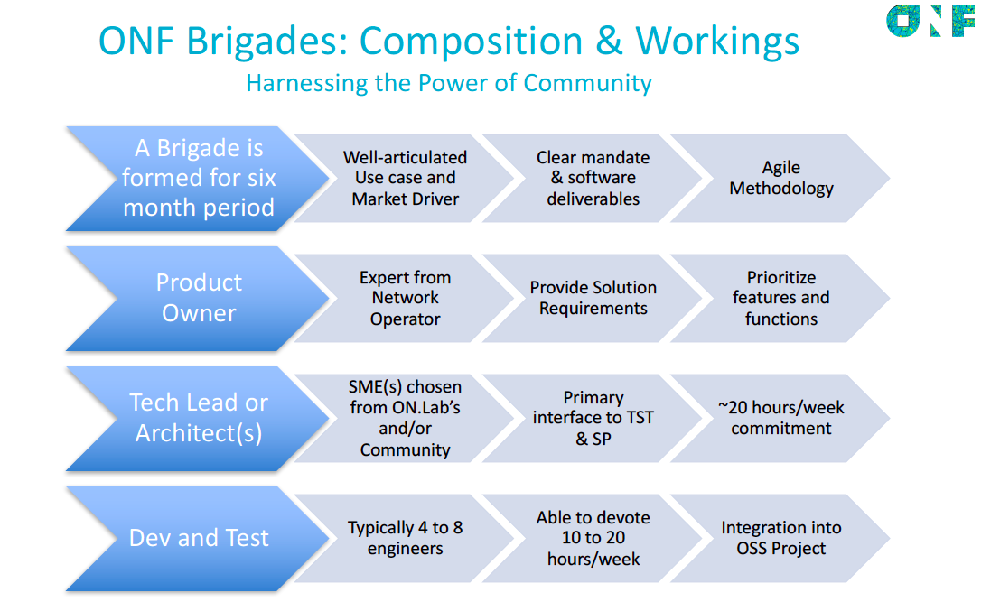

# Brigades

As the ONOS community continues to grow it brings a challenge of how to coordinate a large group to make sure we’re all working toward a shared goal. One way to address this is to communicate clearly about our vision for ONOS and invite people to work together on completing specific parts of that vision.

This is where the brigade model comes in — the idea is to create small teams around specific features that we want to ship in upcoming versions of ONOS. This can help us connect with other people in the community who are excited about that feature and it gives that group a framework for working together.

[Code for America has been successfully using brigades](https://www.codeforamerica.org/brigade/about/) to build new tools that help with local civic issues all across the country. There are many best practices we can take from that experience to help us get moving quickly with this model in our community. If you’ve been involved in a Code for America brigade, we’d be very interested to hear your thoughts.

# Benefits of joining a Brigade

* **Opportunity:** Joining a brigade is a unique opportunity to work with the core engineering team and participate in work onsite at Menlo Park
* **Recognition**: The work of brigade members will be showcased widely with the community both online as well as at events, like at ONOS Build
* **Experience:** Taking part in a brigade is a great opportunity, especially for students, to get experience in network engineering and is a great stepping stone to possibly work at ONF or other member organizations
* **Acceleration:** Helping a brigade deliver a feature will get work that you care about into an official ONOS release much more quickly than it would without the brigade's efforts.
* **Research and Development:** A brigade can bring together researchers and engineers from both academia and industry to propose and develop new features and applications in the SDN/NVF domains or to model, measure, and evaluate performance of current implemented services.

# Active Brigades

These are the currently active ONOS brigades:

* [Build and Package Infrastructure](brigades/build-and-package-infrastructure-brigade.md)
* [Deployments](brigades/deployment-brigade.md)
* [Dynamic configuration](brigades/dynamic-configuration-brigade.md)
* [gRPC](brigades/grpc-brigade.md)
* [GUI](brigades/gui-brigade.md)
* [ISSU](brigades/issu.md) *(In-Service Software Upgrades)*
* [Lion](brigades/lion-brigade.md) *(Localization/Internationalization)*
* [Orchestration](brigades/orchestration-brigade.md)
* [P4](brigades/p4-brigade.md)
* [Security & performance analysis](brigades/security-performance-analysis-brigade.md)
* [Teaching](brigades/teaching-brigade.md)
* [Virtualization](brigades/virtualization-brigade.md)

# Getting Involved with a Brigade

If you're interested in the work of any of these brigades, please take a look at that brigade's wiki page to learn more about what is happening, what help is needed and how to get in touch with the team.

# Expectations

The brigade helps the community scale and take on work items. In using brigades as a work unit, the community is counting on them to execute to their plans successfully. We expect the leader and the brigade members to have the desire, motivation, and skills to make and MEET commitments to the community. Also, as part of the community, it is expected that brigades will engage with the release planning process and the sprint planning process. Specifically, we expect brigades to do the following in the different phases of the ONOS release cycle:

*Planning*

* The brigade lead will work with their team and the ONOS TST to define a high-level vision for their group's efforts and will document this on their brigade's wiki page.
* The expectation is that the lead will be working with their brigade to define a set of deliverables that the team can commit to delivering and this will be communicated in the release planning meeting.  The deliverables and requirements can come from many places in the community, or from the brigade itself. The community is counting on the brigade to deliver on its promises for the release.

*Execution*

* The brigade will keep a public location updated with work items and status so that the brigade's work is visible to the community (a JIRA dashboard, for example).
* The lead, or the lead's delegate, will participate actively in the brigade review meeting held once a month in order to work with other leads to solve problems and make their brigades and the brigade program better.
* If there are concerns about progress on committed deliverables or with any part of the brigade process, we expect leads to reach out and raise those concerns so that we can support you with addressing those.
* We expect that progress will be communicated in the regular sprint review meetings through creating a slide with relevant details about what progress has been made in the brigade over the sprint period.  Attending the meeting to talk over the slide is optional but encouraged.

*Delivery*

* The lead, or the lead's delegate, will participate in the release review meeting to show what the team accomplished for the release.  We expect relevant details to be captured in a slide.  We highly encourage that a brigade does a demo at this meeting to showcase their efforts to the community.

# Roles, Recommendations and Requirements

If you chose to take part in or lead a brigade, we have some best practices and recommendations for you.

## Recommendations

Now that we've been running brigades in the ONOS community for a while, we have some best practices and recommendations to share.

* In-person work weeks are crucial for establishing connections among brigade members and getting a project kicked off.  We encourage all brigades to make use of their budget to bring people together either at the Menlo Park office or somewhere else to meet in person.  Brigade leads have discretion for how to spend this budget – all of it could be spent on the work week or some could be saved for other purposes, like helping people travel to ONOS Build.  And there is discretion for how to distribute the budget – if there are some members who are critical for success of a work week, then you can decide to fund all of their travel and then provide partial support to other members.
* Clarity around a brigade’s goals and vision are very important so that people who are interested in joining that brigade know what they would be getting involved with.  Even if you don't know yet everything that your brigade may want to focus on, share out the ideas and plans you do have on your brigade's wiki page.
* Communicate regularly about what your brigade is doing – we're happy to help you share out your activities on the ONOS blog and other community channels.  Sharing out your progress will also help you find more people who are interested in what you're doing and want to help you out.  Sharing out with other brigade leads will also help everyone learn about what is working and what the best practices are for running a brigade – all brigade leads are encouraged to join the regular Brigade Lead call currently scheduled for every other Wednesday at 10:00 AM pacific.
* Producing code is important, but it is even more important for brigades to be creating more module owners who have expertise and interest in that code.  As your brigade continues, be on the lookout for opportunities to delegate responsibility to brigade members and nominate brigade members to become new module owners.

## Brigade Leads

A brigade leader is someone who has enough bandwidth to devote to the project -- this doesn't necessarily need to be someone who has the most technical experience and non-technical people can lead.  This role is more about coordinating the enthusiasm of brigade members and to keep progress moving forward by coordinating work weeks and regular project calls and also to make sure that brigade members aren't blocked and have what they need to be successful.  Brigade leads should also keep their brigade wiki page updated with relevant information about their efforts (status, team members, communication channels, etc) and also share out news regularly with the community.

## Mentors

Mentorship is vital in an open source community because so much information and knowledge is often not written down or documented.  Mentors focus on leveling up brigade members so they have the skills to be successful.  For brigades where there are leads or members who do not have easy access to the ONF offices in Menlo Park, mentorship is also crucial since you do not have the ability to easily interact with and ask questions of core team members based there.  Because of that, we encourage all brigades that are not lead by an ONF staff member to have a mentor who can support them, answer questions and get them unstuck when they are blocked.  Mentors can be ONF staff members, TST members, module owners or anyone else who has deep knowledge to share about the work the brigade is doing.

## Members

Anyone who is interested in participating in a brigade can join as a member and they will be asked to identify specific tasks related to that brigade's efforts that they will take on.  They are responsible for participating in the brigade's planning and for communicating their progress with their fellow brigade members.

## Product Owners

The product owner makes sure the work of the brigade is *relevant* to the operator. As such, the product owner usually comes from an operator environment (AT&T, Verizon, etc..) and they have a PoC, Lab Trial, or Field Trial that has been selected by the use case steering team. The person could also come from a vendor involved in a PoC, lab trial, or field trial. It is similar to the role as defined in agile scrum. In short, they make sure the features are defined from the end user perspective, and they make sure that work is done in priority order. The product owner provides "pull" for features from the team - helping to bring the work into use in the network. One can find more information on the web about the role of a product owner. One such page is [here.](http://www.scaledagileframework.com/product-owner/)

## Meetings

Brigade leads and members come from around the world and we recognize that it is impossible to schedule meetings that will work for everyone in every time zone.  Because of this we are sensitive to asking people to attend meetings and we've tried to minimize brigade-related calls.  We strongly encourage brigades to participate in the regular sprint and release reviews however since it is important to coordinate your efforts with others in the project and it is a great opportunity to get the recognition and credit you deserve.  If a lead can't join the meetings, please find someone else on your brigade that can make the call.  You can find the meeting details on the [ONOS community calendar](meetings.md).  For other meetings, you and your brigade can decide if and when to schedule team meetings.

## Brigade Leads Mailing List

If you are leading a brigade or acting as a mentor, please take an active role on the [Brigade Leads mailing list](https://groups.google.com/a/opennetworking.org/forum/#%21forum/brigade-leads).  This list is for leads and mentors of active ONOS and CORD brigades.  Discussions will focus on discussing issues, asking questions and sharing tips about running a successful brigade.  You will benefit from learning about what has worked well for other brigades and other leads can learn about the tips and suggestions you have from your experience.

## Test Coverage

Test Coverage is an important aspect for stability of ONOS.  Test Coverage includes Unit Tests and System Tests.

For details on unit test coverage refer to [Unit Test criteria and guidelines](https://wiki.onosproject.org/display/OP/Proposal+for+new+Contributing+to+the+ONOS+Codebase).

System Test Coverage includes delivery of detailed test plans and shared with the team for reviews.  Critical and Major functional test scenarios are to be targeted for automation.  Automated tests/scripts need to be submitted into the common repository.  By committing test cases to a common repo it helps the community/users to scale the tests in future.  All test cases that are automated need to be run before and after code merges into the mainstream. Once code is committed to the mainstream, automated test scripts need to be integrated to jenkins QA jobs for continuous regression of the features.

ONF test engineer(s) will collaborate with the testers in the brigade and guide them through the test coverage procedures.  Testers on the brigade team can also take advantage of the existing automation framework and tools that ONF uses for automated tests.

Refer to [System Testing Guide](../guides/system-testing-guide.md) for more details.

## Visualization of Roles and Process

