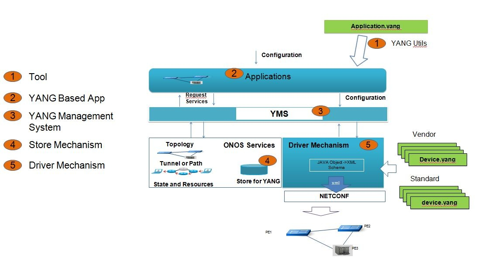

# Dynamic configuration brigade

#### **Goal**

* Dynamic Configuration of Devices
  + Enable a network operator to seamlessly bring up/down and configure devices from different vendors and to verify the configuration with minimal or no human intervention.
* Dynamic Configuration/Provisioning of Services
  + Enable a network operator to seamlessly configure and provision a service on the network comprising many devices from many vendors with minimal or no human intervention

**How to get involved**

**Help needed**

* 1-2 developer for configuration Store, who is/are required to work with ONOS distributed core team to implement Store Mechanism, Application API, and advanced store features etc. Location can be local or remote.
* 1-2 QA engineer, whose responsibility will be setup related testing environment in ON.LAB, design stress and regression testing plan and testing cases, write automation script, work with developer on any issues by stress and regression test. Local resources are preferred.
* Invite 3 (at least) vendors to join the brigade. These vendors will provide one or two L3 devices with NETCONF and device model ready. Engineers are required to work with Brigade team to integrate their devices into the demo environment. They are required to know their device model and is able to help brigade team to debug any issue seen during the integration.

 

**Contact the brigade:**

* Join the mailing list at: [brigade-dynconfig@onosproject.org](mailto:brigade-dynconfig+noreply@onosproject.org)

#### **Story**

* Dynamic Configuration Story slide is a reference to our vision and view how this dynamic configuration system works. It basically covers both device configuration and service provisioning.
* Story document:
  + [Dynamic-Config-Story-v0 1.pdf](../../../assets/dynamic-config-story-v0-1.pdf)

#### Documents

1. [Dynamic Configuration Design Requirement](https://docs.google.com/document/d/1nh_peaC9PkfuwqpaTDUsmR1U8Q7cKd8jcut4wLdki3U/edit#heading=h.ig0rd9w66ogn)
2. [Brigade DynConfig for ONOS Build.pdf](../../../assets/brigade-dynconfig-for-onos-build.pdf)
3. [Dynamic Configuration Design Document](https://docs.google.com/document/d/1jJNMBJpd5YqBLWFYCQzTP_QGX9hshDjMVQau47duGto/edit?ts=5845fd3c)

**Roadmap**

Phase 1: Target ONS 2017 (April, 2017) - Demo 1, Demo 2

- ONOS Release “I” (now)

* APIs definitions for YangCompiler, YangRuntime, and DynamicConfigStore

- ONOS Release “J”

* Refactoring & code restructuring: YangCompiler, YMS -> YangRuntime,
* Implementation of DynamicConfigService & Store
* Implementation of RESTCONF & NETCONF Apps
* Sharding of subtrees will be opportunistic

Phase 2

– Demo 3 (Multi Vendor Device)

– ONOS Release "K" & “L”

* Sharding of subtrees
* Transactional updates
* Performance optimizations
* Driver model based on Behaviors
* Explore Common Driver Architecture (Add a new device without code release -)

#### Requirements to Dynamic Configuration Brigade

Here is a requirement holder, which includes the features, bug fixing, etc.

| Requirements Description | Suggested Priority | contact (email) | comments and feedback |
| --- | --- | --- | --- |
| YANG Store Service notification API should support multiple operations on different node and subtree | high | [patrick.liu@huawei.com](mailto:patrick.liu@huawei.com) |  |
| Augment is required by L3VPN. the changes in yang tools in reflect to the recent architecture refactoring should support this. | high | [patrick.liu@huawei.com](mailto:patrick.liu@huawei.com) |  |
|  |  |  |  |

**Weekly Meeting and Brigade Event**

From 8am to 9/10 am (PST) on each Thursday morning.

----------------------------------------------

Dynamic Configuration Brigade

Please join my meeting from your computer, tablet or smartphone.  
<https://global.gotomeeting.com/join/193053677>

You can also dial in using your phone.  
United States (Toll Free): 1 866 899 4679  
United States: +1 (312) 757-3117

Access Code: 193-053-677

More phone numbers  
Austria: +43 7 2081 5337  
Canada: +1 (647) 497-9373  
China (Toll Free): 4008 866143  
France: +33 170 950 590  
Germany: +49 692 5736 7300  
Italy: +39 0 230 57 81 80  
Netherlands: +31 207 941 375  
Spain: +34 932 75 1230  
Switzerland: +41 225 4599 60  
United Kingdom: +44 20 3713 5011

Joining from a video-conferencing room or system?  
Dial: 67.217.95.2##193053677  
Cisco devices: [193053677@67.217.95.2](mailto:193053677@67.217.95.2)

----------------------------------------------

See [ONOS event calendar](https://goo.gl/cFJnc6) for bridge details

| Date | Meeting and Event | Meeting highlights | Action Item |
| --- | --- | --- | --- |
| 11/30/2017 | Dynamic Configuration Brigade Weekly Meeting | Upcoming demonstration preparation   * DCS demonstration on device configuration and (possibly) NBI + RESTCONF * Targeted event for the demo: ONS, MWC   Magpie Sprint #4 Items and progresses   * ONOS-7036 - code review & concluding in M sprint #4  * ONOS-7037 - in design phase. required for RESTCONF notification and GET. Current DCS store does not have timestamp associated with data nodes.   + option1: extend data node to include timestamp annotation. Drawback is memory consumption   + option2: provide timestamp annotation in the data store (as opposed to extend data node structure in YANG runtime) * ONOS-7064    + Under code review and to be committed soon. * ONOS-7105   + updated document available.   + Adding the support for multiple store into the document * ONOS-7168   + Postponed due to lab facility issues * ONOS-7231   + Requires DocTree changes which is not short term   + Will focus on new DCS design as the next step |  |
| 09/14/2017 | Dynamic Configuration Brigade Weekly Meeting | Magpie Sprint #1 Items and progresses  In Progress:   * ONOS-7007 Cannot write device tree elements to Dynamic Config subsystem   + Fix in progress. Current design is that resource id does not contain root information.   + Root - logical root added by DynConf * ONOS-7020 Fix some of netconf SBI design issues   + Code done. Needs testing. Depending on ONOS-7007 for testing.   To-do:   * ONOS-7033 YANG Compiler: Support for Anydata parsing   + Sprint#2 work item. Part of YANG 1.1 constructs * ONOS-6975 Investigate ConfD, etc. to be used as NETCONF device simulator   + Code done. Needs testing and depends on ONOS-7007. * ONOS-6978 Establish a way to create a device yang tree object for testing   + Code done. Needs testing and depends on ONOS-7007. * ONOS-7037 RestConf Timestamp support   + will share RFC and section info, it is mandatory, etc.   + Requires annotation to the data node   + Request from customer, needed for use case like, orchestrator want to sync with ONOS, etc.   + Discuss during sprint #2 and start on sprint #3 * ONOS-7036 RESTCONF Device proxy support   + should not be that hard, 1 week amount of work   + Sprint #2 * ONOS-6861 RestConf Filter   + depends on ONOS-6494 which was resolved in L Sprint 3   + Implementation follows after ONOS-7036. * ONOS-6878 Revisit DynamicConfigEvent design   + Please share your thoughts on the [mailing list thread](https://goo.gl/4zvaRR).   + Feedback pending   + Currently no implementation changes for sprint #2. Also related with timestamp implementation. * ONOS-6673 YANG Runtime: GET API's for YANG Models   + Low priority, there can be workaround for it. Take a look after OpenConfig work   + Start implementing after anydata.   Done:   * ONOS-6381 Event consolidation * [ONOS-6494](#) Dyn-config List Child need to be ordered together   - Fixed and merged in sprint3   * ONOS-6884 Device tree restructuring, ResourceId related modification to deal with relative ResourceId  * + Currently working on ground work required for relative ResourceId, utility methods to concat, relativizing ResourceIds.   + now merged, will start working on synchronizer code   + Unit test in progress. No NETCONF-capable device to test this function. May use NETCONF simulation to test Device Synchronizer.   + Would be nice to have small YANG for Unit test purpose (question)   + L3VPN is smallest, may be shrink version of it can be extracted as test artifact, so that other tests can refer to it, L3VPN should have device model as part of it.   + models/l3vpn/ietf~/huawei 5 files /tools/test/config/yang. or may be bgp common * [ONOS-6881](#) yangtools "uses" augmentation   - tested and merged.   * [ONOS-6694](#) OpenConfig integration issue   + YANG tools issues are fixed   + Will submit all OpenConfig models into gerritt for review. * ONOS-6906 bug around update, no event issue   - Was able to reproduce; fixed and merged in sprint3   * ONOS-XYZW Live Compilation in place CLI, REST   - now merged |  |
| 08/24/2017 | Dynamic Configuration Brigade Weekly Meeting | Loon Sprint #3 Items and progresses  ONOS-6381 Event consolidation  - in progress, under review  [ONOS-6494](#) Dyn-config List Child need to be ordered together  - Fixed and merged in sprint3  [ONOS-6861](#) Restconf Filter by nodes  - depends on 6494. Will continue to be developed in the next release.  ONOS-XYZW RESTCONF Device proxy support   * should not be that hard, 1 week amount of work * Targeting for the upcoming release   [ONOS-6878](#) Revisit DynConfig Event notification   * Please share your thoughts on the [mailing list thread](https://goo.gl/4zvaRR). * Feedback pending   ONOS-6884 Device tree restructuring   * Currently working on ground work required for relative ResourceId, utility methods to concat, relativizing ResourceIds. * now merged, will start working on synchronizer code * Unit test in progress. No NETCONF-capable device to test this function. May use NETCONF simulation to test Device Synchronizer. * Would be nice to have small YANG for Unit test purpose (question)    + L3VPN is smallest, may be shrink version of it can be extracted as test artifact, so that other tests can refer to it, L3VPN should have device model as part of it.   + models/l3vpn/ietf~/huawei 5 files /tools/test/config/yang. or may be bgp common   [ONOS-6881](#) yangtools "uses" augmentation  - tested and merged.  [ONOS-6694](#) OpenConfig integration issue   * YANG tools issues are fixed * Will submit all OpenConfig models into gerritt for review.   [ONOS-6673](#) YANG Runtime: GET API's for YANG Models  - low priority, there can be workaround for it. Take a look after OpenConfig work  ONOS-6906 bug around update, no event issue  - Was able to reproduce; fixed and merged in sprint3  RESTCONF Timestamp support   * will share RFC and section info, it is mandatory, etc. * Requires annotation to the data node * Request from customer, needed for use case like, orchestrator want to sync with ONOS, etc. * ONOS-XYZW * Candidate for M release.   ONOS-XYZW Live Compilation in place CLI, REST  - now merged |  |
| 08/10/2017 | Dynamic Configuration Brigade Weekly Meeting | Loon Sprint #3 Items and progresses  ONOS-6381 Event consolidation  - in progress, under review  [ONOS-6494](#) Dyn-config List Child need to be ordered together  - Fixed and merged in sprint3  [ONOS-6861](#) Restconf Filter by nodes  - depends on 6494  ONOS-XYZW RESTCONF Device proxy support   * should not be that hard, 1 week amount of work   [ONOS-6878](#) Revisit DynConfig Event notification   * Please share your thoughts on the [mailing list thread](https://goo.gl/4zvaRR).   ONOS-6884 Device tree restructuring   * Currently working on ground work required for relative ResourceId, utility methods to concat, relativizing ResourceIds. * now merged, will start working on synchronizer code   [ONOS-6881](#) yangtools "uses" augmentation  - under review on gerrit  [ONOS-6694](#) OpenConfig integration issue   * Of 5 issues left, 2 will be ready for review soon, 2 more is relatively similar, in progress, 1 needs further analysis. * Would be better to prioritize this task to make it part of Loon release. Currently planning to do a webinar 9/11 about OpenConfig with Google. Focus will be on ONOS YANG tools + OpenConfig (Usage pattern similar to Microsemi driver)   [ONOS-6673](#) YANG Runtime: GET API's for YANG Models  - low priority, there can be workaround for it. Take a look after OpenConfig work  ONOS-6906 bug around update, no event issue  - Was able to reproduce; fixed and merged in sprint3  RESTCONF Timestamp support   * will share RFC and section info, it it's mandatory, etc. * Request from customer, needed for use case like, orchestrator want to sync with ONOS, etc.   ONOS-XYZW Live Compilation in place CLI, REST  - now merged  Would be nice to have small YANG for Unit test purpose   * L3VPN is smallest, may be shrink version of it can be extracted as test artifact, so that other tests can refer to it, L3VPN should have device model as part of it. * models/l3vpn/ietf~/huawei 5 files there. or may be bgp common |  |
| 08/03/2017 | Dynamic Configuration Brigade Weekly Meeting | Loon Sprint #3 Items and progresses  [ONOS-6494](#) Dyn-config List Child need to be ordered together  [ONOS-6861](#) Restconf Filter  ONOS-XYZW RESTCONF Device proxy support   * should not be that hard, 1 week amount of work   [ONOS-6878](#) Revisit DynConfig Event notification   * Please share your thoughts on the [mailing list thread](https://goo.gl/4zvaRR).   ONOS-XYZW Device tree restructuring   * Currently working on ground work required for relative ResourceId, utility methods to concat, relativizing ResourceIds.   [ONOS-6881](#) yangtools "uses" augmentation  [ONOS-6694](#) OpenConfig integration issue   * Of 5 issues left, 2 will be ready for review soon, 2 more is relatively similar, 1 needs further analysis. * Would be better to prioritize this task to make it part of Loon release. Currently planning to do a webinar 9/11 about OpenConfig with Google. Focus will be on ONOS YANG tools + OpenConfig (Usage pattern similar to Microsemi driver)   [ONOS-6673](#) YANG Runtime: GET API's for YANG Models |  |
| 07/27/2017 | Dynamic Configuration Brigade Weekly Meeting | Loon Sprint #3 Items and progresses  **[ONOS-6645] RPC abstractions and generated code clean up and optimize - yang tools side (merged, sprint 2)**  **[ONOS-6385 RPC dispatcher implementation] (merged)**  **[ONOS-6861] Transaction event listener**   * Transaction id support - being considered for next sprint. * Event consolidation - planned for next sprint.   + Applies to all Dynamic Config events   + Producer generates consolidated event and indicates which entities are updated. Parameter data values will be included along with resource ids in the payload. This may raise issue with memory consumption.   + Alternative solution is to wait until data values are processed.   **[ONOS 6861] RestConf Filter**   * Need Dynamic Config support. * Depends on node ordering feature   **[ONOS 6494] Dynamic Config: Changes to preserve ordering of children in the store**   * Not started yet. May hit some performance issue for JSON serializer if unsorted. Included in the next sprint.   **[ONOS 6745] Device synchronizer**   * Description for device synchronizer document is done. Currently discussing about the [designs](https://goo.gl/chMFLt), such as [configuration tree structure](https://goo.gl/bLSyoV) in the mailing list.   + First step is to focus on north->south synchronization (this sprint) by reacting to device changes and configuring devices from ONOS     - Network transactions is currently not supported     - Per-device transaction is possible     - Stateful or stateless provider (store device states)? - should be stateless. Controller has candidate and running store   + Next step is south->north synchronization, fetch and compare changes on the controller and take further actions * API change in dynamic config to support device synchronization is in code review. * Started to look into serialization aspect. * Discussion around proposed device configuration tree structure on mailing list.   + Agreed on basic direction, trying to finalize the details.   **[ONOS 6760] RestConf RPC**   * Code review is completing this week. * Integrating with Dynamic Config service API to be completed - update: code review comments addressed, under testing. * Interface change to add resource id in Dyn Config API to be code reviewed and submitted along with Dyn Conf implementation -  done; * YANG runtime work is done. * Suppress auto generated registration classes - done * comment out invocation code * RPC input/output node will always be there, data can be empty   **[ONOS 6761] RestConf PATCH support**   * Code review is completing this week. * Fix to PUT operation (in compliance with RESTCONF standards) was submitted for code review   **[ONOS 6763] OpenConfig model compilation and integration**   * 2/7 bugs are fixed. Remaining bug fixes will carry towards the next sprint.   **YANG tools and YANG runtime**   * All YANG-type related bugs are fixed. * New YANG syntax support:     + "uses" augmentation   + "anydata" support   **YANG live compiler**   * GET APIs - done. Needs further improvement. * Introduce model identifier in YANG compiler - done * Produce oar file for application integration - not started. Will start in the next sprint. * Ready to release new YANG tools. |  |
| 07/20/2017 | Dynamic Configuration Brigade Weekly Meeting | Loon Sprint #2 Items and progresses  **[ONOS-6787] Rpc abstractions and clean up -Dynamic config side**   * Patch merged   **[ONOS-6645] RPC abstractions and generated code clean up and optimize - yang tools side**   * Patch is merged. * RPC implementation almost done and is pending submission soon. * Working on transactions and event consolidation - code review in progress. Needs refactoring on some code. * Transaction id support - being considered for next sprint. * Event consolidation - planned for next sprint.   **[ONOS 6494] Dynamic Config: Changes to preserve ordering of children in the store**   * Not started yet. May hit some performance issue for JSON serializer if unsorted. Included in the next sprint.   **[ONOS 6745] Device synchronizer**   * Description for device synchronizer document is done. Currently discussing about the [designs](https://goo.gl/chMFLt), such as [configuration tree structure](https://goo.gl/bLSyoV) in the mailing list.   + First step is to focus on north->south synchronization (this sprint) by reacting to device changes and configuring devices from ONOS     - Network transactions is currently not supported     - Per-device transaction is possible     - Stateful or stateless provider (store device states)? - should be stateless. Controller has candidate and running store   + Next step is south->north synchronization, fetch and compare changes on the controller and take further actions * API change in dynamic config to support device synchronization is in code review.   **[ONOS 6760] RestConf RPC**   * Integrating with Dynamic Config service API to be completed - update: code review comments addressed, under testing. * Interface change to add resource id in Dyn Config API to be code reviewed and submitted along with Dyn Conf implementation -  done; * YANG runtime work is done. * Suppress auto generated registration classes - done * comment out invocation code * RPC input/output node will always be there, data can be empty   **[ONOS 6761] RestConf PATCH support**   * Under code review with issues. * Fix to PUT operation (in compliance with RESTCONF standards) was submitted for code review   **[ONOS 6763] OpenConfig model compilation and integration**   * 2/7 bugs are fixed. Remaining bug fixes will carry towards the next sprint.   **YANG tools and YANG runtime**   * All YANG-type related bugs are fixed.   **YANG live compiler**   * GET APIs - patch in gerrit. Needs further improvement. * Introduce model identifier in YANG compiler - path is in gerrit. Support from YANG tool is ready. Improvements ongoing. * Produce oar file for application integration - not started. Will start in the next sprint. |  |
| 07/13/2017 | Dynamic Configuration Brigade Weekly Meeting | Loon Sprint #2 Items and progresses  **[ONOS-6645] RPC abstractions and generated code clean up and optimize**   * Patch not done and waiting to be reviewed. * Dependent code is in gerrit under review (<https://gerrit.onosproject.org/#/c/14642/>) . Code compilation issue should be resolved. * <https://gerrit.onosproject.org/#/c/14620/> - this one is closed. * Working on transactions and event consolidation. Expecting one more week of work. * API of RPC registry is moved to YANG model, implementation still remains in Dynamic Config * RPC input/output - limited to north/south or usable between applications?   **[ONOS 6494] Dynamic Config: Changes to preserve ordering of children in the store**   * Not started yet.   **[ONOS 6745] Device synchronizer**   * Description for device synchronizer document is done. Currently discussing about the [designs](https://goo.gl/chMFLt) in the mailing list.   + First step is to focus on north->south synchronization (this sprint) by reacting to device changes and configuring devices from ONOS     - Network transactions is currently not supported     - Per-device transaction is possible     - Stateful or stateless provider (store device states)? - should be stateless. Controller has candidate and running store   + Next step is south->north synchronization, fetch and compare changes on the controller and take further actions * API change in dynamic config to support device synchronization is in code review.   **[ONOS 6760] RestConf RPC**   * Integrating with Dynamic Config service API to be completed - update: code review comments added. * Interface change to add resource id in Dyn Config API to be code reviewed and submitted along with Dyn Conf implementation; implementation in YANG runtime to be done. * suppress auto generated registration classes, comment out invocation code   **[ONOS 6761] RestConf PATCH support**   * Implemented and under code review. * Fix to PUT operation (in compliance with RESTCONF standards) was submitted for code review   **[ONOS 6763] OpenConfig model compilation and integration**   * 2/7 bugs are fixed   **YANG tools and YANG runtime**   * 1/2 Yang types related bugs are fixed.   **YANG live compiler**   * GET APIs - patch in gerrit. Needs further improvement. * Introduce model identifier in YANG compiler - path is in gerrit. Improvements ongoing. * Produce oar file for application integration - not started. |  |
| 07/06/2017 | Dynamic Configuration Brigade Weekly Meeting | Loon Sprint #2 Items and progresses  [ONOS-6645] RPC abstractions and generated code clean up and optimize  Patch is ready for review. Code compilation issue to be checked.  Working on transactions and event consolidation.  API of RPC registry is moved to YANG runtime, implementation still remains in Dynamic Config  [ONOS 6494] Dynamic Config: Changes to preserve ordering of children in the store  Not started yet.  [ONOS 6745] Device synchronizer  Description for device synchronizer document is done. Currently discussing about the designs in the mailing list.  [ONOS 6760] RestConf RPC  Integrating with Dynamic Config service API to be completed.  Interface change to add resource id in Dyn Config API to be code reviewed and submitted along with Dyn Conf implementation; implementation in YANG runtime to be done.   - suppress auto generated registration classes, comment out invocation code  [ONOS 6761] RestConf PATCH support  Not started yet.  Fix to PUT operation (in compliance with RESTCONF standards) will be submitted.  [ONOS 6763] OpenConfig model compilation and integration   * 2/7 bugs are fixed   YANG tools and YANG runtime  YANG live compiler   * GET APIs * Introduce model identifier in YANG compiler * Produce oar file for application integration |  |
| 01/24//2017 | Review DataNode & Resourse Identifier usage |  |  |
| 12 Jan 2017 | RPC brokerage and notification support by Dynamic config service(Sithara) | Code walk of the RPC brokerage  Implementation of brokerage, correlation of responses to commands  Different approaches to manage the concurrent executions at the executors were discussed  Data change and YANG notifications handling at the store | Disaggregate RPC service and RPC context |
| 12/20/2016 | Agenda  YANG Schama validation for data | two options were proposed.  is YANG runtime stateful?  error handling during validation: giving back to application; tree might be traversed multiple time.  not concluded yet. | update the design document about the options for schema validation (Gaurav) |
| 12/18/2016 | Agenda |  |  |
| 12/13/2016 | Agenda  Gaurav on recent code changes in builder, model object, model converter and data node.  Store APIs | 1. how to add mutability in DataNode? 2. interface to YANG Runtime from schema unaware application. 3. URL and input string is passed to YANG Runtime (XML, JSON?) . Each application should register its own serializer to YANG Runtime. 4. is merge operation required? NETCONF supports this operation. 5. DataNode is not required in ModelObject. 6. How schema identifier in ModelObject help? DataNode has the schema identifier. the decision is up to implementation. 7. Model converter, which is implemented by Yang Runtime. 8. Expose Device Model to NB. (need feedback) | YANG runtime API will be discussed in next meeting (Gaurav)  Use case of merge operation during configuration (Vinod)  Demo 1 requirement from SP (Thomas)  Need close coder review on store APIs (Thomas) |
| 12/08/2016 | Agenda  review DataNode definition (Gaurav)  Review of Dynamic Config Service APIs (Sithara)   1. DataType: do we require the synthetic subdivision of nodes? 2. Filtering: resource identifier based? DataNode based? 3. We need a transient state for data in the store or a transient data store or another mechanism | 1. DataNode and ModelNode: dataNode is final and concrete. Model Node is abstract. 2. schema aware application uses POJO to generate DataNode 3. schema unaware application call YANG Runtime APIs to generate dataNode. (interface to be discussed) 4. Data node operation is expensive. Let us work on this approach initially. we will come to visit the performance later. |  |
| 12/5/2016 | Agenda   1. Expose device YANG interface to NBI  [Exposing device interface in NBI.pptx.pdf](../../../assets/exposing-device-interface-in-nbi.pptx.pdf) 2. data node discussion 3. APIs discussion |  |  |
| 11/29/2016 | Agenda   1. jira tickets status update (Release I only) 2. preparation for 12/5/2017 Demo and planning meeting 3. Technical Discussion    1. APIs: Path parameter (resource identifier)    2. review Data Node definition    3. new components module diagram (Vinod)    4. data tree structure | 1. update the JIRA status in reflect to the current status 2. path is defined as resource identifier in the interface. It can identify anyone (container, branch, list, leaf, etc). generally it is data node (key, value). 3. Node key and resource identifier difference. 4. lot of discussions on data tree retrieval interface and APIs.    1. resource ID definition    2. path to the instance in the data tree    3. key based container based store?    4. content filtering | can Vinod help to make a summary about datanode discussion? |
| 11/22/2016 | Agenda   1. review DataNode (that is, YangNode) definition 2. Review Yang Running APIs 3. Expose device YANG interface to NBI  [Exposing device interface in NBI.pptx.pdf](../../../assets/exposing-device-interface-in-nbi.pptx.pdf) | 1. Yang Running APIs    1. Path information missed.    2. this api is going to be used by protocol APP and service app. Does both have the same requirement and share the same API?    3. path has not defined yet. 2. Data Node definition    1. change double link list to hash map for performance concern | Vinod will look into Path definition |
| 11/17/2016  weekly meeting | Agenda   1. Overview of Objectives and approach from Thomas - <https://groups.google.com/a/onosproject.org/forum/#!topic/brigade-dynconfig/8JOnjcQ9ddc> 2. Reiterate priorities: ConfigNode, YangRuntime API, and DynamicConfig API. 3. Expose device YANG interface to NBI (Vinod) 4. Sprint#3 status update   [Exposing device interface in NBI.pptx.pdf](../../../assets/exposing-device-interface-in-nbi.pptx.pdf) | this meeting is rescheduled to 8-9am of 11/18/2016   1. item 1 and 2 were discussed 2. agreed on the priorities in current and next release 3. Item 3 will postponed to next meeting | Patrick send out the link to the requirement holder. |
| 11/15/2016  Sprint Planning | Ibis Release Sprint# 3 planning | 11 Dynamic-config and 4 yang-tools JIRA tickets are planned  key milestones:   1. 11/22 Initial Proposal YangNode definition 2. 11/28 Initial Proposal Yang running API 3. 11/28 Yang configuration service APIs |  |
| 11/10/2016  weekly meeting | Agenda:   1. ONOS Build Update (Overall, QA team side line discussion update) (Patrick, Verizon Team) 2. Architecture Update (Thomas)    1. [Dynamic Configuration Design Requirement](https://docs.google.com/document/d/1nh_peaC9PkfuwqpaTDUsmR1U8Q7cKd8jcut4wLdki3U/edit#heading=h.ig0rd9w66ogn) 3. Next Step 4. Open Discussion 5. [Brigade DynConfig for ONOS Build.pdf](../../../assets/brigade-dynconfig-for-onos-build.pdf) | * Top priority tasks are defined in the meeting. * The next step focus on defining:   + YangNode   + YangRunning APIs   + YangStore APIs | Ibis Sprint #3 Planning |
| 11/3/2016  weekly meeting | Canceled because of ONOS Build Event |  |  |
| 11/2/2016  Team Meet together | Brigade team meet together at ONOS build in Paris   1. Demos for ONS 2017 (April, 2017) 2. Data Tree structure proposal ( /root{/device, /services } 3. YMS internals Syncup | 1. Demo 1: Single Vendor's Device (one device) 2. Demo 2: Service (e.g. L3VPN) provisioning on single vendor devices 3. Demo 3: Service Provisioning on multiple vendor's devices. (e.g. Common Driver architecture ) |  |
| 10/27/2016  weekly meeting | Agenda:   1. Review Dynamic Configuration Store Slides 2. Review Dynamic Configuration System Data Model and Common Driver idea 3. Vendors demo proposal (Program OLT device by Fujitsu) [Dynamic configuration system data model and common driver idea.pdf](../../../assets/dynamic-configuration-system-data-model-and-common-driver-idea.pdf) 4. [fujitsu report\_Oct26.pptx](../../../assets/fujitsu-report_oct26.pptx) |  | Review Design Requirement document |
| 10/20/2016  weekly meeting | Introduction to current YMS, ElasticConfig subsystem, etc. and also Common Driver Idea.   1. APIs between YMS and Application 2. APIs between Application Driver 3. Vendors device YANG schema management 4. Process in common driver for "SAME" and "RULE" scenarios 5. APIs between app and ElasticConfigService, which has been approved and the code had been committed |  | Need a system level model transform diagram to show NB model to SB model transform |

**Brigade Leader:**

* Patrick Liu

**Brigade Members:**

* Gigamon : Venkata Narayana Tata;
* Fujitsu:      Aarun, Satoshi
* Huawei:    Gaurav, Henry, Patrick, Sithara, Vinod, Jin
* ON.LAB:   Brian, Ray, Thomas
* Verizon:    Viswanath KSP, Jay Simha, Venkat Sravan, Vipul Malgotra

========= **Announcement Please:  the information below are under construction in reflect to the latest view, design and requirements.**

**Demo  (under construction)**

* Use ONOS YANG Utils to translate IETF L3SM L3VPN model to JAVA application framework
* Enable and disable L3VPN service on ONOS controller through dynamic configuration
* Add a new device through modifying ONOS driver configuration (.xml) file.
* Configuration data persistency. the initial consideration is through a 3 node ONOS cluster. more node clustering setup will be considered upon request.
* Demo topology is still under construction.

**Scope (Under Construction)**

Build a model driven architecture in ONOS to dynamically install/update/remove the configuration for NETCONF enabled devices. In the first release, we will use L3VPN as a use case and build related applications on top of this architecture to demonstrate how this architecture works.  This project will be based on and integrate the results from existing projects (e.g. YANG Utils,  YMS, etc) and create new several components when necessary. In the demo, we plan to use multi-vendor devices as network element in our demo setup. to be specific, five components are involved

 1. YANG Utils.  This tools is used to translate YANG defined service/network model and device model into JAVA code. After Releases "G" and Release "H" hard working, current YANG Utils can meet this brigade requirement and no new features are required for this brigade.

 2. We need build L3VPN application and provide configuration interface to allow user enable/disable and configure L3VPN service on each device dynamically. This is a brand new application, which will be based on IETF L3SM L3VPN model. Please see L3VPN project proposal page for the implementation details

 3. In order to make ONOS internal application development easier,  we will use YMS to manage ONOS YANG-based services. The minimum requirement by this brigade is brokerage service, RESTConf, XML/JSON codec, etc. This part is pretty much L3VPN related, see L3VPN project proposal wiki for the dependency and development plan. For external application, it could request ONOS resource and topology service. We don't require YMS to provide the API for ONOS core services in our short team plan.  This is required by our long term plan.

 4. Distributed Configuration Store. This is expected to provide a powerful distrusted data store primitive DocTree to application to store their configuration. It provides two consistency models- eventual and strong consistency model.  The operation rate targets to support 10-12K operations per second. We hope this will meet most of the application's configuration requirement. Store operation for APIs include get/put/update/delete. APIs are under construction.  For more details of this store and the service to access this store, please refer to [Dynamic Configuration Subsystem](../../guides/architecture-and-internals-guide/dynamic-configuration-subsystem.md).

 5. Device Driver.  This is a new component. The target is to build a service and device independent driver. When a new device( from same vendor or different vendor) is added, it is not required,we hope, to build a new driver any more. In our current on-going design, this is achieved through modifying ONOS driver configuration file (in .xml format) by the results of comparing a "standard" device model with vendor's device model. Based on the comparison results, we category this into three group: SAME, RULE, and TRANSFORM. Driver will handle them differently.

1) SAME:  both models are same (namespace can be different). In this case, we only need modify driver configuration file (.xml).

2) RULE:  Vendor's device model can be translated into standard model by policy. For example, some construct missed, device mode is subset of standard model, etc.  In this case, we only need modify ONOS driver configuration file (.xml)

3) TRANSFORMER: Vendor's device model cannot be translated or mapped to "standard" model through policy. Because the "Standard" device model is from IETF or a standard organization, we hope this case is not common. In this case, a new transformer code is required to translate the standard model to this special device model.

  
**Short-term focus in 2016**

Use IETF L3SW model in building both network layer application and network element layer application

Use 3-5 devices from different Vendors as network elements in the Demo setup

New components to be built

L3VPN Application.  This is an external application (off-platform) that handle network model.

Ne L3VPN App.  This is an ONOS internal application that processes device model. Its north bound interface is defined by IETF.

Configuration Store. This is used to store configuration of device.

Driver Mechanism. This is an service and device agonistic mechanism

**Long-term focus in 2017**

* + Performance Assessment and do the enhancement if necessary
  + Transactional Operation on Configuration Store
