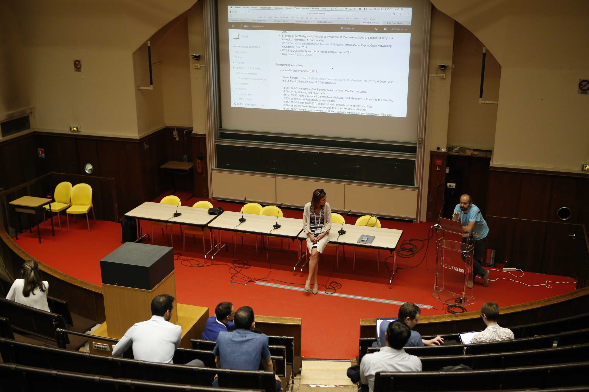
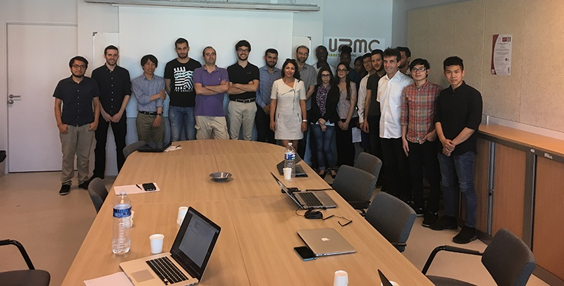
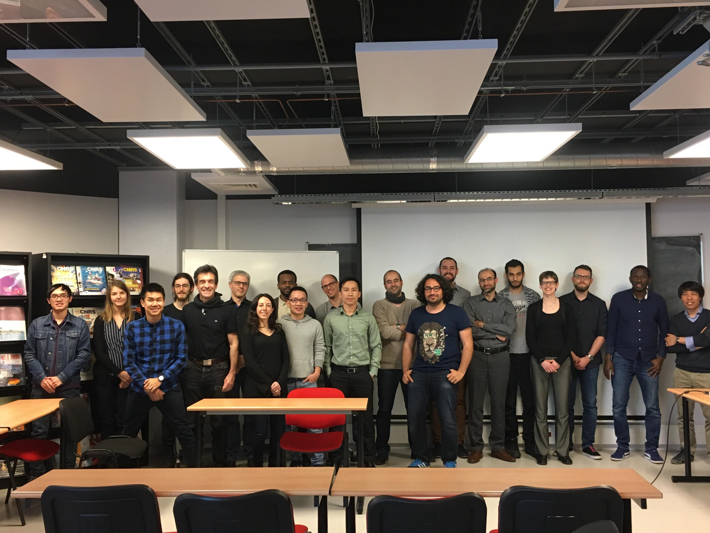
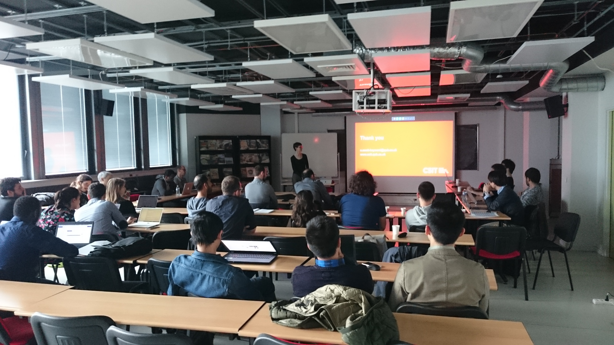

# Security & performance analysis brigade

**Brigade Lead:**

* Stefano Secci / Cnam <[stefano.secci@cnam.fr](mailto:stefano.secci@lip6.fr)>

**Brigade Members:**

* José Sanchez / Orange
* Alessio Diamanti / Orange-Cnam
* Erwan Goareguer / Thales-Cnam
* Sebastian Dittrich / T-Systems DT
* Dominique Verchere / Nokia
* Quan Pham Van / Nokia
* Lalita Jagadeesan / Nokia
* Abdelberi Chaabane / Nokia
* Marina Thottan / Nokia
* Duy Khuong / Nokia
* Jian Li / SK Telecom
* Andrea Campanella / ONF
* Suchitra Vemuri / ONF
* Sandra Scott-Hayward / QUB
* Dylan Smyth / CIT
* Abdulhalim Dandoush / ESME
* Giacomo Verticale / Politecnico di Milano
* Chistophe Basquin / Airbus
* Alpha Sow / Airbus
* Kamel Attou / Anevia
* Chi Dung Phung / Orange
* Stefano Secci / Cnam
* Kashyap Thimmaraju / TU Berlin
* Carmen Mas Machuca / TU Munich
* Petra Vizarreta / TU Munich

Currently calling for performance & security analysis work proposals for 2021 report, please contact Stefano Secci with analysis description and related effort guess.

**Reports:**

* S. Secci, A. Diamanti, JS. Vilchez Sanchez, MT. Bah, P. Vizarreta, C. Mas Machuca, S. Scott-Hayward, D. Smith, [Security and Performance Comparison of ONOS and ODL controllers](https://www.opennetworking.org/wp-content/uploads/2019/09/ONOSvsODL-report-4.pdf), Informational Report, Open Networking Foundation, Sept. 2019.
* S. Secci, S. Scott-Hayward, Y. Wang, Q. Pham Van, D. Verchere, A. Sow, C. Basquin, D. Smyth, K. Attou, K. Thimmaraju, A. Campanella, [ONOS Security and Performance Analysis (2nd report)](https://www.opennetworking.org/wp-content/uploads/2018/11/secperf_report_2.pdf), Informational Report, Open Networking Foundation, Nov. 2018.
* S. Secci, K. Attou, DC. Phung, S. Scott-Hayward, D. Smyth, S. Vemuri, You Wang, "[ONOS Security and Performance Analysis (1st report](https://www.opennetworking.org/wp-content/uploads/2017/07/ONOS-security-and-performance-analysis-brigade-report-no1.pdf))", Informational Report, Open Networking Foundation, Sept. 2017.
* Blog posts: [11/2017](https://onosproject.org/2017/11/03/onos-performance-security-analysis/), [05/2018](https://www.opennetworking.org/news-and-events/blog/onos-performance-and-security-analysis-meeting-recap/), [09/2019](https://www.opennetworking.org/news-and-events/blog/onos-performance-and-security-analysis-meeting-recap-2/).

* Mailing list: [secperf-brigade@onlab.us](mailto:secperf-brigade@onlab.us)

**Past activities:**

* 3rd brigade plenary workshop, June 17, 2017, Cnam, Paris, France  
    
  colocated with [Network Traffic Measurement and Analysis Conference (TMA) 2019](http://tma.ifip.org/2019/).  
    
  13:00 - 14:00: Welcome coffee & poster session of the TMA doctoral school   
  14:00 - 14:15: Opening and round table  
  14h15 - 15:55: [Petra Vizarreta & Carmen Mas Machuca (TUM, Germany)  - Assessing the reliability of SDN controllers with reliability growth models](../../../assets/tum-onfworkshop.pdf).   
  14:55 - 15:30: [Dylan Smith (CIT, Ireland) - Latest security vulnerabilities and fixes](../../../assets/onos-security.pdf)  
  15:30 - 16:00: Coffee break & poster session from the TMA doctoral school  
  16:00 - 16:30: [Sandra Scott-Hawyard (QUB, UK): Security aspects comparison between ODL and ONOS controllers](../../../assets/qub_onossecbrigade_17jun19.pdf)  
  16:30 - 17:00: [Alessio Diamanti (Orange/Cnam, France) - Path recovery behavior comparison between ODL and ONOS controllers](../../../assets/presbrigade.pdf)  
  17:00 - 17:30: [Carmelo Cascone (ONF, USA) - Proposed activity on P4Runtime performance evaluation](../../../assets/onosp4-secperf-workshop-tma-2019.pdf)  
  17:30 - 18:00: wrap-up and discussions  
  19:30 : dinner at [Pompidou restaurant](https://restaurantgeorgesparis.com)

* 2nd brigade plenary workshop, April 11, 2018, LIP6, Paris, France.  

  Venue & Date: LIP6, Sorbonne University (SU), Paris - April 11, 2018

  10:00 - ONOS vs ODL : path restoration / José Sanchez (Orange, France)   
  10:30 - [ONOS vs ODL : security aspects](../../../assets/sandra.pdf) / Sandra Scott-Hayward (QUB, UK)   
  11:00 - ONOS vs ODL : bundle failures / Kamel Attou (LIP6/Anevia, France)  
  11:45 - [SDN Teleportation: Exploiting the Control Plane for Covert Communication](../../../assets/onos-brigade-workshop-openflowhandshake.pdf) / Kashyap Thimmaraju (TUB, Germany)  
  12:30 - lunch break  
  14:00 - [ONOS Performance Benchmarking with NETCONF](../../../assets/netconf_onos_10apr2018_v3.pptx) / Dominique Verchere (Nokia, France)  
  14:30 - [ONOS NETCONF module test with Paxterra’s TestON framework](../../../assets/alpha.pptx) / Alpha Sow (SU/Airbus), Christophe Basquin (Airbus)  
  15:00 - [Evaluation of XMPP as a Southbound Interface for ONOS](../../../assets/xmpp-as-sbi-onos-workshop-newest.pptx) - [demo](https://drive.google.com/file/d/14gHpTpVsud8idsBEIpKWXDlLAn20tUNm/view) / Thomasz Osinski (Orange, Poland), Abdulalhid Dandous (ESME, France)  
  15:30 - Evaluation of the Equally Cost Multi-Paths protocol with ONOS / Guillaume, Bruno, Mathias (ESME, France)  
  16:00 - [Setting up DELTA in a heterogenous telco SDN environment](../../../assets/sebastian.pdf) - [demo](../../../assets/demodelta.webm) / Sebastian Dittrich (DT/T-Systems, Germany)  
  16:30 - [State of the art and challenges on consistency management at switch and controller layers](../../../assets/remi.pdf) / Rémi Oudin (ENS/LIP6, France)  
  17:00 - [ONOS Performance Numbers (using 1.12 and 1.13) with Eventual Consistent Flow Rule Store](../../../assets/you.pdf) - Suchitra/You (ONF, USA)
* [ONOS Build 2017](http://onosbuild.org) @Samsung, Seoul: 1st brigade report presentations and demos at SDN Science Fair and Community Showcases.
* [IEEE NETSOFT 2017](http://sites.ieee.org/netsoft), July 3-7, Bologna (ONOS+CORD tutorial)
* ONOS hackathon projects at [RESCOM 2017](https://rsd-cloud.lip6.fr/rescom17), 20-21 June, 2017, Croisic, France.
* 1st brigade workshop: May 26, LIP6, Paris, France.

* Kick-off meeting: 4-5 pm  CET, Apr. 5, 2017.

**Goals:**

●  Assess controller robustness against network and system attacks

●  Assess controller robustness against software bundle-level and Karaf-level bugs

●  Assess controller performance (e.g., detection time, recovery time) in case of software and network failures

●  Identify countermeasures to cope with attacks and bugs against weak software elements

●  Compare the ONOS controller to other equivalent controllers in terms of network and system performance of core services and bundles as well as of southbound interface plugins

●  Evaluate control-plane performance in multi-layer/domain scenarios.

**Tasks:**

●  A report about identified security & performance issues for each release.

●  Run monthly e-meetings with presentations of experiment results.


●  Run exploratory hackathons and tutorials at workshops and conferences.

**How to get involved:**

To get involved is easy, just write to Stefano Secci or simply send a message to the mailing list ([secperf-brigade@onlab.us](mailto:secperf-brigade@onlab.us)) with a description of your activities.

