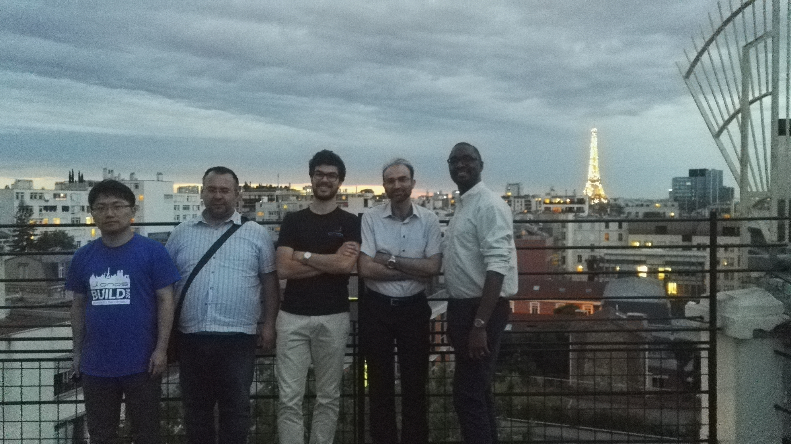
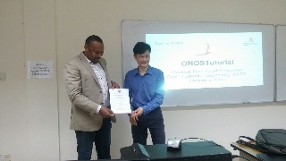
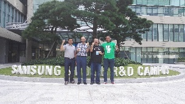
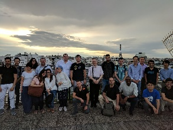
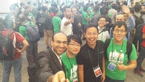
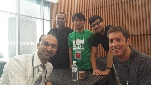
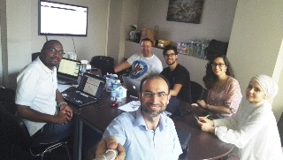

# Teaching brigade

**Brigade Leads:**

* Abdulhalim DANDOUSH / ESME-Sudria, France <dandoush@esme.fr>

**Brigade Members:**

* Andrea Campanella / ONF engineer, USA <andrea@opennetworking.org>
* Lefteris Manassakis / FORTH-ICS University of Crete, Greece <leftman@[ics.forth.gr](http://ics.forth.gr)>
* Alexis MUNYANDEKWE / Altran, France <ndekwe@[gmail.com](http://gmail.com)>
* Viswanath  KSP / Verizon, India <kspviswa.github@[gmail.com](http://gmail.com)>
* Sachidananda Sahu / Radisys, India <[sachi059@gmail.com>](mailto:sachi059@gmail.com)
* David Mahler / Blue Box & IBM Company <[David.Mahler@gmail.com](https://www.linkedin.com/in/davidmahler)>
* Shakil Muhammad / MnLab, KAIST, Korea <[shakilphd@kaist.ac.kr](mailto:shakilphd@kaist.ac.kr)>
* Elisa Rojas / University of Alcala, Spain <elisa.rojas.sanchez@gmail.com>
* Alaelddin Fuad Mohammed / Post-Doc at KAIST, Korea <alaelddin@kaist.ac.kr>
* Amal Kammoun / PhD student at UNIV Paris13, SUPCOM Tunis <amal.kammoun.2@gmail.com>

**Brigade goal:**

Providing and re-organizing open source *modular* teaching/training materials in SDN/NFV domains in different levels. In addition to the organization of training events and helping at the long-term for providing certification services.

**Contact the brigade:** 

* Next brigade call:  
  + March 20 2018, 19h CET (Paris Time)
  + Dial-in info and agenda can be found here:  
    <https://docs.google.com/document/d/1EtH3S1ImDp9u9Xes-eSM2QbLk8YZlcyentpJZYvUYLM/edit?usp=sharing>
* Mailing list: <https://groups.google.com/a/onosproject.org/forum/#!forum/brigade-teaching>
* Slack channel: <https://onosproject.slack.com/messages/brigade-teaching/>

**First brigade notes:**

* <https://goo.gl/fSAufM>

**The big image document :**

* <https://goo.gl/yPcX2Y>

**1st level Teaching brigade modular index**

* <https://goo.gl/kPJhQi>

JIRA Issues/Tickets of the brigade:

[ONOS-6567](https://jira.onosproject.org/browse/ONOS-6567)
-
Getting issue details...
STATUS

**Scope:**

* Short-term focus in 2017:

  + Describing the whole big image of virtualization/SDN/NFV/ONOS/CORD (→ Done).
  + Designing of three training levels (beginner, Net engineer and user, developer). This should be designed in a modular way such that any student of any IT or CS field can follow appropriate modules  (→ Done).

    - Start by the organization and the creation of the modules of the beginners level in addition to the complementary modules (create contents or find the good references). See the shared document for more details  (→ in progress, most of the materials are created).
* Long-term focus:

  + Proposed a demo server with test bed and demo accounts, could be a tie in to the teaching/hands on material (see with ONF members).
  + Go in depth for the intermediate and advanced levels (in 2018)
  + The ultimate *long*-*term*goal is to help providing certification services mainly for ONOS/CORD.

**Events done by the brigade:**

* Three learning sessions about ONOS at the University of Brunei Darussalam (UBD ), November 20-22, 2017 done by Alaelddin.
* Three training events during ONOS Build 2017, September 20-22 in Seoul, Korea, R&D Campus of Samsung Electronics done by Abdulhalim, Lefteris and Andrea.  
  + Teaching brigade show case:<https://goo.gl/6kEaiS>
* Brigade workshop: May 27-28, 2017 at Paris,  [ESME SUDRIA – MONTPARNASSE, 40 rue du Docteur Roux , Paris.](http://www.esme.fr/ecole-ingenieur/campus-etudiants)
  + [Description of modules 1.4 and 1.5 : https://docs.google.com/document/d/1eYTf9XnLB0\_ZvwEAi8fiqhra86HuSYB8hHxTiPAxeUs/edit](https://docs.google.com/document/d/1eYTf9XnLB0_ZvwEAi8fiqhra86HuSYB8hHxTiPAxeUs/edit)
* 2ed Paris ONOS Meetup, May 29th, 2017, 18h45 to 22h00, [ESME SUDRIA – MONTPARNASSE, 40 rue du Docteur Roux , Paris](http://www.esme.fr/ecole-ingenieur/campus-etudiants)
* Paris ONOS Technical Tutorial: Developing a distributed application, May 29 2017, 15h00 to 18h00, [ESME SUDRIA – MONTPARNASSE, 40 rue du Docteur Roux , Paris](http://www.esme.fr/ecole-ingenieur/campus-etudiants)  
  

**How to get involved:**

Are you a professor, an engineer, an instructor or a student ? Have you already prepared tutorials, exercises, exams, MCQ, VMs, or courses about Networking, security, programming skills, DevOps, and SDN/NFV/ONOS solutions? If yes, you are welcome to join us for sharing your experience and integrating your work with our brigade. To get involved is easy, just write us to Abdulhalim Dandoush or David Boswell or simply join the mailing list group and take part of our activities

