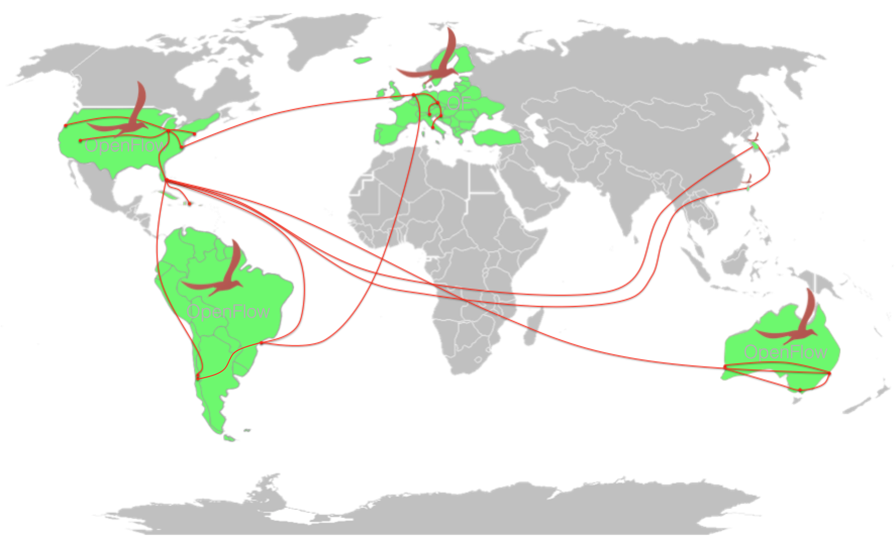

# Deployments

ONOS Project is currently helping the community to **deploy ONOS and its applications**. Deployment efforts demonstrate that **ONOS can work in real networks** guaranteeing HA, performances and scalability.

A mean for deploying ONOS is usually **reduce network complexity, costs** and at the same time start to **innovate** at low costs the own infrastructure.

Thanks to deployments, the ONOS Community can validate the Platform and translate the feedback of the Operation Departments into requirements for the next releases of ONOS.

The first Deployers of ONOS have been Research and Educational Networks (RENs) from around the world. With an ongoing project called "**Global SDN Deployment Powered by ONOS**", tens of RENs and Research Organizations provide L2 and L3 connectivity to their users without using any legacy device in the network core.

More recently Huawei has done the **first commercial ONOS deployment in the network of China Unicom**.

The Deployment section provides:

* Links to [Resources](deployments/additional-resources.md), such as Deployment related presentations and videos
* An overview of the [Global SDN Deployment Powered by ONOS](deployments/global-sdn-deployment-powered-by-onos.md)
* Overview of the [First Commercial Deployment Powered by ONOS](deployments/china-unicom-deployment.md), operated by Huawei and China Unicom
* Guidelines on how the ONOS platform and its apps get deployed
  + [Guidelines to deploy SDN-IP](../tutorials/sdn-ip-deployment-guidelines.md)

