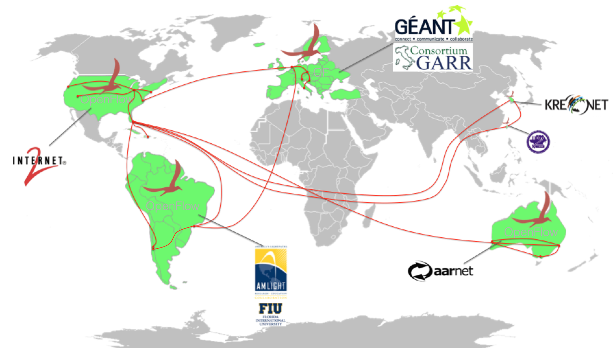
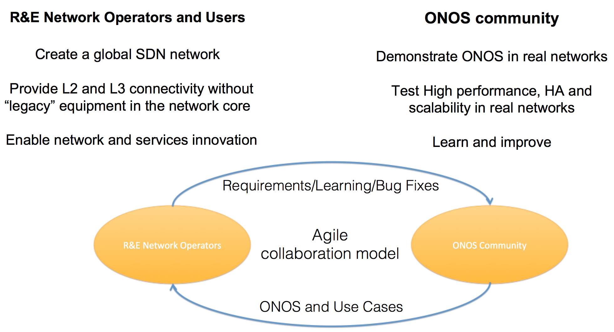
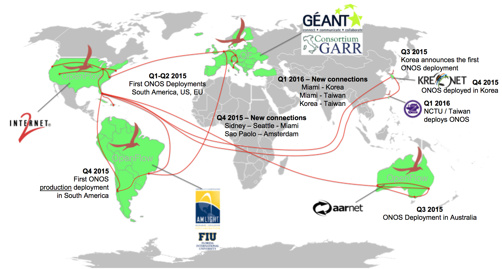

# Global SDN Deployment Powered by ONOS

# Overview

Recently, ON.Lab has successfully deployed ONOS and some of its applications on both production and experimental networks, managed by Research and Educational Networks (RENs), thus creating a global network facility, entirely based on OpenFlow.

The network deployed is able to provide Layer2 and Layer3 connectivity to the end users with no need of any legacy device in the network cores. The actual facility interconnects Australia, Brazil, Chile Europe, Korea, Taiwan and United States, linking together Universities, Research Centers and RENs. More than 60 switches from different vendors are controlled by ONOS clusters geographically distributed and administratively isolated.

The following section provides an overview of the Global SDN Deployment covering the goals and motivations, the main design principles, the applications deployed, few examples and how to join.

# Goals and Motivations

By definition, RENs are the perfect environment where to deploy SDN. Historically, RENs are the ones providing high-quality production network services to Academia and Research Centers around the globe, while maintaining a standing leadership in network innovation. While innovating on the computing has been facilitated by the introduction of open hardware interfaces and Open Source software, network research has always been an hard - if not impossible job. SDN (and ONOS) gives the ability to Academia and Universities to run Carrier Grade networks, while enabling innovation.

The goal of the deployment is to provide L2 and L3 connectivity to end users, without using any legacy device, while enabling innovation. Deploying ONOS in RENs give the ability to the Academia and the R&D Departments to develop new network applications, that can then be validated in real network on hardware, thus being able to get used in production.

Deploying ONOS in production networks is important because it demonstrates the ONOS ability to work at scale on real infrastructures while providing High Performances and HA.

Moreover, the feedback from the Teams running the production networks is continuously translated into new requirements for the next releases of ONOS. Once the new features get implemented, ONOS gets deployed again. This is what we usually call Agile Deployment Model.

# Participants

Following is reported a timeline of the Global SDN Deployment, since January 2016, when the initiative started. Some of the organizations mentioned below run an OpenFlow network (in bold) and provide a service to others through it, while others are daily users of the OpenFlow network.

The deployment currently connects:

* Australia - **AARNet** ([https://aarnet.edu.au/](https://www.aarnet.edu.au/))
* Brazil - ANSP and RNP through **AmLight** (<http://amlight.net/>)
* Caribbean - CKLN through AmLight (<http://amlight.net/>)
* Chile -  Reuna through AmLight (<http://amlight.net/>)
* Europe through **GEANT** PAN European Network GTS testbed facility [http://geant.net](http://www.geant.net))
  + Italy - CREATE-NET Università Roma Tor Vergata through **Consortium GARR** and GEANT ([http://geant.net](http://www.geant.net))
* Korea - **KREONET** (<http://www.gloriad.org/gloriaddrupal/?q=node/114>)
* Taiwan - National Chiao Tung University - **NCTU** (<http://nctu.edu.tw>)
* United States  - Clemson University, Duke University, Florida International University, Georgia Tech, Indiana GigaPoP, University of Huston, University of Maryland, University of Oklahoma at Norman, University of Utah - through **Internet2** (<http://internet2.edu)>

# Design principles

Each REN acts as a separate Autonomous System, administratively isolated from others. This gives to Operators the possibility to be enough independent, experimenting within their domain specific features while enforcing their own settings and polices.

Different domains are then connected through dedicated Layer 2 connections, over which routes are exchanged using BGP.

## Layer 0 - Layer 2

The networks are composed by different (usually OpenFlow) devices, connected to one or more ONOS clusters, made of one or more instances. Operators enforce network polices from the logically centralized ONOS controller and install different applications on top of it, depending on the needs (i.e. provide L2 or L3 connectivity to end-users).

Depending on the infrastructure offered/run by each REN, the SDN devices may be:

* Running as the production network
* The same of the production network, but ONOS is running in a L2 slice given by the OF (or legacy) network hypervisor offered by the REN itself
* Deployed in parallel to the production network as a completely separate Future Internet research infrastructure
* Connected directly with dedicated fibers
* Connected on top of/through an underlying legacy production L2 network

The same usually happens for the L2 connections from the PoP to the end-users.

The RENs are connected through dedicated Layer 2 circuits, terminated on each end at the OpenFlow switches. As it happens for the intra-domain communication, also (and specially) inter-domain communication can vary depending on the infrastructure in between the two RENs. Sometime, OpenFlow switches of different domains get connected using dedicated fibers or through a Layer2 circuit carried over a third partner network using a VLAN or as an Ethernet over MPLS frame.

Currently, the optical layer is totally transparent to the deployment. Anyway, different RENs are investigating with ON.Lab how to coherently control both the packet and the optical layers from ONOS.

## Layer 3

One of the basic services generally offered to end users is Layer 3 connectivity. This is possible through

* A manual configuration: Operators can manually create "ONOS intents" from the CLI / GUI, connecting one or more edge ports of the network together
* ONOS Applications that automatically translate information gained from standard network protocols into intent/flow requests

L3 connectivity is not only used to connect internal users, but also to create inter-domain connectivity. Indeed, RENs establish Layer 3 connectivity on top of the dedicated Layer 2 circuits connecting them. Once Layer 3 connectivity is established, a BGP peering session is created and networks start to exchange routes, without any need of legacy routers.

For example, applications such as SDN-IP are usually adopted to let an OpenFlow network become an IP transit network. BGP routes advertised from the outside (legacy) ASs get translated into ONOS intent requests, which are then compiled by ONOS itself into flow entries on the devices.

RENs can opt to use either public or private Layer 3 address schemes and AS numbers. Sometime, for pure experimentation private AS numbers and addresses are announced and exchanged over certain segments of the global infrastructure. Through the usage of route maps and filters, RENs make sure the private routes don't get propagated to the public Internet, outside the Global Deployment network. Other times, public AS numbers and addresses are announced and exchanged and these get propagated by/to other ASs, just as any other public address does on the Internet.

# Incrementally migrate to OpenFlow. Layer 3 inter-domain failover mechanisms

ONOS is already highly reliable. Anyway, willing to innovate and at the same time run a production network is still a tough task. When it's time to move from a private addressing scheme to a public addressing scheme, taking the right precautions is a must. Layer 3 connectivity and inter-domain Layer 3 protocols (i.e. BGP) related issues usually worry more Operators, since this implies problems to their accessibility from the public Internet.

On the other hand, many of these networks still run in parallel a legacy Layer3 network and the new OpenFlow network, in order to gradually transition to the new technology. Often in these cases, a small part of the Layer3 addresses is initially moved to the new network and gradually then incremented.

Still having two infrastructures running in parallel may be very useful for putting in place defensing mechanisms, in case something fails in the new network. Indeed, RENs use to advertise the same network prefix from two different next-hops or using two different VRFs. The prefix advertised by OpenFlow gets higher priority than the one advertised by the legacy network. In this way, if anything goes wrong with the OpenFlow network, external domains will always be able to automatically transition through the legacy devices.

# Applications deployed

Innovate is a key rationale behind SDN deployments. For the first time, Operators don't necessarily have to wait for vendors to deploy features in their network, but can instead proactively create and deploy new features, just as happens nowadays with Personal Computers.

Different RENs have developed and deployed different ONOS applications on top of their controllers, because having different needs. This is a list with a brief description of the different applications developed and deployed today by the RENs

| App name | Description | Committed in | Developed by | Deployed by | Link to documentation |
| --- | --- | --- | --- | --- | --- |
| Castor | The application allows to manage Internet eXchange Points (IXP) as Software Defined Exchange Points (SDXs). It provides L2 and L3 connectivity. | Still needs to be committed in the ONOS repo. | AArnet | AArnet | Currently not available. |
| Inter Cluster ONOS Network Application (ICONA) | Allows multiple ONOS clusters geographically distributed to communicate together in a peer-to-peer fashion. | Still needs to be committed in the ONOS repo. | CREATE-NET | GEANT | <https://www.create-net.org/publications/icona-inter-cluster-onos-network-application> |
| SDN-IP | It transforms an OpenFlow network into an IP transit network. The OpenFlow network behave as a legacy stand alone Autonomous System talking BGP to the outside world, without anyway any need of using legacy routers.  The solution also helps to migrate an existing legacy network to SDN. | ONOS Main Repository  `https://gerrit.onosproject.org/onos` | ON.Lab | AmLight  Internet2  Kreonet  NCTU | [SDN-IP](../../apps-and-use-cases/sdn-ip.md) on ONOS Wiki |
| SDX-L2/L3 | The application allows to manage Internet eXchange Points (IXP) as Software Defined Exchange Points (SDXs). It provides L2 and L3 connectivity. | ONOS app-samples repository  `https://gerrit.onosproject.org/onos-app-samples` | CNIT  CREATE-NET  GEANT  Università Roma Tor Vergata | GEANT | [GÉANT SDX](../../new-projects/gant-sdx.md) on ONOS Wiki |
| Virtual Private LAN Service (VPLS) | It creates Virtual Private Broadcast L2 networks based on VLANs, on demand. | ONOS Main Repository  `https://gerrit.onosproject.org/onos` | ON.Lab | AmLight  NCTU | [VPLS](../../apps-and-use-cases/virtual-private-lan-service-vpls/vpls-user-guide.md) on ONOS Wiki |
