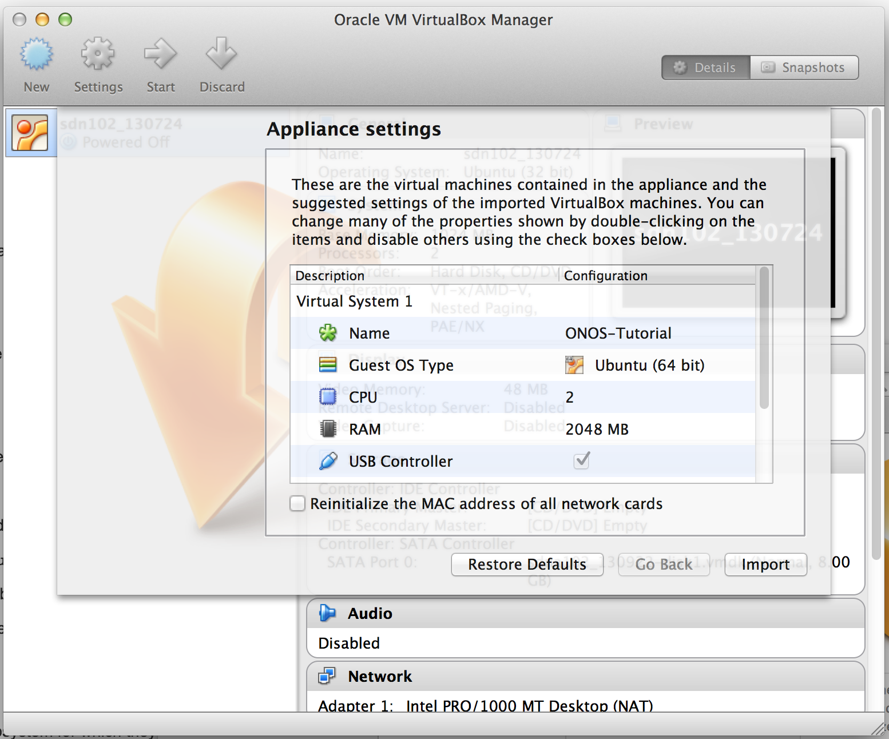

# Intel® Developer Zone NFV/DPDK Devlab - 2016

# What is Intel® Developer Zone NFV/DPDK Devlab?

This two day deep-dive session has experts, from Intel and other companies, talk about the various hardware and software technologies Intel has been working on to make the life of an NFV developer easier. ONOS will be one of the open source projects on the agenda. On Day 2, a 2.5 hour ONOS hands-on training session will be lead by Murat from Argela and Jin Gan from Huawei.

At the end of Day 2, participants will form teams and propose an open source project to work on. Participants will be getting hardware access for 15 days after the workshop to work on their project, and participants will need to submit their project before December 23. Organizers will declare the winners by January 12, and the winning teams will get a chance to speak on a subsequent event.

 

-Prizes-

Grand Prize of $2,000 cash

1st, 2nd and 3rd runner up will also get DPDK in a box dev kit.

# When is the event?

**December 8 - 9, 2016**

## Event Register & Details

Detail: <http://www.meetup.com/Out-Of-The-Box-Network-Developers/events/235276576/>

## Schedule

Tentative Schedule: <https://drive.google.com/file/d/0B49nw1tgv7FCSmN6RHp4UHNJN1E/view>

## When is ONOS hands-on training session?

**December 9 (Day 2), 1:00 PM - 3:30 PM**

# ONOS' Pre-Session VM Preparation and Guide

# 

# 1. Set up your environment

## Install required software

You will need to acquire two files: a [VirtualBox](https://www.virtualbox.org/) installer and the [VM](http://www.parlakisik.com/onos_tutorial/OnosVm.ova)

After you have downloaded VirtualBox, install it, then go to the next section to verify that the VM is working on your system.

## Create Virtual Machine

Double-click on the downloaded tutorial zipfile. This will give you an OVF file. Open the OVF file, this will open virtual box with an import dialog.

Click on import. When the import is finished start the VM and log in using:

**USERNAME: onos1**

**PASSWORD: onos1**

**Example : OnePing (Source code)**

/\*  
 \* Copyright 2015 Open Networking Laboratory  
 \*  
 \* Licensed under the Apache License, Version 2.0 (the "License");  
 \* you may not use this file except in compliance with the License.  
 \* You may obtain a copy of the License at  
 \*  
 \* <http://www.apache.org/licenses/LICENSE-2.0>  
 \*  
 \* Unless required by applicable law or agreed to in writing, software  
 \* distributed under the License is distributed on an "AS IS" BASIS,  
 \* WITHOUT WARRANTIES OR CONDITIONS OF ANY KIND, either express or implied.  
 \* See the License for the specific language governing permissions and  
 \* limitations under the License.  
 \*/  
package org.onos.oneping;

import com.google.common.collect.HashMultimap;  
import org.apache.felix.scr.annotations.Activate;  
import org.apache.felix.scr.annotations.Component;  
import org.apache.felix.scr.annotations.Deactivate;  
import org.apache.felix.scr.annotations.Reference;  
import org.apache.felix.scr.annotations.ReferenceCardinality;  
import org.onlab.packet.Ethernet;  
import org.onlab.packet.IPv4;  
import org.onlab.packet.MacAddress;  
import org.onosproject.core.ApplicationId;  
import org.onosproject.core.CoreService;  
import [org.onosproject.net](http://org.onosproject.net).DeviceId;  
import [org.onosproject.net](http://org.onosproject.net).flow.DefaultTrafficSelector;  
import [org.onosproject.net](http://org.onosproject.net).flow.DefaultTrafficTreatment;  
import [org.onosproject.net](http://org.onosproject.net).flow.FlowRule;  
import [org.onosproject.net](http://org.onosproject.net).flow.FlowRuleEvent;  
import [org.onosproject.net](http://org.onosproject.net).flow.FlowRuleListener;  
import [org.onosproject.net](http://org.onosproject.net).flow.FlowRuleService;  
import [org.onosproject.net](http://org.onosproject.net).flow.TrafficSelector;  
import [org.onosproject.net](http://org.onosproject.net).flow.TrafficTreatment;  
import [org.onosproject.net](http://org.onosproject.net).flow.criteria.Criterion;  
import [org.onosproject.net](http://org.onosproject.net).flow.criteria.EthCriterion;  
import [org.onosproject.net](http://org.onosproject.net).flowobjective.DefaultForwardingObjective;  
import [org.onosproject.net](http://org.onosproject.net).flowobjective.FlowObjectiveService;  
import [org.onosproject.net](http://org.onosproject.net).flowobjective.ForwardingObjective;  
import [org.onosproject.net](http://org.onosproject.net).packet.PacketContext;  
import [org.onosproject.net](http://org.onosproject.net).packet.PacketPriority;  
import [org.onosproject.net](http://org.onosproject.net).packet.PacketProcessor;  
import [org.onosproject.net](http://org.onosproject.net).packet.PacketService;  
import org.slf4j.Logger;  
import org.slf4j.LoggerFactory;

import java.util.Objects;  
import java.util.Optional;  
import java.util.Timer;  
import java.util.TimerTask;

import static [org.onosproject.net](http://org.onosproject.net).flow.FlowRuleEvent.Type.RULE\_REMOVED;  
import static [org.onosproject.net](http://org.onosproject.net).flow.criteria.Criterion.Type.ETH\_SRC;

/\*\*  
 \* Sample application that permits only one ICMP ping per minute for a unique  
 \* src/dst MAC pair per switch.  
 \*/  
@Component(immediate = true)  
public class OnePing {

private static Logger log = LoggerFactory.getLogger(OnePing.class);

private static final String MSG\_PINGED\_ONCE =  
 "Thank you, Vasili. One ping from {} to {} received by {}";  
 private static final String MSG\_PINGED\_TWICE =  
 "What are you doing, Vasili?! I said one ping only!!! " +  
 "Ping from {} to {} has already been received by {};" +  
 " 60 second ban has been issued";  
 private static final String MSG\_PING\_REENABLED =  
 "Careful next time, Vasili! Re-enabled ping from {} to {} on {}";

private static final int PRIORITY = 128;  
 private static final int DROP\_PRIORITY = 129;  
 private static final int TIMEOUT\_SEC = 60; // seconds

@Reference(cardinality = ReferenceCardinality.MANDATORY\_UNARY)  
 protected CoreService coreService;

@Reference(cardinality = ReferenceCardinality.MANDATORY\_UNARY)  
 protected FlowObjectiveService flowObjectiveService;

@Reference(cardinality = ReferenceCardinality.MANDATORY\_UNARY)  
 protected FlowRuleService flowRuleService;

@Reference(cardinality = ReferenceCardinality.MANDATORY\_UNARY)  
 protected PacketService packetService;

private ApplicationId appId;  
 private final PacketProcessor packetProcessor = new PingPacketProcessor();  
 private final FlowRuleListener flowListener = new InternalFlowListener();

// Selector for ICMP traffic that is to be intercepted  
 private final TrafficSelector intercept = DefaultTrafficSelector.builder()  
 .matchEthType(Ethernet.TYPE\_IPV4).matchIPProtocol(IPv4.PROTOCOL\_ICMP)  
 .build();

// Means to track detected pings from each device on a temporary basis  
 private final HashMultimap<DeviceId, PingRecord> pings = HashMultimap.create();  
 private final Timer timer = new Timer("oneping-sweeper");

@Activate  
 public void activate() {  
 appId = coreService.registerApplication("org.onosproject.oneping",  
 () -> [log.info](http://log.info)("Periscope down."));  
 packetService.addProcessor(packetProcessor, PRIORITY);  
 flowRuleService.addListener(flowListener);  
 packetService.requestPackets(intercept, PacketPriority.CONTROL, appId,  
 Optional.empty());  
 [log.info](http://log.info)("Started");  
 }

@Deactivate  
 public void deactivate() {  
 packetService.removeProcessor(packetProcessor);  
 flowRuleService.removeFlowRulesById(appId);  
 flowRuleService.removeListener(flowListener);  
 [log.info](http://log.info)("Stopped");  
 }

// Processes the specified ICMP ping packet.  
 private void processPing(PacketContext context, Ethernet eth) {  
 DeviceId deviceId = context.inPacket().receivedFrom().deviceId();  
 MacAddress src = eth.getSourceMAC();  
 MacAddress dst = eth.getDestinationMAC();  
 PingRecord ping = new PingRecord(src, dst);  
 boolean pinged = pings.get(deviceId).contains(ping);

if (pinged) {  
 // Two pings detected; ban further pings and block packet-out  
 log.warn(MSG\_PINGED\_TWICE, src, dst, deviceId);  
 banPings(deviceId, src, dst);  
 context.block();  
 } else {  
 // One ping detected; track it for the next minute  
 [log.info](http://log.info)(MSG\_PINGED\_ONCE, src, dst, deviceId);  
 pings.put(deviceId, ping);  
 timer.schedule(new PingPruner(deviceId, ping), TIMEOUT\_SEC \* 1000);  
 }  
 }

// Installs a temporary drop rule for the ICMP pings between given srd/dst.  
 private void banPings(DeviceId deviceId, MacAddress src, MacAddress dst) {  
 TrafficSelector selector = DefaultTrafficSelector.builder()  
 .matchEthSrc(src).matchEthDst(dst).build();  
 TrafficTreatment drop = DefaultTrafficTreatment.builder()  
 .drop().build();

flowObjectiveService.forward(deviceId, DefaultForwardingObjective.builder()  
 .fromApp(appId)  
 .withSelector(selector)  
 .withTreatment(drop)  
 .withFlag(ForwardingObjective.Flag.VERSATILE)  
 .withPriority(DROP\_PRIORITY)  
 .makeTemporary(TIMEOUT\_SEC)  
 .add());  
 }

// Indicates whether the specified packet corresponds to ICMP ping.  
 private boolean isIcmpPing(Ethernet eth) {  
 return eth.getEtherType() == Ethernet.TYPE\_IPV4 &&  
 ((IPv4) eth.getPayload()).getProtocol() == IPv4.PROTOCOL\_ICMP;  
 }

// Intercepts packets  
 private class PingPacketProcessor implements PacketProcessor {  
 @Override  
 public void process(PacketContext context) {  
 Ethernet eth = context.inPacket().parsed();  
 if (isIcmpPing(eth)) {  
 processPing(context, eth);  
 }  
 }  
 }

// Record of a ping between two end-station MAC addresses  
 private class PingRecord {  
 private final MacAddress src;  
 private final MacAddress dst;

PingRecord(MacAddress src, MacAddress dst) {  
 this.src = src;  
 this.dst = dst;  
 }

@Override  
 public int hashCode() {  
 return Objects.hash(src, dst);  
 }

@Override  
 public boolean equals(Object obj) {  
 if (this == obj) {  
 return true;  
 }  
 if (obj == null || getClass() != obj.getClass()) {  
 return false;  
 }  
 final PingRecord other = (PingRecord) obj;  
 return Objects.equals(this.src, other.src) && Objects.equals(this.dst, other.dst);  
 }  
 }

// Prunes the given ping record from the specified device.  
 private class PingPruner extends TimerTask {  
 private final DeviceId deviceId;  
 private final PingRecord ping;

public PingPruner(DeviceId deviceId, PingRecord ping) {  
 this.deviceId = deviceId;  
 this.ping = ping;  
 }

@Override  
 public void run() {  
 pings.remove(deviceId, ping);  
 }  
 }

// Listens for our removed flows.  
 private class InternalFlowListener implements FlowRuleListener {  
 @Override  
 public void event(FlowRuleEvent event) {  
 FlowRule flowRule = event.subject();  
 if (event.type() == RULE\_REMOVED && flowRule.appId() == [appId.id](http://appId.id)()) {  
 Criterion criterion = flowRule.selector().getCriterion(ETH\_SRC);  
 MacAddress src = ((EthCriterion) criterion).mac();  
 MacAddress dst = ((EthCriterion) criterion).mac();  
 log.warn(MSG\_PING\_REENABLED, src, dst, flowRule.deviceId());  
 }  
 }  
 }  
}
