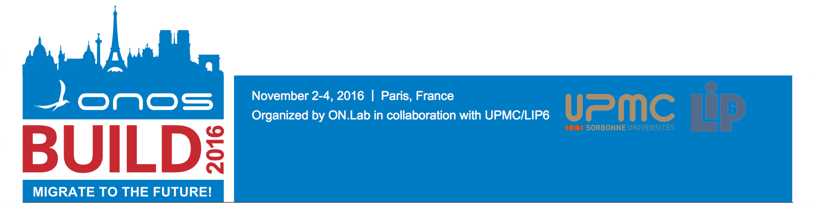

# ONOS Build 2016

 

---

## What is ONOS Build 2016?

ONOS Build 2016 is our first large scale developer conference bringing ONOS developers and contributors from all over the world to share, learn, align, plan and hack together. The event will span three days and bring together 200 core developers, Community.

## Who is organising the event?

The Open Networking Lab (ON.Lab) is the organizer of the event, in close collaboration with the [UPMC / LIP6](https://www.lip6.fr/). Members of the organization committee include:

David Boswell, ON.Lab, US  
William Quiviger, ON.Lab, France.   
Stefano Secci, LIP6, UPMC, France.  
Prosper Chemouil, Orange, France

## Why?

The ONOS community is growing in different geographies around the world and we think that there are many users and contributors that we don’t even know about. There is serious interest and enthusiasm for ONOS in the community and we need to come together to get things done and to figure out the best way for this growing community to work more effectively together.

## When and where?

This event will take place in **Paris, France** on **November 2 - 4, 2016**.  The initial Build event is being held in Europe to help us grow the community there — this will be a catalyst for bringing several new organizations into the community.  Future events will be held in other areas of the world, such as a Build event in Asia in 2017.

### Venue and Rooms

Detailed information on the venue location and session rooms can be found **[here](onos-build-2016/logistics.md)**.

## Schedule

The schedule of the event is currently under construction and you can find it here **<https://onosbuild2016.sched.org>**.

Building the schedule is a collaborative effort so please don't hesitate to contact the event organiser if you're interested in giving a talk or running a session.

If you would like to showcase your work during the Community Showcase (see "Tracks" section), please fill out this simple form to propose a talk: ~~http://onosproject.org/proposal/~~ ---> **CLOSED, submitters will receive email soon.**

## Format

The event will span three days and will offer a mix of presentations, interactive sessions, breakout sessions and various social activities. Our aim is to find a format that allows us to share and work effectively together while ensuring that it is an active, dynamic and powerful event  for everyone to participate in. 

## Content

The aim of ONOS Build is help the ONOS core community align their efforts, get up to speed with the latest updates from others and share theirs. We're going to talk about the state of the ONOS project and set the stage for the upcoming year. The event will also be an opportunity to socialize, to hack with fellow developers from other parts of the world and and to dream up the future of ONOS together.

### Tracks

At this event we're going to focus on three interdisciplinary tracks:

* **[ONOS Hackathon](onos-build-2016/onos-hackathon.md) :**Sessions will focus on hacking on and building features and applications on top of ONOS
  + Audience: Experienced ONOS developers

* **[ONOS Basics](onos-build-2016/onos-basics.md):**Sessions for this track will focus on skills building and best practices in terms of building on top of ONOS
  + Audience: Developers looking to learn more about ONOS

* **[ONOS Community Showcase](onos-build-2016/onos-community-showcase.md):**Sessions in this track will focus on showcasing the amazing work of ONOS Partners, Collaborators and individual contributors from all over the world
  + Audience: People keen  to learn more about what's happening in the ONOS community
* If you would like to present your work during the Community Showcase, please fill out this simple form:~~http://onosproject.org/proposal/~~**---> **CLOSED, submitters will receive email soon.****

### SDN Science Fair

Do you need help with an awesome SDN project you're working on? Do you have a phenomenal demo you want to show off ? Are you working on an experiment or idea that needs feedback or testers? At ONOS Build, you'll have your chance to show off what you're working on and get feedback from SDN experts from all over the world during our lunch-time **SDN Science Fair**.

Exhibitors at the fair will be able to set up their laptops and demos at small booths while everyone else can wander around the space, stopping to chat, watch demos, ask questions, and generally just dive in, talk about stuff, and vote on their favorites.

* If you would like to present demos/posters during the SDN Science Fair, please fill out this simple form: ~~http://onosproject.org/proposal/~~ **---> CLOSED, submitters will receive email soon.**

Participants

More than 200 developers from research labs, academia, vendors and service providers from 40+ countries will be participating in ONOS Build 2016. A full list of participants can be found here: <https://onosbuild2016.sched.org/directory/attendees>

## Sponsors

Support of our sponsors is instrumental in enhancing the quality of the event and will also help cover the costs for travel and accommodation of some of our talented student participants who otherwise may not be able to participate in the conference. [See our list of sponsors](onos-build-2016/sponsors.md).

## Logistics

For logistical information including maps, transport and hotel recommendations, please go to the [Logistics](onos-build-2016/logistics.md) page.

## Contact

For general questions, please contact the ON.Lab event planning team: [onos-build@onlab.us](mailto:onos-build@onlab.us)
