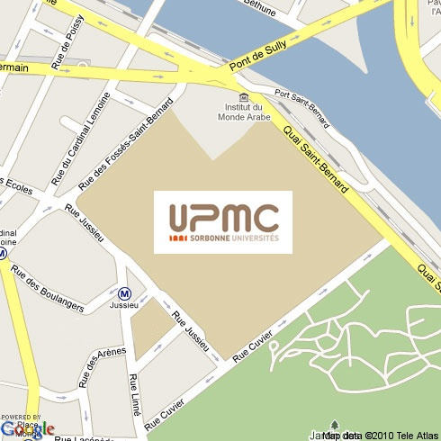
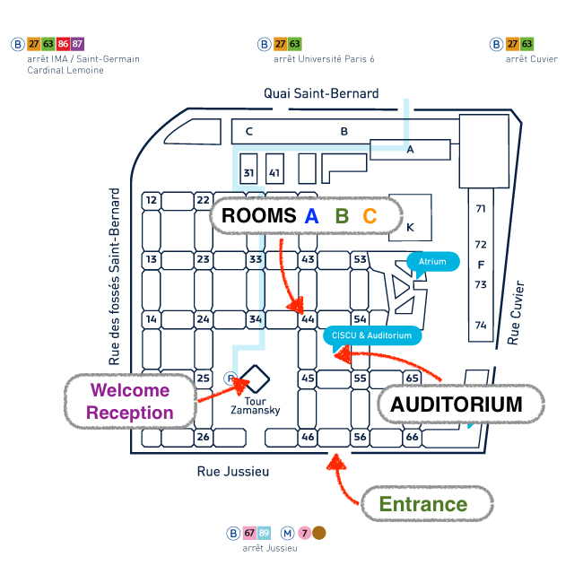

# Logistics

## **VENUE**

ONOS Build will take place in the very heart of Paris, on the Jussieu campus of the UPMC (Université Pierre et Marie Curie).

* **Address :** 4 place Jussieu 75252 Paris cedex 05  
  Tél. 01 44 27 44 27 (google map: <https://goo.gl/maps/2E14yrW5XJz>)
* **Access :**  
  - Métro, lines 7 et 10 (Jussieu station)   
  - Bus 89 (Jussieu station)

    
  

### **ROOMS**

* The **Welcome Cocktail/Dinner** (Nov 2nd) will be on the top floor (24) of the Tour Zamansky
* Main sessions will be in the **AUDITORIUM**
* ONOS Community Showcase will be in ****Room A**** (44-54 - 105 1st floor)
* ONOS Basics will be in **Room B**(44-54 - 107 1st floor)
* ONOS Hackathon will be in **Room C**(44-54 - 109 1st floor)

## **TRANSPORTATION**

### From Paris airports to the venue (~ 50 min.)

From *Charles de Gaulle* (north airport) to the university:

* suburban train RER B until Saint Michel - Notre Dame station
* Metro line 10 until Jussieu station

From *Orly* (south airport) to the university:

* OrlyVal until suburb train (Antony station)
* suburban train RER B until Saint Michel - Notre Dame station
* Metro line 10 until Jussieu station

### From inside Paris ***(see also [RATP website (Paris underground)](http://www.ratp.fr/fr/ratp/c_21879/touristes/?langue=en))***

|  |  |  |  |  |
| --- | --- | --- | --- | --- |
|  |  |  |  | stop at « Jussieu » |
|  |  |  |  | stop at « Cuvier » |
|  |  |  |  | stop at « Jussieu » |
|  |  |  |  | stop at « Institut du Monde Arabe » |

## **ACCOMMODATION**

* 4 stars hotels:

+ [Hotel Royal Saint-Michel](http://www.paris-royalstmichel-hotel.com/) (15 min [walking](http://maps.google.fr/maps?saddr=3,++blvd+Saint+Michel+-+75005+Paris+FRANCE&daddr=4+place+jussieu&hl=fr&ll=48.849242,2.348993&spn=0.009319,0.021887&sll=48.849605,2.34953&sspn=0.009319,0.021887&geocode=FShv6QIdkMMjACnx9Wom3nHmRzHAOMICx4ILEw;FUtW6QIdn-4jACn_JShT5XHmRzGFtp0wIpd1JQ&t=h&dirflg=w&mra=ltm&z=16), 9 min [bus 47](http://www.ratp.fr/itineraires/en/ratp/resultat-detaille/start/3,+bd+Saint-Michel,+75,+Paris/end/4,+Place+Jussieu,+75005,+Paris/is_date_start/1/date/2012-07-25/time/12%3A00%3A00/route_type/plus_rapide))
+ [Villa Mazarin](http://www.villamazarin.com/#/chambre-paris-anglais/3090038) (22 min [walking](http://maps.google.fr/maps?saddr=6+Rue+des+Archives,+Paris&daddr=4+place+jussieu&hl=fr&sll=48.851614,2.355237&sspn=0.018638,0.043774&geocode=FYeB6QIdD-wjACnTn0VrHW7mRzERRhxMw4ILEw;FUtW6QIdn-4jACn_JShT5XHmRzGFtp0wIpd1JQ&oq=6+rue+des+archi&t=h&dirflg=w&mra=ltm&z=15), 10 min [bus 67](http://www.ratp.fr/itineraires/en/ratp/resultat-detaille/start/6,+Rue+des+Archives,+75,+Paris/end/4,+Place+Jussieu,+75005,+Paris/is_date_start/1/date/2012-07-25/time/12%3A00%3A00/route_type/plus_rapide))
+ [Hotel Le Marceau Bastille](http://www.hotelmarceaubastille.com/en/) (20 min [walking](http://maps.google.fr/maps?saddr=13,+rue+Jules+C%C3%A9sar+75012+Paris&daddr=4+place+jussieu&hl=fr&ie=UTF8&ll=48.846545,2.362297&spn=0.00932,0.021887&sll=48.849242,2.348993&sspn=0.009319,0.021887&geocode=FR5g6QId_ygkAClBaWeyA3LmRzEg2BZJw4ILEw;FUtW6QIdn-4jACn_JShT5XHmRzGFtp0wIpd1JQ&t=h&dirflg=w&mra=ls&z=16), 13 min [bus 87](http://www.ratp.fr/itineraires/en/ratp/resultat-detaille/start/13,+rue+Jules+C%C3%83%C2%A9sar+75012+Paris/end/4,+Place+Jussieu,+75005,+Paris/is_date_start/1/date/2012-07-25/time/12%3A00%3A00/route_type/plus_rapide))
+ [Hotel Best Western Le Jardin de Cluny](http://www.hoteljardindecluny.com/en/home.html) (10 min [walking](http://maps.google.fr/maps?saddr=9+rue+de+sommerard&daddr=Pl.+Jussieu&hl=fr&sll=48.84779,2.35083&sspn=0.00466,0.010943&geocode=FdNj6QIdbM8jACmvWHbg5nHmRzG-frz9Ogse7Q;FYFW6QIdS-4jAA&t=h&dirflg=w&mra=dme&mrsp=1&sz=17&z=17), 7 min [bus 47](http://www.ratp.fr/itineraires/en/ratp/resultat-detaille/start/9,+Rue+du+Sommerard,+75005,+Paris/end/4,+Place+Jussieu,+75005,+Paris/is_date_start/1/date/2012-07-25/time/12%3A00%3A00/route_type/minimum_de_marche))

* 3 stars hotels:

+ [Hotel Saint-Christophe](http://www.saint-christophe-hotel.eu/) (5 min [walking](http://maps.google.fr/maps?saddr=17+Rue+Lac%C3%A9p%C3%A8de,+75005+Paris,+%C3%8Ele-de-France&daddr=4+place+jussieu&hl=fr&ie=UTF8&sll=48.84471,2.35382&sspn=0.00233,0.005472&geocode=FedL6QId-eUjACnV1Rmy73HmRzEGD4gWy8nmBQ;FUtW6QIdn-4jACn_JShT5XHmRzGFtp0wIpd1JQ&t=h&dirflg=w&mra=ltm&z=18))
+ [Hotel les jardins du Luxembourg](http://www.les-jardins-du-luxembourg.com/) (16 min [walking](http://maps.google.fr/maps?saddr=5,+Impasse+Royer+Collard+75005+Paris&daddr=4+place+jussieu&hl=fr&sll=48.84471,2.35382&sspn=0.00233,0.005472&geocode=FStT6QId1rcjACkf7RnYwnHmRzEQdRVJw4ILEw;FUtW6QIdn-4jACn_JShT5XHmRzGFtp0wIpd1JQ&t=h&dirflg=w&mra=ls&z=16), 11 min [bus 89](http://www.ratp.fr/itineraires/en/ratp/resultat-detaille/start/5,+Impasse+Royer+Collard+75005+Paris/end/4,+Place+Jussieu,+75005,+Paris/is_date_start/1/date/2012-07-25/time/12%3A00%3A00/route_type/plus_rapide))
+ [Hotel California Saint Germain](http://www.california-paris-hotel.com/en/) (8 min [walking](http://maps.google.fr/maps?saddr=32+rue+des+ecoles&daddr=Pl.+Jussieu&hl=fr&sll=48.847717,2.350978&sspn=0.00466,0.010943&geocode=FV9g6QId0NAjAClz-jP65nHmRzED-Xz6YJCIeg;FYFW6QIdS-4jAA&t=h&dirflg=w&mra=ls&z=17))
+ [Hotel Claude Bernard Saint-Germain](http://www.hotelclaudebernardparis.com/) (8 min [walking](http://maps.google.fr/maps?saddr=43,+rue+des+Ecoles+75005&daddr=Pl.+Jussieu&hl=fr&ll=48.847752,2.35086&spn=0.00466,0.010943&sll=48.84772,2.35098&sspn=0.00466,0.010943&geocode=FfZf6QIdZs8jAClXQIn-5nHmRzErwazCBb_Syw;FYFW6QIdS-4jAA&t=h&dirflg=w&mra=ls&z=17))

* 2 stars hotels:

+ [Hotel Saint Jacques](http://www.paris-hotel-stjacques.com/en/) (8 min [walking](http://maps.google.fr/maps?saddr=35+de+la+rue+des+Ecoles,+paris&daddr=place+jussieu&hl=fr&sll=48.84761,2.35123&sspn=0.005747,0.013937&geocode=FQNg6QId19EjAClNei_05nHmRzFwNKhMw4ILEw;FeFV6QIdCe8jAClLsNVU5XHmRzE8PonKVfm0KA&t=h&dirflg=w&mra=ltm&z=17))
+ [Hotel Home Latin](http://www.hotelhomelatinparis.com/en/) (10 min [walking](http://maps.google.fr/maps?saddr=15+et+17+rue+Du+Sommerard+75005&daddr=place+jussieu&hl=fr&ll=48.848147,2.35072&spn=0.005747,0.013937&sll=48.84761,2.35123&sspn=0.005747,0.013937&geocode=FSdk6QId0c0jAClxve0h53HmRzEy2jMmCoziYg;FeFV6QIdCe8jAClLsNVU5XHmRzE8PonKVfm0KA&t=h&dirflg=w&mra=ls&z=17), 6 min [bus 47](http://www.ratp.fr/itineraires/en/ratp/resultat-detaille/start/15,+Rue+du+Sommerard,+75005,+Paris/end/4,+Place+Jussieu,+75005,+Paris/is_date_start/1/date/2012-07-25/time/12%3A00%3A00/route_type/minimum_de_marche))
+ [Hotel Royal Cardinal](http://www.parishotelroyalcardinal.com/) (3 min [walking](http://maps.google.fr/maps?saddr=1+rue+des+ecoles&daddr=place+jussieu&hl=fr&sll=48.848147,2.35072&sspn=0.005747,0.013937&geocode=Faha6QId7-QjACkdBs4L5XHmRzH81-kBOFlN5w;FeFV6QIdCe8jAClLsNVU5XHmRzE8PonKVfm0KA&t=h&dirflg=w&mra=ls&z=19))

* AirBNB
  + - Paris offers hundreds of affordable choices near the conference venue

## **FOOD AND DRINKS**

There will be a welcome reception near the conference venue on **November 2nd at 6pm**with free drinks (alcoholic and non-alcoholic) as well as an assortment of snacks.

 Breakfast, lunch and coffee breaks will be offered the two following days, **November 3rd** and **November 4th**.

## **SOCIAL ACTIVITIES**

### **Welcome Reception (Wednesday @ 6pm)**

As the ONOS community converges into Paris, we strongly encourage participants at ONOS Build to meet, engage and get to know each other.  A welcome reception will be hosted from **6pm to 10pm** **on Wednesday November 2nd** on the top floor of the [Zemansky Tower](https://en.wikipedia.org/wiki/Jussieu_Campus), right in the middle of the UPMC Jussieu Campus. Drinks (including Champagne) and food will be served throughout the evening. 

**NB: please have your ONOS Build Eventbrite ticket QR code ready (preferably on your smartphone) as only people with an official ONOS Build ticket will be let inside.**

In our effort to encourage ONOS Build participants to socialise throughout the event, here's a list of recommended resources that will hopefully help you find some fun activities to do in Paris:

* <https://www.cultival.fr/en/> - a long list of tours for small groups regularly organised in Paris
* <http://www.bateaux-mouches.fr/en> - boat tours on the river Seine open day and night (boats leave every 30 minutes!)
* <http://o-chateau.com/> - great wine tasting in the heart of Paris

### Walking Tours

A few suggested walking tours can be found [here](https://drive.google.com/open?id=1p4uml4pn416geSSIwd4ybCaKsKk&usp=sharing).

* Walking Tour 1 takes about 2,5 hours (Latin Quarter + Le Marais)
* Walking Tour 2 takes about 1,5 hours (Montmartre)
* Walking Tour 3 takes about 3 hours. (Eiffel Tower + Champs Elysées)

## **VISA INVITATION LETTERS**

An invitation letter can be provided for those requiring a VISA to enter France. You may request a formal invitation by sending an email to [onos-build@onlab.us](mailto:onos-build@onlab.us). Please make sure to provide your full name (as it appears in your passeport). 

## **LIVE STREAMING**

For all those who would have liked to attend ONOS Build but were not able to, we want to make sure that you don't miss a beat. We will be live streaming all Main session, as well as the ONOS Basics and ONOS Community Showcase tracks on the ONOS Project YouTube channel: <https://www.youtube.com/c/ONOSProject>

## **WiFi**

To connect to WiFi, please ask for an **access code** at the welcome desk in the Auditorium entrance hall. NB: to enter your username and password, connect to the SSID called **eduspot**and then click on "UPMC: Congrès et Invités"

## **CONTACT INFO**

If you need to get in touch with someone from the ONOS Build planning team, please don't hesitate to send an email to [onos-build@onlab.us](mailto:onos-build@onlab.us) . You can also ask your question on the official [ONOS Build Slack Channel](https://onosproject.slack.com/archives/onos-build).

In case of an emergency, here are some useful numbers:

* SAMU (Ambulance): 15.
* Police: 17.
* Fire: 18.
