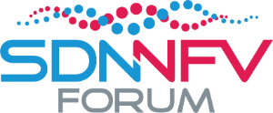

# ONOS-P4 Brigade Work Days 2017

The [ONOS P4 Brigade](../brigades/p4-brigade.md) is glad to announce that it will hold a 2-day event of collaborative work on 18-19 September 2017 in Seoul, South Korea.

This is a great opportunity either if you are already an active member of the brigade, or if you are simply thinking to join. Indeed, as part of the agenda, we will give an extensive tutorial on the P4 support in ONOS. Moreover, [ONOS Build 2017](http://onosbuild.org/) (the annual conference dedicated to ONOS developers) takes place the same week in Seoul, meaning that you can make the most out of your travel by attending to both events!

Organized by [Open Networking Foundation](http://www.opennetworking.org) in collaboration with [Samsung Electronics](http://www.samsung.com/) and [ONOS/CORD Working Group](http://onos.kr) (under [SDN/NFV forum](http://www.sdnnfv.org)).

## When

18-19 September 2017

## Where

Room 126 (A-Tower), Samsung R&D Campus, Seoul, Republic of Korea  
<https://goo.gl/maps/h4DZZ1MkmRu>

## Sponsor

 

We would like to thank our sponsor Samsung Electronics who have kindly offered to host us in their Seoul R&D Campus, and SDN/NFV Forum who have kindly provided logistics to us.

## Logistics

For information regarding hotel, visa letter, etc. please refer to ONOS Build 2017 logistics:  
<http://onosbuild.org/logistics/>

## Registration

Add your name and information to the following Google doc if you plan to attend:  
<https://goo.gl/bCFX41>

## Program:

|  |  |
| --- | --- |
| **Monday 18 September 2017** | |
| 9AM-12.30PM | **Preparation for Brigade showcase at ONOS Build** *(reserved to active brigade members)* |
| 12.30PM-2PM | **Lunch** (on your own) |
| 2PM-6PM | **ONOS-P4 tutorial with hands-on activity** (co-located with Korea ONOS/CORD WG Meetup)  Participants will learn how to develop ONOS applications to control a network of P4-enabled devices.  Detailed tutorial program: |
| 8PM-10PM | **Social event** (details TBD) |
| **Tuesday 19 September 2017** | |
| 10AM-5PM (all day) | **Discussion on next steps and new use cases**  Brigade members will present ideas for new use cases and feature requests. The goal is to engage in an active discussion and to do early planning. This is a great occasion for anyone wanting to join the brigade to learn about future developments and to meet other brigade members.  Detailed program (work in progress):   * ONOS-P4 roadmap recap (Carmelo / ONF) * P4Runtime support: status and next steps (Carmelo / ONF) * fabric.p4: new use case (Jonghwan / ONF) * Programmable switch machine model for multi service networks: research talk (Zhenguo Cui / Korea University.) * P4 universal programmable gateway: research talk (Sol Han / Korea University) * Controller-independent Loss-aware Low Latency State Migration in Network Functions Virtualization: research talk (Gyuyeong Kim / Korea University)   *If you would like to present something please contact Carmelo (**[carmelo@](mailto:carmelo@opennetworking.org)[opennetworking.org](http://opennetworking.org)**)* |

## Contacts

For any questions regarding this event please contact Carmelo Cascone *(**[carmelo@](mailto:carmelo@opennetworking.org)[opennetworking.org](http://opennetworking.org/)**)*
