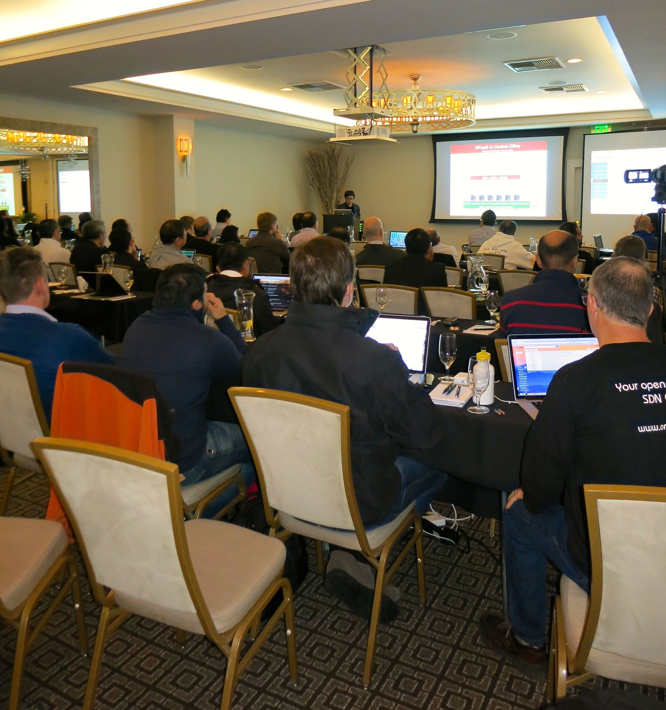
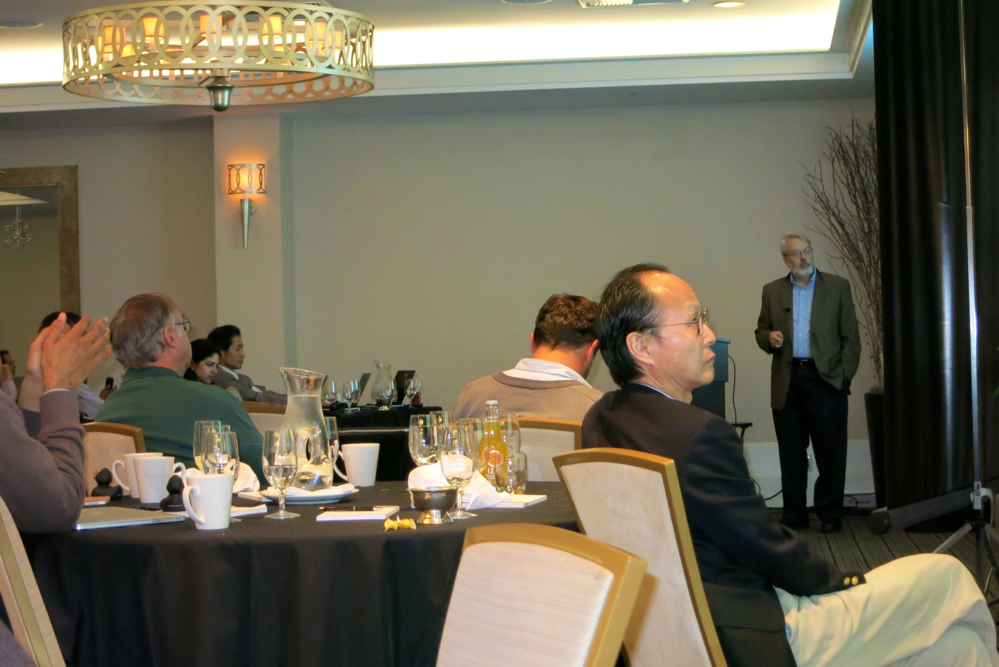
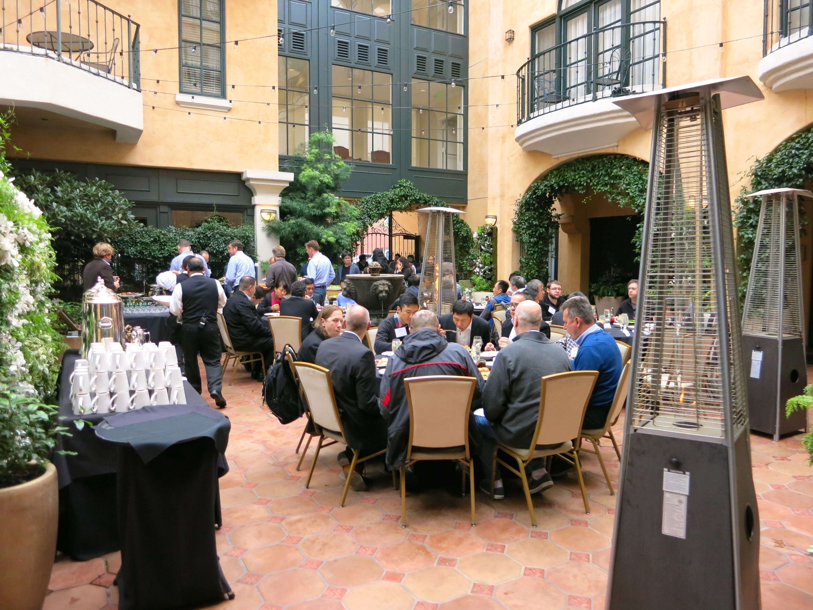
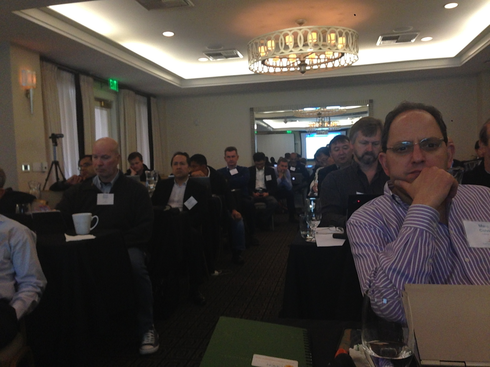
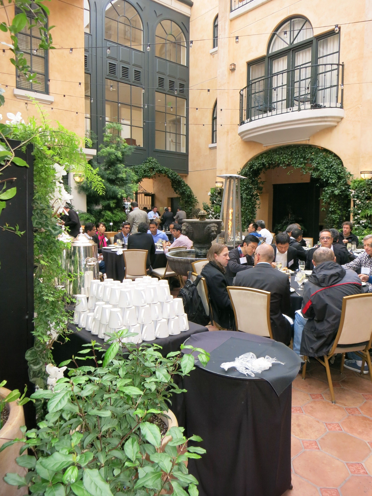
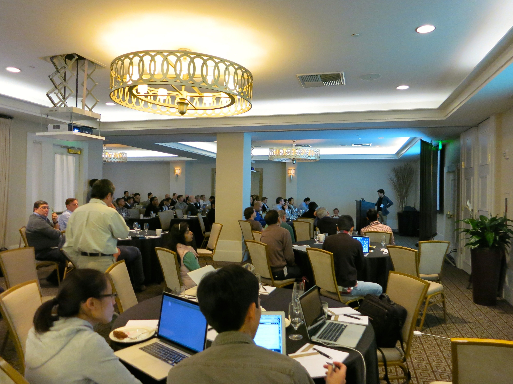
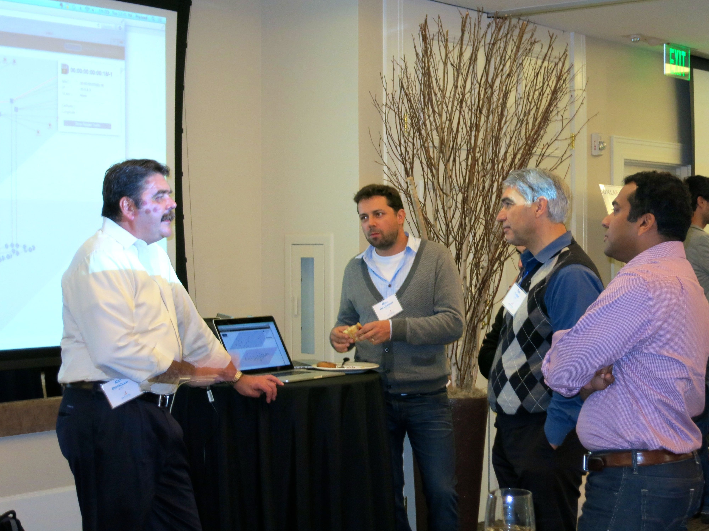
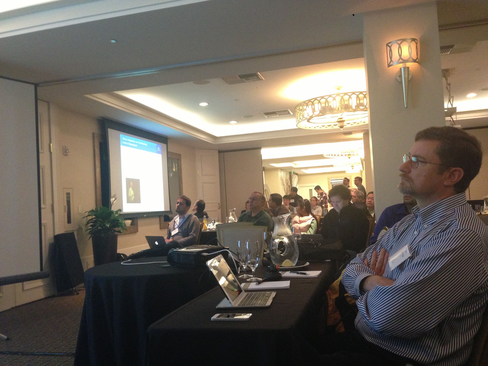
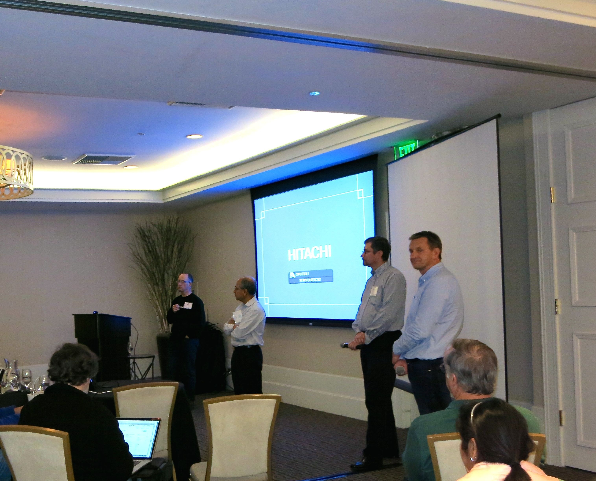

# ONOS Summit: Dec 9th, 2014

ON.Lab and ONOS project partners hosted the ONOS Summit in Palo Alto on Dec 9th, 2014. ONOS was open sourced on Dec 5th, 2014 and this summit followed the release and brought together business and thought leaders from leading Service Providers and Vendors. The 100+ attendees ranged from current funding partners to those exploring or interested in joining as open source ONOS project sponsors.

The videos and slides for the sessions from this summit are now available below. (Note- all ONOS demos at the summit were done live in the 11:00am-12:00noon session and they worked - no glitches )

*If you are interested in sponsoring and signing up as a funding member of the open source ONOS project, ["Join Now" on onosproject.org](http://onosproject.org)  or send an email to [join@onlab.us](mailto:join@onlab.us).*

## **Slides and Videos**

* [Agenda and details of the Summit](https://speakerdeck.com/onosproject/onos-summit-agenda-and-details)

***Morning Session***

* 8:30 - 8:45am   Welcome— Tom Anschutz (AT&T) and Guru Parulkar (ON.Lab/Stanford)  
  + [Slides](https://speakerdeck.com/onosproject/onos-summit-introduction)
  + [Video](http://youtu.be/-Dh0otE7Pdk)

* 8:45 - 9:00am    User Defined Network and Open Source ONOS at AT&T — Al Blackburn (AT&T)
  + *Video and slides not available*

* 9:00 - 9:15am    Open SDN, Open Source and ONOS — Nick McKeown (ONF/ON.Lab/Stanford)
  + [Slides](https://speakerdeck.com/onosproject/onos-summit-sdn-open-source-and-onos)
  + [Video](http://youtu.be/s10XP8qdZ34)

* 9:15 - 9:30am   ONOS at AT&T — Tom Anschutz (AT&T)
  + [Slides](https://speakerdeck.com/onosproject/onos-summit-onos-use-cases-at-at-and-t-service-provider-perspective)
  + [Video](http://youtu.be/s6h5ECvEIDs)

* 9:30 - 9:45am   ONOS at NTT Comm — Yukio Ito (via video) and  Dai Kashiwa (both NTT Comm)
  + *Slides (Coming soon)*
  + [Video](http://youtu.be/azeDLT_Rs1A)

* 9:45 - 9:55am   ONOS for Service Providers-  Walter Miron ( Telus)
  + *Slides (coming soon)*
  + *Video (coming soon)*

* *9:55 - 10:15am    Break*
* 10:15 - 11:00am   ONOS Overview and Demo — Thomas Vachuska (ON.Lab)
  + [Slides](https://speakerdeck.com/onosproject/onos-summit-onos-architecture)
  + [Video](http://youtu.be/6fWpFeOV-ZY)

* 11:00 -12:00noon    ONOS Use Cases and Demos – ON.Lab and Partner developers
  + Packet Optical (Tom Tofigh,AT&T and Praseed Balakrishnan)
    - [Slides](https://speakerdeck.com/onosproject/onos-summit-demo-1-packet-optical)
    - [Video](http://youtu.be/3CQfN_BZunI)

* + SDN-IP (Luca Prete, Jono Hart- both ON.Lab)
    - [Slides](https://speakerdeck.com/onosproject/onos-summit-demo-2-sdn-ip)
    - [Video](http://youtu.be/1D5bg6xishw)

* + Segment Routing (Saurav Das, ONF)
    - [Slides](https://speakerdeck.com/onosproject/onos-summit-demo-3-segment-routing)
    - [Video](http://youtu.be/S1WXO0iKTrY)

* + NFaaS (Teru Uchida, Naoki Shiota- both NEC)
    - [Slides](https://speakerdeck.com/onosproject/onos-summit-demo-4-nfaas)
    - [Video](http://youtu.be/yJ1Lmk7XhmI)

* 12:00 -12:30pm    Open source ONOS Roadmap — Prajakta Joshi (ON.Lab)
  + [Slides](https://speakerdeck.com/onosproject/onos-summit-onos-roadmap-2015)
  + [Video](http://youtu.be/hkVJpvZHOwQ)

* *12:30 - 1:30pm    LUNCH + DEMOS*

### *Afternoon Session*

* 1:30- 2:10pm    ONOS for Vendors-
  + Marc Cohn(Ciena)
    - [Slides](https://speakerdeck.com/onosproject/onos-summit-onos-and-ciena-vendor-perspective)
    - *Video (coming soon)*

* + Min He(Fujitsu)
    - [Slides](https://speakerdeck.com/onosproject/onos-summit-onos-talk-by-fujitsu-vendor-perspective)
    - [Video](http://youtu.be/QH2PTQSjuAQ)

* + Ayush Sharma(Huawei)
    - [Slides](https://speakerdeck.com/onosproject/onos-summit-talk-by-huawei-vendor-perspective)
    - [Video](http://youtu.be/dGe9g2csZLs)
    - [Use Case Demo Video](http://youtu.be/dsrs6uD_Fgk)

* + Shinya   Nakamura(NEC)
    - [Slides](https://speakerdeck.com/onosproject/onos-summit-onos-talk-by-nec-vendor-perspective)
    - [Video](http://youtu.be/oYUm5cHG754)

* 2:10-2:15pm     ONOS Affiliates- bringing value to ONOS community –Eric Breuninger (Black Duck)
  + - [Slides](https://speakerdeck.com/onosproject/onos-summit-affiliates-bringing-value-to-the-onos-community-black-duck)
    - [Video](http://youtu.be/jmGSi_Y1Bvg)

* 2:15-2:45pm     Overview of Open Source Governance models- Mark Radcliffe (DLA PIPER)
  + *Video (coming soon)*
  + [Slides](https://speakerdeck.com/onosproject/onos-summit-open-source-governance-models)

* 2:45-3:15pm   ONOS Governance Model proposal— Bill Snow (ON.Lab)
  + [Slides](https://speakerdeck.com/onosproject/onos-summit-onos-project-governance-proposal)
  + [Video](http://youtu.be/aGAIryUQHjc)

* *3:15-3:45pm   Break*

* 3:45-4:45pm  Discussion and Q&A (Tom Anschutz, Bill Snow, Guru Parulkar, Nick McKeown)
  + [Video](http://youtu.be/fGwcTgVP0sg)

* *4:45-5:00pm   End of Summit*

## **Pictures**

****

****

****

****

****
