# Open and Virtual Networking Conference (OVNC) Korea- Feb 5th 2015

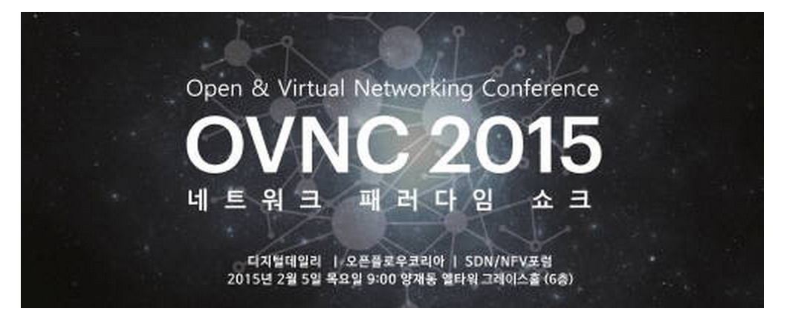

## Open and Virtual Networking Conference (OVNC) Korea 2015

Feb 5th, 2015

Seoul, Korea

## Opening Keynote

ONOS- Enabling Software Defined Transformation of Service Provider Networks

Presented by: Prajakta Joshi, Director Products @ ON.Lab

**[Slides](http://www.slideboom.com/presentations/1184038/OVNC-2015-Korea%3A-Keynote---ONOS--Software-Defined-Transformation-of-Service-Provider-Networks)**

**[Video](http://youtu.be/6gIZSrvLErQ)**

## Panel Discussion

Presented by: Bill Snow, VP Engineering @ ON.Lab

**[Slides](http://www.slideboom.com/presentations/1184037/OVNC-2015-Korea%3A-Panel)**

*Video ( to be added once provided by organizers)*

## Pictures

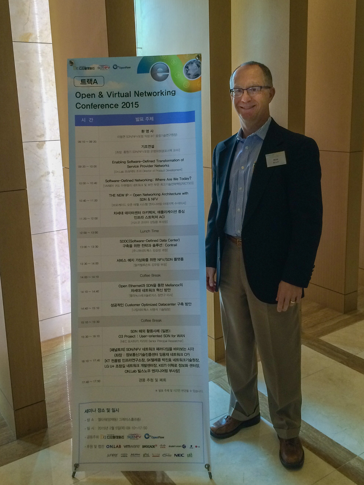

 

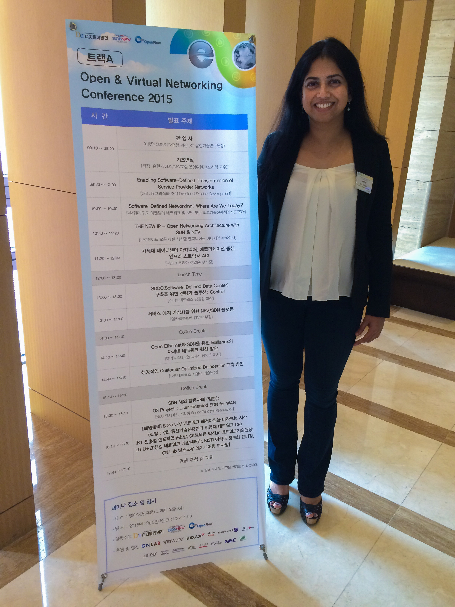

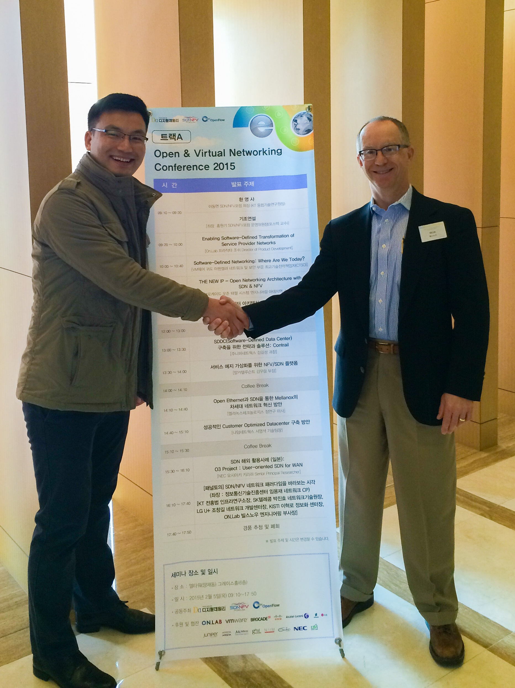

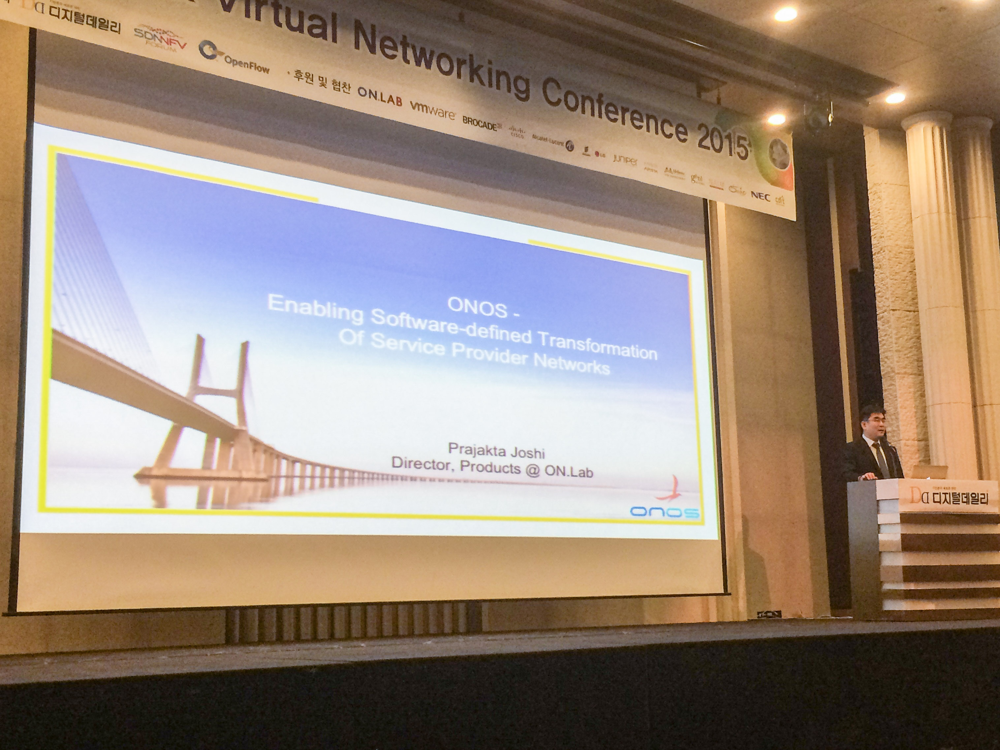

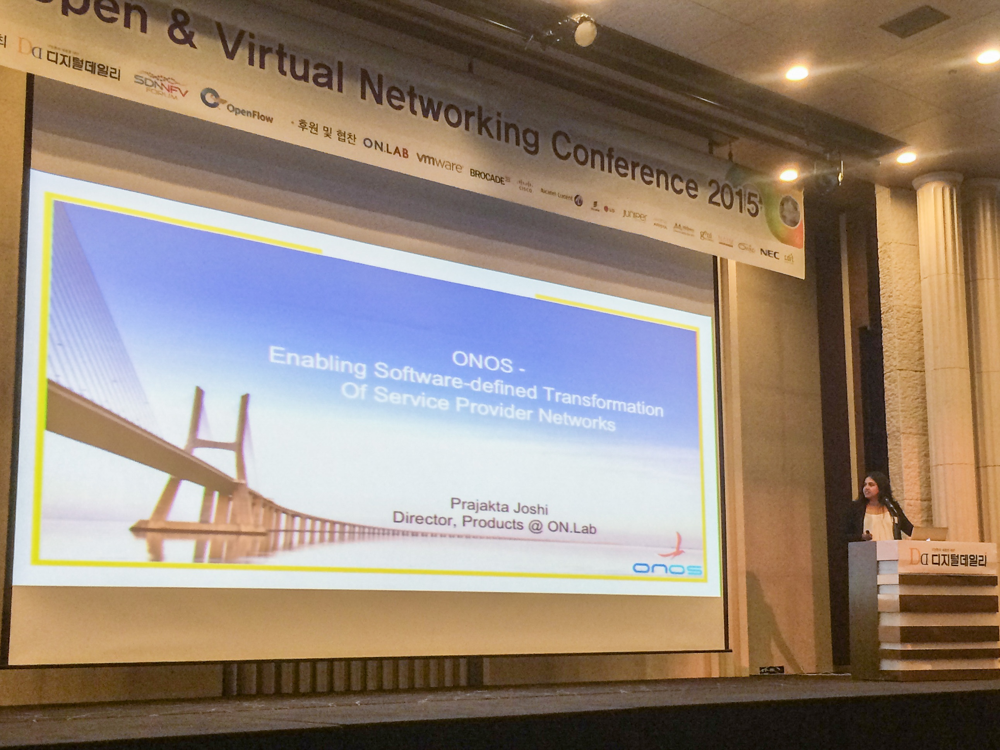

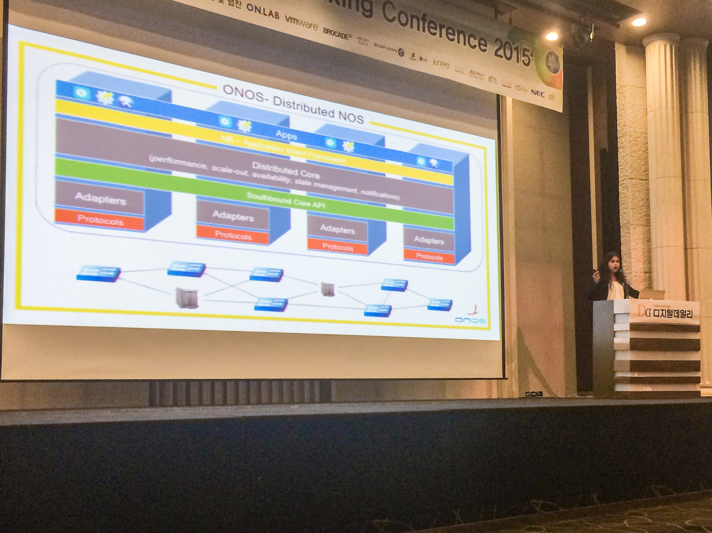

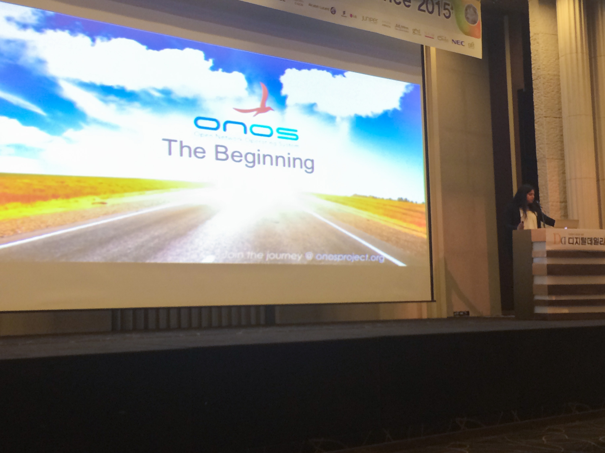

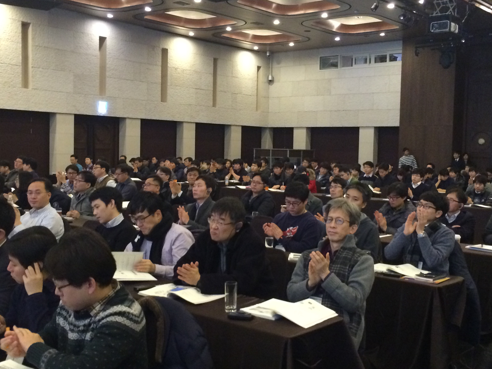

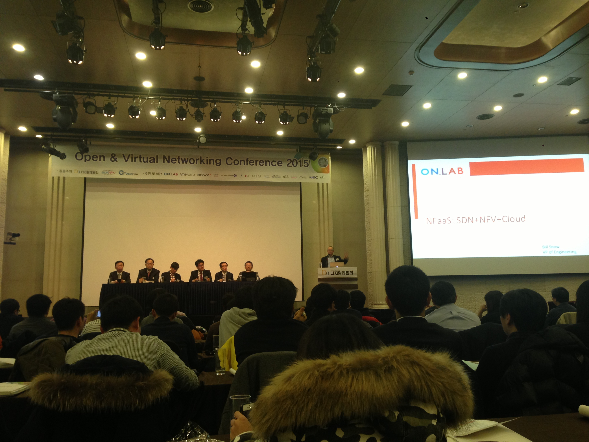

## Bill on the panel

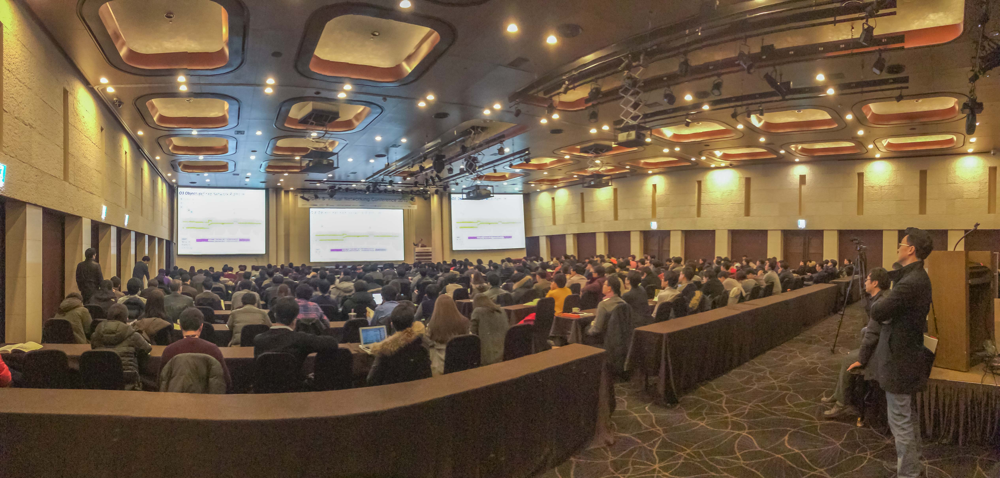

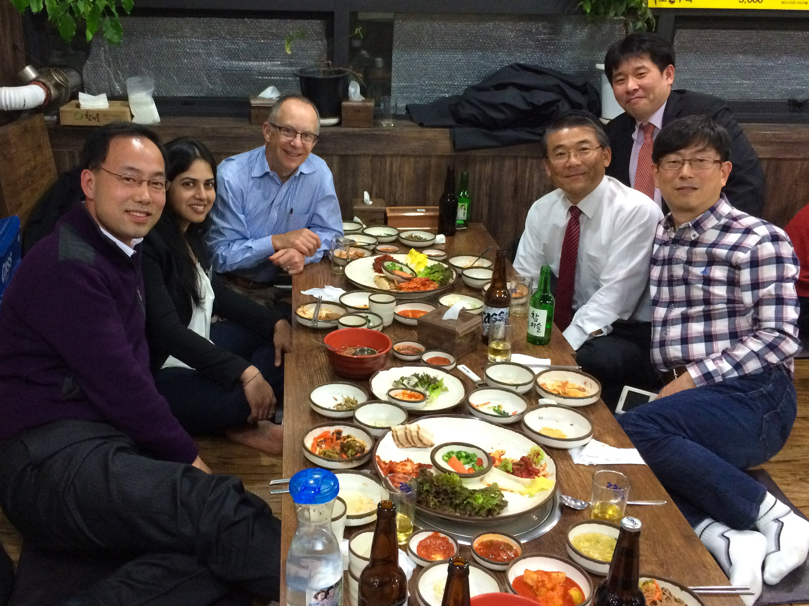

## At ETRI, Daejeon

")
