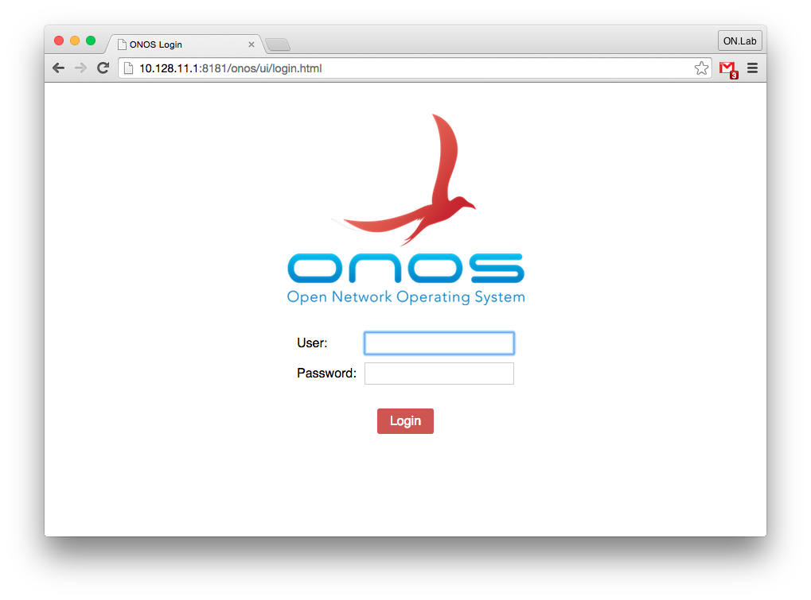

# Configuring Authentication - CLI, GUI & REST API

## Overview

ONOS CLI, GUI and REST API are all presently secured by allowing only authenticated access.

* ONOS CLI uses public/private key authentication
* ONOS GUI uses form-based login
* ONOS REST API uses basic authentication

All of these are backed by the existing Apache Karaf JAAS authentication realm, which by default allows key-based or user/password-based authentication configured in the `etc/users.properties` and `etc/keys.properties` files.

Presently, ONOS does not support differentiated role-based authorization. That may be added later.

Configuration

Without any configuration steps, ONOS CLI will continue to be accessible using the Apache Karaf client and the GUI & REST API will be accessible using both the built-in Apache Karaf credentials (karaf/karaf) and ONOS credentials (`onos`/`rocks`).

To enable the secure access, a new tool `onos-secure-ssh` has been provided. This tool will secure the ONOS CLI so it is no longer accessible using the Apache Karaf client; this client is inherently insecure as it relies on a well-known private key (yes that is an oxymoron). After running the `onos-secure-ssh` tool, ONOS CLI will be only accessible using direct `ssh`. The tool also deletes the default users and keys, and allows the user to specify their own user/password combination as follows:

```
$ onos-secure-ssh -u onos -p totallyRocks
```

The tool comes in two variants to support run-time deployments and dev-time usage. The dev-time variant secures the entire ONOS test cell with one invocation and will use the dev bench user’s public key to enable secure ssh CLI. The run-time variant secures just the instance on which it is invoked and uses the invoking user’s public key to enable secure ssh CLI.

## Authentication

Since ONOS CLI is secured via key-based authentication, there is no explicit action required once the `onos-secure-ssh` tool was used.

Specifying login credentials for REST API will vary depending on the REST client. With `curl`, it would look something like this:

```
$ curl http://10.128.11.1:8181/onos/v1/devices --user onos:totallyRocks
```

The GUI login is very straightforward as it will automatically redirect to the login page, which looks like this:



The login will remain active while the browser is active or until user logs-out by clicking on the `logout` link in the right-hand side of the GUI mast-head. Presently there are no cookies and no mechanism to maintain authentication past browser restart. This may be added in future releases as we add token-based authentication.

## HTTPS & Redirect

By default HTTPS is not enabled, but it can be easily configured and used directly, by modifying the `etc/org.ops4j.pax.web.cfg` file. The reason for this is that it requires a setup of keystore & truststore and unless one has a key signed by a CA, the self-signed key ends up raising issues with REST API and puts up entry barriers in the browser. For these reason, this remain a manual configuration task; see instructions in <https://ops4j1.jira.com/wiki/display/paxweb/SSL+Configuration>.

For the same reasons, neither REST API nor GUI will presently insist on communicating via HTTPS via mandatory redirect to a confidential channel. However, one can force HTTPS-only communication by disabling the HTTP channel by modifying the `etc/org.ops4j.pax.web.cfg` file.  Default version of this file is under source-control in `tools/package/etc` directory and is included in the corresponding distributable tar.gz, zip, deb & rpm packages.
