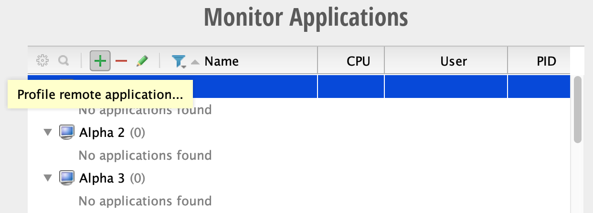
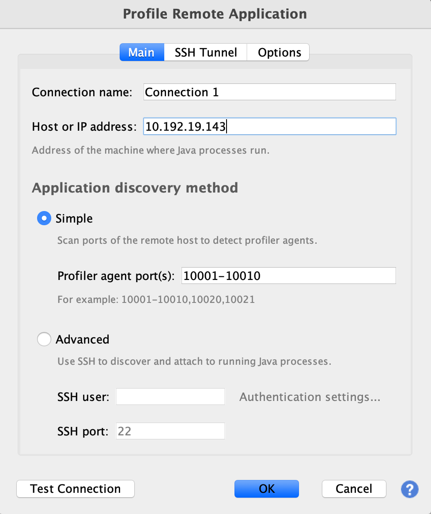
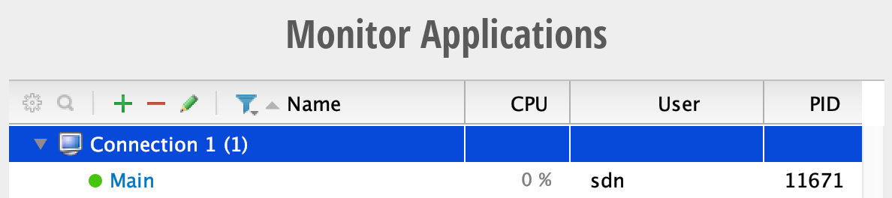
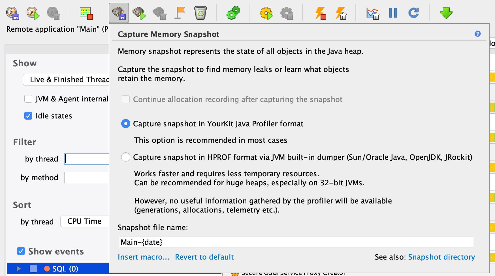

# Production Deployment Tuning

# Garbage Collection

ONOS relies on a variety of distributed systems protocols which use timeouts for failure detection. In production systems at scale, the various components in ONOS can generate enough garbage to cause multi-second GC pauses when not tuned correctly. To reduce the chance of false negatives (timeouts) occurring during GC pauses, we recommend deployments use the [Garbage First (G1) Garbage Collector](https://docs.oracle.com/javase/9/gctuning/garbage-first-garbage-collector.htm). The G1 garbage collector allows a maximum GC pause goal to be set, and the garbage collector will attempt to avoid pauses larger than the maximum. We recommend a GC pause goal around 200ms.

The G1 garbage collector can be enabled by overriding the `$JAVA_OPTS` environment variable in ONOS deployments:

```
export JAVA_OPTS="-XX:+UseG1GC -XX:MaxGCPauseTimeMillis=200"
```

# Storage Timeouts

As mentioned above, ONOS relies on a variety of time-dependent distributed systems protocols for cluster coordination and storage. Because they depend on time, these protocols can degrade when latency suffers in clusters placed under high stress. ONOS and Atomix provide options for tuning most time-dependent protocols.

## ONOS <=1.13

* `-Donos.cluster.raft.electionTimeoutMillis` Sets the election timeout for Raft partitions. This value should be greater than the maximum estimated GC pause time for the cluster. Defaults to `2500`
* `-Donos.cluster.raft.heartbeatIntervalMillis` Sets the interval at which Raft leaders send heartbeats to followers. This value must be less than the election timeout and should be less than one second to reduce read latency. Defaults to `500`
* `-Donos.cluster.raft.storage.level` Sets the storage strategy for Raft logs. Must be either `MAPPED` or `DISK`. Defaults to `MAPPED`
* `cfg:set org.onosproject.store.cluster.impl.DistributedLeadershipStore electionTimeoutMillis` Sets the election timeout for all leadership elections, including mastership elections. This value should be greater than the maximum estimated GC pause time for the cluster. Defaults to `2500`

## ONOS >=1.14

* `cfg:set org.onosproject.store.cluster.impl.DistributedLeadershipStore electionTimeoutMillis` Sets the election timeout for all leadership elections, including mastership elections

## Atomix 3.x

Persistent storage is critical for the efficient operation of Atomix. In containerized environments where storage is ephemeral unless otherwise specified, volumes should be used to provide efficient, persistent storage to *local* disks. To configure the location of Atomix data storage, either specify the directory in the `partitionGroups` configuration or specify a `--data-dir` when running the Atomix agent.

In addition to storage, Atomix provides a variety of configuration options that can be used to tune the cluster:

* `cluster.messaging.connectionPoolSize` Sets the maximum number of simultaneous connections that can be opened to each peer. Atomix will partition communication across connections. Defaults to `8`

To override Atomix agent configuration options, simply modify the atomix.conf file and specify the desired property.

# Async Logging

The default logging configuration for both ONOS 1.x (log4j) and ONOS 2.x (log4j2) can in some environments block multiple threads for long periods of time due to a single lock shared by all loggers. These blocks can lead to timeouts, mastership changes, and other problems. In ONOS 2.x, to avoid extensive blocking due to loggers, we recommend using [`AsyncLogger`s](https://logging.apache.org/log4j/2.0/manual/async.html).

```
log4j.appender.async=org.apache.log4j.AsyncAppender
log4j.appender.async.appenders=rolling
```

See the [Karaf logger documentation](http://karaf.apache.org/manual/latest/#_advanced_configuration) for more information on async loggers.

For ONOS 1.x, log4j does support asynchronous appenders, but we have not found success with them. It is possible to upgrade ONOS 1.x to log4j2, but the process of upgrading breaks other logging features to an extent that makes it unsuitable for production.

# Karaf Lock Timeout

When starting up or recovering ONOS nodes in a cluster, some core ONOS components can take a while to startup. This can result in exceptions during startup:

```
2019-01-16T19:58:35,712 | ERROR | FelixDispatchQueue | onos-core-primitives             | 183 - org.onosproject.onos-core-primitives - 2.0.0.SNAPSHOT | FrameworkEvent ERROR - org.onosproject.onos-core-primitives
org.osgi.framework.ServiceException: Service factory exception: Could not obtain lock
        at org.apache.felix.framework.ServiceRegistrationImpl.getFactoryUnchecked(ServiceRegistrationImpl.java:352) ~[?:?]
        at org.apache.felix.framework.ServiceRegistrationImpl.getService(ServiceRegistrationImpl.java:247) ~[?:?]
        at org.apache.felix.framework.ServiceRegistry.getService(ServiceRegistry.java:350) ~[?:?]
        at org.apache.felix.framework.Felix.getService(Felix.java:3737) ~[?:?]
        at org.apache.felix.framework.BundleContextImpl.getService(BundleContextImpl.java:470) ~[?:?]
        at org.apache.felix.scr.impl.manager.SingleRefPair.getServiceObject(SingleRefPair.java:73) ~[?:?]
        at org.apache.felix.scr.impl.inject.BindParameters.getServiceObject(BindParameters.java:47) ~[?:?]
        at org.apache.felix.scr.impl.inject.field.FieldHandler$ReferenceMethodImpl.getServiceObject(FieldHandler.java:519) ~[?:?]
        at org.apache.felix.scr.impl.manager.DependencyManager.getServiceObject(DependencyManager.java:2308) ~[?:?]
        at org.apache.felix.scr.impl.manager.DependencyManager$SingleStaticCustomizer.prebind(DependencyManager.java:1162) ~[?:?]
```

By default, Karaf imposes a 5 second limit on the time it takes to ignite a component. However, storage components in particular can take longer to startup. They often must run a leader election protocol and replay logs to rebuild the cluster state. We recommend increasing Karaf lock timers to avoid exceptions when starting up ONOS nodes.

Karaf lock timeouts can be overridden via the ds.lock.timeout.milliseconds system property. This property can be set again by overriding the $JAVA\_OPTS environment variable:

```
export JAVA_OPTS="-Dds.lock.timeout.milliseconds=15000"
```

# Profiling

Profiling is critical to tuning ONOS for production deployments. Indeed, the above recommendations were based on extensive profiling of ONOS deployments. We recommend [YourKit Java Profiler](https://www.yourkit.com/java/profiler/) for profiling ONOS.

To enable YourKit profiling, [download the YourKit agent](https://www.yourkit.com/java/profiler/download/) from the YourKit webset and modify the ONOS environment variables to start the JVM with the YourKit agent:

```
export JAVA_OPTS="-agentpath:/path/to/libyjpagent.so=listen=all"
```

By default, the YourKit agent will bind to port `10001`, so ensure that port is open.

Once an ONOS node is started, open YourKit and select the + symbol to add a new remote application:



Enter the IP of the ONOS node and optionally assign a name to the connection:



Once the connection has been added, select the connection to connect to the YourKit agent:



Once the connection is established, the full YourKit profiler view will be opened, including CPU, memory, garbage collection, events, and other statistics. Note: by default CPU usage is sampled. To gather more precise CPU usage statistics, enable CPU tracing.

## Sharing Snapshots

The YourKit profiler provides a variety of valuable views for analyzing and debugging the performance of ONOS deployments. But we've found its most invaluable feature to be memory snapshots. YourKit allows users to take a complete snapshot of memory allocations, CPU usage, garbage collection, and all other statistics at a point in time. These snapshots can then be shared with other ONOS developers. Indeed, when reporting a memory leak or debugging a performance issue, ONOS developers may request a YourKit memory snapshot.

To take a memory snapshot, simply click the memory snapshot button in the toolbar:



The snapshot will be captured and saved to the client's machine. By default, snapshots will be saved in `~/Snapshots`. Snapshots can then be sent to other developers for review and collaboration.
