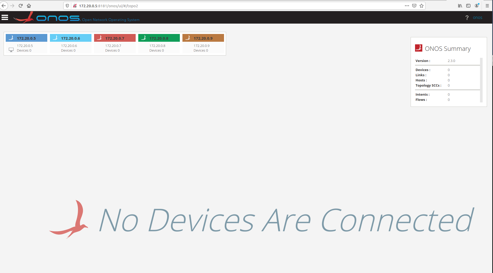

# Automating cluster creation

I tried to extend Eric Tang's steps into a script. You are free to copy-paste it from here or clone the repo: <https://github.com/ederollora/ONOS_autocluster/blob/main/create_cluster.sh>

Requirement;

**Install requirements**

```
sudo apt install jq
```

*NOTE: If you have to deploy ONOS and Atomix several times, you are responsible for stopping and removing the containers you deployed the last time before running the script again, else container names will clash. I will try to add this feature to the script but not there yet.*

By default, the script will deploy ONOS 2.2.1 and Atomix 3.1.5, with 3 containers for ONOS and 3 for Atomix. This can all be modified using the command parameters.

For instance this command: "user@machine:~/ONOS\_autocluster$ **./create\_cluster.sh -o 2.3.0 -a 3.1.5 -i 3 -j 5"**will generate 5 ONOS containers using tag 2.3.0 and 3 Atomix 3.1.5 containers. See the output of the command here:

**Script output**

```
~/ONOS_autocluster$ ./create_cluster.sh -o 2.3.0 -a 3.1.5 -i 3 -j 5
atomix-version: 3.1.5
onos-version: 2.3.0
atomix-containers: 3
onos-containers: 5
subnet: 172.20.0.0/16
Pulling Atomix:3.1.5
Creating atomix-1 container with IP: 172.20.0.2
Creating atomix-2 container with IP: 172.20.0.3
Creating atomix-3 container with IP: 172.20.0.4
Starting container atomix-1
Starting container atomix-2
Starting container atomix-3
Pulling ONOS:2.3.0
Starting onos1 container with IP: 172.20.0.5
Starting onos2 container with IP: 172.20.0.6
Starting onos3 container with IP: 172.20.0.7
Starting onos4 container with IP: 172.20.0.8
Starting onos5 container with IP: 172.20.0.9
Copying configuration to onos1
Restarting container onos1
Copying configuration to onos2
Restarting container onos2
Copying configuration to onos3
Restarting container onos3
Copying configuration to onos4
Restarting container onos4
Copying configuration to onos5
Restarting container onos5
```


