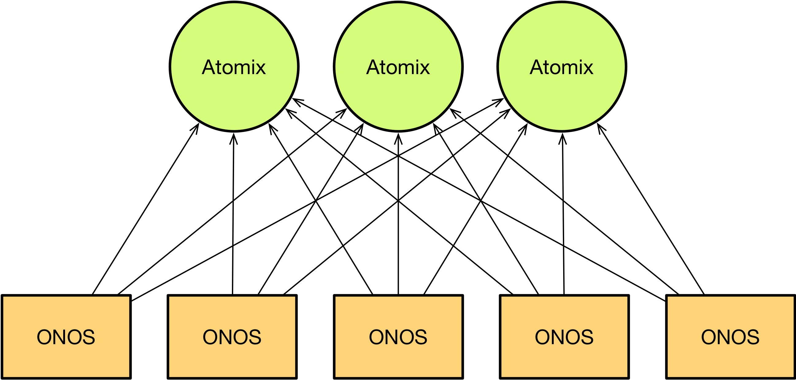
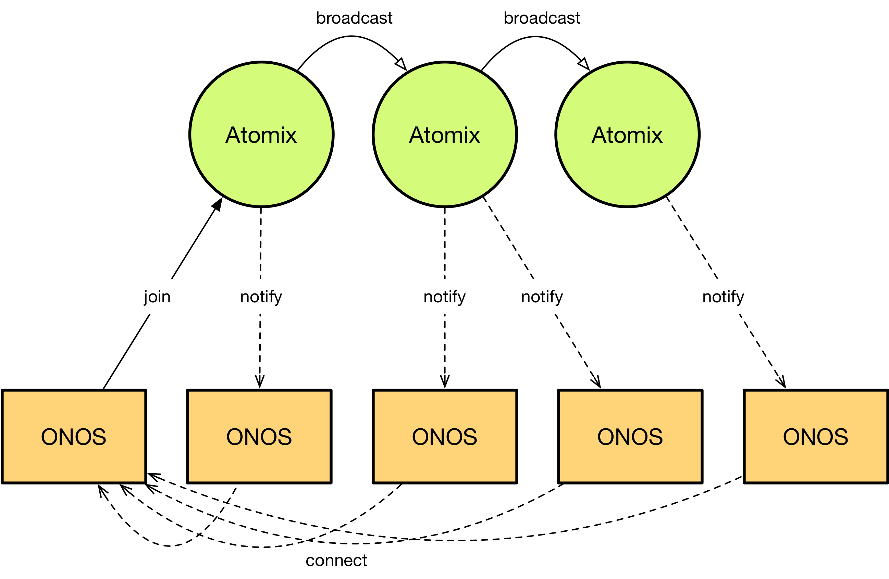

# Cluster Configuration in Owl (1.14)

The Owl release (1.14) features a new architecture which physically decouples cluster management, service discovery, and persistent data storage from the ONOS nodes themselves. These functions are now the responsibility of a separate [Atomix](https://atomix.io) cluster. The new ONOS/Atomix architecture, however, introduces several breaking changes to the way clusters are configured and managed and requires additional setup and configuration steps. This guide will explain how to configure Atomix and ONOS in production.

**Note: When running ONOS in local mode in 1.14 (for testing and development), Atomix is still embedded inside the ONOS node. No additional configuration step is required.**

In order to understand how the cluster is configured in ONOS 1.14, it's important first to understand how it is architected. In past versions, ONOS embedded Atomix nodes to form Raft clusters, replicate state, and coordinate state changes. In ONOS 1.14, that functionality is moved into a separate Atomix cluster:



Prior to bootstrapping the ONOS cluster, an Atomix cluster must first be formed for data storage and coordination. ONOS nodes are then configured with a list of Atomix nodes to which to connect.

# Running Atomix

Atomix can be run via either the [official Atomix Docker image](https://hub.docker.com/r/atomix/atomix/) or the [Atomix distribution](https://oss.sonatype.org/content/repositories/releases/io/atomix/atomix-dist/). We recommend that the latest stable Atomix 3.0.x release be used with ONOS 1.14. However, all Atomix 3.0.x releases should be compatible with all ONOS 1.14.x releases.

## Distribution

The Atomix distribution can be downloaded from the [downloads page](https://atomix.io/downloads/) on [atomix.io](http://atomix.io) or from [Maven Central](https://atomix.io/downloads/) directly and is provided in either `tar` or `zip` format.

```
curl -o atomix-dist-3.0.7.tar.gz -XGET https://oss.sonatype.org/content/repositories/releases/io/atomix/atomix-dist/3.0.7/atomix-dist-3.0.7.tar.gz
```

Once the distribution has been downloaded, unpack the distribution into the desired directory:

```
tar -xvf atomix-dist-3.0.7.tar.gz
```

The Atomix distribution is laid out as follows:

* `/bin` - scripts for running Atomix
* `/conf` - default configuration files with documentation
* `/examples` - example configuration files
* `/lib` - core dependencies and extensions
* `/log` - Atomix system logs

The default configuration provided in `/conf/atomix.conf` is not a runnable configuration. Instead, it's an example configuration documented with instructions on configuring the cluster. To configure the Atomix distribution, update the `/conf/atomix.conf` configuration with the desired configuration and then run the atomix-agent:

```
./bin/atomix-agent
```

## Docker Image

The Atomix Docker image can be retrieved via the `atomix/atomix Docker` Hub repository.

```
docker pull atomix/atomix:3.0.7
```

Atomix Docker images are tagged with the Atomix version number. Note, however, that the `latest` tag is currently reserved for the latest Atomix snapshot and may be incompatible with ONOS 1.14. Ensure you pull a version tag.

To run the Atomix Docker image, create an Atomix configuration in a dedicated directory:

```
mkdir conf
vi conf/atomix.conf
...
```

When running the Atomix image, mount the configuration directory onto the container and point Atomix to the configuration by providing a `--config` option in the container arguments:

```
docker run -it -v /path/to/conf:/etc/atomix/conf atomix/atomix:3.0.7 --config /etc/atomix/conf/atomix.conf --ignore-resources
```

Atomix supports merging multiple configuration files together, so when providing a custom configuration to the Docker image, the --ignore-resources flag must be enabled to avoid picking up the `atomix.conf` included with the image/distribution.

To preserve data across restarts, you may also want to mount a data directory. To do so, mount the data directory and pass a `--data-dir` to the container:

```
mkdir conf
vi conf/atomix.conf
mkdir data
docker run -it -v /path/to/conf:/etc/atomix/conf -v /path/to/data:/var/lib/atomix/data atomix/atomix:3.0.7 --config /etc/atomix/conf/atomix.conf --ignore-resources --data-dir /var/lib/atomix/data
```

With an external data directory specified, the container can be destroyed and recreated without losing state. **This is a critical requirement of production systems.**

## Atomix configuration

*Note: for the complete documentation of available Atomix configuration options, see:*

* [Atomix configuration reference](https://atomix.io/docs/latest/user-manual/configuration/reference)
* [reference.conf](https://github.com/atomix/atomix/blob/master/dist/src/main/resources/examples/reference.conf)

The Atomix cluster is configured by providing a JSON or [HOCON](https://github.com/lightbend/config/blob/master/HOCON.md) configuration file to each Atomix node. The Atomix configuration requires the following three components to operate correctly:

* `cluster` - specifies how the Atomix nodes discover and communicate with one another
* `management-group` - configures a partition group for managing primitives
* `partition-groups` - configures a set of partitions groups for primitive storage and replication

Partition groups are a new concept introduced in Atomix 3.0. A partition group can be defined as a set of shards implementing a specific distributed systems protocol (e.g. Raft, primary-backup, etc). Distributed primitives are stored in a specific partition group, and all primitives can operate on any partition group regardless of the protocol it implements. This generic architecture means the protocol underlying Atomix's distributed primitives is configurable. For ONOS's use case, however, the system expects the Atomix cluster to be configured with a Raft partition group for distributed primitives.

A minimal Atomix configuration for ONOS will include a single Raft management partition plus a Raft partition group.

**atomix.conf**

```
cluster {
  cluster-id: onos
  node {
    id: atomix-1
    address: "10.192.19.111:5679"
  }
  discovery {
    type: bootstrap
    nodes.1 {
      id: atomix-1
      address: "10.192.19.111:5679"
    }
    nodes.2 {
      id: atomix-2
      address: "10.192.19.112:5679"
    }
    nodes.3 {
      id: atomix-3
      address: "10.192.19.113:5679"
    }
  }
}

management-group {
  type: raft
  partitions: 1
  storage.level: disk
  members: [atomix-1, atomix-2, atomix-3]
}

partition-groups.raft {
  type: raft
  partitions: 3
  storage.level: disk
  members: [atomix-1, atomix-2, atomix-3]
}
```

The node specified in the cluster configuration is an optional field. To share the configuration file among multiple Atomix nodes, the local node information can instead be passed as arguments to the Atomix agent:

```
./bin/atomix-agent -m atomix-1 -a 10.192.19.111:5679
```

The `cluster` configuration specifies a node `discovery` protocol that relies on a static membership list to form a cluster. The `nodes` provided to the discovery protocol are the set of all Atomix nodes. Note that ONOS nodes do not need to be listed here since ONOS connects to Atomix in a client-server architecture. The `address` field for each node is a host:port tuple which includes support for DNS. Additional discovery protocols exist and are documented in the Atomix documentation. However, the `bootstrap` protocol is recommended for consensus nodes since fixed node identities are a requirement of the Raft protocol regardless.

The `management-group` defines the protocol and configuration to use for managing the Atomix cluster. Since ONOS relies heavily on Atomix for consensus, this must be a Raft partition group. The management group may be configured with only a single partition as the load on the group is low.

The `partition-groups` configuration defines a set of named partition groups for storing distributed primitives. Again, ONOS expects a single Raft partition group to be configured. The group can be named with any name and can include any number of partitions. We recommend the `partitions` to be set to `1` or `2` times the number of Atomix nodes.

## Raft Configuration

Critically, each of the `raft` partition group configurations includes a `members` field which lists a set of node IDs. This indicates the set of nodes that participate in consensus for the partition group. The set of member IDs *must* be the same in the configuration of each of the Atomix nodes, and IDs in the `members` list must be present in the `bootstrap` nodes list.

Additionally, the `storage` object dictates how Raft partitions store commit logs:

* `storage.level` - Defines the storage level for Raft commit logs. May be `disk` for direct file storage or `mapped` for memory mapped file storage.
* `storage.directory` - Defines the storage directory for Raft commit logs. Defaults to the Atomix distribution's `/data` directory. In containers, the `storage.directory` should be pointed to a persistent volume.
* `storage.segmentSize` - Defines the maximum size of each file in the Raft logs. Defaults to `64MB`.
* `storage.maxEntrySize` - Defines the maximum size of each entry in the Raft log. Defaults to `1MB`.
* `storage.flushOnCommit` - Indicates whether to flush Raft logs to disk on every change. Defaults to `false`. Enabling this option will impact performance but may help preserve data in a simultaneous failure of multiple Atomix nodes.

# ONOS Configuration

The second part of the ONOS cluster configuration is the ONOS configuration itself. In past releases, the cluster has been configured either using `cluster.json` or by running the `onos-form-cluster` script. The Owl release preserves `cluster.json` but no longer supports `onos-form-cluster`. However, the format of `cluster.json` has changed to accommodate changes in communication patterns within the ONOS and Atomix clusters. In past releases, ONOS nodes formed a cluster by communicating with one another to elect leaders using the [Raft protocol](https://raft.github.io/raft.pdf). As a consensus protocol, Raft required strict cluster membership information to preserve consistency while forming the cluster by counting votes. But since the Raft protocol is moved to Atomix in ONOS 1.14, the ONOS cluster itself no longer has any such strict requirement for cluster membership. In other words, an ONOS node can now discover its peers using dynamic discovery mechanisms, and the ONOS cluster as a whole can tolerate the failure of all but one node. This is done by discovering ONOS nodes through the Atomix cluster:



When an ONOS node is bootstrapped, it connects to the external Atomix cluster for data storage and coordination. Upon connecting, the ONOS node notifies Atomix of its existence and location. Atomix then broadcasts the new node's information to all other connected ONOS nodes, and connected ONOS nodes subsequently connect directly back to the new ONOS node for peer-to-peer communication. This allows ONOS nodes to dynamically discover one another while still preserving the same performance characteristics as in past releases.

But the introduction of service discovery for the ONOS controller changes its cluster configuration. In past releases, `cluster.json` was used to list each ONOS node's peers and the distribution of Raft partitions in the cluster. But ONOS nodes now have no knowledge of their peers or the available storage partitions. Instead, ONOS nodes need only be configured to locate and connect to Atomix to discover each other and store state.

To facilitate the new cluster architecture, the format of `cluster.json` is changed to list the set of Atomix nodes rather than the set of ONOS nodes. This is done by listing the nodes in the `storage` field:

```
{
  "name": "onos",
  "storage": [
    {
      "id": "atomix-1",
      "ip": "10.192.19.111",
      "port": 5679
    },
    {
      "id": "atomix-2",
      "ip": "10.192.19.112",
      "port": 5679
    },
    {
      "id": "atomix-3",
      "ip": "10.192.19.113",
      "port": 5679
    }
  ]
}
```

**To configure the ONOS cluster, place the cluster.json file in the /config directory under the ONOS root.**

The format is the same as the format for the `nodes` field in past releases, but the listed IP/port combinations are for Atomix nodes rather than ONOS nodes. In addition to support for IP addresses, ONOS 1.14.1 introduced support for hostnames via the `host` field:

```
{
  "name": "onos",
  "storage": [
    {
      "id": "atomix-1",
      "host": "atomix-1",
      "port": 5679
    },
    {
      "id": "atomix-2",
      "host": "atomix-2",
      "port": 5679
    },
    {
      "id": "atomix-3",
      "host": "atomix-3",
      "port": 5679
    }
  ]
}
```

In past releases, ONOS nodes could be assigned human readable identifiers. In order to facilitate this in the Owl release, we added an additional `node` field to describe the local node.

```
{
  "name": "onos",
  "node": {
    "id": "onos-1",
    "ip": "10.192.19.121",
    "port": 9876
  },
  "storage": [
    ...
  ]
}
```

# Rolling Upgrades

Atomix supports rolling upgrades, allowing ONOS users to introduce bug fixes and new primitive features into their running ONOS clusters. To upgrade an Atomix cluster, simply shutdown, update, and restart each Atomix node in sequence, ensuring each node becomes fully available prior to proceeding to the next node. Atomix guarantees backwards compatibility for all Atomix version 3.0.x releases.
