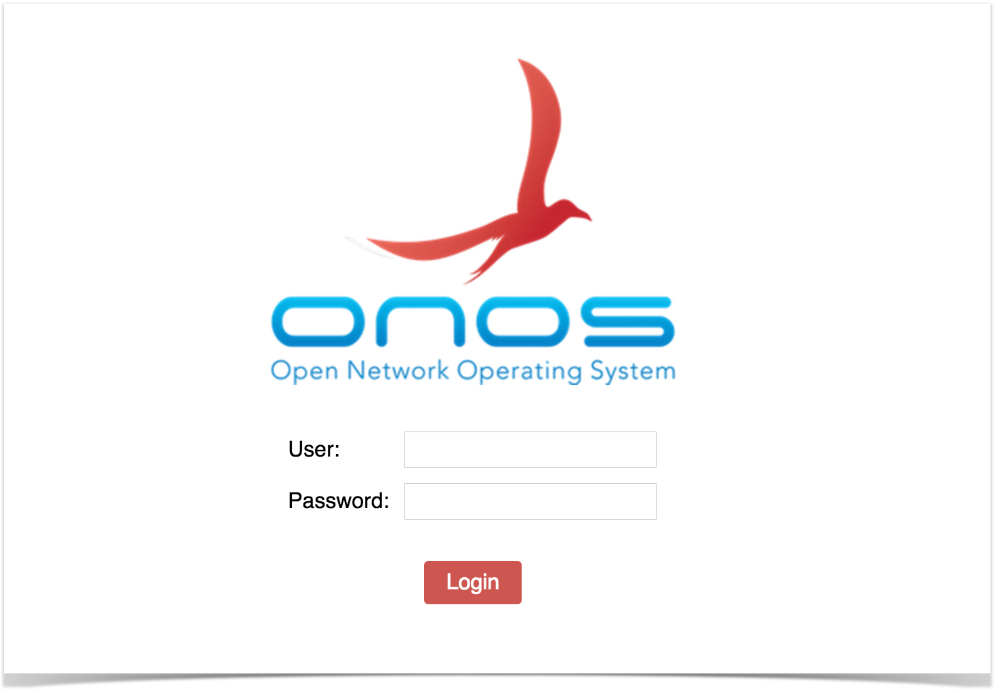
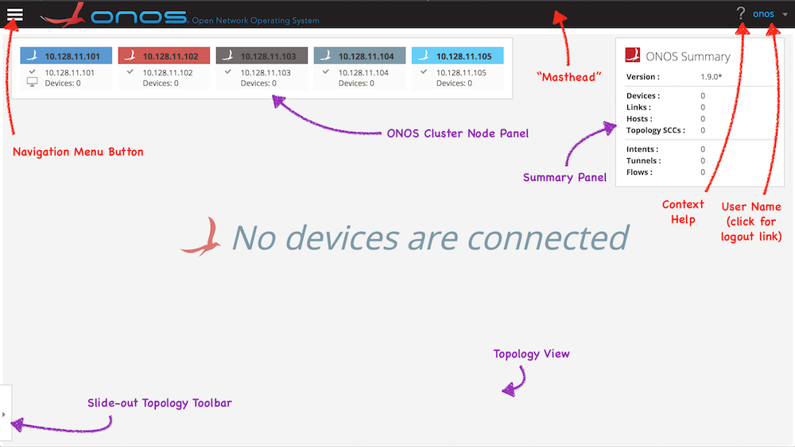
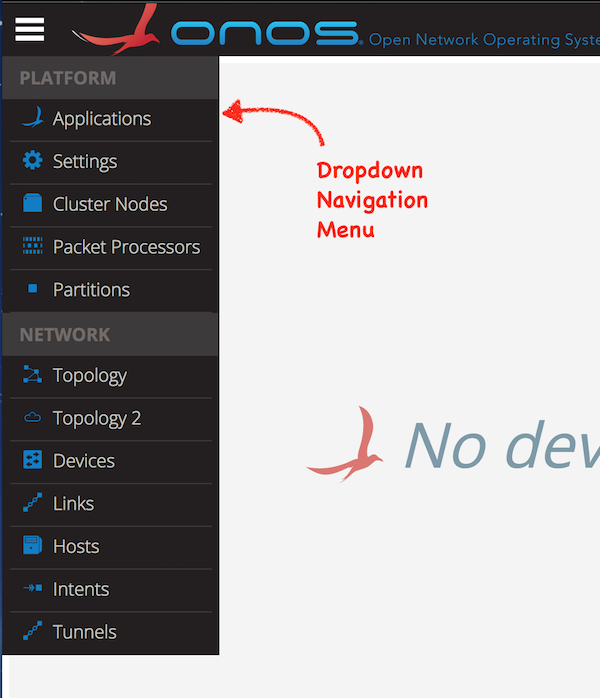

# The ONOS Web GUI

> Note: This page applies almost equally to the legacy GUI and its replacement GUI2. Any new enhancements are added to GUI2 only. See [GUI Release Notes](the-onos-web-gui/gui-release-notes.md) for details of new features

# GUI Overview

The ONOS GUI is a *single-page web-application*, providing a visual interface to the ONOS controller (or cluster of controllers).

For documentation on how applications running on ONOS can inject content to the GUI at runtime, see the [Web UI tutorials](../../../tutorials/web-ui-tutorials.md).

For documentation on the design of the GUI, see [Web UI Architecture](../../architecture-and-internals-guide/web-ui-architecture.md) in the Architecture Guide.

# GUI Configuration Notes

* The ***onos-gui*** feature must be installed in ONOS.
* The GUI listens on port ***8181***.
* The base URL is ***/onos/ui***; for example, to access the GUI on localhost, use: <http://localhost:8181/onos/ui>
* The GUI has been developed to work on *Google Chrome*. The GUI has been tested on Safari and Firefox and minor compatibility adjustments have been made; these and other browsers may work, but have not been extensively tested, and are not actively supported, at this time.
* The key bindings associated with any view will work on any keyboard. The "*Cmd*" (⌘) key on an Apple keyboard is bound to the same key as the "*Windows*" or "*Alt*" keys on Windows or other keyboards.

# GUI Session Notes

Note that the current version of the GUI does not fully support the concept of individual user accounts, however, login credentials are required.

On launching the GUI you should see the login screen:

Default username and password are ***onos***/***rocks***.

If ONOS was installed via ***onos-install*** and configured by ***onos-secure-ssh*** (developer/test tools), then the passwords may be different; examine the *$ONOS\_WEB\_USER* and *$ONOS\_WEB\_PASS environment variables.*

After a successful login, you should see a screen that looks something like this:

The dark bar at the top is the *Masthead*, which provides a location for general GUI controls. Items shown with red text / arrows are always present:

* the Navigation Menu button
* the ONOS logo and title
* the Context Help button (click to open web URL specific to current view)
* the User Name (click to access logout link)

 (In future versions, the masthead may include session controls such as user preferences, global search, etc.)

The remainder of the screen is the "view", which defaults to the *Topology View* when the GUI is first loaded (items shown with purple text / arrows) – a cluster-wide view of the network topology.

* The *ONOS Cluster Node Panel* indicates the cluster members (controller instances) in the cluster.
* The *Summary Panel* gives a brief summary of properties of the network topology.
* The *Topology Toolbar* (initially hidden) provides push-button / toggle-button actions that interact with the topology view.

For more detailed information about this view, see the [Topology View](the-onos-web-gui/gui-topology-view.md) page.

GUI Navigation

Other views can be "navigated to" by clicking on the *Navigation Menu Button* in the masthead, then selecting an item from the dropdown menu:

# GUI Views

The GUI is capable of supporting multiple views. As new views are added to the base release, they will be documented here.

> *NOTE:*
>
> The capability of adding views to the GUI dynamically at run-time is also available to developers, allowing, for example, an ONOS App developer to create GUI content that works specifically with their application. The content will be injected dynamically into the GUI when the app is installed, and removed automatically from the GUI when the app is uninstalled. For more details on this feature, see the [Web UI tutorials](../../../tutorials/web-ui-tutorials.md).

The views currently included in the base release are:

| View | Description |
| --- | --- |
| *Platform Category* |  |
| Applications | The [Application View](the-onos-web-gui/gui-application-view.md)\* provides a listing of applications installed, as well as interaction with them on the network. |
| Settings | The [Settings View](the-onos-web-gui/gui-settings-view.md)\* provides information about all configurable settings in the system. |
| Cluster Nodes | The [Cluster Node View](the-onos-web-gui/gui-cluster-node-view.md)\* provides a top level listing of all the cluster nodes, (ONOS instances), in the network. |
| Packet Processors | The [Packet Processors View\*](the-onos-web-gui/onos-packet-processors-view.md) shows the currently configured components that participate in the processing of packets sent to the controller. |
| Partitions | The [Partitions View](the-onos-web-gui/gui-partitions-view.md)\* shows information about how the cluster partitions are configured. |
| *Network Category* |  |
| Topology | The [Topology View](the-onos-web-gui/gui-topology-view.md) provides an interactive visualization of the network topology, including an indication of which devices (switches) are mastered by each ONOS controller instance. |
| Topology 2 | The [Topology 2 View](the-onos-web-gui/gui-topology-2-view.md) (currently experimental) is an alternative to the Topology View, providing the ability to view the network in a more hierarchical manner. |
| Devices | The [Device View](the-onos-web-gui/gui-device-view.md)\* provides a top level listing of the devices in the network. |
| \*\*Flows | The [Flow View](the-onos-web-gui/gui-flow-view.md)\* provides a top level listing of all flows for a selected device. (Note that this view is not on the navigation menu.) |
| \*\*Ports | The [Port View](the-onos-web-gui/gui-port-view.md)\* provides a top level listing of all ports for a selected device. (Note that this view is not on the navigation menu.) |
| \*\*Groups | The [Group View](the-onos-web-gui/gui-group-view.md)\* provides a top level listing of all groups for a selected device. (Note that this view is not on the navigation menu.) |
| \*\*Meters | The [Meter View](the-onos-web-gui/gui-meter-view.md)\* provides a top level listing of all meters for a selected device. (Note that this view is not on the navigation menu.) |
| Links | The [Link View](the-onos-web-gui/gui-link-view.md)\* provides a top level listing of all the links in the network. |
| Hosts | The [Host View](the-onos-web-gui/gui-host-view.md)\* provides a top level listing of all the hosts in the network. |
| Intents | The [Intent View](the-onos-web-gui/gui-intent-view.md)\* provides a top level listing of all the intents in the network. |
| Tunnels | The [Tunnel View](the-onos-web-gui/gui-tunnel-view.md)\* provides a top level listing of all tunnels defined in the network. |

***\*Tabular Views**: The GUI has multiple "tabular views" that are similar in look and interaction, but display different information. For a general overview of tabular usage, see the [Tabular View](the-onos-web-gui/gui-tabular-view.md) page. For specifics on each view, follow the links in the above table.*

\*\****Hidden Views:** Some views (e.g. flows, ports, groups, meters) do not show up on the Navigation Menu, but are navigable from other views (e.g. the device view).*

# Web UI Applications

ONOS applications may contain Web UI components – either custom views, or topology overlay behaviors. For documentation on application-specific behavior, please see the [Web UI Application Index](the-onos-web-gui/web-ui-application-index.md).

# Release Notes

See the [reverse-chronological summary of changes](the-onos-web-gui/gui-release-notes.md) to the GUI for each release.

---

[Previous : The ONOS CLI](the-onos-cli.md)  
[Next : Distributed ONOS](#)

---
