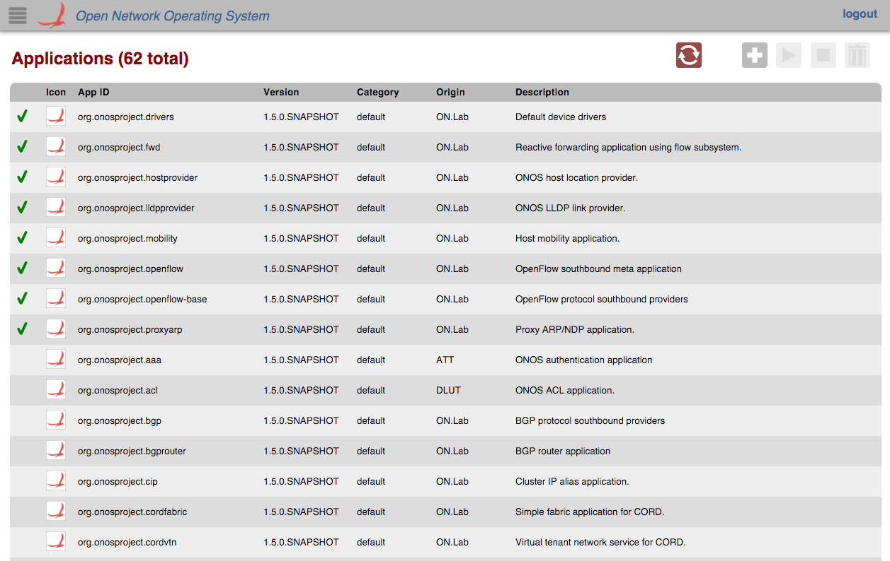
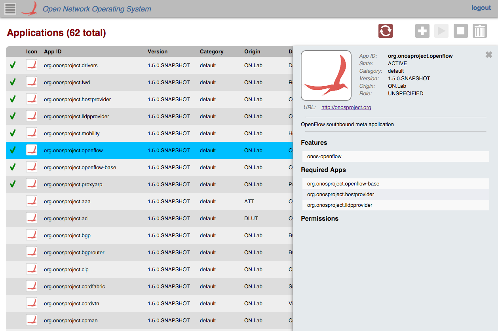
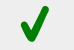
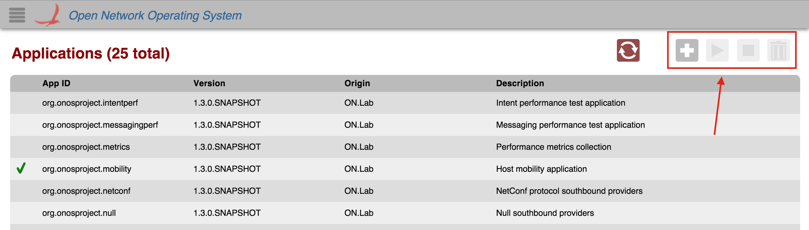
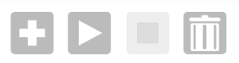
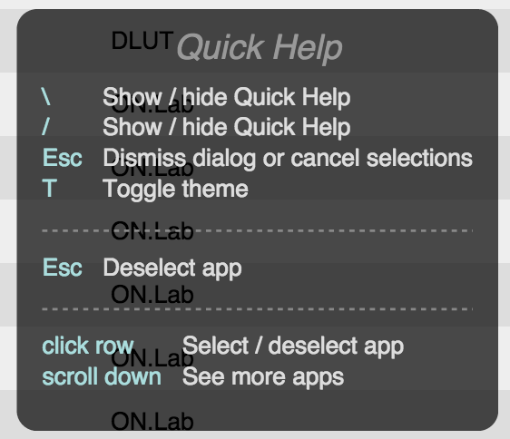

# GUI Application View

# Overview

The *Application View*provides a top level listing of and basic interaction with all applications installed. All applications are displayed in [tabular form](gui-tabular-view.md).

Each row in the table is a single application. To see more applications, scroll down inside the table body.

# Table Body

## Selection

Some interactions (see below) with the Application View are only available when you select an application in the table. To do so, click the row in the table displaying your application.

A blue selection color will appear on the row when the application is selected.

When an application (table row) is clicked on, a details panel about that application will appear on the right edge of the screen with more detailed information about the application.

## Column Headers

The column headers for each section in the table are sortable (see [tabular view page](gui-tabular-view.md)). By default, the applications are sorted in ascending order by App ID. You can toggle between ascending and descending on any header.

## Active vs. Installed

There is one icon (the checkmark) that shows in the Application View table body.

 This icon indicates that the application is in the **ACTIVE** state.

No icon indicates it is in the **INSTALLED** state, but not active.

# Interaction with Applications

The Application View allows the user to interact with installed applications via the control buttons on the upper right of the view.

When an application is **not** selected, the control buttons will look like this:

When an application **is** selected, the control buttons may look like this:

or this:

## Control Buttons

Click to trigger any button.

| Icon | Action | Description |
| --- | --- | --- |
|  | Install | Brings up a file explorer so you can upload an .oar file with your ONOS application directly. |
|  | Activate\* | Change the state of the current application from INSTALLED to ACTIVE. |
|  | Deactivate\* | Change the state of the current application from ACTIVE to INSTALLED. |
|  | Uninstall\* | Uninstall the current application. |

\* Indicates that a device must be selected to have the button become active.

# Quick Help

You can press the '/' or '\' key to bring up the Quick Help Panel which lists actions you can use on the view.

