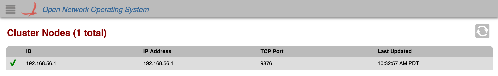

# GUI Cluster Node View

# Overview

The *Cluster Node View* provides a top level listing of the Cluster Nodes (ONOS Instances) on the network. All cluster nodes are displayed in [tabular form](gui-tabular-view.md). This view will be expanded on in future releases.

Each row in the table is a single instance on the network.

# Total Cluster Nodes

The total number of nodes connected (both active and inactive) is displayed in the upper left corner.

# Table Body

## Column Headers

The column headers for each section in the table are sortable (see [tabular view page](gui-tabular-view.md)). By default, the instances are sorted in ascending order by ID. You can toggle between ascending and descending on any header.

## Availability

 If the cluster node is *active,* a green checkmark is displayed in the far left column of the table.

 If the cluster node is *inactive**,* a red "x" will be displayed instead.
