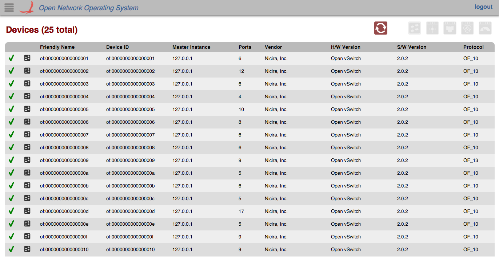
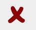
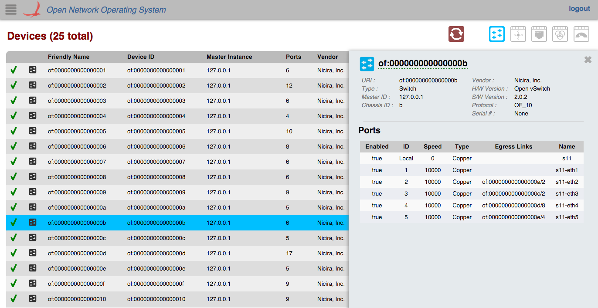
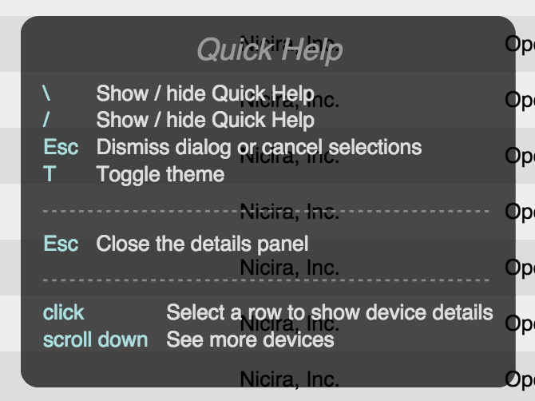

# GUI Device View

# Overview

The *Device View* provides a top level listing of the devices in the network. All devices connected to the network are displayed in [tabular form](gui-tabular-view.md).

Each row in the table is a single device on the network. To see more devices, scroll down inside the table body.

# Total Devices

The total number of devices connected (both online and offline) is displayed in the upper left corner.

# Control Buttons

## Navigation

There are a few buttons in the upper right corner of the Device View that allow you to navigate to associated views. You can only click on these when a device is selected.

**Flow View:**Click this to go to the [flow view](gui-flow-view.md) for the selected device.

**Port View:**Click this to go to the [port view](gui-port-view.md) for the selected device.

**Group View:**Click this to go to the [group view](gui-group-view.md) for the selected device.

**Meter View:**Click this to go to the [meter view](gui-meter-view.md) for the selected device.

# Table Body

## Column Headers

The column headers for each section in the table are sortable (see [tabular view page](gui-tabular-view.md)). By default, the devices are sorted in ascending order by Device ID. You can toggle between ascending and descending on any header.

## Availability

 If the device is *online,* a green checkmark is displayed in the far left column of the table.

 If the device is *offline,* a red "x" will be displayed instead.

## Device Type

 Indicates the device is a switch.

 Indicates the device is a roadm.

# Details Panel

All rows in the table are selectable. When a device (table row) is clicked on, a details panel about that device will appear on the right edge of the screen with more detailed information about the device.

You can close the panel by deselecting the table row (clicking on the same device again), or by clicking on the 'X' in the upper right corner of the panel.

## Ports Table

The table of ports inside the panel is scrollable but it is not sortable. This table will be expanded on in future releases.

# Quick Help

You can press the '/' or '\' key to bring up the Quick Help Panel which lists actions you can use on the view.

