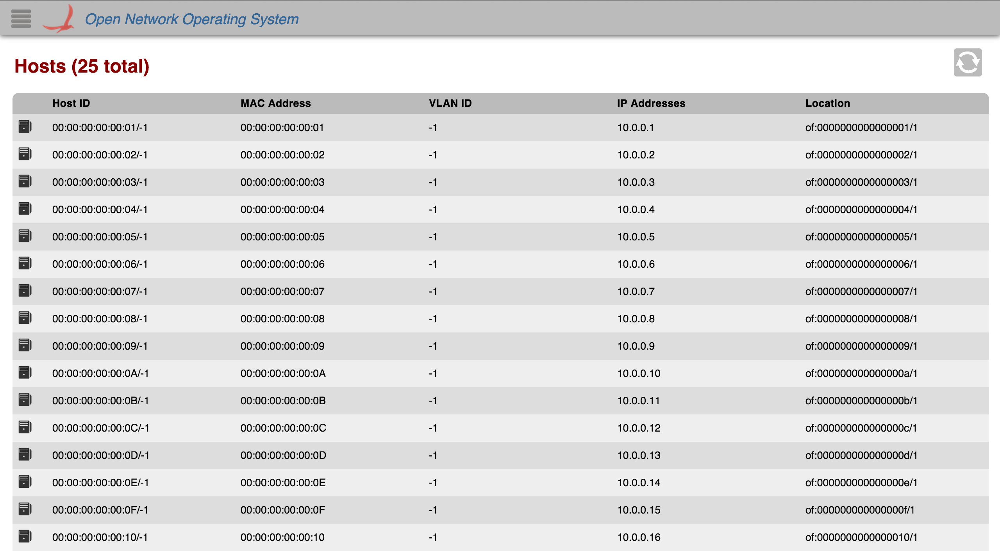

# GUI Host View

# Overview

The *Host View* provides a top level listing of the hosts in the network. All hosts on the network are displayed in [tabular form](gui-tabular-view.md).

Each row in the table is a single host on the network. To see more hosts, scroll down inside the table body.

# Table Body

## Column Headers

The column headers for each section in the table are sortable (see [tabular view page](gui-tabular-view.md)). By default, the hosts are sorted in ascending order by Host ID. You can toggle between ascending and descending on any header.

## Host Type

 Indicates the host is an end station.

 Indicates the host is a router.

 Indicates the host is a BGP speaker.
