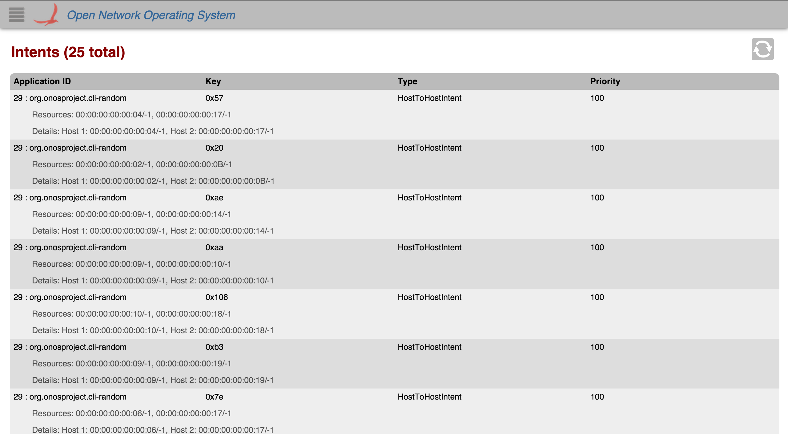

# GUI Intent View

# Overview

The *Intent View* provides a top level listing of the intents given to the controller. All Intents are displayed in [tabular form](gui-tabular-view.md). This view will be expanded on in future releases.

Each row in the table (that spans three lines) is a single intent on the network. To see more intents, scroll down inside the table body.

# Total Intents

The total number of intents on the controller is displayed in the upper left corner.

# Table Body

## Column Headers

The column headers for each section in the table are sortable (see [tabular view page](gui-tabular-view.md)). By default, the intents are sorted in ascending order by Application ID. You can toggle between ascending and descending on any header.

## Information Not Under a Header

For readability, "resources" and "details" about the intent are displayed in the lines below the other information displayed in columns.

### Resources

All of the intent's resources are displayed if they are available. If there are no resources, then "(No resources for this intent)" will be displayed.

### Details

All of the intent's details are displayed if they are available. If there are no details, then "(No details for this intent)" will be displayed.
