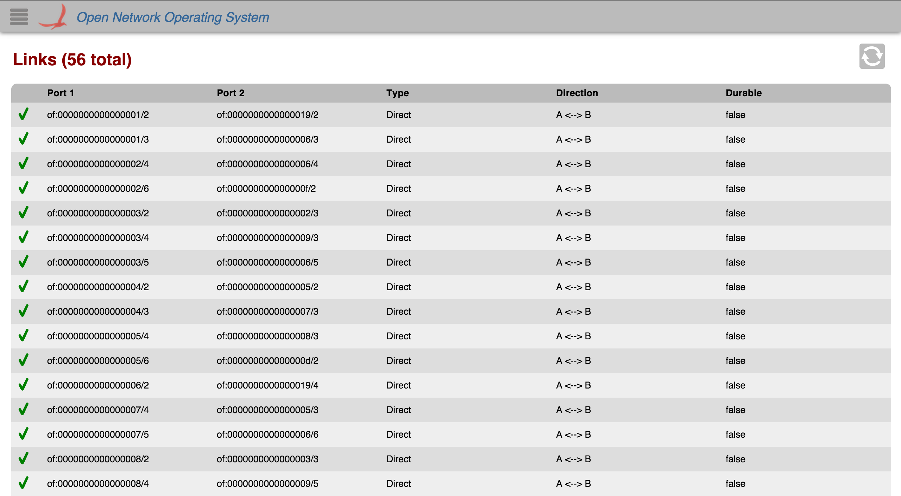

# GUI Link View

# Overview

The *Link View* provides a top level listing of the links in the network. All links on the network are displayed in [tabular form](gui-tabular-view.md). This view will be expanded on in future releases.

Each row in the table is a link on the network. (Bidirectional links are combined into one entry.) To see more links, scroll down inside the table body.

# Total Links

The total number of links connected (both active and inactive) is displayed in the upper left corner.

# Table Body

## Columns

The column headers for each section in the table are sortable (see [tabular view page](gui-tabular-view.md)). By default, the links are sorted in ascending order by Port 1. You can toggle between ascending and descending on any header.

### Availability

 ***Either*** link one or link two of the bidirectional link is *active*.

 ***Both*** links are *inactive*.

### Direction

A ↔ B The link is bidirectional.

A → B The link is in a single direction.
