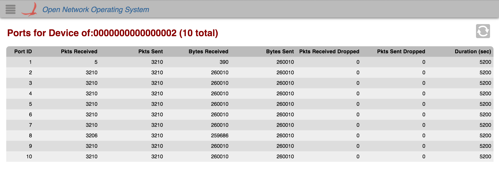
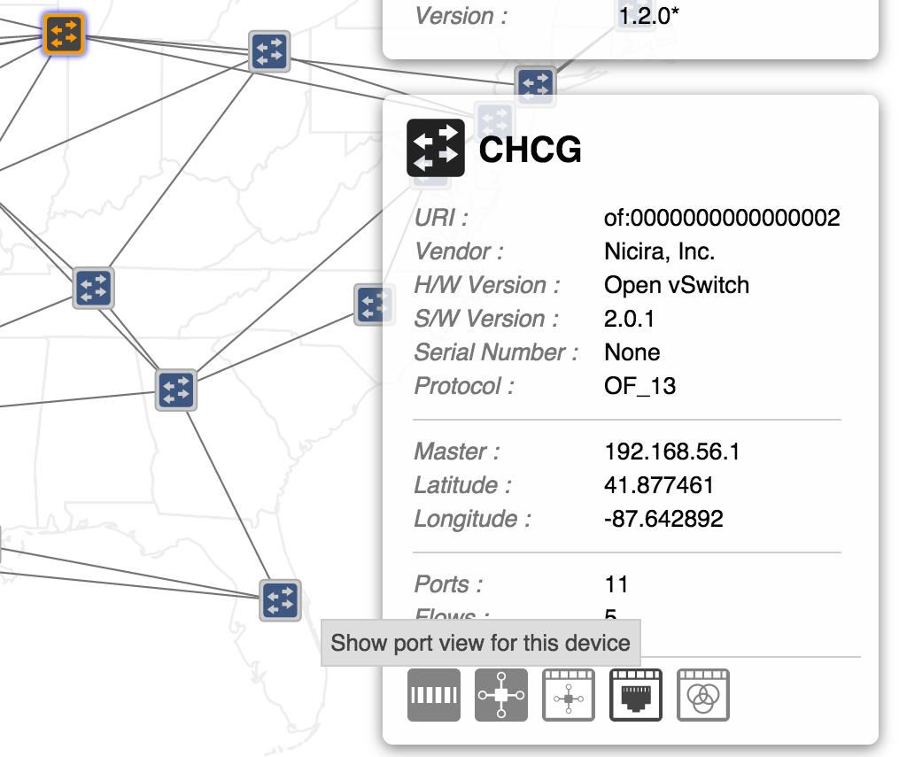
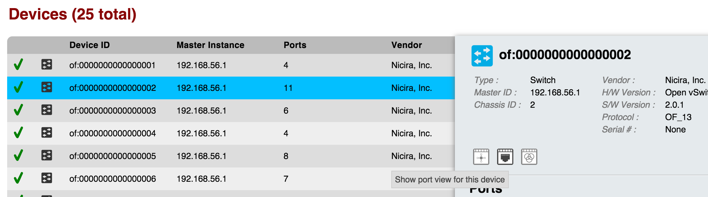

# GUI Port View

The *Port View* provides a top level listing of the ports associated with a chosen device. Ports are displayed in [tabular form](gui-tabular-view.md).

Each row in the table is a single port on the device. To see more ports, scroll down inside the table body.

# Navigating to the Port View

You can get to the Port View in a few ways, although it is not on the main navigation menu.

## Topology View

To get to the ports view for a certain device on the [Topology View](gui-topology-view.md), select a device, **make sure the Details Pane is enabled**, and click on the button as shown below:

This will navigate you to the ports table for the device you have selected.

## Device View

To get to the ports table from the [Device View](gui-device-view.md), select a device (row) of the table to have the details panel appear. To get to the ports view, click on the button as shown below:

This will navigate you to the port table for the device you have selected.

## Query String via URL

You can also get to the ports view for a specific device by altering the query string in the URL.

The URL format for the ports table is:

***http://<HOST>:<PORT>/onos/ui/index.html#/port?devId=<DEVICE URI>***

Notice that the end of the URL contains query parameters. If you choose to navigate to the ports view directly, type in the device's URI after ***?devId=***.

For example, to get to ports table for the device with the URI "of:0000000000000002" while using the domain *localhost* and the default port, use the URL:

***http://localhost:8181/onos/ui/index.html#/port?devId=of:0000000000000002***

# Header

The header of the Port View will tell you which device's ports you are currently viewing, with how many ports there are in total on that device.

# Table Body

## Column Headers

The column headers for each section in the table are sortable (see [tabular view page](gui-tabular-view.md)). By default, the ports are sorted in ascending order by Port ID. You can toggle between ascending and descending on any header.
