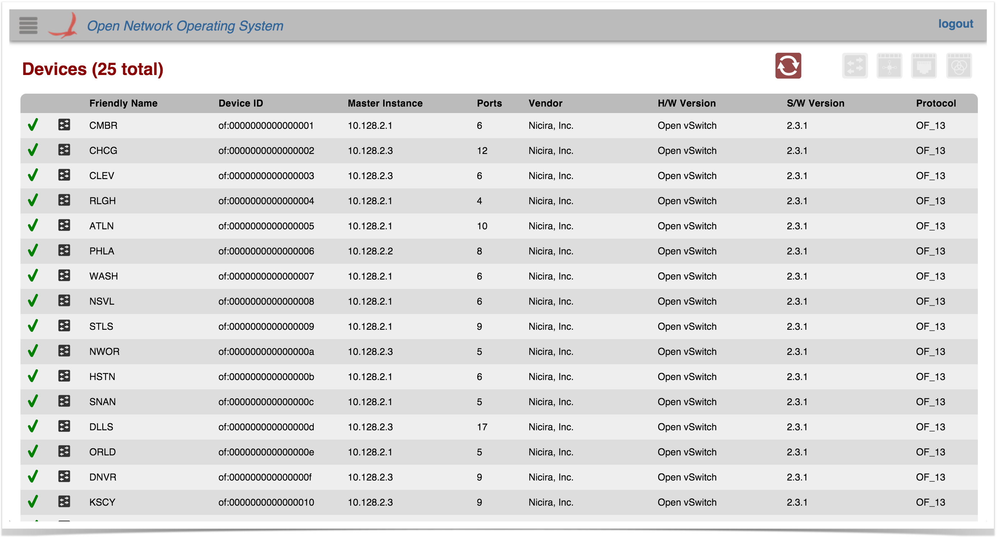
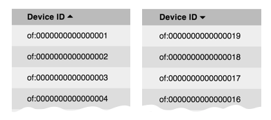
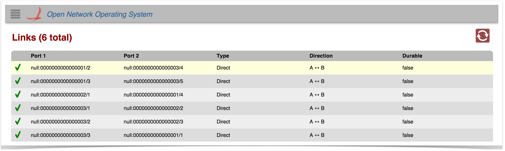
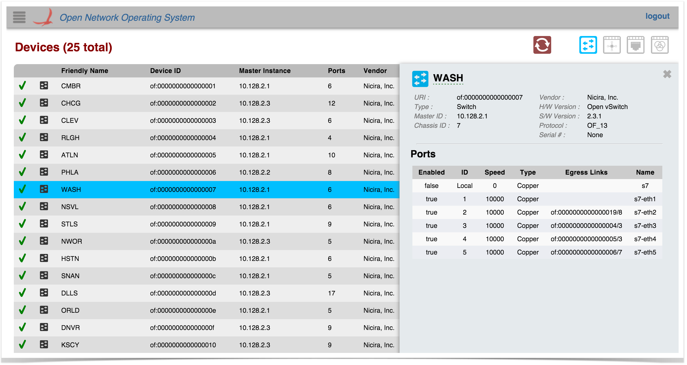
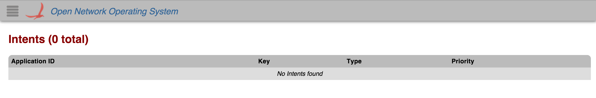

# GUI Tabular View

# 

# Overview

Tabular views display information in table form, typically showing one item per row, and providing the ability to sort the rows by clicking on column headers. For example, the [Device View](gui-device-view.md) is shown here:

See [this tutorial](../../../../tutorials/web-ui-tutorials/web-ui-tutorial-creating-a-tabular-view.md) for details on how to develop a tabular view for your ONOS Application.

# View Header

At the top of every tabular view is a header providing the table title on the left, and a set of control buttons on the right.

## Control Buttons

The control buttons provide additional functionality for the table view. Most tables include a *Refresh-enabled* toggle button. Other buttons may also be provided, depending on the view.

**Refresh:** Tables with this button auto-refresh every two seconds. Click on this button to *disable* or *enable* the auto-refresh feature.

# Table Body

The body of the table is scrollable; the column headers will remain in place while the table data scrolls underneath.

You may use your browser's Find/Search capabilities to quickly find something in the table. (Use Cmd-F for Mac OS,  or Ctrl-F for Windows).

## "Loading..." Animation

If the server takes more than a few hundred milliseconds to respond, a ["loading..." animation](../../../../../assets/demo-delayed-server.mp4) will appear, indicating that the client is waiting for a response from the server:

## Table Columns

Typically, the data in a table is sortable; click on a column header to sort rows by ascending values in that column. Click again to reverse the sort.

A small triangle indicating the sort direction will be displayed after the column name:

## Table Rows

Each row in the table represents a single item. When an item is added or updated, the row will briefly flash yellow, as shown below:

## Selectable Rows

Tables may implement selectable rows: clicking on a row highlights it and displays a details panel with more information about the selected item. Clicking on a different row selects a new item and updates the details panel appropriately. Clicking on the selected row again (or pressing the *Esc* key) deselects the item:

## Empty Tables

If there are no items to display, an "empty" table will be shown:

