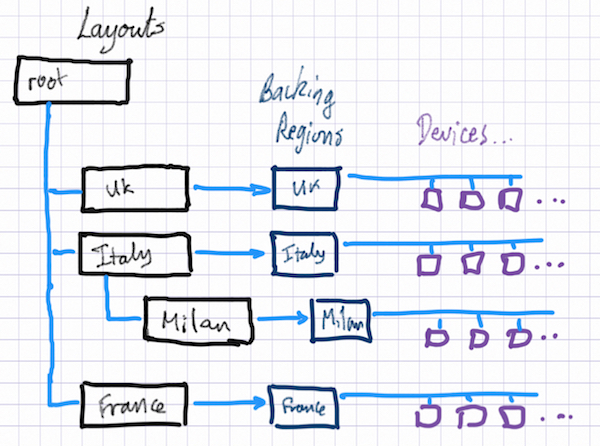
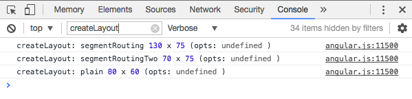

# GUI Topology 2 View

## Introduction

*Topology 2* is a "region aware" view of the topology, where the administrator can configure the network into regions and sub-regions.

In its default state (where no "regions" or "layouts" are defined), it should look and behave similarly to (and eventually the same as) the ["classic" Topology](gui-topology-view.md) view.

> Note that this view is currently "experimental", although the longer term plan is to bring it up to par with the "classic" view, which it will eventually replace.
>
> A more detailed description of the current state of Topology 2 can be found **HERE**. (Steven to provide link)

## Regions

The ONOS model of the network includes *Region* objects which can be configured with a collection of *Devices* (switches) "belonging" to that region.

Regions can be configured using a number of CLI commands:

### region-add

To add a region to the model, the ***region-add*** command can be used..

***region-add** <region-id> <region-name> <region-type> <lat/Y> <long/X> <locType> <region-master>*

*where:*

* ***<region-id>** is a unique identifier for the region*
* ***<region-name>** is a human readable name for the region*
* ***<region-type>** is one of the values defined in the **Region.Type** enumeration:*
  + *CONTINENT, COUNTRY, METRO, CAMPUS, BUILDING, DATA\_CENTER, FLOOR, ROOM, RACK, LOGICAL\_GROUP*
* ***<lat/Y>**, **<long/X>** are the latitude / longitude (for geo layouts) or Y-coord / X-coord (for grid layouts) to be assigned to the region when it is displayed as a node in its parent layout.*
* ***<locType>** is either **geo** (to indicate coords are **lat/long**) or **grid** (to indicate coords are **Y/X**).*
* ***<region-master>** is a list of sets of node-IDs for mastership of the devices (see [RegionAddCommand](https://github.com/opennetworkinglab/onos/blob/master/cli/src/main/java/org/onosproject/cli/net/RegionAddCommand.java#L119-L132) for more details).*

A couple of examples:

```
region-add rUK "United Kingdom" COUNTRY 52.206035 -1.310384 geo "192.168.56.101 / 192.168.56.102"
region-add rRack1 "Primary Rack" RACK 15.0 20.0 grid 10.0.0.5
```

Note that CLI commands are scriptable. One way of doing this is as follows:

```
#!/bin/bash
host=${1:-localhost}
 
onos ${host} <<-EOF
region-add rUK "United Kingdom" COUNTRY 52.206035 -1.310384 geo ${host}
region-add rIT "Italy"   COUNTRY 44.447951  11.093161 geo ${host}
region-add rFR "France"  COUNTRY 47.066264  2.711458 geo ${host}
EOF
```

### region-add-devices

Devices can be assigned to regions with the **region-add-devices** command:

***region-add-devices** <region-id> <dev1> <dev2> ... <dev-n>*

*where*

* ***<region-id>** is the region unique identifier*
* ***<dev-...>** is a device identifier*

For example:

```
region-add-devices rUK \
    of:0000000000000001 \
    of:0000000000000002 \    
    of:0000000000000003
```

### regions

The regions currently configured in the system can be listed with the **regions** command:

```
onos> regions
id=rDE, name=Germany, type=COUNTRY
  master=[localhost]
  of:0000000000000013
  of:0000000000000014
  of:0000000000000015
  of:0000000000000016
  of:0000000000000017
id=rES, name=Spain, type=COUNTRY
  master=[localhost]
  of:0000000000000018
  ...
```

Another region command we'll look at is **region-add-peer-loc**, but we'll defer that until we have covered layouts.

Note that regions do not have any notion of hierarchy; they are simply "collections of devices". The hierarchy is expressed using *Layouts*.

## Layouts

Layouts are used to define a "containment" hierarchy for the regions, as well as provide configuration information for the UI, such as which background decoration to use when displaying the layout; for example a geographical map.

A Layout is a "UI construct" that has an associated region "backing" it. Layouts (except for the "root" layout) declare their parent layout, thereby defining a hierarchy of layouts to be constructed.

The following diagram illustrates an example hierarchy:



Note that the "root" (default) layout does not have a backing region. Any devices (and their attached hosts) that have not been assigned to a region will appear in the topology view at the top level.

Layouts can be configured using a number of CLI commands:

### layout-add

Layouts can be added to the model with the **layout-add** command.

***layout-add** <layout-id> <bg-ref> <region-id> <parent-layout-id> <scale> <offset-x> <offset-y>*

*where*

* ***<layout-id>** is a unique identifier for the layout*
* ***<bg-ref>** is a reference to the background to display for this layout*
* ***<region-id>** is the identifier of the backing region*
* ***<parent-layout-id>** is the identifier of the parent layout*
* ***<scale>**, **<offset-x>**, **<offset-y>** are custom values to define the initial pan/zoom of the background*

Some examples:

```
layout-add root @europe . . 4.66 -2562.93 -412.56
 
layout-add lUK @europe rUK root 11.63 -6652.54 -938.04
layout-add lIT @europe rIT root 7.15 -4818.73 -1330.36
layout-add lFR @europe rFR root 8.98 -5378.99 -1334.77

layout-add lMilan +segmentRouting rMilan lIT 0.86 68.58 54.71
```

Note the use of the dot (".") character in the definition of the root layout, as placeholders for the (non-existent) *region-id* and *parent-layout-id*.

Notes on *<bg-ref>*:

The *<bg-ref>* parameter should take the form:

* + ```
    "."            : to define no background,
    ```
  + ```
    "@{map-id}"    : to define a geo background, or
    ```
  + ```
    "+{sprite-id}" : to define a grid layout background
    ```

Map identifiers can be listed by using the ***ui-geo-map-list*** command in the onos CLI:

```
onos> ui-geo-map-list
UiTopoMap{id=australia, desc=Australia}
UiTopoMap{id=americas, desc=North, Central and South America}
UiTopoMap{id=n_america, desc=North America}
UiTopoMap{id=s_america, desc=South America}
...
```

Additional maps can be registered from an application's server-side *UiExtension* implementation. *(link to tutorial needed)*

Sprite identifiers can be listed by opening the web console, making sure verbose option is selected, and filtering for the string "createLayout":



Additional sprite layouts can be registered from an application's topology overlay JavaScript code. *(link to tutorial needed)*

Notes on *<scale>, <offset-x>, <offset-y>* values:

Currently, getting these values right is a manual process:

* + start by setting them to  `1.0  0.0  0.0`
  + enable debugging of *UiWebSocket* to see message transmissions between client and server
    - onos> l**og:set DEBUG org.onosproject.ui.impl.UiWebSocket**
  + in the UI, pan and zoom the map to the desired location
  + in the log, identify the last *UiWebSocket* RX message for "**updateMeta2**"
    - `2017-05-26 17:07:15,750 | DEBUG | tp1445302012-173 | UiWebSocket`
    - `| 158 - org.onosproject.onos-gui - 1.11.0.SNAPSHOT |
      RX message:`
    - `{"event":"updateMeta2","payload":{"id":"layoutZoom",`
    - `"memento":{"scale":4.66,"offsetX":-2560.646888427734,"offsetY":-409.13537841796875}}}`
  + use the values listed in the "**memento**" field for your scripted command (you should be safe rounding to 4 decimal places)

One further note:

If the user zooms and pans a layout, the UI will remember how they left it.

However, by pressing the '***R***' key, the view will reset to the *<scale/offset>* values configured in the **layout-add** command.

### layouts

The layouts currently configured in the system can be listed with the **layouts** command:

```
onos> layouts
id=lDE, bgref=@europe, region=rDE, parent=root
id=lES, bgref=@europe, region=rES, parent=root
id=lFR, bgref=@europe, region=rFR, parent=root
id=lIT, bgref=@europe, region=rIT, parent=root
id=lMilan, bgref=+segmentRoutingTwo, region=rMilan, parent=lIT
id=lUK, bgref=@europe, region=rUK, parent=root
id=root, bgref=@europe, region=(root), parent=root
```

## Putting this all together

View a [brief demonstration](https://youtu.be/4aPoD7fAoW8) of the UI configured with the [regions-europe.sh](https://github.com/opennetworkinglab/onos/blob/master/tools/test/topos/regions-europe.sh) script...

# Further Topics

* [GUI Topology 2 Overlay API](gui-topology-2-view/gui-topology-2-overlay-api.md)
