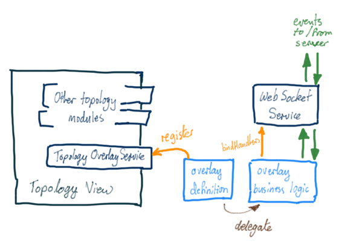

# GUI Topology Overlay API

This page describes the JavaScript API that the Topology View provides to allow contributed application code to integrate with, and provide additional functionality to, the topology view.

Note that this API pertains to the "Classic" Topology View (topo). For the "Region Aware" Topology view see [here](../gui-topology-2-view/gui-topology-2-overlay-api.md).

# Recommended Usage Pattern

The following figure illustrates the recommended pattern for defining the (client-side) code for a topology overlay:



It is strongly recommended that the *overlay definition and business logic* are kept in separate modules. The definition should contain no state, and its callbacks and other functions should delegate work to the business logic module.

The definition module (**.js** file) should register with the *Topology Overlay Service*.

The business logic module (**.js** file) should bind event handlers with the *Web Socket Service*, to handle incoming events from the server, as well as use the *sendEvent()* function (also on the *Web Socket Service*) to send events to the server.

See example code for:

* [Overlay definition](gui-topology-overlay-api/gui-topology-overlay-sample-definition.md)
* [Overlay business logic](gui-topology-overlay-api/gui-topology-overlay-sample-business-logic.md)

# Topology Overlay Service

The *Topology Overlay Service* is a JavaScript module that provides the [client-side API](https://github.com/opennetworkinglab/onos/blob/master/web/gui/src/main/webapp/app/view/topo/topoOverlay.js) for registering new "topology overlay" components.

The functions exported on the API are summarized below. Note that applications should only be invoking the ***register()*** function. The remaining functions are documented here for reference only; they provide the integration of overlay modules with the rest of the topology view.

| Function | Description |
| --- | --- |
| ``` register ``` | Main function that applications should call to register their overlay definition. |
| ``` setApi ``` | Injects an internal API for accessing other topology modules. (internal use only). |
| ``` list ``` | Lists the registered overlays. |
| ``` overlaysAcceptingIntents ``` | Returns a list of overlays that support "intent rendering". |
| ``` augmentRbset ``` | Utility function to add radio buttons to the topology toolbar - one for each overlay. |
| ``` mkGlyphId ``` | Utility function to create a glyph identifier (expands '\*' prefixes to the overlay identifier). |
| ``` tbSelection ``` | Toolbar overlay button selection callback. |
| ``` installButtons ``` | Installs action buttons on the detail panel. Usually just the core buttons, but this can include buttons defined by the currently active overlay. |
| ``` addDetailButton ``` | Adds a button to the detail panel |
| ``` resetOnToolbarDestroy ``` | Function to reset state when the toolbar is destroyed. |
| ``` showHighlights ``` | Event handler for "showHighlights" event from the server. |
| ``` setLionBundle ``` | Invoked by the framework to set the appropriate localization bundle. |

The following functions are specialized "hooks" for integrating callbacks for overlays (optionally) defined on the overlay definition.

If an overlay definition includes hook functions of the same name, those callbacks will be invoked at the appropriate times, whenever the overlay is currently active.

| ``` hooks.{function} ``` | Description |
| --- | --- |
| ``` escape ``` | Invoked when the Escape key is pressed. |
| ``` emptySelect ``` | Invoked when the user empties the "selection" (e.g. clicking on the topology background). |
| ``` singleSelect ``` | Invoked when the user selects a single item (device, host) on the topology view. |
| ``` multiSelect ``` | Invoked when the user selects multiple items (device, and/or hosts) on the topology view. |
| ``` mouseOver ``` | Invoked when the user hovers the mouse over a node (device, host). |
| ``` mouseOut ``` | Invoked when the user moves the mouse away from a node (device, host). |
| ``` showIntent ``` | Invoked when the topology view is directed to render an intent (e.g. from the Intents view). |
