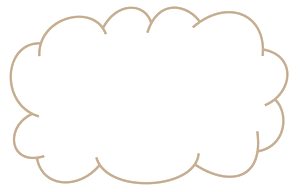
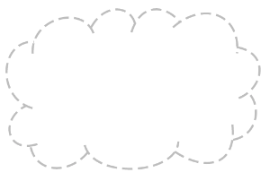
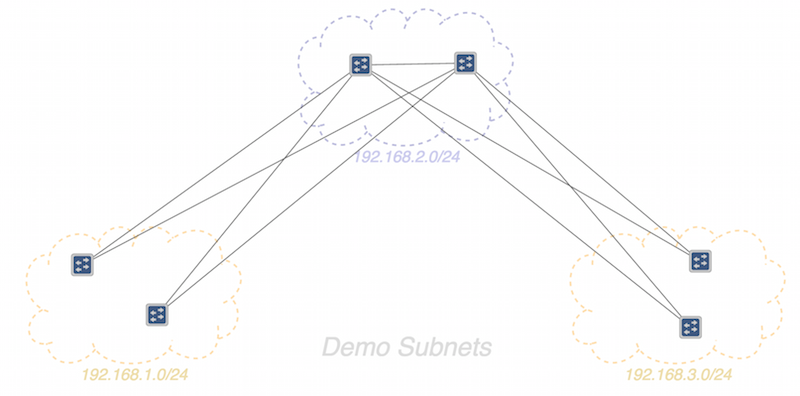

# Topology Sprite Layer

# 

# Topology View – Custom Sprites

The [GUI Topology View](../gui-topology-view.md) has the ability to have custom sprites displayed as a layer between the (geographical) background map and the topology elements (nodes/links).

In the current release (1.2.0 "Cardinal") sprite layers are defined in an external JSON format and uploaded to the controller via a REST command. They are loaded into the Topology view by manually adjusting the browser URL to include a "sprites" query parameter. We hope to provide a more user-friendly mechanism (directly through the GUI) in some future release.

# JSON Sprite Definition File

The sprites to load into the sprite layer of the topology view are defined in an external file.

## File Format

The general format of the JSON is as follows:

```
{
  "defn_name": "sprite_layer_id",
  "defn_desc": "Brief One-Line description of sprite layer",
 
  "_comment": [
    "Multi-line comment...",
    "if desired.",
    "(This is optional)"
  ],
 
  "paths": [
    { ... path defn 1 ... },
    { ... path defn 2 ... },
    ...
  ],
 
  "defn": [
    { ... sprite defn 1 ... },
    { ... sprite defn 2 ... },
    ...
  ],

  "load": {
    "alpha": ... ,
    "sprites": [
      { ... sprite instance 1 ... },
      { ... sprite instance 2 ... },
      { ... sprite instance 3 ... },
      ...
    ],
    "labels": [
      { ... label instance 1 ... },
      { ... label instance 2 ... },
      ...
    ]
  }
}
```

### File Identification

The ***defn\_name*** property should be a short string to be used as a (unique) ID for this definition. For example, '*subnets*', or '*campus*', etc.

The ***defn\_desc*** property should be shortish string to be used as a descriptive title for this definition. For example, 'Map of Stanford Campus'.

The ***\_comment*** property (an array of strings), is optional. It can be used to provide some commentary about the file.

### Path Definitions

The ***paths*** property should be an array of objects of the following form:

```
{                                                {
  "tag": "<path_id>",                              "tag": "<path_id>",
  "stroke": { ... },               == OR ==        "stroke": { ... },
  "glyph": "<builtin_glyph_id>"                    "viewbox": "<viewbox_data>",
}                                                  "d": [ ... ]
                                                 }
```

Both forms require a ***tag*** property which gives a unique name to the path.

Both forms may specify an optional ***stroke*** property which should be an object, the keys of which define CSS *stroke\_\** properties to apply to the path. For example:

```
"stroke": {
  "width": 2.5,
  "dasharray": [4, 2]
}
```

This will apply the following CSS styles to the path when the sprite is rendered:

```
stroke-width="2.5"
stroke-dasharray="4, 2"
```

The first form is used when the required path already exists as a glyph in the glyph service.

For example, the "cloud" glyph is already defined ... 

We can re-use that path, by defining a ***glyph*** property with the value ***"cloud"*** (the id of the glyph). At the same time, we can apply a "dotted line" style to the path; for example:

```
{ 
  "tag": "dotted-cloud",
  "stroke": {
    "dasharray": [4, 2]
  }
  "glyph": "cloud"
}
```

Resulting in something like this....          

We plan to add a few more simple shapes to the glyph service to serve as sprites, e.g. rectangle, rounded rectangle, oval, ... but this hasn't happened yet.

The second form is used when you want to define your own SVG path by supplying a viewbox and data definition.

The ***viewbox*** property should be the "viewbox" string for the SVG path; for example, ***"0 0 200 200"***.

The ***d*** property should either be a string, or an array of strings (which will be joined together), defining a sequence of SVG path commands; for example:

```
"d": [
  "M50,50h100v100h-100z",
  "M70,70h60v60h-60z"
]
```

.. which defines a path composed of two concentric squares.

See [SVG Paths](http://www.w3.org/TR/SVG/paths.html) (or a good SVG reference book) for more detailed information.

### Sprite Definitions

The ***defn*** property should be an array of "sprite objects" that define a "stamp" if you will, that can be positioned multiple times on the view. Each element of the array should have the following form:

```
{
  "id": "<sprite_id>",
  "path": "<path_id>",
  "dim": [<width>, <height>],
  "labelyoff": <percent_from_top>
}
```

These elements tie together a path, the size (dimension) it should be mapped into, and how far from the top of the sprite the label should be positioned, if supplied – all under a unique sprite id.

As an example:

```
{
  "id": "subnetA",
  "path": "dotted-cloud",
  "dim": [400,400],
  "labelyoff": 0.9
}
```

The ***id*** property should uniquely identify this sprite definition.

The ***path*** property should match the ***tag*** of one of the paths specified earlier in the file.

The ***dim*** property is a two element array defining the *width* and *height* that the sprite should map into, given in logical coordinates of the topology view's SVG layer. Note that "zoom-factor 1.0" maps 1000 units as the height of the view (approximately). Some experimentation may be required.

The ***labelyoff*** property (label-y-offset) expresses the ratio (between top and bottom of the sprite's bounding box) for where the label text for the sprite instance should be positioned (if supplied). In this example, the *0.9* equates to *90%* of the way down, so somewhere close to the bottom edge of the sprite. Note that the label is automatically centered horizontally within the sprite's bounding box.

### Load Definition

The ***load*** property defines an object with three optional keys: ***alpha***, ***sprites*** and ***labels***.

If ***alpha*** is defined, it should be a real number in the range *0.0 – 1.0*: it defines the opacity applied to the sprite layer as a whole. If not defined, the value of ***1.0*** is used (i.e. fully opaque).

If ***sprites*** is defined, it should be an array of elements with the following form, each defining where to "stamp" a copy of the sprite on the view:

```
{
  "id": "<sprite_id>",
  "pos": [<x>,<y>],
  "label": "<label_text>",
  "class": "<class_name>"
}
```

The ***id*** property specifies one of the sprites (defined earlier) by id.

The ***pos*** property (position) is a two element array defining the *X* and *Y* coordinates of the top-left corner of the sprite's bounding box, given in logical coordinates of the topology view's SVG layer.

The ***label*** property is optional. If supplied, it defines the text to be used for the sprite's label. If no label is provided, no text is shown.

The ***class*** property is also optional. It defines a "logical" color class to apply to the path. If not supplied, it defaults to ***"gray1"***. Its value should be selected from the list:

* ***gray1***
* ***blue1***
* ***gold1***

More logical class IDs may be added in the future...

If ***labels*** is defined, it should be an array of arbitrary text labels to be placed on the view. Each item in the array should take the form:

```
{
  "pos": [<x>,<y>],
  "text": "<text-to-display>",
  "size": <size-multiplier>,
  "class": "<class_name>"
}
```

The ***pos*** property (position) is a two element array defining the *X* and *Y* coordinates of the lower-middle of the text's bounding box, given in logical coordinates of the topology view's SVG layer. That is to say, the X coordinate denotes the middle of the bounding box, and the Y coordinate denotes the base-line of the text.

The ***text*** property is a string of the text to display.

The ***size*** property is optional. If supplied it increases (or reduces) the font size (from the nominal default size) by the specified amount.

The ***class*** property is similarly optional, and as described above.

An example ***load*** property might look something like this:

```
"load": {
  "alpha": 0.9,
  "sprites": [
    { "id":"subnetA", "pos":[250,40], "label":"192.168.2/24", "class":"blue1" },
    { "id":"subnetA", "pos":[-200,400], "label":"192.168.1/24", "class":"gold1" },
    { "id":"subnetA", "pos":[700,400], "label":"192.168.3/24", "class":"gold1" }
  ],
  "labels": [
    { "pos":[0,50], "text":"Dev Lab Subnets", "size":1.4 }
  ]
}
```

## Sample Files

Sample sprite definition files can be found in the source code repository under the onos-web bundle:

[onos-web:~/gui/src/main/webapp/data/sprites](https://github.com/opennetworkinglab/onos/tree/master/web/gui/src/main/webapp/data/sprites)

# Uploading Sprite Definitions to the Server

The sprite definition file can be uploaded to the server with the ***[onos-upload-sprites](https://github.com/opennetworkinglab/onos/blob/master/tools/test/bin/onos-upload-sprites)*** script.

```
onos-upload-sprites <server-ip> <sprite-defn.json>
```

For example:

```
onos-upload-sprites localhost clouds.json
```

If you happen to be looking in the karaf log (*$KARAF\_LOG*) you should see an entry that looks something like this:

```
<date> | INFO | ... | UiExtensionManager | 151 - org.onosproject.onos-gui - 1.2.0.SNAPSHOT | Registered sprite definition [clouds]
```

You can load multiple sprite definition files at the same time. The server keeps the definitions in an in-memory cache, indexed by their ***defn\_name*** (shown in [ ... ] in the log file). 

 

Currently, definition files are only uploaded to the specified controller; they are not distributed to other controllers in the cluster. This means that the UI will only be able to install the sprites when it attaches to that specific controller. Note also that the definitions are not persisted; if the controller is restarted, you will have to upload the definitions again.

# Installing the Sprites into the Topology View

The first thing you probably want to do is to hide the background (geographical) map, if it is showing. Press '**B**' to toggle the map visibility.

By default, the sprite layer in the topology view is empty. To load a sprite definition, modify the URL in the address bar to add the "sprites" query parameter with the ID of the sprites definition, and then refresh the page. For example:

*http://localhost:8181/onos/ui/index.html#/topo**?sprites=clouds***

This instructs the topology view to request the "clouds" sprites definition data from the server, and install it into the sprites layer.

The GUI will cache the sprites ID locally, so future invocations of the topology view (without the query parameter specified) will also send a request to the server for the sprites definition data.


