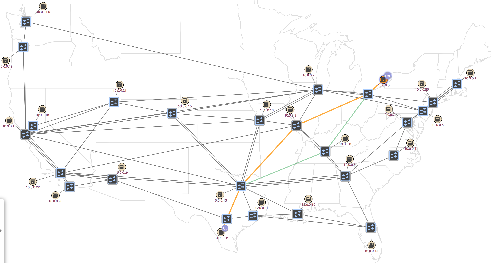
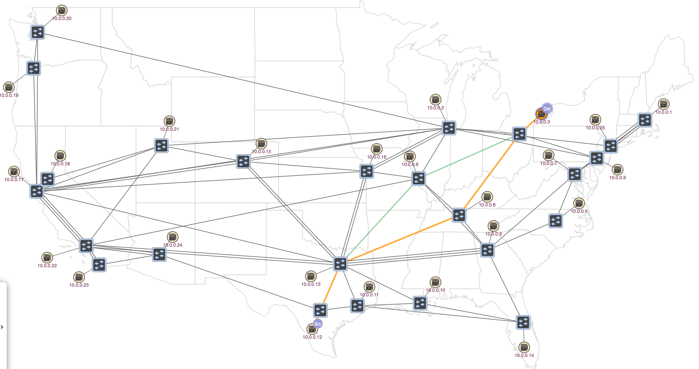
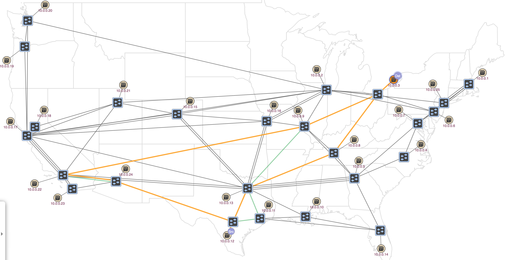

# Path Painter Application GUI

# Introduction

This page provides information on how to use and understand the PathPainter Application for the ONOS Web UI.

The PathPainter application allows the user to see the different type of paths between two entities in ONOS, regarding of their type.

The application has three different modes for three different type of paths:

* shortest: highlights the shortest paths between the source and the destination
* disjoint: highlights the disjoint paths between the source and the destination
* geoPath highlights the geographically shortest path

# Application Key bindings

While in the PathPainter application there are different key mappings and buttons for different functionalities.

| Button | Key | Functionality |
| --- | --- | --- |
|  | [ | Set source device |
|  | ] | Set destination device |
|  | 3 | Swap source and destination device |
|  | 4 | Set the path computation to shortest |
|  | 5 | Set the path computation to disjoint |
|  | 6 | Set the path computation to geoData |
|  | Right  arrow | Go to the next path in the set of paths  from source and destination |
|  | Left  arrow | Go to the previous path in the set of paths  from source and destination |

# Usage

In order to use the PathPainter application you need to have onos installed and configured.

First step is to start the gui:

```
$: onos-gui 
```

Once the GUI is stated up in your browser you should activate the pathpainter app by opening the left-side panel, going to applications, finding org.onosproject.pathpainter and clicking the activate button on the upper-right side corner.

You can then return to the topology view and open the toolbar panel in the bottom left side of the screen by pressing the dot key.

Once you have the toolbar open you should see the pathPainter Icon:


Clicking on the Icon will activate the application GUI overlay.

Once you have the overlay active you can select an element and set it, through the button or the 1 key, as the source from which you want to see the paths. The selected element should now have a "Src" badge. Afterwards you should select another host and set it as the the destination. A "Dst" badge will appear and you will see some highlighted paths. If you have not changed previously the mode it will be shortest by default.



The paths will be highlited in two colors, yellow for the current primary path and green for all the others paths between the two elements. Now you can circle between the paths with the correct buttons or the keyboard arrows.



When you select a different mode you can see that the highlighted paths change, in this case we selected disjoint paths mode.


