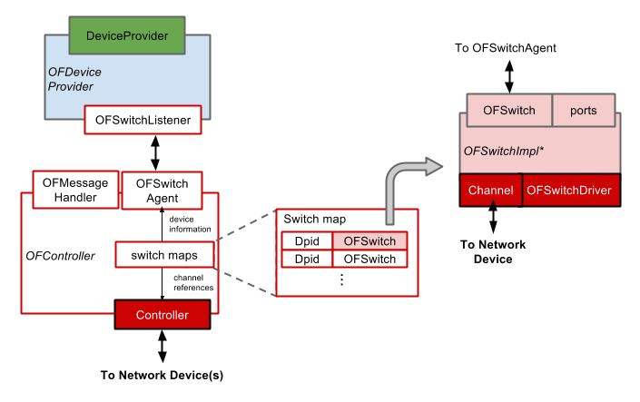
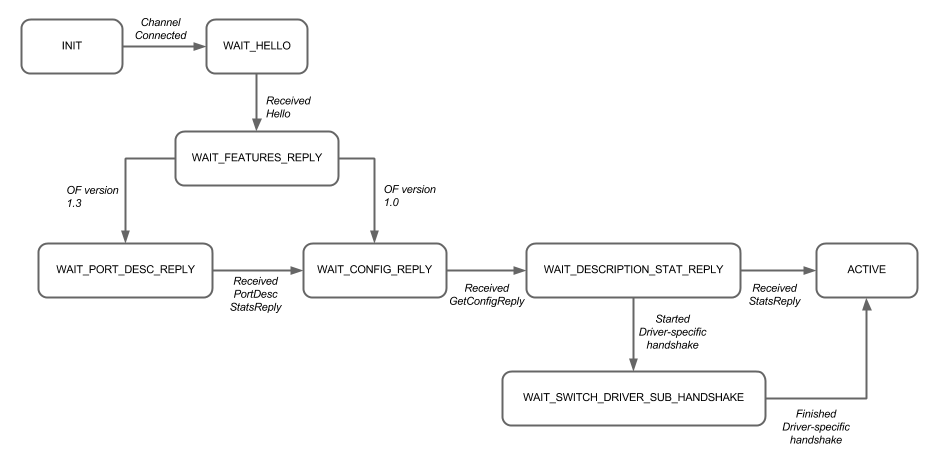

# Device Subsystem

This section describes the function and structure of the Device subsystem, including a detailed look at the OpenFlow facilities.

## Overview

The Device subsystem is responsible for discovering and tracking the devices that comprise the network, and for enabling operators and applications to control them. Most of ONOS's core subsystems rely on the the Device and Port model objects created and managed by this subsystem, and/or its provider for interacting with the network.

The Device subsystem follows the architecture described in [System Components](system-components.md), featuring:

* A `DeviceManager` capable of interfacing with multiple `Providers` via a **`DeviceProviderService`** interface and multiple listeners via a **`DeviceService`** interface
* **`DeviceProviders`**, each with support of their own network protocol libraries or means to interface with the network
* A `DeviceStore`, which tracks Device model objects and generates **`DeviceEvents`**

This section focuses on the aptly named `OpenFlowDeviceProvider`, used by ONOS to interact with OpenFlow networks. The `OpticalConfigProvider`, used to read in network configurations for optical networks, will be described as part of the [Packet Optical use case].

## Model Objects and Provider Representations

[Recall](network-state-construction/representing-networks.md) that ONOS represents various network components and properties as protocol-agnostic model objects at the core tier, and as protocol-specific objects at the provider tier. The following are the major representations translated across the two tiers:

| DeviceManager | OpenFlowDeviceProvider |
| --- | --- |
| `Device` | `OpenFlowSwitch` |
| `DeviceId/ElementId` | `Dpid` |
| `Port` | `OFPortDesc` |
| `MastershipRole` | `RoleState` |

## The OpenFlow Subsystem

The OpenFlow southbound is comprised of the `OpenFlowDeviceProvider` and the OpenFlow driver components. While not a subsystem in the ONOS subsystem sense, we will refer to these components collectively as the OpenFlow subsystem. The OpenFlow subsystem implements the controller-side behavior of the OpenFlow protocol using the Java protocol bindings generated with [Loxi](https://github.com/floodlight/loxigen/wiki/OpenFlowJ-Loxi). As such, the currently supported protocol versions are 1.0 and 1.3, the former with Nicira vendor extensions to add role negotiation functionalities.

The following figure summarizes the organization of this southbound.

*Note: "OF"* is shorthand for *"OpenFlow"*. For example, the actual name of *OFSwitch* above is *OpenFlowSwitch.*Exceptions will be noted when they crop up.

Not shown above are how there are (currently) three switch maps for Switch objects in various states,  
and the entry points for the other subsystems.

The blue and green blocks correspond to the Provider Component and Provider in the figure under [Subsystem Structure](system-components.md). The red and pink blocks and those with red outlines represent the constituents of the red block labeled 'Protocols' in the same figure([Subsystem Structure](system-components.md)). The red and pink blocks highlight the components that directly play a role in communicating with the infrastructure via TCP connections.

### The OpenFlow Controller

The OpenFlow functions are orchestrated through the **`OpenFlowController`** (OFController in the above figure). This component stores mapping of switch DPID to references to `OpenFlowSwitch` objects, and generates OpenFlow events that listeners (providers) may subscribe to. Providers may subscribe as one or more of the following listeners:

* ***`OpenFlowSwitchListener`***  - A listener for switch events, e.g. switches connecting and disconnecting. Examples: `OpenFlowDeviceProvider`, `OpenFlowLinkProvider`.
* ***`OpenFlowEventListener`*** - A listener for OpenFlow messages. Example: the `OpenFlowRuleProvider`.
* ***`PacketListener`*** - A listener for incoming traffic packets (PacketIns). Examples: `OpenFlowPacketProvider`, `OpenFlowLinkProvider`, `OpenFlowHostProvider`.

The `OpenFlowController` is also responsible for establishing, and managing the communication channels for each of the Switch objects that it learns about. Connections are established by the **`Controller`**, and the state of each connected switch is kept track of by the **`OpenFlowSwitchAgent`**. Specifically, `Controller` associates a TCP OpenFlow channel (the `OFChannelHandler`, currently in Netty) to an incoming connection by creating a Switch object with a reference to the TCP connection (labeled "Channel" above).

### OpenFlow Switch Objects

The OpenFlow Switch object is the OpenFlow subsystem's representation of a network device, complete with a set of ports, unique identifier, device information, and a channel reference to the actual device connected on the other side. It is a composite of multiple interfaces, implemented as a series of **`OFSwitchImpl*`** classes. Each such implementation represents a type of OpenFlow-capable switch; for example, `OFSwitchImplOVS10` is a representation of an [OpenVSwitch](http://openvswitch.org) supporting OpenFlow 1.0. A single instance of a Switch object represents a single OpenFlow connection from the network.

A Switch object has two types of interfaces:

* ***`OpenFlowSwitch`***, facing north, towards Providers, and
* ***`OpenFlowSwitchDriver`***, facing south towards the channel and `Controller`

In general, the first interface allows providers (and indirectly, the rest of ONOS) to interact with the Switch object, and second interface deals with the details of the protocol that require (or should have) little or no intervention from the rest of the system. These include parts of the OpenFlow handshake unique to various types of switch, and certain forms of sanity checking of incoming/outgoing messages.

## Switch States

Switch objects are associated with several types of states. Each state has a set of behaviors associated with it, e.g. the types of control messages that a Switch expects to receive or send. Two of the primary states tied to a Switch are its *Channel State*, and the ONOS instance's *role*.

The **`OFChannelHandler`** implements the channel state FSM in the `ChannelState` Enum. Each enum value represents the various points in the OpenFlow handshake. The following flowchart represents this FSM.

The state transitions for this FSM are driven by the reception of various OpenFlow messages during the handshake, which are defined in the [OpenFlow specifications](https://www.opennetworking.org/wp-content/uploads/2014/10/openflow-switch-v1.5.1.pdf). Driver-specific aspects of the handshake, such as the exchange of barrier messages by some 1.3 switches, are implemented per `OFSwitchImpl`\* class for the specific type of switch.

The role of an ONOS instance describes its read and write permission regarding a Switch object. In the multi-instance setting, one ONOS instance will be a *Master* with full control over the network switch, and the rest will be *Equals* only capable of reading state information from a network switch. The roles are enforced both at the `OpenFlowSwitchDriver` level by the `RoleManager` (not shown), and at a protocol-neutral level by the *Cluster* Subsystem.

Roles are discussed further in [Cluster Coordination](distributed-operation/cluster-coordination.md).

---

[Previous : Representing Networks](network-state-construction/representing-networks.md)  
[Next : Clustering](distributed-operation/cluster-coordination.md)

---
