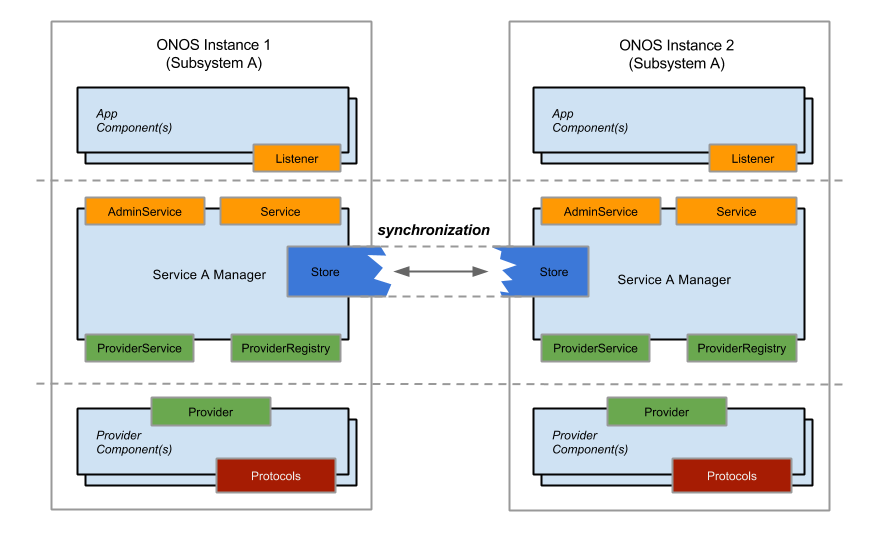

# Cluster Coordination

This section describes the subsystems responsible for ONOS's distributed functionalities. This includes information distribution and synchronization, cluster management, and device mastership management.

## Overview

A multi-instance ONOS deployment is a ***cluster*** of one or more ONOS instances, or ***nodes***, each with an unique `NodeId.` Each node in a cluster is aware of the state of a subsection of the network. The state information local to a subsection is disseminated across the cluster as events, by the node that manages the subsection. The events are generated in the store, and are shared with all of the nodes in a cluster via distributed mechanisms built into the various services' *distributed stores*.

In addition to data distribution, an ONOS cluster must:

* Detect and handle nodes joining and leaving the cluster
* Delegate control over devices, such that any given device has one primary controller

The first item is managed by the *Cluster subsystem*, which contains Cluster and Mastership management. The remaining sections elaborate on the distributed store, and describe the functions of these managers.

## Distributed Stores

Depending on the requirements of a service, how the contents of a store is distributed between nodes can have different characteristics (e.g. strongly consistent, eventually consistent, ...). This is made possible by having each service's store implement the appropriate distribution mechanism. Historically, the store for Mastership management used Hazelcast's distributed structures as a strongly consistent backend. Since v1.4 the Atomix framework is used instead. The stores for Device, Link, and Host management uses an optimistic replication technique complemented by a background gossip protocol to ensure eventual consistency.

Simply put, the same subsystems of two different nodes synchronize directly with one another through the Store. The Store only synchronizes the states of the subsystem that it is part of; A `DeviceStore`, for example, only knows about the state of devices, and does not have any knowledge of how host or link information is tracked. The figure below summarizes this for two nodes and a subsystem "A" that is part of both.

At the time of this writing, all services with the exception of topology management have access to distributed stores. The distributed topology store simply relies on the distributed versions of the device, link and host stores.

### Event ordering

For the eventually consistent stores, events are partially ordered with an approach similar to vector clocks. The logical clock used by the `DeviceStore` and `LinkStore` is a combination of the number of mastership hand-offs for a device since its discovery (its *term number),* and a sequence number local to the node that is incremented per observed event. The `HostStore` relies on system time (the *wall clock*), due to the lifespan of Host objects and their mobility that prevents them from being tied to a particular device. The mechanisms of the device-based logical clock are detailed further in the next section, [Network Topology State](network-topology-state.md).

## Cluster Management

ONOS also uses the term 'cluster' to refer to connected subgraphs of the network topology, which has no association to the cluster in the multi-instance sense. When clusters are mentioned in this section, they are strictly in terms of the latter.

The Cluster subsystem is responsible for the following:

* Keeping track of the membership of a cluster
* Delegating identifiers to nodes, in the form of `NodeId`s
* Providing the notion of a *local node,* similar to *localhost*

The **`DistributedClusterStore`** historically leverages Hazelcast for its cluster membership facilities by implementing Hazelcast's `MembershipListener`, and using it to translate `MembershipEvent`s into ONOS **`ClusterEvent`**s. It also relies on it for the setup and management of the multicast group used for inter-store communication. 

Since v1.4 Hazelcast has been replaced by the Atomix framework. This change was motivated by managing the recovery from split-brain situations. Since Atomix is based on the RAFT consensus algorithm, the cluster must be composed by an odd number of member controller nodes. Previously supported 2- or 4-node deployments shall be replaced by 3- and 5-node deployments.

## Device Mastership Management

A device is free to connect to one or more nodes in a cluster. The three roles that a node can take with respect to a device are:

1. `NONE` : The node may or may not have knowledge of the device, and cannot interact with it.
2. `STANDBY` : The node has knowledge of the device, and can read the state of, but not manage (write to) the device.
3. `MASTER` : the node has knowledge of the device, and has full control of (read-write access to) the device.

These three roles map to the NONE, SLAVE, and MASTER roles specified by OpenFlow v1.2<, respectively, and are defined by the enum **`MastershipRole`**. The mastership subsystem is responsible for guaranteeing that every device has exactly one MASTER at any given time, and that the rest are either STANDBY or NONE. The following sections describe how the service assigns and reassigns roles, and recovers role assignments after various types of failures.

### Node Mastership Lifecycle

A node begins in the NONE role. In current implementations, the first node to confirm that 1) the device has no master tied to it, and 2) has a control channel connection to the device, becomes its master. Any other nodes that subsequently discover the device become either STANDBY, if it has a connection to the device, or remain as NONE otherwise. The last case occurs when the `DeviceService` detects a device indirectly through the distributed store, or if a previously connected device disconnects. The mapping of roles, nodes, and devices are kept in the `MastershipStore` as a distributed map of `DeviceId`s to **`RoleValue`** model objects.

The established roles can change as a result of various events. We currently consider the following events:

* Administrative intervention : an operator manually sets the role of a device
* Disconnection of/from a device : the node loses control channel connectivity to a device
* Disconnection from the cluster (Split-brain syndrome)

The `MastershipManager` responds to these role-changing events with *role relinquishment* and *reelection* to maintain the "at most one master per device" policy, and to ensure that a node incapable of properly handling a device doesn't get elected into mastership. 

The term 'node', 'MastershipManager', and 'MastershipService' are used interchangeably in these sections.

#### Role relinquishment

A node that relinquishes its role gives its current role up to fall back to the NONE role. A node will relinquish its role for a device if:

* It loses its connection to a device, or the device fails
* It becomes part of the minority during a split-brain situation
* An administrative command sets its role to NONE
* Consistency checks fail, e.g if an OpenFlow device responds to a RoleRequest with an error, or unanticipated mastership changes occur

#### Reelection

A node resigning from mastership may elect another node to become the new master for a device. Reasons for reelections include:

* Failure (role relinquishment) of a master node
* Device disconnection from a master node
* Administrative demotion of a master to either STANDBY or NONE

A candidate node is selected from the pool of known standby nodes for a device. Currently, this pool is a ordered list of `NodeID`s in preference order. This enables the relinquishing node to simply choose the next node on the list to ensure that the candidate is the next-best choice.

 The candidate can choose to become the new master, or facing failure scenarios, appoint another candidate upon role relinquishment. Reelection can occur up to N times, given that there are N standby nodes for the device. Such a chain of handoffs can arise if the device fully disconnects from the control plane, and this mechanism serves to prevent endless reelections.

### Handling Split-brain Scenarios

Given that a cluster splits into two of different sizes, the nodes in the smaller cluster will relinquish their roles, or, incapable of doing so, members of the larger cluster will force reelections for devices whose master nodes became part of the smaller cluster. The `MastershipManager` determines whether it is in the minority or majority by querying the `ClusterService.`

Historically, the ONOS implementation (based on Hazelcast) does not handle the case where the partitions are equal in size, **and** both are still connected to the network. Since v1.4, the Atomix framework ensures that this situation would not occur, since the number of controller cluster members are always odd (usually 3 or 5).

## Relation to the Device Subsystem

The Device subsystem uses the role information maintained by the `MastershipManager` in order to determine which nodes are allowed to interact in what way with the devices that it has knowledge about. The `MastershipManager` also listens for device events as cues to force role reelections and relinquishments. Finally, any role-related control messages to and from the network, such as OpenFlow RoleRequests and RoleReplies, must be sent and received via `DeviceProvider`s; therefore, the DeviceService must manipulate the network on behalf of the MastershipService. 

 

---

[Previous : Distributed Operation](../distributed-operation.md)  
 [Next : Network Topology State](network-topology-state.md)

---
