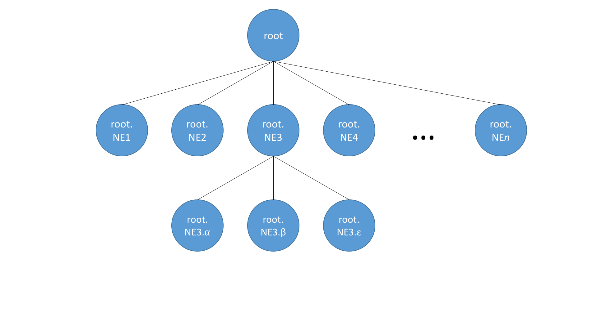

# Dynamic Configuration Subsystem

# Overview

 In ONOS, various abstractions collect configuration information pertaining to the network and network elements and store them in the implementation defined system wide models. But often in the brown fields, applications create or collect similar configuration information  and work with their own individual information models. Often these models are heterogeneous and most of them do not directly confirm to the models/abstraction within ONOS. Purpose of the Dynamic config subsystem is to provide suitable abstractions that would enable ONOS to consume/produce configuration in a structured and extensible manner. Parking such abstracted configuartions within ONOS would also allow opportunities for other abstractions (like drivers, providers etc.) to consume or modify them.

 

 Components

The main components of this subsystem include the Dynamic config service and manager, Dynamic config store interface and the distributed config store. Dynamicconfig service is the gateway for applications to inject configs to ONOS. Dynamic config manger implements this service and is responsible for managing the distributed config store; this component also provides an RPC dispatching framework, for the yang based RPCs. The distributed config store implementation is wrapping the Document Tree primitive and is built on top of the ONOS Distributed storage implementation.

The important abstractions that Dyanmic config subsystem provides, are the DataNode, ResourceId, RpcService, RpcInput and RpcOutput. DataNode is the abstraction to hold any configuration that ONOS (any module within ONOS) would deal with. ResourceId is the globally unique identifier for any such configuration nodes; this is created by abstracting information available in the schema about a given config node. RpcService, input and output provide abstractions for defining an Rpc interface contatining various Rpc methods, their input and output respectively. The dispatcher framework works on these abstractions.

# APIs

Dynamicconfig service supports the following APIs currently:

```
public interface DynamicConfigService  
        extends ListenerService<DynamicConfigEvent, DynamicConfigListener> {  
    /**  
 * Creates a new node in the dynamic config store.  
 * This method would throw an exception if there is a node with the same  
 * identifier, already present at the specified path or any of the parent  
 * nodes were not present in the path leading up to the requested node.  
 * Failure reason will be the error message in the exception.  
 *  
 * @param path data structure with absolute path to the parent  
 * @param node recursive data structure, holding a leaf node or a subtree  
 * @throws FailedException if the new node could not be created  
 */  
 void createNode(ResourceId path, DataNode node);  
  
    /**  
 * Reads the requested node form the dynamic config store.  
 * This operation would get translated to reading a leaf node or a subtree.  
 * Will return an empty DataNode if after applying the filter, the result  
 * is an empty list of nodes. This method would throw an exception if the  
 * requested node or any parent nodes in the path were not present.  
 * Failure reason will be the error message in the exception.  
 *  
 * @param path data structure with absolute path to the intended node  
 * @param filter filtering conditions to be applied on the result list of nodes  
 * @return a recursive data structure, holding a leaf node or a subtree  
 * @throws FailedException if the requested node could not be read  
 */  
 DataNode readNode(ResourceId path, Filter filter);  
  
    /**  
 * Returns whether the requested node exists in the Dynamic Config store.  
 *  
 * @param path data structure with absolute path to the intended node  
 * @return {@code true} if the node existed in the store  
 * {@code false} otherwise  
 */  
 Boolean nodeExist(ResourceId path);  
  
    /**  
 * Updates an existing node in the dynamic config store.  
 * Existing nodes will be updated and missing nodes will be created as needed.  
 * This method would throw an exception if the requested node or any of the  
 * parent nodes in the path were not present.  
 * Failure reason will be the error message in the exception.  
 *  
 * @param path data structure with absolute path to the parent  
 * @param node recursive data structure, holding a leaf node or a subtree  
 * @throws FailedException if the update request failed for any reason  
 */  
 void updateNode(ResourceId path, DataNode node);  
  
    /**  
 * Replaces nodes in the dynamic config store.  
 * This will ensure that only the tree structure in the given DataNode will  
 * be in place after a replace. This method would throw an exception if  
 * the requested node or any of the parent nodes in the path were not  
 * present. Failure reason will be the error message in the exception.  
 *  
 * @param path data structure with absolute path to the parent  
 * @param node recursive data structure, holding a leaf node or a subtree  
 * @throws FailedException if the replace request failed  
 */  
 void replaceNode(ResourceId path, DataNode node);  
  
    /**  
 * Removes a node from the dynamic config store.  
 * If the node pointed to a subtree, that will be deleted recursively.  
 * It will throw an exception if the requested node or any of the parent nodes in the  
 * path were not present; Failure reason will be the error message in the exception.  
 *  
 * @param path data structure with absolute path to the intended node  
 * @throws FailedException if the delete request failed  
 */  
 void deleteNode(ResourceId path);  
  
    /**  
 * Invokes an RPC.  
 *  
 * @param id of RPC node  
 * @param input RPC input  
 * @return future that will be completed with RpcOutput  
 * @throws FailedException if the RPC could not be invoked  
 */  
 CompletableFuture<RpcOutput> invokeRpc(ResourceId id, RpcInput input);  
}
```

Use Case

In its current state, the following demo use case is planned to be supported (by ONS 2017)

 

Document Tree primitive

This subsystem makes use of the DocumentTree primitive.  The primitive consists of an implementation of [AsyncDocumentTree](https://github.com/opennetworkinglab/onos/blob/7a9d04e9e80c884677f92ed7d5f89cc99e486864/core/api/src/main/java/org/onosproject/store/service/AsyncDocumentTree.java) ([AtomixDocumentTree](https://github.com/opennetworkinglab/onos/blob/7a9d04e9e80c884677f92ed7d5f89cc99e486864/core/store/primitives/src/main/java/org/onosproject/store/primitives/resources/impl/AtomixDocumentTree.java)) residing on the client machine which submits commands to the remote Copycat [state machine](http://atomix.io/copycat/docs/state-machine/) ([AtomixDocumentTreeState](https://github.com/opennetworkinglab/onos/blob/7a9d04e9e80c884677f92ed7d5f89cc99e486864/core/store/primitives/src/main/java/org/onosproject/store/primitives/resources/impl/AtomixDocumentTreeState.java)), responsible for maintaining distributed state.  The commands submitted to the primitive are found in [AtomixDocumentTreeCommands](https://github.com/opennetworkinglab/onos/blob/7a9d04e9e80c884677f92ed7d5f89cc99e486864/core/store/primitives/src/main/java/org/onosproject/store/primitives/resources/impl/AtomixDocumentTreeCommands.java), it should be noted that there will not necessarily be a one to one correspondence between the commands provided in the AsyncDocumentTree API and the command classes, in many cases a single command class can encapsulate the functionality of several API calls.

### Behavior

The DocumentTree primitive supports a tree structure which allows nodes with arbitrary numbers of children.  The primitive also provides efficient prefix filtering by using qualified names which identify the ancestry of a node (as demonstrated in the image below) which enables listening for notifications from specified subtrees.  The structure supports sequential query consistency but makes no guarantees about the linearizability of queries.



# Next Steps
