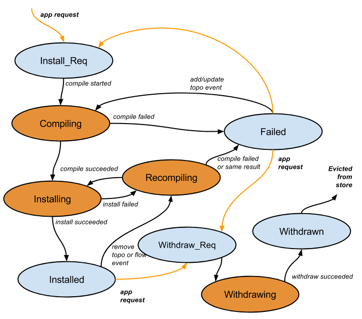

# Intent Framework

This section describes the Intent Framework and the subsystems associated with it.

## Overview

The Intent Framework is a subsystem that allows applications to specify their network control desires in form of policy rather than mechanism. We refer to these policy-based directives as ***intents***. The ONOS core accepts the intent specifications and translates them, via *intent compilation*, into installable intents, which are essentially actionable operations on the network environment. These actions are carried out by intent installation process, which results in some changes to the environment, such as tunnel links being provisioned, flow rules being installed on a switch, or optical *lambdas* (wavelengths) being reserved.

Although the ONOS core provides a suite of built-in intents and their compilers and installers, the intent framework is designed to be extensible. It allows additional intents and their compilers or installers to be added to ONOS dynamically at run-time. This allows others to enhance the initial arsenal of connectivity and policy-based intents available in ONOS by default.

## Intents

An **`Intent`** is an immutable model object that describes an application's request to the ONOS core to alter the network's behavior. At the lowest levels, Intents may be described in terms of:

* ***Network Resource*** : A set of object models, such as links, that tie back to the parts of the network affected by an intent.
* ***Constraints*** : Weights applied to a set of network resources, such as bandwidth, optical frequency, and link type.
* ***Criteria*** : Packet header fields or patterns that describe a slice of traffic. An Intent's **`TrafficSelector`** carries criteria as a set of objects that implement the `Criterion` interface.
* ***Instructions*** : Actions to apply to a slice of traffic, such as header field modifications, or outputting through specific ports. An Intent's **`TrafficTreatment`** carries instructions as a set of objects that implement the `Instruction` interface.

In addition, Intents are always identified by both the `ApplicationId` of the application that submitted it, and a unique `IntentId`, generated at creation.

## Intent Compilation

The following diagram depicts the state transition diagram for the compilation process of each top-level intent:

The states depicted in orange are transitional and are expected to last only a brief amount of time. The rest of the states are *parking states* where the Intent may spend some time. The exception is the *Submitted* state, where the intent may pause briefly while:

* the system determines where to perform the compilation, or
* it performs global recomputation/optimization across all prior intents.

### General Operation

After an intent is submitted by an application, it will be sent immediately (but asynchronously) into a compiling phase, then to the installing phase, and finally, to the installed state. An intent may also be withdrawn if an application decides that it no longer wishes for the intent to hold.

The rest of the states account for various issues that may arise:

* An application may ask for an objective that is not currently achievable, e.g. connectivity across to unconnected network segments. In this case, the compiling phase may fail. A change in the environment that results in the objectives being met can trigger a transition back to the compiling state.
* The installing phase may be disrupted. In this case, the framework will attempt to recompile the intent to see if an alternate approach is available. If recompilation succeeds, it will return to the installing phase.
* A loss of throughput or connectivity may impact the viability of a successfully compiled and installed intent. In this case, the framework will attempt to recompile the intent, and if an alternate approach is available, its installation will be attempted.

The failure mode for the above cases is the failed state. 

The Intent framework relies on the Java [Future](https://docs.oracle.com/javase/7/docs/api/java/util/concurrent/Future.html) for handling the asynchronous intent compilation process. 

### Compilers and Installers

`Intent`s are ultimately compiled down into a set of **`FlowRule`** model objects. The process may include:

* The compilation of an `Intent` down into *installable intent(s),* by an **`IntentCompiler`**
* The conversion of installable Intents into `FlowRuleBatchOperations` containing `FlowRules`, by an `IntentInstaller`

Each non-installable `Intent` has an `IntentCompiler` associated with it. Similarly, installable `Intents` will have a corresponding `IntentInstaller`. For example, a PointToPointIntent must first be compiled into a `PathIntent` by a `PointToPointIntentCompiler`, before being converted into a `BatchOperation` by the `PathIntentInstaller`.

The **`IntentManager`** coordinates the compilation and installation of `FlowRule`s by managing the invocation of available `IntentCompiler`s and `IntentInstaller`s.

### FlowRule Installation

`FlowRuleBatchOperations` are handed off to the **`FlowRuleService`** to be written down as protocol-specific messages. In the case of OpenFlow, the OpenFlowRuleProvider is responsible for generating `OFFlowMod` messages from `FlowRules`, and sending it to the appropriate network switch. It relies on the OpenFlow subsystem for its message factories and `OpenFlowSwitch` references for this task.

---

[Previous : Clustering](https://wiki.onosproject.org/display/ONOS/Clustering)  
[Next : GUI Architecture](web-ui-architecture.md)

---
