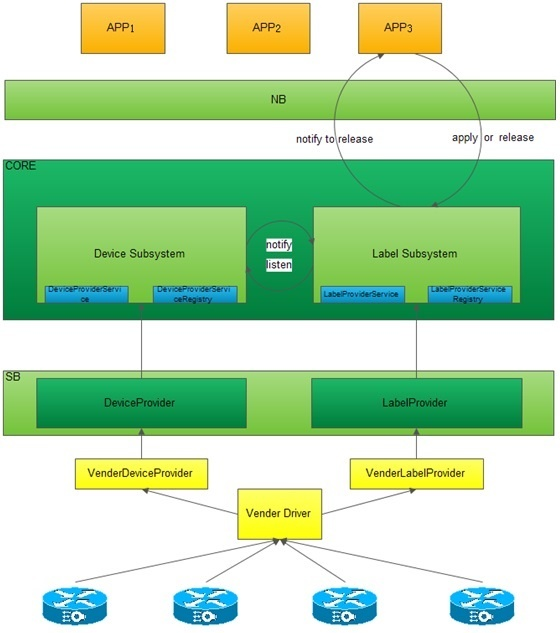

# Label Subsystem

**Label Subsystem**

**Overview**

The label subsystem is designed to support MPLS-based applications. As a system resource, label is managed in ONOS and applications can acquire or release label resources through northbound API calls. The labels are constructed as resource pools and saved in ONOS stores. The label pool is a kind of container. Labels in the pools are defined as consecutive numbers. Depending on the type of applications and their specific requirements, two kinds of label pools are provided. The first one, **device-label-pool**, is provided by device itself when a device is connected to the network. The other one, **global-label-pool**, is created manually. User application can take the global-label-pool as a special device-label pool via a virtual device identity named “*global\_resource\_pool\_device\_id*”.

Device-label-pool and global-label-pool can co-exist in ONOS stores with different label ranges. So the label ranges in each pool should be carefully planned when operator starts deploying ONOS in their networks.

Two sets of corresponding APIs are provided to operate on these two types of pools in ONOS. The CLI commands are also implemented to access the label stores.

The following figure shows the label subsystem architecture.

**WorkFlow:**

1. When a device is connected to the network, it uploads pool information into the store.
2. Applications can apply or release label through northbound APIs.
3. Applications listen the label subsystem events, while the label subsystem listens the device subsystem events.
4. When a device is vanished, the device subsystem notifies the label subsystem indicating which device is vanished and then the label subsystem destroys the corresponding device’s label pool. Any applications applied labels in vanished device will receive the notification and should release all applied labels of the vanished device.

**Featuring**:

* A LabelResourceAdminService provides services for administrators to interact with the inventory of label resource pools.
* A LabelResourceService provide services for applications to apply, release and query labels.
* A *LabelResourceManager* manages interface with multiple *Providers* via a *LabelResourceProviderService* interface and multiple listeners via a *LabelResourceService* interface
* *LabelResourceProviders* supports their own network protocol libraries or ways to interface with the network
* A *LabelResourceStore* tracks *LabelResourcPool* model objects and generates *LabelResourceEvent.*

**Programming APIs for ONOS applications**

The labels are provided in ONOS as a common system resource. Independent applications use the label resource through calling ONOS northbound APIs.

Meanwhile, ONOS provides southbound label APIs for device driver to communicate with ONOS.

There are two ways to create a device’s initial label resource pool, i.e., device upload and admin planned. Firstly, a device driver can call southbound API *deviceLabelResourcePoolDetected* to upload its local labels to ONOS. The other way is by planning labels when deploying ONOS. After planned label ranges for each device, the network administrative application calls northbound API *createDevicePool* to create label pool for the device. The admin planned labels will overwrite any reported labels from device. The global labels are always created by admin application via calling *createGlobalPool.*

Once the label pools are created, customer applications can use the label resource via calling ONOS’s northbound APIs. An applications calls *getDeviceLabelResourcePool* to get the device label resource pool, or *getGlobalLabelResourcePool* to get the global label resource pool, then call *applyFromDevicePool* or *applyFromGlobalPool* to require label from the device label pool or global label pool. Before requiring a label, application has chance to check label resource’s status in ONOS. For example, calling *isDevicePoolFull* to check is there is any labels available in the pool, or calling *getFreeNumOfDevicePool* to get current unused labels in the pool. After using the labels, application should return the labels to ONOS label pool by calling *releaseToDevicePool* or *releaseToGlobalPool.*

The followings list current APIs available in ONOS.

***Southbound APIs***

**LabelResourceProviderService**

* *deviceLabelResourcePoolDetected* :Signal that a device label resource pool has been detected and upload labels to ONOS.
* *deviceLabelResourcePoolDestroyed* :Signal that an label resource pool has been destroyed.

***Northbound APIs***

**LabelResourceAdminService**

* *createDevicePool* Create device label resource from begin label to end label.
* *createGlobalPool* Create the global label resource pool.
* *destroyDevicePool* Destroy a device label resource pool.
* *destroyGlobalPool* Destroy the global label resource pool.

**LabelResourceService**

* *applyFromDevicePool* Apply labels from a device resource pool.
* *applyFromGlobalPool* Apply labels from the global label resource pool.
* *releaseToDevicePool* Release labels to device pools .
* *releaseToGlobalPool* Release labels to the global resource pool.
* *isDevicePoolFull* Check if a device pool is full.
* *isGlobalPoolFull* Check if the global resource pool is full.
* *getFreeNumOfDevicePool* Get unused label number of a device label resource pool.
* *getFreeNumOfGlobalPool* Get unused label number of the global label resource pool.
* *getDeviceLabelResourcePool* Get a device label resource pool.
* *getGlobalLabelResourcePool* Get the global label resource pool.

**Label management CLI commands**

Besides APIs, ONOS provides CLI commands for label usage and management purpose. Administrators can use CLI commands to interact with the inventory of label resource pools. Currently ONOS supports the following CLI commands:

* *label-apply* Apply label resource from device pool by specific device id
* *global-label-apply* Apply global labels from global resource pool
* *label-pool-create* Creates label resource pool by a specific device id
* *global-label-pool-create* Creates global label resource pool.
* *label-pool-destroy* Destroys label resource pool by a specific device id
* *global-label-pool-destroy* Destroys global label resource pool
* *global-label-pool* Gets global label resource pool information.
* *label-pool* Gets label resource pool information by a specific device id
* *global-label-release* Releases labels to global label resource pool.
* **label-release** Releases label ids to label resource pool by a specific device id
