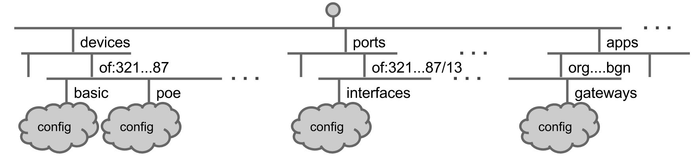

# Network Configuration Subsystem

The network configuration subsystem allows applications to inject attribute and configuration information for various network components into the models used for network representation. Examples include (but are not limited to):

* Device and device port types and names
* Device location, owner, hardware and software versions
* Whether components are allowed or denied inclusion in the network model

The configurations may refer to a component that may or may not already exist in the network representation (i.e., the system may/may not have discovered it in the network). This implies that an application can offer hints about a yet-to-be-discovered component, as well as modify a known component’s attributes.

This subsystem likewise serves as a shim between the system’s network representation, and the means to configure it. Currently, JSON is the preferred means to describe component configurations.

## Terminology

* A *subject* is a reference to, or a placeholder for, an object to be configured via this subsystem. Example: a `DeviceId` for a network device, or a `ConnectPoint`for a device port.
* A *config* is a set of exposed tunables for a given object. Example: A `BasicDeviceConfig` allows a device’s type and southbound driver to be set/changed.
* A *key*, or *subject key*, is a string name for a subject. It is used as the key for the JSON field containing the configuration values. Example: Device configurations can be found in the field with key “devices”.
* A *config key* is a string name for a configuration class. It is also used as a JSON field key. Example: the key “basic” refers to the general configurations allowed for a device. The value associated with it may be a JSON representation of config values.
* A *config operator* reconciles different sources of network configuration information for a given object. Sources include descriptions (from Providers), configs (from this subsystem), and intents (from applications).



## Components

* A subject is a Java object used as an unique identifier for a network object. Its stringified form is used as a JSON field key tied to the configurations associated with the network object.

  Example: A `Link` can be uniquely identified by a `LinkKey` (a pair of endpoints), so we use that as its subject. A `LinkKey` can be represented by a string of format “deviceId/port-deviceId/port”, and conversely, such a string can be used to generate a `LinkKey`.

* `Config` subclasses implement the tunables for a subject as a set of getters and setters (attribute accessors) to JSON object constructs (`ObjectNodes`).

  Example: An `OpticalPortConfig` is defined as:

  ```
  public class OpticalPortConfig extends Config<ConnectPoint>
  ```

  meaning that it manipulates the configurations associated with `ConnectPoint` subjects (device ports). Some of its attribute accessors include the port’s string and numeric names, and the number of channels that the port supports.

* `SubjectFactory` ties a subject to its subject key, and generates objects that represent the subject.

  Example: the factory that generates `ConnectPoints` is instantiated as:

  ```
  public static final SubjectFactory<ConnectPoint> CONNECT_POINT_SUBJECT_FACTORY =
      new SubjectFactory<ConnectPoint>(ConnectPoint.class, "ports") {
          @Override
          public ConnectPoint createSubject(String key) {
              return ConnectPoint.deviceConnectPoint(key);
          }
      };
  ```

  meaning that the key for the JSON field containing port information is keyed on string “ports”, and the factory can create `ConnectPoint`s from a “deviceId:port” string (the argument to `createSubject`).

* `ConfigFactory` ties a subject to its config and config key, and generates `Config`s.

  Example: The ConfigFactory for `OpticalPortConfig` is defined as:

  ```
  // ConfigFactory<S, C extends Config<S>>
  new ConfigFactory<ConnectPoint, OpticalPortConfig>(CONNECT_POINT_SUBJECT_FACTORY,
                                                     OpticalPortConfig.class,
                                                     "optical") {
      @Override
      public OpticalPortConfig createConfig() {
          return new OpticalPortConfig();
      }
  }
  ```

  indicating that this `ConfigFactory` can generate `OpticalPortConfig`s, and the configuration information for a given optical port can be fetched from the subsystem’s manager using its associated subject (a `ConnectPoint` in this case). In the JSON structure, the key “basic” can be used to fetch out the values set by the `OpticalPortConfig`.

* `ConfigOperator` implementations are classes that implement the policy for merging information from different sources, and conversions between these sources.

  Example: The `BasicLinkOperator` defines methods for merging the contents of `BasicLinkConfig`s and `LinkDescription`s, and for converting `Link` objects and `BasicLinkConfig`s into `LinkDescription`s understood by the core.

## Configuration Syntax

The relationship between the subject, config, subject key, and config key are summarized by the following JSON tree:

```
{
    subject key 1 : {
        subject 1 : {
            config key 1 : {
                attr1 : value1,
                attr2 : value2,
                ...
            },
            config key 2 : {
                ...
            }
        },
        subject 2 : {
          ...
    },
    subject key 2 {
    ...
}
```

For example, a configuration for the device identified by the ID (subject) *of:0000ffffffffff0a* might look like the following:

```
{
   "devices" : {
      "of:0000ffffffffff0a" : {
          "basic": {
              "driver": "linc-oe",
              "type": "ROADM",
              "latitude": 33.8,
              "name": "ATL-S10",
              "longitude": -84.1
          }
      }
   }
}
```

Indeed, if you were to take a look at `BasicDeviceConfig` and its superclass, you will find all of the fields within the “basic” clause above defined in those two classes.

## Using Network Configuration Services

### Making objects configurable

The network configuration subsystem can be used to configure arbitrary network objects. For an object to be configurable through this subsystem, you must implement the components described in [Components](#NetworkConfigurationSubsystem-components). Some things to note are:

* `SubjectFactory` implementations belong in `SubjectFactories`. While you may want to use an existing factory for your subject of choice, you may want to implement a new `SubjectFactory` in addition to an existing one if a different key/creation technique is required for a subject.

* A `ConfigFactory` must be registered with the `NetworkConfigManager`. Adding a `ConfigFactory` to `BasicNetworkConfigs` will cause it to be registered when the subsystem starts up. Alternatively, you may manually invoke `NetworkConfigManager.registerConfigFactory()` from the application:

  ```
  // in the application:
  @Reference(cardinality = ReferenceCardinality.MANDATORY_UNARY)
  protected NetworkConfigRegistry registry;

  private ConfigFactory configFactory =
          new ConfigFactory(SubjectFactories.FOO_SUBJECT_FACTORY, FooConfig.class, "foo") {
      @Override
      public FooConfig createConfig() {
          return new FooConfig();
      }
  };

  public void register() {
      registry.registerConfigFactory(configFactory);
  }
  ```

* `ConfigOperator`s enforce an order of precedence on information depending on their source. As a general rule, the configs supplied by this subsystem override information supplied by providers.

### Using the service from applications

As with other services, the two primary ways that an application can use the network configuration subsystem are:

* Registering as a `NetworkConfigListener` : this enables the listener to receive `NetworkConfigEvent`s whenever configurations are added, removed, or modified.

* Requesting configuarations with `getConfig()` : an application can fetch the config tied to a certain network element given its subject and a `Config` class:

  ```
  public void doConfigThings(Device dev) {
      // a Device's subject is its ID
      DeviceId devId = dev.id();
      BasicDeviceConfig bdc = configService.getConfig(devId, BasicDeviceConfig.class);

      // a attribute of a device is if it's allowed in the network model
      if (!bdc.isAllowed()) {
          log.warn("This device isn't allowed here!");
          removeDevice(devId);
      }
  }
  ```
