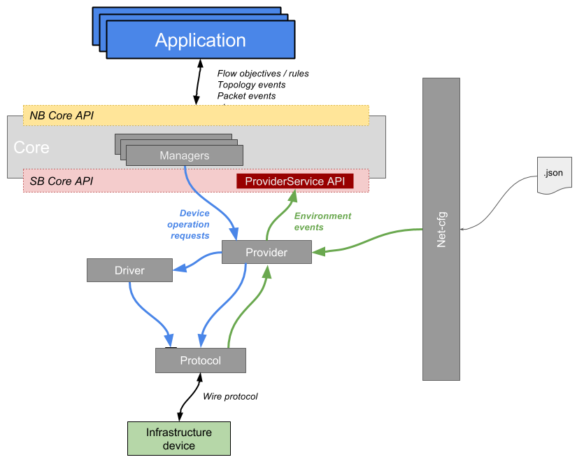

# Southbound: Protocol, Providers, Drivers

Work in progress

Please be aware that this page is still a work in progress and is subject to changes and needs to be polished.

## Introduction

TODO: architecture overview (providers, drivers, protocol)

## Providers

### Overview

ONOS interacts with the underlying network with the help of its Providers. Providers in ONOS are standalone ONOS applications based on OSGi components that can be dynamically activated and deactivated at runtime. The main purpose of providers is to abstract the configuration, control and management operations of a specific family of devices (e.g. OpenFlow, SNMP, Netconf, etc.).

Providers offer means to:

* execute requests originated from the core, such as install/get flow rules in OpenFlow, set/get MIB parameters in SNMP, set/get port status in Netconf, etc;
* process and notify the core about events originated from the infrastructure devices or manually injected in the system using the net-cfg service. Examples of environment event that are relevant to ONOS operations are: an OpenFlow switch connection request or packet-in, a BGP route advertisement, a SNMP trap, etc.

Requests from the core are usually originated from the managers (e.g. the DeviceManager, PacketManager, LinkManager, etc.), while providers can notify the core about events using the [ProviderService API](http://api.onosproject.org/1.5.1/org/onosproject/net/provider/ProviderService.html).

Providers implementation is used to generalize the logic of operating on a device of a given family, when it comes to actually performing a specific operation on a specific device instance, in order to allow support for different flavors of the same device (e.g. different support of the OpenFlow 1.3 specification), providers can call drivers to abstract the device-specific logic. On the other hand, when dealing with external events, a good practice is to have a server or controller component implemented in the protocol module and have providers register for event listeners. Similarly a provider can register for net-cfg events, so that users or external applications can inject informations using JSON-formatted messages, such as the IP address and port of the control agent of device, links, and so on.

Usually, there exist multiple providers for the same device family, each one devoted to provide control abstractions and environment sensing over physical and logical infrastructure entities, such as devices, links, flow rules, packets, etc. As an example, the following providers can be defined for the same device family (here the [complete list](http://api.onosproject.org/1.5.1/org/onosproject/net/provider/Provider.html) of currently available Provider interfaces in ONOS):

* [DeviceProvider](http://api.onosproject.org/1.5.1/org/onosproject/net/device/DeviceProvider.html): responsible of notifying the core through the [DeviceProviderService API](http://api.onosproject.org/1.5.1/org/onosproject/net/device/DeviceProviderService.html) about the discovery of new devices and their description (such as vendor/model, available ports, hardware/software version, etc.), as long as exposing method to DeviceManager in order to perform operations such as setting a port operational state (up or down).
* [PacketProvider](http://api.onosproject.org/1.5.1/org/onosproject/net/packet/PacketProvider.html): responsible of notifying the core through the [PacketProviderService API](http://api.onosproject.org/1.5.1/org/onosproject/net/packet/PacketProviderService.html) of a [packet-in event](http://flowgrammable.org/sdn/openflow/message-layer/packetin/) received from the data plane, as long as exposing methods to PacketManager in order to generate [packet-outs](http://flowgrammable.org/sdn/openflow/message-layer/packetout/) at the data plane.
* [LinkProvider](http://api.onosproject.org/1.5.1/org/onosproject/net/link/LinkProvider.html): is responsible of notifying the core through the [LinkProviderService API](http://api.onosproject.org/1.5.1/) of the discovery of new links, while not methods are exposed to any manager since it would make no sense to perform an operation on a logical entity such as a link.

### Code walk-trough

WIP

## Protocol

### Overview

“Protocols” in ONOS are modules contained under the directory /protocols and usually named onos-<protocol\_name>. A protocol module contains the implementation of all those features needed by ONOS to communicate with devices implementing a specific runtime control and/or management protocol. Examples of what ONOS considers protocols are OpenFlow, NETCONF, SNMP, OVSDB, etc. A protocol usually depends on third-party communication libraries (e.g. openflowj, snmp4j, thrift, etc.). 

A best practice used in ONOS is to divide the protocol module into two submodules, API (named onos-<protocol\_name>-api) and CTL (onos-<protocol\_name>-ctl). As suggested by the name, API usually contains mostly Java interfaces and simple classes representing the fundamental objects of a protocol (e.g. a FlowMod and a Controller in OpenFlow), while CTL contains the specific implementation of the API.

The division between API and CTL is done for cleanness and inter-module dependency, such that other modules inside ONOS can simply depend on the API without having to bring in all the implementations of the CTL module.

### API submodule

The API module usually contains interfaces that abstract the operations and messages necessary to control a device.. For example, given an example protocol called “Foo”, we can imagine having a FooController interface that exposes informations about the devices connected to it. Another interface can be the FooSession that abstracts the state of the underlying transport session with the device.   
Some example of the operation that the protocol module exposes are:  
OpenFlow: FlowMods, GroupMods, etc  
Rest: implements CRUD operations (GET, POST, DELETE, etc...)  
Netconf: Open/close session, setConfiguration, getConfiguration

### CTL submodule

The CTL module contains the implementation of the APIs. There can be multiple implementations for a single interface to provide different types of logic according to the use case (e.g. persistent and nonpersistent transport sessions). The implementation classes translate between high level Java calls, for example doOperation(operation), to the equivalent wire messages and system calls to communicate with the device over the control channel. Examples of operations implemented in the CTL module are: handshaking, connection establishment and maintenance with the device. If the transport session with the device is a persistent one, for example TCP in OpenFlow or in NETCONF, all the state about the connection is maintained in the protocol subsystem, meaning that upper layers such as drivers or providers, do not need to deal with connection open/close, reconnection in case of network errors, etc.

#### Usage

The Protocol is not an application but a simple set of OSGI components that can be loaded and unloaded from KARAF if somebody needs it. Usually the <protocol-name>Controller is a OSGI component that can be referenced from outside the protocol module, usually in the providers and drivers.   
For a new device the contact information and any other detail is fed to the protocol from the provider or taken from the core. If it’s not fed from the core, the end point to talk to the device: IP and port, is taken parsing the deviceId.   
Classes and modules  
In summary if you are implementing a new protocol in ONOS the protocol module should only contain:  
API sub-module with interfaces describing operations and state logic  
CTL sub-module with implementation of the logic for the exposed interfaces  
Dependencies on third party libraries that enable communication to and from the device.  
The protocol module should not contain any device model specific or vendor specific element, just “language” specifics.
